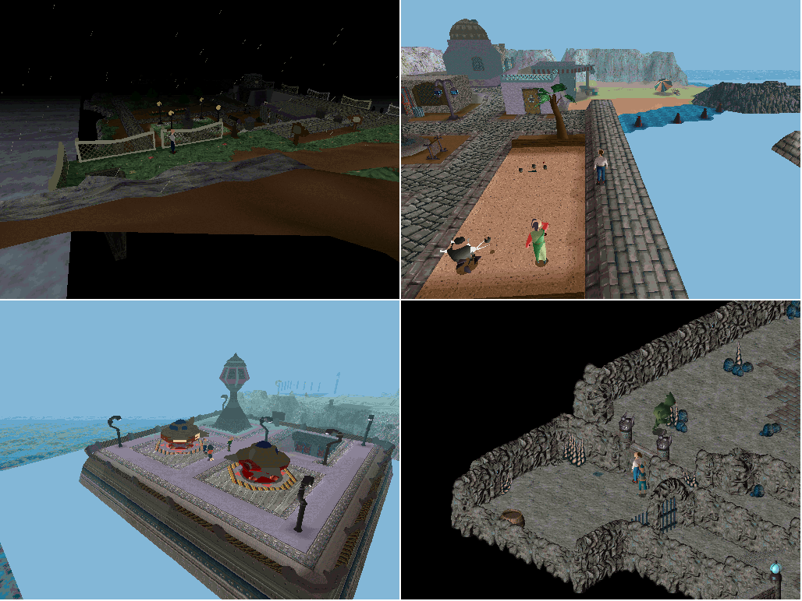
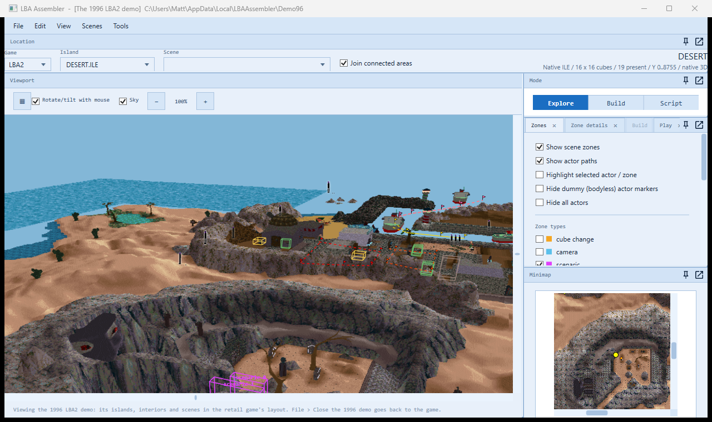
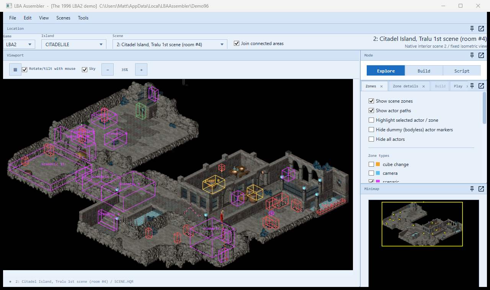
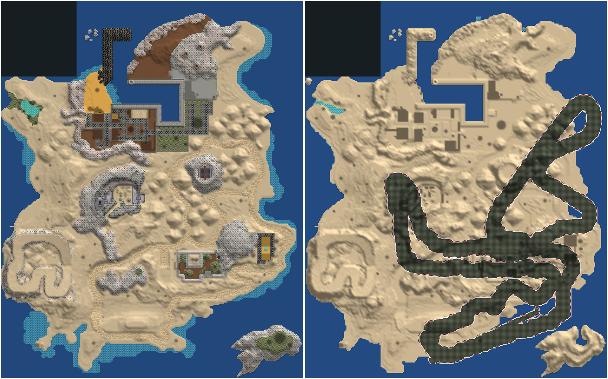

# The 1996 LBA2 demo in LBA Assembler (2026-10-05)

A demo of LBA2 was released in 1996, before the game was finished (`LBA2DEMO.EXE`, a DOS/4GW program). Its folder holds
the game's usual files -- `SCENE.HQR`, `BODY.HQR`, `RESS.HQR`, `LBA_BKG.HQR`, four islands (`CITADEL`, `CITABAU`, `DESERT`, `OTRINGAL`
`.ILE`/`.OBL`) -- but most of them are in earlier versions of the formats, so neither the retail engine nor the editor reads them as they
are. LBA Assembler converts the demo once into the retail layout, in a folder of its own, and then shows it as it shows the game.

## Opening it

- **File > Open the LBA2 1996 demo...** and choose the demo's folder (the one with `LBA2DEMO.EXE`). The first time, it is converted
  (a few seconds) into `%LOCALAPPDATA%\LBAAssembler\Demo96`; after that the converted copy is reused, unless it was made from another folder
  or by an older converter.
- The window title then starts with "[The 1996 LBA2 demo]". The islands, interiors and scenes are in the usual menus; a scene the demo
  shares with the retail game is named after it (59 of the 66), the others "<island>, an interior only the 1996 demo has".
- **File > Close the 1996 demo** goes back to the game folder.
- From the command line: `LBAAssembler.exe --demo96 <demo folder> [scene]`.

The demo folder and the game folder are only read. The LBA2 game folder must be set (File > Settings): the engine's start-up files,
which the demo has none of, come from it (below). While the demo is open, the settings are not saved (as with File > Test edits), so the
game folder in them is never replaced by the demo's; the joined interior maps (made for the retail scene numbers) are off.

## What converts, and how well

| Part | Result |
|---|---|
| Scenes | 66 of 66. 59 match a retail scene (outdoors by island and cube; interiors by the grid they are drawn with) |
| Islands | 4 of 4, ground, heights, textures and decors |
| Interiors (grids, libraries, bricks) | all; already in the retail format, only the file's header differs |
| Bodies | 116 of 116 characters (3 partly), 56 of 56 objects, all island decors (323) |
| Animations, sprites, texts, samples, screens, flows | copied as they are: the retail format |
| Scripts | 44 scenes decode completely (379 scripts); 22 use instructions the retail game does not have (below) |

What the editor does with it:
- every island in 3D with its actors and zones, the minimap, the scenes' interiors, actors, zones and track points;
- the engine's renderer draws the scenes (the picture at the top: storm Citadel, scene 48; the Desert village, scene 60; the Otringal
  spaceport, scene 29; the caves of scene 2, which matches the retail "Tralu 1st scene").

What the demo is: an earlier, different game in places. The Desert Island is laid out differently from the retail one -- the same
outline, but the buildings, the temple, the paths and the rocks are elsewhere:

Its Citadel Island interiors are early versions of the retail scenes 0-22 and its Citadel outdoor scenes are the retail 42-50, mostly
under the same numbers; the Desert Island's are partly renumbered (demo 13-65 against retail 55-73) and the Otringal ones are all
renumbered (demo 23-35 against retail 87-92). Seven interiors match nothing in the retail game (demo scenes 6, 12, 17, 18, 26, 30, 37).

## The format differences (what the converter does)

`Demo96/Demo96Converter.cs` (with `Demo96Scenes.cs` and `Demo96Bodies.cs`); the same conversion from the command line:
`ScriptRoundTrip demo96 <demo folder> <out folder> [retail folder]`.

**`SCENE.HQR`**
- No entry 0 (the retail game's "largest scene" size): demo scene N is entry N, retail entry N + 1. The converter writes the size entry.
- The ambient sample slots are 3 numbers each, not 5: the retail frequency (4096) and volume (110) are added.
- Each actor has 40 more bytes after its armour and life points (20 numbers, mostly animation numbers or -1); the retail game has no use
  for them and they are dropped.
- No patch table at the end: rebuilt from the decoded scripts. For the 22 scenes whose scripts don't decode, the table is left empty.
- One actor flag (1 << 18, "3DS animation" in the retail game) is cleared: the converted actors have no 3DS animations.
- Zones and track points are the retail format.

**Bodies (`BODY.HQR`, `OBJFIX.HQR`, the `.OBL` decors)** -- a format between LBA1's and LBA2's:
- a 16-byte header (flags, 2 = animated; bounding box; extra size), then the points (6 bytes each);
- bones (animated bodies only): 8 bytes each (point count, first point x 6, parent x 36, normal count);
- normals: 8 bytes each;
- untextured polygons are LBA1's (types 0-10; 7 and 8 carry a face normal, 9 and 10 a normal per point) and map onto the retail types
  {0:0, 1:4, 2:4, 3:4, 4:0, 5:2, 6:3, 7:1, 8:1, 9:4, 10:5};
- textured polygons are types 11-36: types 12, 16, 20 and 24 start with a face normal; then 4 bytes a point (normal, point x 6), the
  texture word (the retail texture table entry) and the texture co-ordinates (the retail values). The retail type is the demo's minus 3
  (8-23); 36 is the retail 10;
- lines and spheres are LBA1's (8 bytes).

Three bodies don't read to the end (`BODY.HQR` 4, 70 and 103: a polygon past the retail engine's 550, a point outside the body, a polygon
of no points -- perhaps unfinished data); the polygons up to there are kept.

**Islands (`.ILE`)**: the same container; the ground texture definitions are 8 bytes (three corners in whole pixels) instead of 12 (8.8
fixed point), converted to the middle of each pixel. Without it the ground textures are scrambled.

**`RESS.HQR`** is rebuilt in the retail layout:
- the demo's palette (entry 0) is followed by its 64 K shading table and a 36-byte trailer (fog colour, shading start/normal/end); entry 9
  is the storm version. The retail engine wants a palette file per island (the XPL entries 27-42): they are made from these -- the storm
  one for 27, the fine-weather one for the rest -- with a 50 % blend transparency table;
- the demo's font, skies (Citadel 11, Desert 13, fine-weather Citadel 26; Otringal has none of its own and gets Citadel's) and
  `FILE3D.HQR` (the entities: one entry each, packed into the retail entity table, entry 44);
- from the retail game: the memory sizes, inventory pictures, 3DS animations, flows and impacts.

**`LBA_BKG.HQR`**: a 7-number header against the retail 6 numbers and 4 sizes; rewritten, with the brick buffer sizes worked out.

**From the retail game folder** (the demo has none of them; they are only copied into the converted folder): `ANIM3DS.HQR`, `LBA2.HQR`,
`HOLOMAP.HQR`, and an empty `video\VIDEO.HQR` the engine needs to start.

## Two engine fixes it needed

Both in `native/lba2-classic-community/SOURCES/3DEXT/`, both harmless for the retail game:
- `RENDERER_ACTORS.CPP`: the island actor scan assumed the retail game's 222 scenes; it now reads how many `SCENE.HQR` has.
- `RENDERER_API.CPP`: the renderer kept the last palette's number across a change of game folder, so after opening the demo (or closing
  it) it kept a palette buffer that was gone and drew black. It is reset when the renderer starts again.

## As a game patch, later

The pictures, islands, interiors and characters are all there, so "the demo's scenes in the retail game" is within reach. What it needs:

1. **The scripts.** 22 scenes stop at an instruction the retail game doesn't have: life instruction 132 (17 scenes: most of the Citadel
   Island houses and the storm scenes), 5, 6 and 9, track instruction 100 and condition 115. Each needs finding in the demo's executable
   (`LBA2DEMO.EXE`) and mapping onto a retail one (or a new engine instruction); 132, in 17 scenes, would open most of them. One script
   (scene 44, actor 3) decodes but not back into the same bytes.
2. **Texts and voices.** The scripts' text numbers are the demo's own `TEXT.HQR`; a patch would add them to the retail texts (or keep the
   demo's) -- there are no demo voices.
3. **Scene numbers.** The demo's scenes would go past the retail 222 (or replace retail scenes), with their cube-change zones renumbered
   and the holomap told where they are.
4. **What is missing**: Otringal's sky, three partly-read bodies, and the demo's music (its `MIDI_*.HQR` files are not converted).

The scenes already open in the engine (the picture at the top). Not tested yet: how far the scripts that do decode behave as they did in
the demo, and what the engine does on reaching one of the unknown instructions.
