# The proposed race tracks, built on the Desert island, Citadel Island, Mosquibees Island, Celebration Island, the Elevator Platform, Sendell's Well, the moons and Polar Island (2026-09-27, reworked up to 2026-10-06)

Nine tracks are built by the same code: the Desert island's (this document's main subject), Citadel Island's town circuit (see "Citadel Island's town circuit") and its storm track (see "Citadel Island in the storm: a track of its own") -- one in each of the island's two files -- Mosquibees Island's mountain lap (see "Mosquibees Island's mountain lap") Celebration Island's lap up round the statue on a raised road (see "Celebration Island: round the statue") and its lava lake's (see "Celebration Island: the lava lake"), the Elevator Platform's rollercoaster (see "The Elevator Platform: a rollercoaster") a lap round Sendell's Well, the cut island the build makes (see "Walls, mines, checkpoints, Sendell's Well and a loop"), two vertical loops on the old moon, MOON.ILE (see "The old moon: two vertical loops"), the Emerald Moon's lap over its reactor (see "The Emerald Moon: over the reactor") and Polar Island's dream race, a sprint rather than a lap (see "Polar Island: the dream race to Sendell"). What differs between islands is `Terrain/RaceTrackIsland.cs`. Any of them can be built into one game folder together, and Play races the one of the island the editor has open (see "Several tracks in one game folder").

The picture the track came from is [racetrack/concept_track.png](racetrack/concept_track.png). It is built on a **copy** of the game, so nothing in the real game folders is touched.

| | |
|---|---|
| Where the copy is | `E:\dump\LBA2RaceTrackBuild\Game` (a plain copy of the "Level viewer" install without the CD images, `DOSBOX`, `DRIVERS` and the intro video except `VIDEO\VIDEO.HQR`, which the engine needs) |
| The originals of the files that change | `E:\dump\LBA2RaceTrackBuild\Pristine` (`DESERT.ILE`, `DESERT.OBL`, `SCENE.HQR`, `ANIM.HQR`, `RESS.HQR`); a build always starts from them, so it can be repeated |
| Files the build changes | `DESERT.ILE` (heights, ground triangles, decor objects), `DESERT.OBL` (three new decor bodies for the road bridge: a plain deck tile, an edge tile with the curb, and a railing), `SCENE.HQR` (scenes 55-73); for the jump also `ANIM.HQR` and `RESS.HQR` (its longer flight, see "The jump"); for Baldino's car and the fifty-eight cars after other characters `BODY.HQR` and `RESS.HQR` (see "Baldino's rocket car" and "Cars after the game's characters"). It writes `RACETRACK.JSON` beside them: the crossing style, the start line and the checkpoints, the opponent's line and actors, and the scene the race starts in, for Play's race-track mode |
| The game engine | LBA Assembler's Play runs the engine in its race-track mode on a folder with a race track built, and only then (see "The engine's race-track mode"): the car stays level on the bridge deck, has gears and the car setup, a lap counts only through every checkpoint, two opponents race round the lap (the retail track's racer and Baldino in his rocket car), and the gear, speed, lap times and race position are on screen. In the retail engine, or the community engine without that mode, the track and the jump work, but the car's body tilts over on the deck |
| To look at it | LBAAssembler > File > Settings > LBA2 folder = the copy, then Desert island (Explore), or Play: with the car setup's race start on (the default) Play starts the race in scene 67 beside the car, and with it off it plays whichever of scenes 55-73 is open |
| To rebuild | `ScriptRoundTrip buildtrack docs\racetrack\track_plan.json E:\dump\LBA2RaceTrackBuild\Pristine E:\dump\LBA2RaceTrackBuild\Game out.png 4` |

Pictures, all from the built copy:

- [Top-down map](racetrack/build/built_map.png). This renderer draws the ground only, so the bridge deck is not in it.
- [An earlier route over your picture](racetrack/build/built_over_concept.png): cyan is the lap before the retail track's area was added and the crossing re-shaped.
- In the game:
  - [the start line](racetrack/build/h_start.png)
  - [the water bridge](racetrack/build/h_bridge.png)
  - [walking the lower road towards the bridge, with the deck overhead](racetrack/build/h_under_bridge.png)
  - [on the deck](racetrack/build/h_deck_test.png)
  - [the deck's end: curbs, railings and the landing beyond](racetrack/build/h_deck_end.png)
  - [the pit lane entry](racetrack/build/h_pit_entry.png) and [its exit](racetrack/build/h_pit_exit.png)
  - [the race-track mode's display](racetrack/build/h_race_display.png) (gear, speed, lap times) and [the car level on the deck with it, tipping without it](racetrack/build/deck_race_mode.png)
- The jump crossing style: [the car in the air over the gap](racetrack/build/h_jump.png), [the gap and the down ramp from the other road](racetrack/build/h_jump_gap.png), [from above](racetrack/build/jump_top.png).
- The level crossing style (an old picture): [the level crossing](racetrack/build/h_cross.png).
- [The race car setup](racetrack/build/car_setup.png).
- The race: [Play in the app](racetrack/build/race_start_app.png) (Twinsen beside his car on the straight, the racer and Baldino on the grid, the editor's markings hidden), [the opponent setting off](racetrack/build/race_opponent.png), [the checkpoint messages](racetrack/build/checkpoints.png).
- Baldino's rocket car: [in the game, four ways round](racetrack/build/baldino_car_game.png), [in Body Studio's renderer](racetrack/build/baldino_car_preview.png), [racing](racetrack/build/baldino_race.png).
- The cars after the game's characters: [all fifty-nine](racetrack/build/character_cars_preview.png), [in the game](racetrack/build/character_cars_game.png).

## What was built

- **The lap** is 1351 cells long (about 691,500 world units). The plan is 1372 cells; straightening the road at the crossing shortens it. The road is 9 cells wide with one cell of red/white curb each side, the same widths as the retail Desert track. The centre line comes from the picture (see "Where it goes"), with one stretch re-routed through the retail track's own ground (see "The retail track's area").
- **The ground** under the road follows the natural height, smoothed and limited to a 9 % climb (exactly; see "The ground"). It is smoothed again so crests and dips are rounded, then levelled across the road with an embankment of about 7 cells each side that blends into the ground around it. 29,902 vertices were changed.
- **Banking**: each bend's outside edge is raised. The cross slope is 700 / turn radius in cells, at most 70 height units per cell (about 8 degrees).
- **Textures**, the ones catalogued in [LBA2_DESERT_RACE_TRACK.md](LBA2_DESERT_RACE_TRACK.md):
  - the asphalt tile (96,0);
  - the red curb (flat bank 4) alternating with the white curb texel (180,155);
  - 12 orange arrows (flat bank 5) after bends and on long straights, drawn triangle by triangle like the retail ones (see "The arrows");
  - the red/gold hatch tile (192,48) on the outer verge of bends, and sand on the rest of the verge;
  - the white start line row.
- **The pit lane** is 136 cells long, beside the bottom straight of the map (the yellow line of the picture). It has 5 cells of asphalt with its own curbs, runs 10.5 cells from the lap's centre line, and tapers onto the lap at both ends.
- **The start line** is a one-cell white row across the road at the middle of the pit lane. The retail gantry (bodies 64 + 65 + 66, checkered beam and red posts) stands over it, turned to the road.
- **The water bridge** takes the lap across a corner of the harbour on a raised causeway: 29 cells long, 19 of them over water, at least 700 units above the sea. Its steep rock sides carry the blocking bit (Col), so a car stays on it.
- **Where the lap crosses itself**, in one place that matches the picture's single "Bridge" label (see "Only one crossing"), there is a **road bridge** built the way Citadel Island's own plank bridges are built (see "The road bridge"). This is the default style, `CrossingStyle.Bridge`.
  - The crossing is first re-shaped to about the picture's own angle: 41 degrees, where the fitted centre line had flattened it to 17.
  - The straighter road climbs a 50-cell ramp, then crosses 4 cells of level landing onto a flat deck 2800 units above the other road. The deck is 68 cells long and 12 wide, laid as a grid of 51 decor tiles with the road's red and white curb along both edges and low red and white railings outside them.
  - The other road keeps its own grade and passes underneath.
  - Two other styles are still offered in the menu. A **jump**: the straighter road climbs a ramp to a lip, the car flies over a gap of sand, the other road and another gap, and lands on a down ramp (see "The jump"); it turns the crossing to the steepest angle that keeps the rest of the lap clear (42 degrees on this track) first, then squares the other road up to the jump. A **viaduct** is three arched decks and two abutments (retail bodies 68-70) over a level junction.
- **Decor**: 119 plants, posts, fences and small props on the road were removed. The set of body numbers is `RemovableBodies` in the code. Pieces placed at one origin go together, so a palm's trunk goes with its crown. The route was planned around every house. What was left of the retail Desert track (cube 7,10) is gone: its gantry, billboard, arch and wedge are removed, and its painted road is turned back to sand where the new lap doesn't run over it.
- **Scenes** (55-73, every outside scene of the island):
  - 163 actors are removed: all except Twinsen, the buggy, slot 1 (see below) and the 10 that the ferry and Dino-Fly cutscenes need (see "The stand-in, and the actors that stay"). An inert stand-in takes the removed actors' script references.
  - The fixed camera angles along the track are removed: 16 camera zones (see "Fixed cameras").
  - Track points and actors that stood on reshaped ground move with it.
  - The light is re-baked along the road.
  - A copy of the retail track's racer and one of Baldino's rocket car, the opponents' cars, are added to each of them (see "The engine's race-track mode" and "Baldino's rocket car").
- **Twinsen and the buggy** start in scene 67 next to the start line, facing the way the lap runs, with the racer's car on the grid beside the buggy and Baldino's on the second row.

## Things worth knowing

- **Only one crossing.** The lap's centre line crosses itself exactly once. This was checked three ways:
  - an exhaustive segment-intersection test in island-cell space;
  - the same test after the warp into the picture's space, used for the overlay picture;
  - the painted ground of a fresh build, where only one place shows two road arms meeting.

  An early bad build did cross itself three times, and each crossing got its own structure. `RaceTrackBuilder.Build` now logs a loud `WARNING` if `FindCrossings` ever returns more than one crossing, and treats only the first as intended.
- **The engine's ground is one height map** (`CalculAltitudeObjet`). A road cannot pass over another at the same place using terrain alone, which is why the road bridge is a decor object.
- **The buggy is one object for the whole game** (BUGGY.CPP). It exists in the cube that `INIT_BUGGY` last put it in. The island's scenes run `INIT_BUGGY(0)`, which only shows it where it already is, and every scene deletes it (`SUICIDE`) until the car quest (game variable 74) reaches 3. The copy's scripts were changed in three ways:
  - The quest test always passes (`IF VAR_GAME(74) >= 0`).
  - Scene 67 uses `INIT_BUGGY(2)`, which puts the buggy on the start line whenever that scene starts on foot.
  - While Twinsen drives (`comportement_hero() == 12`), scene 67 uses `INIT_BUGGY(0)` instead. Forcing the buggy onto the start line when Twinsen drives back into the scene on the next lap parked a second, solid buggy there for the car to crash into.

  The engine also rebuilds its background copy when Twinsen gets in (`TakeBuggy`); without that, the parked car stayed on screen as a ghost.
- **Actor slot 1 is kept.** Every scene has a bodiless "Zoe" placeholder in slot 1 (entity 14, at 0,0,0). With it deleted, the buggy moved into slot 1 and came up with no life; with it kept, the buggy's state matches the retail one exactly.
- **Not touched**:
  - the demo copies of these scenes (198-206), the interiors, the texts, and everything outside these three files;
  - the zones on the road (doors, hit, ladder, escalator, grid, rail): all were checked and none lie on it;
  - the garage beside the old track and its door into scene 54.
- **Where the track differs from the picture.** The picture is a hand-painted view of the island, not a map, so the lap was fitted to the real island. On average it is 3 cells from the drawing (90 % of it within 7 cells, 17 cells at worst), to go round the town's houses, the fortress and the big rocks.

## Known limitations

- **The game's ending hangs in scene 60** on a build with the actors removed: the ending's script waits on actors that are gone. Only the actors the travel cutscenes wait on directly are kept. "Put the original files back" undoes the build.
- **The ferry passes through the causeway** in the harbour's arrival and departure cutscenes. This is only visual; the cutscenes play to the end.
- **The ramps' sides.** A car steered hard off a ramp can still leave it: the blocking bit makes it slide along the side rather than stop dead (see "The road bridge"). Railings along the ramps would close this.
- **The tightest turns** are radius 2.6 cells (the north-west hairpin at cell 483, 534, straight from the picture, whose two legs are 9 cells apart), 3.8 cells (625, 643) and 4.4 cells (574, 556). Widening the hairpin means moving one leg, which changes the drawn shape.
- **The pit lane's second end** joins the lap on the road bridge's south-east ramp, where the road climbs 13-18 %.
- **On foot, Twinsen can pass between the railing squares** at the deck's edge. The gaps are narrower than the car, not than Twinsen.
- **Some of the island's own objects overhang the cut** where the road is carved into a hillside: a rock whose far edge loses the ground under it. Only what the build leaves hanging over most of its own footprint is cleared (see "Mosquibees Island's mountain lap"); a corner over the air is left as it is.
- **The deck tile nearest the camera** is sometimes clipped by the near plane in the engine's view. (The ground crossing the near plane used to be filled with black spikes -- TERRAIN.CPP `FillBlackPolyZBuf`, the original engine's handling; since 2026-09-29 it is drawn clipped, see "Mosquibees Island's mountain lap".)
- **The jump runs one way.** Driving the lap backwards, the car climbs the down ramp and drops off its top into the gap; from the gap it can drive on along the other road.
- **The gears, the car setup, the checkpoints, the opponent, the display and the level car on the deck** are the community engine's race-track mode, which only LBA Assembler's Play turns on. In the retail game the track, the bridge and the jump work, with the original car, and the car's body tilts over on the deck; the opponent's car stands still on the grid.
- **Celebration Island's and the Elevator Platform's raised roads are the race-track mode's alone**: without it the road is only decor, and nothing can drive on it (see "Celebration Island: round the statue" and "The Elevator Platform: a rollercoaster").
- **The opponents aren't driven by the game's physics.** Each follows a line planned with the track, at planned speeds. They have no collision, so they pass through the player's car and each other (the two lines meet in tight bends), and they don't react to the player. They wait while Twinsen is out of the car, and are only seen in the island's outside scenes.

## Where it goes (how the picture became coordinates)

1. The picture is the island seen from the other side (turned 180 degrees, tilted and stretched). It was registered to the island's own top-down map by 15 landmarks (the islets, the oasis, the harbour, the town, the retail track...) with a thin-plate spline: [tools/RaceTrackPlan/landmarks.json](../tools/RaceTrackPlan/landmarks.json), checked by [pic3.py](../tools/RaceTrackPlan/pic3.py).
2. The road was cut out of the picture by colour (lime, plus the red "Bridge" label), skeletonised, and followed along the skeleton between hand-placed waypoints ([pic5.py](../tools/RaceTrackPlan/pic5.py), [pic6.py](../tools/RaceTrackPlan/pic6.py), [pic7.py](../tools/RaceTrackPlan/pic7.py)). The yellow pit lane gave its two ends.
3. The centre line was fitted to the real ground ([plan5.py](../tools/RaceTrackPlan/plan5.py)). This is the cheapest path within 28 cells of the drawing, where houses, rocks, cliffs, the sea and the retail track cost a lot. A relaxation then pushes different parts of the track apart, to 14 cells where it can, except at the one crossing. In the final lap a few places come closer: 11 cells near the north-west hairpin, and 8 where the two roads converge on the crossing. The result is [racetrack/track_plan.json](racetrack/track_plan.json), in island cells counted from cell 448,448.
4. `Terrain/RaceTrackBuilder.cs` (ground, painting, decor) and `Terrain/RaceTrackScenes.cs` (scenes) build it. `tools/ScriptRoundTrip/RaceTrackCommand.cs` is the command line (`buildtrack`, `herostart`).

## Checking it without the editor

`tools/RaceTrackPlan/hshot.ps1 -cube 67 -tp "x y z"` starts the engine without a window, muted, on the sandbox copy. It teleports Twinsen and saves a screenshot and a state dump (the actors' positions and life). `tools/RaceTrackPlan/drive.ps1` drives the buggy the same way. Both take `-car <file>` to run the engine's race-track mode with a car setup file, as Play does on a folder with a race track built; without it they run the plain engine. The pictures above and the bridge faults were found with these. `gears.ps1` puts Twinsen in the buggy on the start line and prints its speed while it shifts gear at set ticks (`-keys '200:27,280:27'`, 27 being X's scancode and 29 Z's). `jumpdrive.py` drives a jump build over the jump and prints the car's path; build with `RT_CROSSING=Jump` and keep the build's output as `jumplog.txt` in the game folder. `ScriptRoundTrip racetrack island 2` lists the island's scenes, and `racetrack 9 10 --scripts` lists a cube's actors and scripts. `buildtrack` takes `RT_CROSSING=Bridge|Jump|Viaduct|Level`, and `RT_ARROWS=1` lists the arrows.

## The road bridge

The Citadel Island scene "at the Cliffs of the Woodbridge" (cube 9,7) has two short plank bridges over a canyon: a flat deck decor (CITADEL.OBL body 14, 1500 x 200 x 1300 units) with corner posts and rail braces at each end. The mechanism is `ReajustPosDecors` (EXTFUNC.CPP). When a character's or car's xz position is inside a decor's ZV box, the object is held at the box's `YMax`, whatever the terrain underneath is doing. So a decor is a second, independent floor, and that carries one road over another with no scripted jump.

**The bodies.** `Terrain/RaceTrackDeckBody.cs` builds three bodies with `BodyStudio.Body` and appends them to the copy's `DESERT.OBL` (`AppendTo`, which counts the entries with `HqrArchive.CountEntries`):

- a plain deck tile (index 106);
- an edge tile (107), whose top carries the road's curb and a concrete strip outside it;
- a railing (108).

Every face lists its points so its normal points out of the body, as the retail bodies do; the engine skips faces seen from behind. The colours are:

- the road's grey (palette 53) on top;
- red (75) and white (63) for the curb;
- a lighter grey (57) for the concrete;
- a darker grey (51) for the sides.

The white is the ground curb's own white: palette colours 0-15 are remapped on objects, so 15 draws lilac.

**Where the deck goes** (`RaceTrackBuilder.PlanRoadBridge`):

- `SteepenCrossing` turns the crossing to `BridgeCrossingAngle` (42 degrees asked for, 41 reached). It makes the straighter road dead straight over the deck, its landings and the ramp mouths, and joins that straight to the drawn road with cubic Hermite curves. Before this, the join had a kink of radius 2.8 cells south-east of the bridge.
- The straighter road keeps its own grade-limited height profile everywhere except a flat window around the crossing. That window is pinned to the other road's height there plus `RoadBridgeClearance` (2800) and blended in with a smoothstep over `RoadBridgeRampLength` (50) cells each side.
- Cells under the deck's core are marked (`TrackRoad.Deck`). `ModifyGround` leaves the ground there to the lower road, `PaintRoad` paints nothing there, and `PlaceDeck` lays the tiles instead.

Three numbers were found by testing in the engine:

- **Clearance 2800.** The engine's solid collision (`WorldColBrickDecors` / `TestZVDecorsZV`, EXTFUNC.CPP) tests the walker's whole box against the deck's box. So the deck's underside must clear a walker's head everywhere under it, and the lower road climbs a few hundred units under the deck's far end. At 900 and at 2300, Twinsen walking the lower road was stopped dead under the deck; at 2800 he walks straight through.
- **Deck length 68.** The ramp may only start where nothing of the lower road's shaping reaches any more: `VergeHalf + BlendWidth` to its side, plus the ramp's own shoulders and `RoadBridgeMargin`. Measured along the upper road, that is that distance / sin(angle) (`DeckHalfCells`). With a shorter deck, the lower road's embankment pulled the first ramp cells about 1000 units under the deck.
- **Square tiles.** A decor's collision box is axis-aligned. The deck is a grid of 4 x 4-cell squares (3 across, 17 along), whose boxes overhang the mesh by well under a cell. An earlier version laid long slabs diagonally, and each slab's box reached cells past the visible deck.

More was found by driving the buggy over it in the engine:

- **Every cube a piece reaches gets its own copy.** The engine only knows the decors of the cube the hero is in (`LoadCube`: `ListDecors` is that cube's list alone), for drawing and for collision. The deck crosses two cube borders. A tile kept only in the cube that holds its centre was neither drawn nor solid from the next cube, and a car driving over the border fell 3000 units in one frame. `PlaceDeck` adds every tile and railing to each cube its box overlaps, each copy in that cube's own frame: 138 decors in all.
- **The bridge heads.** The deck is a whole number of tiles long. The ground under its last 1.5 cells is shaped 40 below the deck's top, hidden by the tiles, so there is no crack at the joint. Past each end, the ground runs level with the deck for 4 cells (`RoadBridgeLanding`) before the ramp starts. These landings are 2 cells wider than the road's verge each side (`LandingExtra`), so an edge tile's overhanging box always lies over ground at its own height. The car steps about 10 units onto the deck and 1 off it.
- **The shoulders.** Beside the ramps and landings, a strip of rock one cell wide past the curb is passable, and a band of blocking rock (Col) runs beyond it, to 2.5 cells past the curb on the ramps (`RampShoulder`) and to the verge plus 2 on the landings. A car driven into Col stops as at a wall, but a car put down on Col skates out of control. When the car changes cube, the engine's snap can move it up to 0.73 cells sideways, so the passable strip keeps a car running along the curb off the Col.
- **Railings.** The railings are low red and white bars, 300 high, one piece per 2 cells, along both outer edges of the deck. A diagonal piece's own axis-aligned box would reach inside the rail, and a first version stopped the car dead on the road. So each piece's collision box is a small square (360 units wide) centred 700 units outside the deck's edge; the engine only tests the box. The outset also absorbs the 0.73-cell cube-change snap. A car on the road never touches one, and a car that runs onto the concrete strip is stopped before it can drive off: the gaps between the squares are narrower than the car, and the squares stand well above the step it may climb (`DEMI_BRICK_Y`, 128).

**Verified in the engine** (headless, muted, `drive.ps1` and `hshot.ps1`):

- Walking the lower road goes straight under the deck and out the far side.
- Driving up either ramp stays on the deck all the way across.
- In a sweep of 210 drives over the bridge heads and ramps, including hard steering, 1 car fell at a deck end and 5 left the side of a ramp. The rest crossed, or stopped against the blocking rock. In an earlier version, 85 of 144 fell at the north-west end.
- Drives along the cube borders, up to 4.2 cells off the centre line, all crossed.

### The car on the deck (engine patch)

The car tipped over on the bridge because of how its body is drawn, not where it is. `DoAnimBuggy` (BUGGY.CPP) tilts the car's body (pitch and roll) and turns its wheels from heights sampled 400 units ahead, behind and to each side with `CalculAltitudeObjet`, which reads the height map only. On the deck those samples read the lower road 2800 below, so the body nose-dived at the joint (77 degrees) and rolled up to 51 degrees along the deck, while the car itself stayed on the deck at the right height. No data change can fix that while a road runs under the deck.

The fix is in the engine that LBA Assembler's Play runs (`native/lba2-classic-community`). A helper, `BuggyFloorY`, gives those samples a decor's top by two rules:

- A decor top under the sample point counts if the engine itself would put the car on it: a top between the ground and the car's height plus the step it may climb.
- While the car is carried by a decor, a sample point with no decor under it (hanging over the deck's edge or end) that would read more than a step below the car reads the car's own height. The engine holds the car level on the deck for as long as its box touches it, so the body does not dip towards the ground far below.

With no decor near, nothing changes. Measured on the whole deck, pitch is at most 11 (1 degree) and roll 1, against 875 and 579 before. Positions are frame for frame the same as before, and plain ground is unchanged. Both native targets (`lba2cc`, `lba2_renderer`) are rebuilt with it.

This is part of the engine's race-track mode: without it (any game folder with no race track built) `BuggyFloorY` is the terrain as ever. Checked by driving onto the deck both ways with the same car: [level with the mode, tipping without it](racetrack/build/deck_race_mode.png).

## The retail track's area

The lap runs through the ground the retail Desert track used (cube 7,10, scene 57), and what was left of the retail track is removed.

- **The route.** Three routes were designed and checked independently: a gentle loop through the old infield, one tracing the retail layout, and one found with a cost-based router along the old road bed. The chosen one takes the retail track's own layout driven the other way round: the bottom lobe, the esses with the hairpin widened to a radius of about 9 cells, the bottom-left lobe, the sea-side rim, the top straight, and the old start straight as the exit. It reuses 82 % of the old road bed, its tightest turn in the cube is 9.2 cells, and it keeps 17 cells from every other part of the lap. The splices where it joins the rest of the lap were smoothed.
- **What is removed** (`RaceTrackBuilder.ClearOldTrack`, option `OldTrackCube`, a tick box in the menu):
  - the retail track's 8 decor pieces (bodies 64-71: start gantry, billboard, arch and abutments, wedge);
  - every triangle of its paint (asphalt, curbs, arrows, hatching, start line), 2967 in all, turned into the plain sand of its own infield before the new lap is painted over the same ground.

  The ground's shape is left alone, so where the new lap doesn't use the old road bed, it becomes sand between its rock banks.

## The ground

**The grade limit.** The first grade limiter moved pairs of neighbouring heights towards each other, 60 passes at most. On a hilly stretch such as the retail track's bed that is nowhere near enough, and it left 23 % climbs against the 9 % limit. `LimitGrade` now computes the answer directly: the average of the two envelopes of the profile limited to the grade. One is the highest profile that nowhere rises above it (cut only); the other is the lowest that nowhere drops below it (fill only). Both climb at most 9 %, so their average does too, and it splits the difference between cutting and filling everywhere. A 4-cell smoothing afterwards (`VerticalSmoothing`) rounds the crests and dips, which otherwise pitch the car all at once; smoothing never makes a profile steeper. The water bridge keeps its clearance by a fill-only pass.

**Distance to the road.** A point's distance from a road is its true distance to the nearest segment. It used to be the sideways offset alone, which reads about 0 wherever the projection stops at a segment's end. That caused two faults:

- Past the pit lane's open ends, it claimed a 13-cell circle round each end at the pit lane's height, which made a cliff across the lap.
- In tight bends, the search's second hit on the same road (a point 18 cells further round the bend) got full weight and pulled the surface up to 540 units out of shape.

**Where two roads overlap**, each road's shape is laid over the ground from the farthest to the nearest, so the nearest road wins. The pit lane takes its heights from the nearest point of the lap beside it, so where the two merge they are already at one height, and it hands the ground back to the lap over its last 8 cells.

**Two more rules** keep the shaping out of trouble:

- **The sea's edge.** A vertex beside the sea or at the island's own edge keeps its natural height unless it lies within a road's verge. Before this rule, the fill beside the new section raised the island's west rim in cube (7,10) from sea level to 4800, a slab ending in mid-air. Verge cells within 2 cells of the sea get the blocking bit, a sea wall: a car running wide there stops instead of dropping into the water.
- **Old rock walls.** The retail rock banks carry the blocking bit (Col) on their triangles, and where the shaping left one nearly flat just past the verge, it became an invisible wall in the sand. Every triangle the shaping moved (by 50 units or more at a corner) whose new slope is walkable (under 0.5) loses the bit: about 2000 triangles. A nearly flat rock one (under 0.35) whose neighbours are mostly sand or road (at least 10 of its 16 neighbouring triangles) is painted as sand: 119. Next to a real outcrop it stays rock, only passable, so the sand does not bite a sawtooth into the rock.

## The arrows

The first arrows were blobs: whole cells painted wherever a cell's centre fell inside a small arrow shape at the road's own angle. The retail arrows are drawn with the ground's own triangles, since each cell is two triangles cut along one diagonal or the other. A retail arrow is 17 orange triangles: a head 2.1 cells long and 4.2 wide on a shaft 1.4 wide, always pointing along a diagonal, so every edge of the arrow is a cell side or a cell diagonal and the triangles draw it exactly.

The track's arrows do the same. Each arrow is turned to the nearest of the eight directions the triangles can draw exactly (at most 5-8 degrees off the road) and placed where the road runs that way, with its tip on a cell corner. Each cell's cut is chosen to fit the arrow's edges (`RasteriseArrow`). The arrows come in two shapes:

- Along a row or column, an arrow is 6 cells long, with a head 2 long and 4 wide on a shaft 2 wide: 24 triangles.
- Along a diagonal, it has the retail head and shaft, 6.4 cells long.

An arrow that would touch anything but plain asphalt is moved along its straight, or left out with a note in the log. Two were left out, both near the road bridge.

**The start line** is one straight column of white cells across the road (`MarkStartLine`): where the road runs within 25 degrees of the cell grid's rows or columns, the line is the column through the cell the start point is in, and the gantry over it and the line laps are counted at are turned onto the grid with it. It used to be the cells within half a cell of the true line, which stepped sideways a cell where the road runs 5 degrees off the grid. The curb blocks either side of it are red, so a white one doesn't run into it. [From above](racetrack/build/start_line_top.png).

**Checked in the engine** (2026-09-28): every arrow of a bridge build (12) and of a jump build (15-16) was photographed standing on it in the game, and all are clean. The engine reads a cell's cut from its first triangle only (TERRAIN.CPP), as the builder and the map assume. A jump build in the "Level viewer" install had broken arrows in the game: its diagonal arrows came out as two arrows pointing opposite ways over each other, and it was just as broken drawn top-down with the engine's rule. It came from an app instance started before the final arrow code, while that code was still being changed: the same build from the current app and from the command line is byte-identical, and clean. Rebuilding from a freshly started app fixes it.

## Fixed cameras

Camera zones (type 1) switch the view to a fixed camera while Twinsen is inside the box. "Forced" ones re-aim it every frame and switch off the view's recentring, which is why the car could drive out of the picture.

With `RemoveTrackCameras` (a tick box), a camera zone is removed from scenes 55-73 if it is switched on when the scene loads and its box reaches within 8.5 cells of the road's centre line. That removes 16 zones:

| Scene | Zones removed |
|---|---|
| 61, the School of Magic plaza | 9 |
| 67, the start area | 2 |
| 57, over the old track's start straight | 2 |
| 60, 62 and 65 | 1 each |

Zones that start switched off are kept: only cutscene scripts switch them on (the ferry's arrival, calling the car), and they need them. Scripts and signs that switch a camera on look it up by number, and do nothing when it is gone. Camera shots of doors and buildings further from the road stay.

## The stand-in, and the actors that stay

Removing an actor leaves references to it in the scripts that stay. Mostly these are in Twinsen's own life script: "if Twinsen is near the shopkeeper and presses Action, talk, then send the shopkeeper's track to @45".

At first those references were pointed at Twinsen himself. In scene 67, every press of Action (which is also how he gets into the car) found him at distance 0 from "the shopkeeper", made him speak, and jumped his own track script to a foreign offset.

They now go to a stand-in actor added to each scene that needs one:

- It is invisible, with no body and no shadow, 20000 below the ground. The engine's `distance()` reads "far away" (32000) when two heights differ by 1500 or more.
- Its life and track scripts are a single `END`, and every jump the kept scripts make into its scripts goes to that `END`.
- A camera told to follow it follows Twinsen instead.

Some actors can't go. Twinsen's own script plays the cutscenes of arriving on and leaving the island: by ferry in the harbour (scenes 59, 60, 65) and by Dino-Fly (scenes 55, 73). It waits on those actors' tracks or points the camera at them. Without them, a normal game got stuck for good on the way to or from the island, and with the stand-in the screen went blank.

So the actors Twinsen's script waits on directly (`l_track_obj(n) == k`) or follows with the camera (`cam_follow(n)`) stay: 10 in five scenes (55: 3; 59: 2; 60: 13, 28, 30, 31; 65: 3, 4, 13; 73: 3). In a new game they are hidden until their cutscenes, except the boat moored in the harbour and a Grobo on its quay (scene 65, 10 cells from the road) and the turtle-calling bell (scene 55, 14 cells from the road). The arrival cutscenes were checked against the original files: Twinsen, the Dino-Fly, the ferry and the cameras end up exactly where they do in the original game.

## A longer jump (proposal)

Still a proposal. Its way of making the flight longer, a scaled copy of the retail flight given to Twinsen as an animation of its own, is now built for the jump crossing style (sized to the layout: x1.43 at this track's crossing; see "The jump"); the harbour leap would need a x1.3 copy of its own.

The proposal is the **harbour leap**, in place of the water bridge (scene 65, cube 9,8). The lap crosses 19 cells of open harbour water there, and a jump 1.3 times the retail one clears it:

| | Retail jump | Proposed jump |
|---|---|---|
| Length | 17.6 cells | 22.8 cells |
| Peak | +1921 | +2401 |
| Time | 1.78 s | 2.05 s |

On the centre line it leaves 1.7 cells of quay before the water and 0.8 cells of the far quay's top to spare. The retail length would come down in the sea.

It works exactly like the retail car jump (next section): a take-off strip, a controller actor, and a flight animation. The flight is a new `ANIM.HQR` entry made from entry 51, with the forward steps x1.3, the climb x1.25 and the timing x1.15. Twinsen gets it as a new animation number, so the retail jump in scene 62 stays as it is.

What it needs:

- **A take-off strip narrowed to the middle 3 cells**, with rock walls either side, or a wider far quay. The quays cross the flight line at a slant, so the car only lands on the far quay if it takes off within about 1.5 cells of the centre line.
- **The approach raised by 251.** The flight ends 251 below its start; with the approach raised, that lands on the far quay.
- **A way across for a miss.** The causeway goes, so a miss (on foot, or reversing) ends in the sea. A footbridge beside the flight line, or keeping the causeway and flying alongside it, is part of the proposal.

The alternative, B in the picture, is a dry "canyon" jump on the nearly straight stretch from cell (587, 653) to (610, 653) in the start cube, landing 275 lower, with a gap dug across the road under the flight. It is safer and less spectacular.

[tools/RaceTrackPlan/jumpsite.py](../tools/RaceTrackPlan/jumpsite.py) searched the rest of the lap for stretches straight enough and long enough for a 23-cell flight inside one cube. It leaves out the water bridge itself, the road bridge, the start and the pit ends. It found B, and one other stretch whose landing is 900 above its take-off, which the flight can't reach.

## How the retail jump works (scene 62 "near car jump"; still available as a crossing style)

There is no jumping in the engine's physics. The buggy follows the ground height map, and an object that falls (`FALLING`) only moves straight down. The retail jump is a **scripted flight**:

1. The **hero's own life script** (scene 62, actor 0) checks three things every frame: `IF COMPORTEMENT_HERO == 12` (driving the buggy), `IF ZONE == 1` (Twinsen is in scenario zone 1, the take-off), and `BETA` within about 45 degrees of the zone's direction. `ZONE == 2` with the opposite direction handles the return jump.
2. Then it does `SET_DIR(MOVE_BUGGY)` (movement 12: the object is moved by its animation and its track, not the keys) and `SET_TRACK(label 0)`, and switches to a waiting behaviour.
3. The hero's **track script** label 0 is `ANIM(67); WAIT_ANIM; ANIM(0)`, then `LABEL(1); STOP`. Generic animation 67 of Twinsen is `ANIM.HQR` entry 51: 18 keyframes over 1780 ms, with the "master" bit (no gravity) set on keyframes 1-17. Its root translation adds up to **8990 units forward** (17.6 cells), climbs **1921**, and ends 201 below the start.
4. When the track reaches label 1, the waiting behaviour does `SET_DIR(MOVE_BUGGY_MANUAL)` (13), and the player drives again.

Measured in the engine (headless, `tools/RaceTrackPlan/drive.ps1`): the flight runs along the buggy's heading from the point of entering the zone, 17.4-17.6 cells long, with Y up to about +1920. It lands wherever that is; if the ground there is higher, the car is lifted to it (the retail landing is on a plateau 265 higher, and comes out 7383 units long).

In the retail scene the two plateaus are 4400 to 5200 high with a canyon between them (heights down to 200). Zone 1 is a 4 x 3 cell box on the west plateau's edge, and zone 2 is the same on the east one. The buggy's own script (actor 5) sets game variable 168 while the buggy is in zones 2-5, so the tour garage (scene 57) takes the buggy back when you leave it there.

## The jump (2026-09-28)

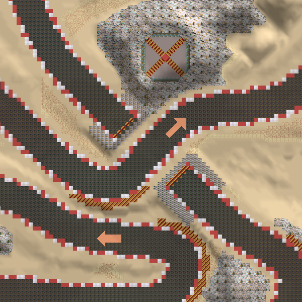

The jump crossing style, like the retail car jump, is a scripted flight (previous section); what is new is the road around it. Before, the road ran on through the crossing as a level junction and the car flew over it, so from the ground the track still crossed itself. Now the jumping road leaves the ground (numbers from the current build, the other road squared up to 90 degrees):

| Along the road, from the crossing | What is there |
|---|---|
| -15.4 to -7.4 cells | **the up ramp**: 800 above the road at its top, 8 cells long, a straight climb with a rounded foot, asphalt and curbs with rock sides; its last cell of flat top is painted with the red/gold hatching |
| -7.4 to -4.4 | **a gap**: sand, level with the other road |
| -4.4 to +4.7 | **the other road** (its curbs, 9 cells across; the two sides are measured separately, since the road bends a little) |
| +4.7 to +7.7 | **a gap** |
| +7.7 to +19.7 | **the down ramp**: 372 above the road at its top (hatched), down to the road over 12 cells |

The very end of each ramp is a face of blocking rock. Each gap is 3 cells (`JumpGap`) past where the jumping road's line actually leaves the other road's curbs, measured on the built road: the other road bends through the crossing, and a gap worked out from the crossing angle alone came out a cell wide on one side. The whole jump sits on a level stretch at the crossing's height, which EqualiseCrossings gave both roads, blended into the road's own profile over the next 15 cells. That matters because the flight knows nothing of the ground: it ends a fixed distance on and a fixed height down from where it starts, so the down ramp must be where the flight ends. `RaceTrackBuilder.PlanJump` does the layout; the ramps get the bridges' narrow rock-sided shoulders (`TrackRoad.Bridge`), the gap is sand (`TrackRoad.Gap`), and no arrow is put on any of it (`TrackRoad.Jump`).

**The crossing angle.** A jump clears the other road more easily the steeper it crosses it, but the crossing is re-shaped: the straighter road is turned and made straight over the whole jump, then bent back to the drawn course. At 64 degrees the stretch beyond the jump ran into the next part of the lap, 4.3 cells between centre lines (two 9-cell roads overlapping), which read as a second crossing. So `JumpAngle` tries 64 degrees down to 36, 2 at a time, and takes the steepest whose re-shaped stretch (the points that moved off the drawn road) keeps `JumpClearance` (12.5 cells) from every other part of the lap. The other road's own arm near the crossing is left out, being the one crossing there should be. On the Desert track that is 42 degrees (41 as built), keeping 13.2 cells, as the bridge build does there. A lap where no angle manages it gets the angle that keeps the most, and a `WARNING` in the log.

**The other road squared up.** At 41 degrees the other road met the up ramp at a slant, and its surface ran into the ramp's right side: 3.1 cells of overlap, where its ground and paint won over the ramp's curb, so the ramp had no red/white curb on that side. `SquareOtherRoad` now turns the other road to meet the jump at 90 degrees over a short stretch: straight for 8 cells either side of the crossing, then back on its own course over 32 cells. It tries 90 degrees down to 60 with blends of 32, 28 and 24 cells, and takes the first that still crosses the lap once, keeps `JumpClearance` from the rest of the lap, and bends no tighter than 6 cells (10.8 here). Its surface now stays 3 cells clear of both ramps, which come out the same either side. Two smaller changes back this up: the ground under a jump ramp's top is shaped after the verges and embankments and before the road surfaces (`ModifyGround`), and a ramp's rock sides win over another road's sand verge in the paint.

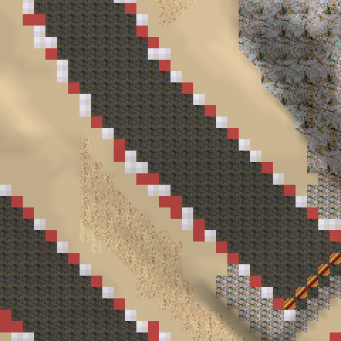

**A longer flight.** The retail flight (17.6 cells) would land in the gap. `Terrain/RaceTrackJumpAnim.cs` adds a copy of ANIM.HQR entry 51 as a new entry with its steps scaled, as long as the layout needs: from the take-off strip, over both gaps and the other road, to `JumpLandInto` (3.5) cells down the far ramp. Squared up, that is x1.21 forward, x1.18 up and x1.11 the time: 21.2 cells in about 2 s. It is added after the island is built, since the layout decides its length. It gives the new entry to Twinsen's buggy entity (RESS.HQR entry 44, entity 12: the engine loads entity n for behaviour n, and driving is behaviour 12) as generic animation 200, the one record added to that entity (since 2026-09-30 the island's own number, 202 on the Desert island: see "Several tracks in one game folder"); the retail jump in scene 62 keeps entry 51. The hero's track script plays `anim(200)`.

**Where the flight starts.** The take-off strip (scenario zones numbered 40) starts 2.5 cells before the lip and is 1.25 cells deep, as wide as the curbs. The flight starts where the car enters it, whatever the speed: at full speed the car moves a fifth of a cell a frame. So the flight starts at a known place, 5.5 cells up the ramp, and ends 3.6 cells down the far ramp, 30 units above its surface: the down ramp's height (372) is worked out from that. The strip started 1.5 cells before the lip at first. The jumping road runs diagonally across the ground's grid, so the lip's rock face is a staircase of blocking cells, and a car 3 cells off the centre line hit a step of it before it reached the strip, and stopped.

**Verified in the engine** (headless, `tools/RaceTrackPlan/jumpdrive.py`):
- Driving at full speed from 20 cells before the take-off, on the centre line, the car climbs the ramp and takes off at the strip. It flies over the gaps and the other road, lands on the down ramp, and drives on down it.
- Three and four cells either side of the centre line, the same.
- Both ramps have their red/white curbs along both edges up to the lip (the picture above, and cell by cell along both edges).
- [In the air](racetrack/build/h_jump.png); [from the other road](racetrack/build/h_jump_gap.png) (an earlier build), with the gap and the down ramp's hatched top.

### How the scene runs it

`Terrain/RaceTrackScenes.cs` (`AddJump`) adds a small controller actor instead of editing each scene's long hero script:

- **The controller** (entity 16, invisible, no body) goes in the scene the take-off lies in (scene 66). It makes the retail script's three checks (`zone_obj(0)`, `beta_obj(0)` within 56 degrees of the road, `comportement_hero`), then does `set_dir_obj(0, 12)` and `set_track_obj(0, label_90)`. It gives the keys back when label 91 is reached.
- **The hero's track script** gets `label(90); beta(<heading>); anim(200); wait_anim(); anim(0); label(91); stop();`. The `beta` sets the road's heading first, so the flight goes along the road whatever the car's heading was within the window.
- **The take-off strip** is added at the end of the zone list, so it wins where zones overlap.
- **The crossing**: `RaceTrackBuilder.SteepenCrossing` turns the road to the chosen angle and makes it straight over the whole jump (about 25 cells either side), `SquareOtherRoad` squares the other road up to it, and `PlanJump` lays it out.

## The engine's race-track mode (2026-09-28)

The engine changes a race track needs are in one place, `native/lba2-classic-community/SOURCES/RACEMOD.CPP`, and are on only when the environment names a car setup file (`LBA2_RACETRACK_FILE`). LBA Assembler's Play sets it only when the LBA2 folder it plays has a race track built (`RaceTrackService.HasBackups`). Every other game plays exactly as before: the code paths are the original ones.

With it on:
- **The car stays level on the bridge deck** (BUGGY.CPP `BuggyFloorY`, "The car on the deck"), and the parked car doesn't stay on screen as a ghost when Twinsen gets in (`TakeBuggy`).
- **The car setup**, from the file, replaces the buggy's fixed rates (BUGGY.CPP `RaceSpeed`):
  - a **gearbox**: X shifts up and Z down, on the key's press. Each gear has its own top speed; it can also be automatic (up at a gear's top speed, down below 70 % of the gear below's);
  - the **acceleration**, scaled to the gear as a gearbox does it. The pull goes with the gear ratio and the top speed against it, so a gear whose top speed is the original car's pulls like the original car, and a lower one harder (at most 4 times);
  - above a gear's top speed, just after a shift down, the car slows as it does off the throttle;
  - the **braking**, the **rolling to a stop**, the **top speed backwards** and the **steering**;
  - the engine's sound revs up through each gear.
- **A display** in the top right corner, in the game's font, while Twinsen drives: the gear, the speed, the lap and its time, the checkpoints crossed, the last and best laps, the race position and a message line. Speeds are in km/h with a cell taken as a metre, so the original car's top speed is 27 km/h.
- **Laps are counted** at the start line (from RACETRACK.JSON: its ends in its cube's coordinates, across the lap and the pit lane, and the way a lap crosses it). Crossing it the right way starts lap 1. The timer is the game's own clock (`TimerRefHR`).
- **Checkpoints.** A lap used to count at every forward crossing of the line, so a car could reverse over it and cross it again. Now there are 8 checkpoints round the lap: lines across the road (and its verges), each within one cube, put by `RaceTrackBuilder.PlaceCheckpoints` evenly along the lap, away from the pit lane, the crossing and the cube edges. A lap counts when the car has crossed them all in order and then the start line; the display shows the last lap's time and the best. Crossing the start line short of them shows "Missed checkpoint N: no lap", and the lap's time runs on. Crossing the last one backwards takes it off again and shows "Wrong way".
- **An opponent.** The retail Desert track's racer (scene 57's actor 4: entity 157, body 227, the car with its driver) is copied into every outside scene of the island. The copies are hidden below the ground, except the one on the grid beside the buggy in scene 67. The engine drives it along a racing line the builder plans with the track, at speeds planned from the player's own car (see "The opponents' driving"). Over the jump it follows the flight's own arc. It sets off when the player first drives off, and waits while Twinsen is out of the car. Each frame it is placed, facing along its line and running its driving animation, in whichever scene is showing (`RaceMod_Frame`, at the start of the frame's drawing). The display shows the race position: how far round each car is. While it moves, the whole scene is redrawn each frame. Without that, the car, drawn into the engine's background copy while it waited on the grid, stayed there as a picture once it set off.
- **Play starts the race.** With "Start beside the car on the start/finish straight" in the car setup (the default), Play on a folder with a race track built starts scene 67 whatever scene is open (`RACETRACK.JSON`'s `StartScene`). Twinsen stands beside his buggy on pole, with the opponents on the grid behind him (see "The grid, qualifying and the count-down"), and the zones and routes the editor draws over the game are hidden; changing those checkboxes while playing shows them again. The build removes the outside scenes' other actors already. The scene's hero start keeps no facing, and Twinsen comes in facing the lap's way, so he stands 1.8 cells behind the car, where Action gets him straight in.

- **Two opponents.** Baldino races too, in his rocket car, on a line of his own (see "Baldino's rocket car"). The engine drives up to four, each with its own line, grid spot, skill, character and cars; the display's position counts them all ("Position 2/3").

The file is `key=value` lines: `gears`, `gear1`..`gear8` (top speeds, world units a second), `accel`, `brake`, `coast` (speed gained or lost per millisecond; the original car's are 4, 12 and 7), `reverse`, `steer` (4096ths of a turn a second; the original 1024), `automatic`, `hud`, `startline=<cube x> <cube z> <x0> <z0> <x1> <z1> <dir x> <dir z>`, a `checkpoint=` line in the same form for each checkpoint in order, and for the opponent `opponent_path=<file>` (lines of `x z y speed radius`, island world units, 32768 a cube: with the bend radius the speeds are planned from the car, without it the file's are driven), `opponent_grid=<the line's point it starts at>`, `opponent_pace=<percent>` (its skill), `opponent_top=` and `opponent_grip=<percent>` (its character), `opponent_catchup=<percent>` `opponent_name=`, and an `opponent_actor=<scene> <actor>` line for each scene's copy; the second opponent's lines are `opponent2_path` and so on, up to `opponent4`. The grid is `grid=<cube x> <cube z> <x> <y> <z> <turn>` lines, pole first, `qualifying=1` (or 0), `qualifying_seed=<n>` (optional: the opponents' qualifying times' randomness, else the clock) and `hide_actor=<scene> <actor>` for the cars of opponents the player left out. Anything missing keeps the original car's value; with no `checkpoint=` lines every crossing of the line counts, and with no opponent lines there is no opponent. X is otherwise the dodge key, which does nothing while driving.

**The race car setup** (`RaceCarWindow.cs`, `RaceCarSetup.cs`, kept in the settings): presets (the original buggy, a 5-gear race car, a fast 6-gear one), the number of gears and each one's top speed in km/h, the acceleration, braking, rolling to a stop and steering as percentages of the original car, the opponents (each on or off, with its skill, 50-120 %, and whether they push harder when they fall behind), and the race start. It appears when Play starts on a folder with a race track (it can be switched off there; it doesn't appear when the game is only restarted), and from the race track dialog's "Race car setup…" button. Play writes it for the engine as `racecar.txt` in its user folder, with the opponents' lines beside it as `racepath.txt` and `racepath2.txt` (`Terrain/RaceCarEngineFile.cs`).

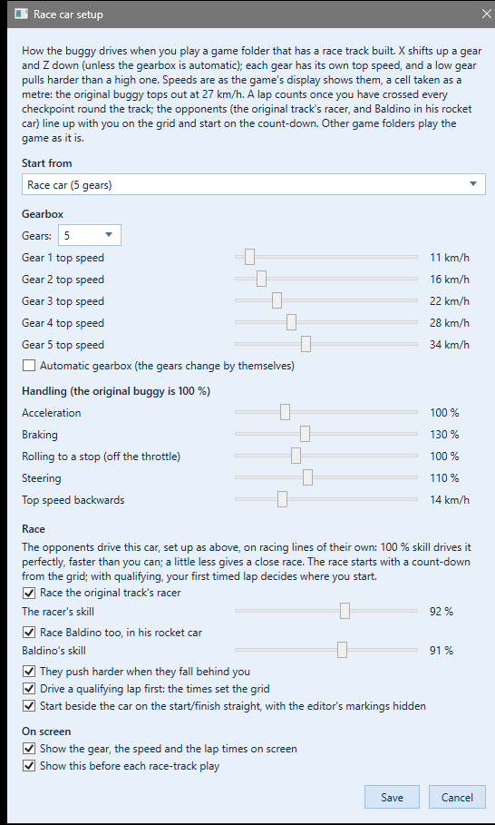

**Verified**:
- Headless, with no car file, the car tops out at 3800 as ever.
- With a 3-gear car (1500/2500/3500), first gear holds at 1500, and each X press lifts the top speed to the next gear's.
- The display shows the gear and the speed. The first crossing of the start line starts lap 1; the car taken back and across again shows lap 2, and the last and best times.
- In the app: Play on the built folder showed the car setup, then the game with the display; the car file had the start line from RACETRACK.JSON. Play on the same folder restored showed neither.
- Checkpoints (headless, a test file with two checkpoints in the start cube): crossing one counts it (1/2); reversing over it shows "Wrong way" and takes it off (0/2); recrossing the start line then shows "Missed checkpoint 1: no lap" and lap 1's time runs on. With both crossed in order, the next crossing counts lap 2, with the last and best times. The built lap's 8 checkpoints are crossed once each, in order and the lap's way, by the opponent's line (both styles).
- The opponent (headless, jump and bridge builds): on the grid beside the buggy, it sets off with the player and runs ahead, and nothing is left behind on the grid. On the bridge build its line runs over the deck at the deck's height and under it on the lower road.
- In the app (2026-09-28): with scene 61 open, Play showed the car setup, then started scene 67 with Twinsen beside his car, the opponent on the grid and no zones or routes drawn. The car file it wrote matched the one tested headless.

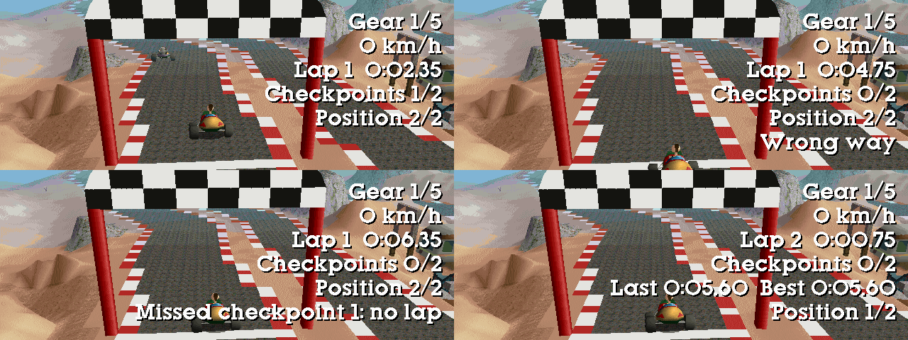

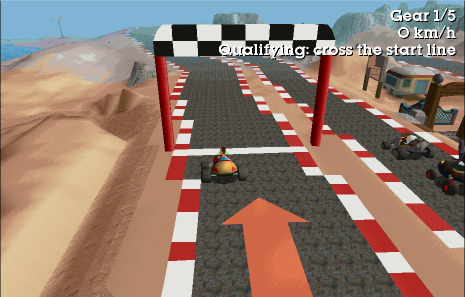

## The grid, qualifying and the count-down (2026-09-28)

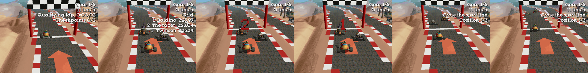

**The grid** (`RaceTrackScenes.GridSpot`) has five spots in scene 67, staggered either side of the middle of the road:
- Pole is 3 cells behind the start line; each spot is 3.5 cells behind the one before it and 1.75 cells to its side.
- Two cars side by side are 3.5 cells apart across the road (the cars are 2.6 cells wide, so 0.9 cells between them), and 7 cells apart on the same side. Before, the racer's car stood touching the player's.
- The build puts Twinsen's buggy on pole, with Twinsen 1.8 cells behind it (where Action gets him in; the next car is on the other side, clear of him), the racer on the second spot and Baldino on the third.
- The spots are written to RACETRACK.JSON (`Grid`) and passed to the engine.

**The pits** (`RaceTrackBuilder.PlacePits`) are where the opponents' cars wait while Twinsen qualifies: five spots in the pit lane, the first 2 cells before the start line and each 4 cells further back, 10.5 cells to the side of the lap (the road's curb is 4.5 from its middle, so they stand well clear of it) and facing the way a car leaves the pits. On the grid they stood across the start line, which a qualifying lap has to cross. The build parks the cars there, so they are out of the way in the retail engine too; the spots go to RACETRACK.JSON (`Pits`) and the car file (`pit=`). The pit lane is its own road whose points may run either way round the lap, so a spot is found by where it lies along the lap, not by counting points along the lane.

**Qualifying** (`RACEMOD.CPP`, the car setup's "Drive a qualifying lap first", on by default):
1. While Twinsen qualifies, the opponents wait in the pits. The display says "Qualifying: cross the start line", then "Qualifying lap" with its time and the checkpoints.
2. His first complete lap (every checkpoint, in order) is his qualifying time.
3. Each opponent's time is its lap as the engine planned it at its skill, plus or minus up to 3 s at random.
4. Everyone is sorted by time and put on the grid, pole first: the opponents move from the pits onto their spots. Twinsen's car is moved to its spot (only ever in scene 67, where his lap has just ended), standing, and the camera follows it. The display lists the grid ("1 Baldino 2:25.97 ...") for 4 s.

Without qualifying, the grid is formed as soon as Twinsen is in his car, with him on pole and the opponents behind in order of their times.

**The count-down** follows: a big 3, 2 and 1 in red, a second each, then a green GO!, drawn in blocks in the middle of the screen (`BigText`). Twinsen's car can't move until GO (`RaceMod_Held`, BUGGY.CPP `RaceSpeed`). At GO the laps start afresh from the start line, and the opponents pull away from a standstill:
- An opponent's speed rises no faster than the car's pull through its gears allows, up to its line's speed.
- It moves from its grid spot onto its racing line over its first 12 cells. The lines are no longer held at the grid.

**Verified** (headless, the jump build):
- **Without qualifying:** the grid formed with Twinsen on pole. The throttle was held from 2.8 s, but his car stayed on its spot until GO at 6.1 s. The count-down showed and all three cars set off at GO.
- **Qualifying:** a test car file puts two checkpoints just past the start line, the second crossed backwards, so a lap can be completed without steering. Twinsen's 155.39 s lap put him third behind Baldino's 145.97 s and the racer's 148.05 s. His car was moved to the third spot, the grid was listed, then 3, 2, 1, GO.
- **The pits:** during qualifying the start/finish straight is clear, and a state dump puts both opponents exactly on the first two pit spots (0.9 and 4.9 cells before the line, 12 cells to its side). When the grid forms they move onto grid spots 2 and 3, to the centimetre. In the app, Play shows Twinsen alone on the straight with the two cars waiting in the pit lane.
- **In the app:** the menu build is byte-identical to the command-line build. Play started on the staggered grid, and the car file had the grid, qualifying and the opponents' names.

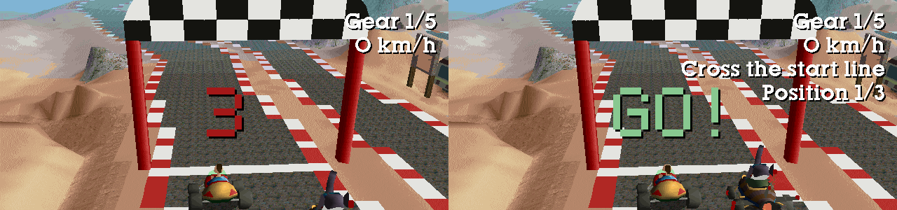

## The opponents' driving (2026-09-28)

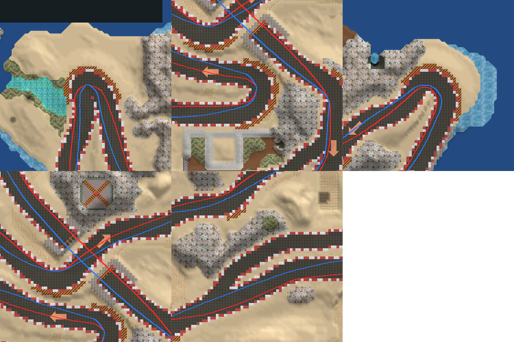

The racer's line (red above) and Baldino's (blue), at the north-west hairpin, the two bends at (625, 643) and (653, 480), the jump and the start.

**The racing line** (`RaceTrackBuilder.PlanRacePath`) has a point a cell apart round the lap. Each point may sit up to 3.2 cells either side of the middle of the road (the car's middle: its wheels then just reach the curb). On the inside of a bend it stays far enough from the bend's centre to keep a radius of 1.2 cells at least: the lap's tightest bends are 2.6 cells round the middle of the road, and a line cutting further in folded over itself there. The line is found in two steps:

1. **Smoothing.** Each point is moved to the middle of its neighbours and then back within the road, over windows from 30 cells down to 2, 100 rounds each. A long bend's line moves as a whole. Point-by-point curvature sweeps, tried first, only ironed out small wiggles in 6000 rounds; they left the line on the middle of the road.
2. **Local search.** A search on the lap time itself: points every 4 cells are moved in and out by 1, 0.5, 0.25 and 0.1 cells, and a move is kept when the lap is quicker.

Each opponent leans a little to its own side, so the two lines don't lie on each other on the straights. Its grid spot and the start line are held at its side, so it starts where the scene puts its car. On the Desert track, with the race car driven perfectly, the line takes 134.4 s against 145.0 s on the middle of the road; the old line took 163.2 s.

**The speeds** are planned by the engine when the race starts (`RACEMOD.CPP` `PlanSpeeds`), from the player's own car as the car setup makes it:
- **Bends:** the buggy turns at a fixed rate whatever its speed (its steering, `SpeedRot` a second, BUGGY.CPP), so a bend of radius R is taken at up to that rate times R. The path file carries each point's bend radius (the circle through the points three cells either side).
- **Straights:** no faster than the car's top gear.
- **Braking and accelerating:** braking before bends as hard as the car's brakes, pulling away after them as hard as its gears (the pull of the gear an automatic gearbox would be in), two rounds each way round the loop.
- **Skill:** the speeds are driven at the opponent's skill, the car setup's slider. At 100 % it drives the player's car perfectly on its line, faster than anyone can. The defaults are 92 % for the racer and 91 % for Baldino: laps of 146.1 s and 145.0 s. A player driving the middle of the road perfectly takes 145 s.
- **Character:** Baldino drives with 102 % of the car's top speed and pull but 92 % of its cornering. His perfect lap is 132.0 s, the racer's 134.4 s.
- **Catch-up:** an opponent that has fallen behind the player pushes harder, up to 8 % more at 60 cells behind. It never slows down when ahead. This is a car setup checkbox, on by default.

Because the speeds come from the player's car, a faster car setup (the 6-gear preset, say) makes the opponents faster too.

**Verified:**
- **Headless:** the engine planned the perfect laps above. With Twinsen sitting in his car at the start, the opponents lapped in 146.09 s and 145.01 s, lap after lap. The engine logs each opponent's lap (`[racemod] opponent 1: lap 1 in 146.09 s`).
- **The lines:** they stay within the road everywhere; in the picture above, they use the curbs round every bend. On the bridge build they run over the deck at its height and under it on the lower road.
- **In the app:** the menu build is byte-identical to the command-line build. Play wrote the skills, characters and catch-up into the car file, and the engine planned from them.

## Baldino's rocket car (2026-09-28)

A second opponent: Jerome Baldino, the Desert island's inventor, in a car made after his rocket ship (`Terrain/RaceTrackBaldinoCar.cs`). It isn't a copy of the ship but an inventor's version of it, about the size of the game's own cars (2.6 cells long, 2.3 wide):

- **The hull** is a stubby ribbed barrel, the ship's planked fuselage in alternating brown and taupe planks, with navy go-faster stripes down both sides.
- **The cockpit is open**, so his face shows: an oval hole with a brass rim, a low teal windscreen, and a red steering wheel he holds out in front of him (his elephant's head reaches forward, so the wheel is below his chin).
- **At the back**, a grey rocket nozzle with an orange flame (drawn unlit, so it glows), the ship's swept grey wings with red lights at their tips (its red discs), and a tail fin with another.
- **The gadgets**: odd wheels (big at the back, small at the front) with red hub caps, a coil-spring aerial with a red ball, a clockwork key in the side, a propeller on the nose and two yellow headlights.
- **Baldino himself** comes from his own body (BODY.HQR entry 139, "Jerome Baldino"): his torso, head with sunglasses, ears and arms. His hips and legs are left out (they are in the car), he is made a little smaller (0.8) and his arms are posed on the wheel (a two-bone reach that keeps his arm lengths). His trunk is raised forward and to one side, as if trumpeting: hanging, it went through the dashboard, and straight up it hid his face.

**How it moves.** The car is a second body of the retail racer's entity (157: its own car is body 0, BODY.HQR 227; this one is body 1), so the racer's animations drive it. It has the same 18 bones for the same parts:
- 0-1: the root and the bounce;
- 2: the hull;
- 3-8: the front struts, hubs and wheels;
- 9-12: the rear axles and wheels;
- 13: the driver.

The racer's driving animation bounces the car, tilts it a degree, wobbles the wheels and leans the driver. It also swings the racer's arms (bones 14-17) a long way onto his wheel; Baldino's arms are drawn on his wheel already, in bone 13, and 14-17 are empty.

**What the build does** (`RaceTrackService.Finish`):
- It adds the body to the end of BODY.HQR (entry 469 of the original file: 415 polygons, 11 lines, 16 spheres, 443 points, inside the engine's 550).
- It adds a body record, `1, 1, 4, <entry>, 0`, to entity 157 in RESS.HQR entry 44 (`RaceTrackBaldinoCar.WithBody`, as the jump's `WithAnim` does for its animation).
- It puts a copy of the racer's actor with body 1 in every outside scene, hidden below the ground, except the one on the grid in scene 67 (the third spot until the qualifying decides).
- It writes his line to RACETRACK.JSON (`Rivals`).

BODY.HQR is kept as `BODY.HQR.before-racetrack` with the others. The body writer (`Body.Write`) now keeps a face whose `Material` is 0 flat and unlit in a lit body (the flame, the cockpit's dark hole). Every retail body still reads back after a write (`BodyPipeline bodyroundtrip`).

**His line** (`RaceTrackBuilder.PlanRacePath` with `BaldinoLine`) keeps more to the other side of the road from the racer's. His rocket car (his character) drives with 102 % of the player's car's top speed and pull but 92 % of its cornering. Over the jump it follows the flight like the racer's. The car setup has "Race Baldino too" and his own skill.

**Verified**:
- In the engine (headless): the car on the grid, and seen from the front, three-quarters, the side and the back (the scene's copy turned with `ScriptRoundTrip actorbeta`, played without the race-track mode, which turns the cars along their lines every frame). With the race on, both opponents set off with the player and the display counts three racers.
- His line crosses the 8 checkpoints once each, in order and the lap's way, on the jump and the bridge builds. On the bridge build it runs over the deck at its height and under it on the lower road.
- The menu build (jump) is byte-identical to the command-line build, BODY.HQR included. Play from the app started the race with both cars on the grid, and the car file it wrote had both opponents.

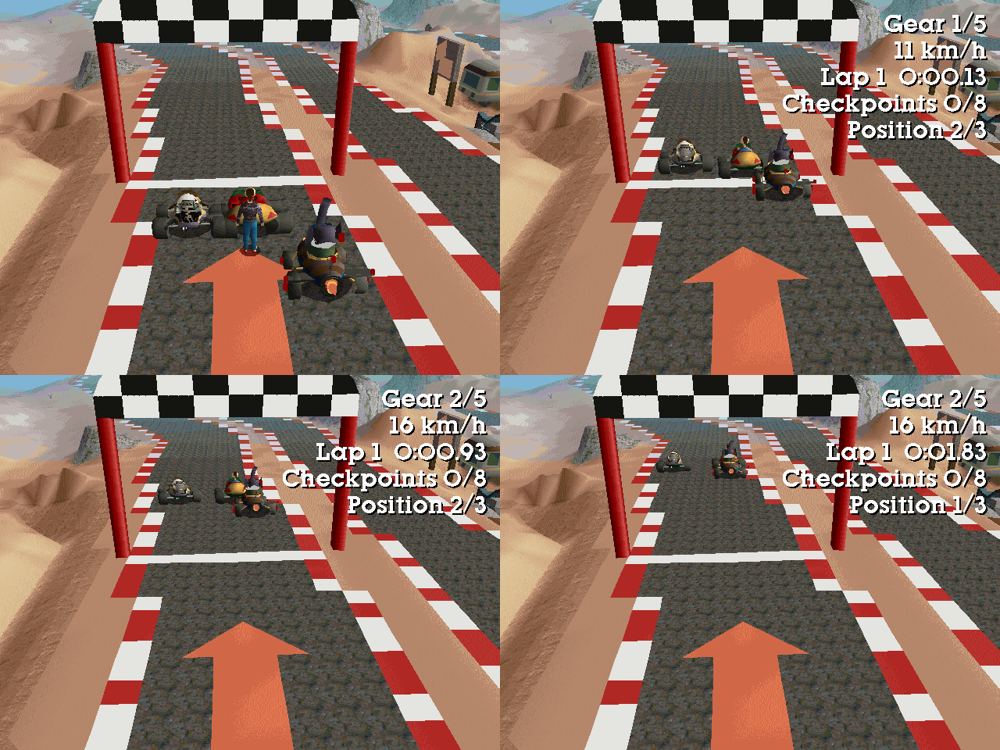

`ScriptRoundTrip baldinocar <game> <scratch>` builds the car into copies of a folder's BODY.HQR and RESS.HQR; `BodyPipeline object 2 <scratch>\BODY.HQR 469 <turn> <png>` draws it. `BodyPipeline bodyinfo <file.hqr> <entry>` lists a body's bones, `animdump <file.hqr> <entry>` an animation's keyframes, `palettesheet 2 <png>` the body palette.

## Citadel Island's town circuit (2026-09-29)

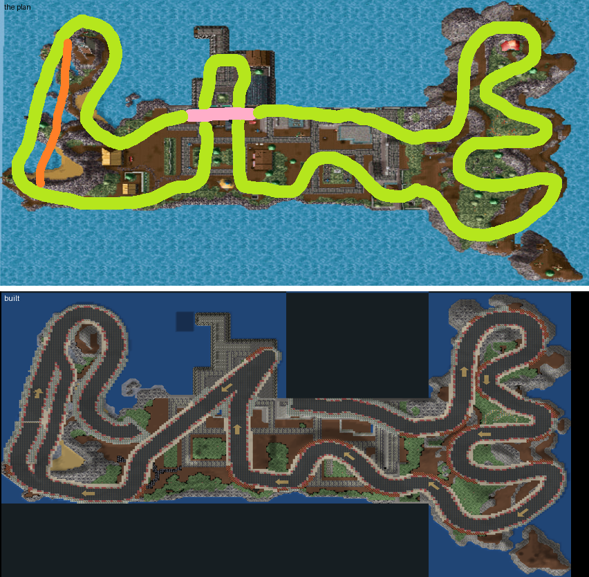

A second track, from the user's own drawing over a top-down picture of Citadel Island: a 1,046-cell town circuit through the harbour, the citadel's streets and the cliffs, with a pit lane down the west side and a bridge where the lap crosses itself. Everything the Desert track learned is reused: the same road, curbs, arrows and hatching, the same grid, qualifying, count-down, opponents and racing lines.

**The route came off the picture.** The picture is the island's own map turned a quarter turn clockwise and squashed, so the drawing was fitted to a fresh render of `CITADEL.ILE` rather than measured by hand:
- the land of both was masked (the sea, and the drawn lines) and the best scale and offset found by cross-correlation: 0.805 across and 0.595 down, an island cell being 4 pixels of the render. The outline it gives follows the coast in the drawing exactly.
- The lime route was skeletonised and walked with a "snake": a cursor that steps a few pixels along and snaps back to the line. A plain walk of the skeleton turned back on itself where the route crosses, and closed a loop covering only part of the track; the snake carries straight on through a crossing. It closed on the whole 1,071-cell lap.
- The pink bridge bar is drawn over the lime and cuts it, so the route mask is the lime and the pink together.
- The orange pit lane's two ends and the bridge's middle came from their own masks.
`docs/racetrack/citadel_track_plan.json` is the result (the plan format the Desert track uses: points in island cells, and the pit lane's ends). `ScriptRoundTrip planprobe CITADEL <plan>` checked every point is on land before anything was built.

**What differs between islands** is now a record, `Terrain/RaceTrackIsland.cs`: the ground and decor files, the island byte, its outside scenes, its palette, the plan built into the program, and whether there is a retail race track to clear. The dialog has an island to choose, and the command line takes `RT_ISLAND`.

- **The road's look** (`Terrain/RaceTrackTextures.cs`). The Desert track's asphalt, hatching, rock and white curb are tiles of the *Desert island's* own 256 x 256 texture page, and its red curb and arrows are colours of its own palette; on Citadel those coordinates draw whatever happens to be there. The build now copies those four tiles into the target island's spare texture space -- the 8 x 8 blocks no cube's polygon reads, 14 % of Citadel's page -- and remaps every pixel to the nearest colour of that island's palette. The flat colours are matched the same way, keeping each colour's position in its ramp so the engine's light still lands on it (red curb 69, arrows 101 on Citadel).
- **The buggy.** Citadel has none: the buggy is one object the game puts on the Desert island. The build copies the buggy actor out of Desert scene 67 into the start scene, with the same script, and takes the car quest out of it so it is there from the start of any game (a copy added after that patch had already run kept the quest test and removed itself, which is why Twinsen first stood on the grid with no car).
- **One bridge over two crossings.** The drawing has the lap cross itself twice a few cells apart, with one pink bridge over both: a loop that dips under the same stretch of road twice. The bridge planner used to take the first crossing and give the deck to whichever road was straighter there, which picked a different road at each crossing and carried neither. It now takes the crossings within a deck's length of each other as one span, chooses the side of the first crossing that the others also lie on, centres the deck between them, makes it long enough for all of them and high enough over the highest road it passes above (73 cells of deck here, against 68 for the Desert track's one crossing).
- **Read-only files.** A game folder taken off a disc (or from a reference set kept read-only) has read-only files, and File.Copy carries that to the copy, so the build failed on its own backup; every copy the build makes is now cleared.

**The track**: 1,046 cells, 19,033 ground points levelled, 12,481 cells painted, 96 props and 85 solid decors taken off the road, 10 arrows, a 98-cell pit lane, 8 checkpoints, a grid of 5 and the pits beside the start line. With the race car driven perfectly a lap is 102.6 s (the racer's line) against 111.8 s round the middle of the road -- a shorter, twistier circuit than the Desert track's 134 s.

**Verified**:
- The menu build is byte-identical to the command-line build (all seven files), and only Citadel's own files are kept and changed: the Desert island's are untouched.
- The Desert track, built again with all of this in place, is byte-identical to its last build (`DESERT.ILE`, `SCENE.HQR`, `RACETRACK.JSON`), for the jump and the bridge alike.
- In the engine (headless): the start scene (49, near the Dino-Fly) puts Twinsen beside his buggy on the grid, Action gets him in, the display says "Qualifying: cross the start line", he crosses it and the lap times run with the checkpoints. The opponents wait in the pit lane.
- In the app: Play starts scene 49 with the car and the opponents in the pits.
- Citadel's own rain and gloom make the track look dark: a screenshot of the untouched scene 49 is darker still (mean brightness 43 against 59), so that is the island, not the build.

### Second round: the invisible walls, the leftovers, the bridge and the rain (2026-09-29)

The first Citadel build could not be driven round. Five separate faults, four of them Desert assumptions that only showed on a second island:

**The invisible walls were the cube edges.** An island's outside is one scene per cube, and the engine holds the hero at a cube's edge (`EXTFUNC.CPP`: the position is clamped and `FlagHeroOut` set) unless a cube-change zone (type 0) to the next cube's scene covers that spot, at his height, on that edge (`GereZoneChangeCube`; the zone's arrival value, 512 or 32768 - 1024, names the edge). The build removes door zones that lie on the road, and it told a door from an edge crossing by the scene it leads to -- hard-coded as the Desert's outside scenes, 55-73. On Citadel every edge crossing leads to 42-50, so all of them were removed: 29 zones, a wall at every cube edge. Now the island's own range decides (`RaceTrackIsland.FirstScene/LastScene`), and only the 9 real doors go (into the sewer, Tralu, the ticket office...).

That alone was not enough: the retail edge zones only span the edges where the retail paths cross them (scene 42's south edge into 49 has none for 14 cells, where a cliff was). So the build now finds every place the lap crosses a cube edge (`RaceTrackScenes.EdgeCrossings`) and, both ways, adds a crossing zone of its own wherever the island's don't cover the whole road's width at the road's height (`CoverEdges`: the last cell before the edge, 16 cells of it, the position and height carried over like the retail ones). Citadel's lap crosses 14 edges and needed 9 zones; the Desert's crosses 26 and needed 14 -- it too had stretches of edge its racing line crossed fine but the road's full width didn't.

**The remains of a building were the start gantry and some protected bodies.** Body numbers are an island's own. The gantry is placed as bodies 64-66 (the Desert track's beam and posts) and the viaduct's arch as 68-70; on Citadel 64 and 65 are a building's stone wall and pillar, so the "gantry" stood at the start line as a wall and a pillar. And the retail track's bodies (64-71) were protected from removal -- on every island, so Citadel's walls and pillars on the road stayed. Now the protection only applies on the island that has the retail track, and for any other island the build copies the Desert's gantry and arch bodies into its own OBL (`RaceTrackService.CopyRetailBodies`, as they are: the palettes put the same colours at those indices) and places the copies (`RaceTrackOptions.RetailBodies`).

A third kind of leftover: a building is several decor pieces placed apart, and clearing the pieces on the road left the rest standing -- a wall on its own by the kerb, a roof beam in mid-air whose supports had gone. `ClearRuins` treats pieces whose boxes touch as one structure, and where one lost pieces to the road and what is left is all small parts (no whole building among them), those go too, within 14 cells of the road. It took 6 pieces on Citadel and 3 on the Desert (two lone fence posts and a small low piece).

**The bridge didn't meet the road.** The deck is straight, so the road it carries is straightened first (`SteepenCrossing`). With one deck over two crossings, the straightening still picked its road by the old one-crossing rule (the straighter one) -- the other road -- while the deck went on the stretch the two crossings share: the deck sat on a road that had never been straightened. Now a multi-crossing span straightens the road it carries, through all its crossings, along that road's own heading (`SpanOf` gives the span's middle and length to both steps). The build reports how far the road's middle strays from the deck's: 0.0 cells along the whole deck, where anything over 1.5 is a warning.

**The road ran off the island.** Driving over the bridge, the car went through scene 94, the engine's open sea: the deck's far end reached the corner of cube (7,8), which Citadel hasn't got. The drawn route itself passes 2 cells from that corner, and the road is 6 cells wide each side. `KeepOnIsland` now moves the lap's middle smoothly away from any missing cube until its verge clears it by half a cell (on Citadel from 2.2 to 6.8 cells; the Desert's lap never comes near one), and the bridge's straight is moved sideways, staying straight, until all of it clears too (6 cells here, so the deck stands 6 cells east of the drawing's pink bar).

**The rain.** The storm is the engine's `TEMPETE_ACTIVE` (COMMON.H): chapter below 2, which is how the story stands until the lighthouse keeper is freed and the aliens land. Once it is over the engine does more than stop the rain -- it loads Citadel Island from a different file, `CITABAU.ILE` ("citadelle beau"), with its own light, palette (RESS 42 against 27) and decor bodies (`CITABAU.OBL`), and a clear sky. So:
- the track is built into both files (`RaceTrackIsland.TwinIleFile/TwinOblFile`, `RaceTrackService.BuildTwin`): the same ground, so the same road, with the twin's own texture import, decor clearing, gantry and deck bodies. Without it the track would vanish in a real game once the lighthouse quest is done.
- the race car setup has "Stop the rain on Citadel Island" (on by default), which writes `weather=fine` to the car file; the engine's storm macros then read `RaceMod_FineWeather()` as well as the chapter. Only the weather changes, not the story: the scripts that test the chapter or the lighthouse quest (variable 56 turns Twinsen back at scene 49's edge in one of its states) are left as they are.

**Verified**:
- Every place the lap crosses a cube edge, both ways, walked in the engine (a script puts Twinsen a few cells before the edge on the racing line and walks him over): all 28 Citadel crossings and all 48 Desert ones end in the right scene. (Loading scene 48 directly starts Twinsen inside its scenario zone 7, which plays its scripted arrival from the sewer grid and holds him, so its departures were walked after arriving from scene 47, as a car does.)
- The bridge in the engine: the car started on the straight before the deck and driven straight across held the deck's height (3501) the whole length, within 0.3 cells of its middle, and went on into scene 48 without passing through the open sea.
- `weather=fine`: the engine loads the fine-weather island (mean brightness at the start 99 against 64), no rain, the sky and sea clear, the track, gantry and grid all there.
- The fine-weather file built from the same plan has the same lap, start line, pits and checkpoints; the heights of the two files are identical.
- The menu build is byte-identical to the command-line build (all nine files), and keeps backups of CITABAU's two files as well as CITADEL's.
- In the app: Tools > LBA2: race track opens on the island the folder was built with; Play shows the car setup with the rain option and starts scene 49 in fine weather with the real gantry.

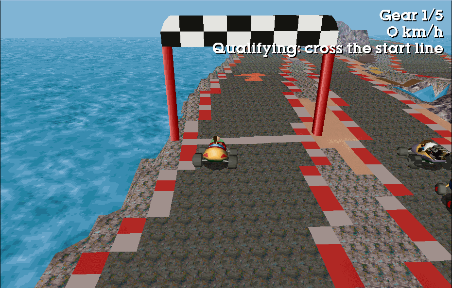

**Known limitations**:
- One island at a time. `RACETRACK.JSON` describes the last one built, and Play races that one; building Citadel's leaves the Desert island's ground as it was but stops the game racing it. (Citadel Island itself now carries two tracks, one in each weather: see "Citadel Island in the storm".)
- The lap's tightest turn is 1.5 cells round the middle of the road (the Desert track's is 2.6), at the hairpin above the harbour.

## The story, the holomap, the gloves and the biker (2026-09-29)

**The holomap pictures** (`Terrain/RaceTrackHolomap.cs`). When the holomap zooms in on an island it shows a pre-rendered 640 x 480 picture of it -- HOLOMAP.HQR entry 18 + 2 x island, in the game's palette (RESS.HQR entry 0) -- and draws the arrows and Twinsen over it through a camera the next entry gives: the island's target point, two angles and a distance (HOLOPLAN.CPP InitHoloPlan, `SetProjection(320, 240, 1024, 700, 700)`, `SetFollowCamera`). That camera is reproduced exactly (LIB386's `InitMatrixStdF`, `LongWorldRotatePoint` -- a rotation only, the camera being the rotated target pushed back by the distance -- and `LongProjectPoint3D`); projecting the island's own heights lands on the island in each picture, islets included. The built road is drawn through it: asphalt taking its shade from the picture's own light, red and white curbs every 1.6 cells as on the ground, the start line, all hidden where the built ground stands between it and the camera (a depth buffer of every ground triangle), and the bridge deck drawn after the roads it passes over. Citadel Island has two pictures, the storm's (18) and, once it is over, its own slot 12's (42); the Desert island's is 22. The retail Desert picture's own little race track sits under the new one but for a few pixels of its gantry.

**Zoe's line** (`Terrain/RaceTrackStory.cs`, Citadel Island only; replaced on 2026-10-03 by the user's story -- see "The story and each track's drivers"). The game opens with Zoe walking up to Twinsen in their house (scene 0, actor 4) to say text 0 of Citadel's texts -- "rush to the downtown pharmacy" -- and switch on the pharmacy's holomap arrow (`set_holo_pos(22)`). Her walk stays; she says a new text instead: "Twinsen, the new race track is finally built, head to the start line behind the house to qualify. Don't forget your racing gloves.", in all six languages the game has (English, French, German, Spanish, Italian, Portuguese; code page 850, as the game's own texts). TEXT.HQR's language files are 15 per language, each an id list and a table of offsets and texts (an attribute byte, the characters, a 0: MESSAGE.CPP); the CD version speaks a text by its place in the list, so a new text goes at the end, past the last recorded voice, and is shown, not spoken (`Speak`: `num >= MaxVoice`). Her later reminder ("did you find something to cure the Dino-Fly?") keeps the pharmacy's arrow.

**The arrow.** Holomap positions are scene numbers: record 50 + n of HOLOMAP.HQR entry 12 is where scene n lies on its island, used for its arrow and for "Twinsen is here" when he is inside it. The game has 222 scenes and every number 0-99 is one, so the start line's arrow is position 222 -- no scene's, no script's, and the island view's arrow loop runs to 254. Its label is a new text in the holomap's text file (2): "Race track start line.". The race-track mode clears it once Twinsen is at the wheel (`holo_arrow=` in the car file). Fixed in the engine on the way: the arrows' spin was only set up for positions below 100, and the game's own 104-188 started still. The engine's `dumpstate` now lists the arrows switched on (`holo_active`): a new game shows `[22]` after Zoe's line on the untouched data and `[222]` on the mod's.

**The racing gloves.** The darts lie on a shelf in Twinsen's attic (scene 1, actor 8, entity 18 -- BODY.HQR 31); Action in zone 5 there gives them (`found_object(2)`). The inventory is 40 fixed slots, and all 40 are the game's: a save stores exactly 40, item n's count is game variable n, and variable 40 is already the Dino-Fly quest. The darts' own slot won't do either -- the shop sells them (scene 14, 4 kashes, `found_object(2); set_var_game(2, 3)`), and scene 36 and the Desert island's scene 67 give them too. So the gloves take slot 7, the part Baldino gives Twinsen for Zoe to mend the car: the mod has the buggy ready from the start, so the part has nothing left to do.
- Their model (`Terrain/RaceTrackGloves.cs`): a pair of driving gloves built from boxes on one bone -- lit racing red, white cuff bands and a white stripe down the back of each hand, dark palms and fingertips in flat colours (a lit grey ramp came out mid-grey). Standing, fingers up, backs forward, at the size of the game's own glove (OBJFIX 11) as OBJFIX.HQR 7, the model the inventory and the "you have found" screen turn; and lying flat at the darts' size as a new body of the darts' entity (body 1), so the pair lies on the attic's shelf.
- Their texts: slot 7's found message, name and description (file 2: 7, 107, 207) are the narrator's (EN_GAM.VOX has them), so each old text keeps its place in the file under an id nothing asks for (60000 + id) -- every text after it keeps its voice -- and the gloves' texts go at the end, unvoiced: "You have found a pair of racing gloves.", "Racing gloves", "Your racing gloves: a firm grip on the buggy's steering wheel, lap after lap." (six languages).
- The attic: the shelf shows the gloves and goes once they are taken (`if (0 < var_game(7))`); Action there gives them (`found_object(7); set_var_game(7, 1)`). The part's one use -- giving it to Zoe near the car, scene 49 -- would have taken them away, so it asks `2 == use_inventory(7)`, which never answers.

**The biker.** Citadel Island's motorbike taxi -- a Rabbibunny on his bike, entity 100 (body 0 = BODY.HQR 148; animation 0 standing astride it, 317 riding: ANIM.HQR 764 and 766) -- stood on the track: his actors were kept because Twinsen's script rides with him in a travel cutscene, and the one in scene 42 was on the road under the bridge. He races now: the taxi's copies leave the outside scenes, and a copy of him joins every one as the third opponent, on a line of his own down the middle of the road (a bike: 97 % of the car's top speed, 106 % of its cornering). The car setup races him (on by default, skill 90 %); the engine drives each opponent with its own animations (`opponentN_anim=0 317`; the cars keep 0 and 1). He races on the Desert island's track too.

**Verified**:
- In the engine, a new game in scene 0: Zoe says text 996 (`[life] obj=4 MESSAGE dial=996`) and arrow 222 is on; the untouched game switches on 22. Her line shows in the game's dialogue box.
- The attic: the shelf actor is the gloves' body; after Action, item 7's count is 1, the darts' (2) untouched, the shelf gone; the found screen says "You have found a pair of racing gloves."; the inventory shows the gloves in the part's box.
- The race: the grid "1 Twinsen, 2 Baldino, 3 The racer, 4 The biker", GO, and the biker riding the lap on his bike with its riding animation, "Position n/4" on the display.
- The holomap: the island view in the engine shows the track on Citadel Island's picture.
- The menu build is byte-identical to the command-line build (all nine files, HOLOMAP.HQR, TEXT.HQR and OBJFIX.HQR now among the ones kept and put back). The suites pass.

## Mosquibees Island's mountain lap (2026-09-29)

The drawing: a lap round the Mosquibees' mountain in two loops, up to a bridge (pink) over to the plateau, a jump (blue) along the plateau's west side, and back down. It had no pit lane; the build puts one beside the start line (below).

**The island.** MOSQUIBE.ILE is three cubes (7,8), (8,7) and (8,8); (7,7) is missing -- the engine's open sea. The Mosquibees' mountain (7,8) is a stepped cone: flanks steeper than 100 %, a 9,500 shelf, an 11,100 summit with the three landing pads. The plateau (8,7) is a mesa at 12,750 with cliffs all round and three bays cut into it (west, north, east). South of it a ridge (9,500-11,000) runs down to the low ground by the arrival (700-1,600); the sea channel between the mountain and the ridge is 13-17 cells wide. Outside scenes 102 (the plateau), 103 (the mountain) and 105 (the arrival); 104, numbered between them, is the Queen's throne inside the mountain.

**From the drawing to a plan** (`tools/RaceTrackPlan/fitcam.py`, `perspective_trace.py`, `mosquibe_design.py`). The drawing is the island seen at a slant, in perspective -- the high plateau drawn far bigger than the mountain -- so a flat fit of the picture does not work. A pinhole camera is fitted instead (position, turn, tilt, focal length) that turns the island's 3D ground into the drawing, scored by how well the land it would see covers the drawing's land (IoU 0.92). The drawn line is traced and each point put on the ground the camera sees behind that pixel. That trace is a guide, not the plan: the mountain's flanks are far too steep for a road to follow the ground, so the lap is designed by hand along it -- a closed spline through control points, with its own heights: straight grades keyed at points, a vertical curve (a parabola tangent to both grades) at every change, the start straight, the bridge deck and the jump exactly level.

**The lap**, 500 cells, 47.6 s for the race car driven by the test pilot (below):
- **The start line and the pit lane** on the plateau's north edge, the only long, level, open straight. The pit lane runs inside it (south); it is short (24 cells beside the lap), so it moves out from the lap over 7 cells instead of 24 (`pitTaper`), and the waiting spots are taken after the line too where the ones before it are still too near the lap (two before, two after, 7.4-9.2 cells to the side).
- The north-east hairpin (4.8 cells), an S-bend across the plateau, and **the descent** down its east side: 14 %, over the low ground on a walled causeway 5,000-9,000 high.
- **The bottom straight** along the south shore, over the channel's mouth, still coming down, to **the first loop's start at the mountain's south-west foot: 925, the lowest point of the lap, just above the sea.**
- **Two loops winding up round the mountain**, clockwise: the first round its flank, the second round the summit, 11.5 cells inside it and 5,000-8,000 above it -- terraces one above the other; at most 12.6 %.
- **The bridge**: from the mountain's shoulder a flat deck, 28 cells (7 tiles) at 11,100, over the first loop -- 5,265 above it, crossing at 65 degrees -- and over the channel to the ridge.
- Up the ridge (12 %) to **the jump over the plateau's west bay**: a ramp to a lip at 13,100 on the south-west arm, a 17-cell gap over the bay (the flight tops out 15,500 above the lava sea), a landing 3.4 cells down the ramp on the north-west arm; then the north-west corner to the line.

**The plan** (`docs/racetrack/mosquibe_track_plan.json`) carries more than the others: `heights` (one per point: the road follows them, cut into the mountain and built up over the sea, grade-limited to the plan's own `maxGrade`, 15.8 %), `deck` (the first and last point of the flat deck), `gapJump` (the take-off lip and the landing lip) and `pitTaper`. A plan with heights is built as drawn: no crossing is re-shaped and the crossing style doesn't apply (the dialog greys it out) -- except that the style still decides whether the deck is given its bodies in the island's OBL, so such a plan sets it itself (`RaceTrackService.FollowPlan`: a bridge when it draws a `deck`). The greyed-out box first kept whatever the folder's previous build had used, and a folder last built with the jump got a Mosquibees lap with no deck under its bridge (2026-09-29).

**What the builder does with a planned lap** (`Terrain/RaceTrackBuilder.cs`; none of it touches a plan without heights -- the Desert island's and Citadel Island's builds are byte for byte what they were):
- **Walled road** (`PlannedProfile`): wherever the road stands more than 1,200 off the ground -- built up over the sea or the low ground, or cut deep into the mountain -- it gets the water bridge's narrow level top with blocking rock at its edges instead of the 7-cell earth skirt, which spilled fill across whatever lies below: the sea, or the road on the next terrace. 367 cells of the lap.
- **Steep banks are blocking rock** (`WallSteepBanks`, and verge cells holding a step): the engine lifts a car straight onto higher ground it drives into, however much higher, unless the triangle blocks (EXTFUNC.CPP `ReajustPosExt`), so an ordinary bank beside a terrace was a ramp up the cliff to the next one. 918 cells.
- **The plan's deck** (`PlanDeck`): the flat tiles over the deck's points, lengthened to whole tiles, the ground just under their last cells and level with them for 4 cells beyond, the clearance over every part of the lap it crosses reported.
- **The gap jump** (`PlanGapJump`, the crossing jump's ramps and flight in `LayJump`): the road's own level, the ramps on it, and between the lips nothing -- the gap's ground is left as it is and not painted (`Void`). A checkpoint is kept away from it.
- **The sea under every cube**: the engine draws the sea in 4 x 4 squares, only those a cube's info word marks (`CubeBitField`); all are marked.

**The engine** (`native/lba2-classic-community`):
- **Ground across the near plane is drawn clipped** (TERRAIN.CPP `DrawFeuillePolyClipped`). A ground cell some of whose corners are behind the camera's near plane (3,000 units) was painted black from its visible edge down to the bottom of the screen -- right for flat ground passing under a camera close over it, which is off the bottom of the screen anyway, but on this lap the camera following the car passes a few cells from terrace walls, and whole sides of the view went black. Each of its two triangles is now clipped against the plane in the camera's space (`ClipperZ`, as the sea's `Draw_Poly`) and drawn with its own colour and texture. The retail islands look as they did.
  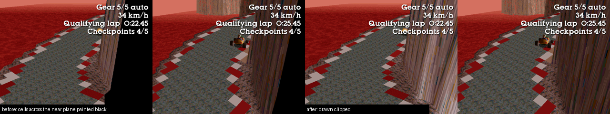
- **A test pilot** for headless runs: the console's `autodrive 1 [look ahead]` steers and pedals the player's car along the first opponent's line (RACEMOD.CPP `RaceMod_AutoInput`), so a whole qualifying lap and race can be driven with no one at the keys. The race-track mode now logs each checkpoint, missed checkpoint and lap.
- The console's `cube` leaves any cutscene the old scene was in (a harness's jump straight after boot landed in the opening's `cinema_mode(1)`, which then held for the whole run: letterbox bars, and the Auto camera never ran); `screenshot [path]` takes a file name; `camtrace` shows the camera's eye.

**The scenes**: a cube change to any scene that isn't one of the island's own outside scenes is a door (the rule counted everything numbered from the first to the last outside scene, and 104 is the Queen's throne).

**Verified**, on a copy of the game:
- The test pilot drives the whole lap: the qualifying lap through all five checkpoints in 47.61 s, the grid (Twinsen, Baldino, the racer, the biker), GO, and race laps of 47.63 s and 47.50 s, the three opponents lapping in 48-52 s.
- Every cube edge the lap crosses, both ways (8 of 8, the deck's included, at deck height).
- The jump: the flight starts on the take-off strip, clears the bay and lands on the far ramp; the deck carries the car level at 11,100 over the first loop.
- The frames round the lap with both cameras: no black left in the view.
- The menu build is byte-identical to the command-line build; "Put the original files back" restores every file exactly.
- The holomap picture (HOLOMAP.HQR entry 32) has the track drawn in; the picture itself is the island as it was, so where the build raised or cut the ground a great deal the road is drawn over the old shapes.
  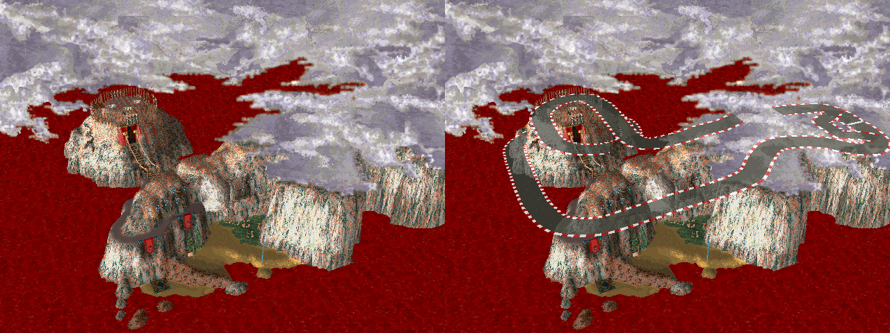

**Two leftovers, and what caused them (2026-09-29)**. Driving the built lap turned up a Mosquibee's nest sitting on the asphalt and a plank walkway hanging in the sky. Both were general faults, fixed for every island; `ScriptRoundTrip trackleftovers <game folder> <ISLAND> <lap.csv>` is the probe that found them (the lap's centre line comes from a build run with `RT_DUMP=<file>`; `RT_BEFORE=<the untouched ILE>` tells what the build itself left hanging rather than what the island always had, and it lists the actors of the outside scenes the same way).

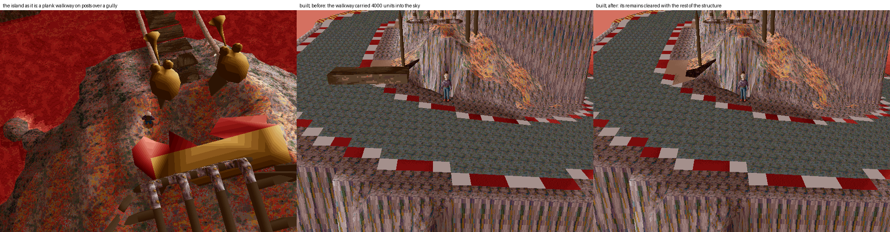

- **Objects were carried about by the ground under a corner of them** (`Terrain/IslandOps.cs`, `DecorFollow`). A decor keeps its height above the ground when the build reshapes it, read under the decor's own origin -- but an origin is not where the object rests: for many it is a corner of the box, and its `Y` is 0, the body itself being at `YMin..YMax`. Mosquibees Island's walkway is a row of planks on posts across a gully, so its origin stands over the gully floor; when the road's embankment filled that floor, the whole walkway rose 4,000 units into the air. Now a decor follows the ground only when it rests on it -- its underside at or below the highest ground anywhere under its footprint -- and one hanging clear of the ground is left where it is. (Following the *highest* ground under the footprint instead was tried and is wrong the other way: it lifted a small rock beside the new embankment onto the embankment's own height.)
- **A structure whose pieces stand apart was not recognised** (`RaceTrackBuilder.ClearRuins`). What the road ran through is cleared, and so are the orphaned pieces of the same structure -- but pieces counted as one structure only when their boxes touched within a quarter of a cell and lay within 64 units of each other in height. The walkway's planks are half a cell apart with a handrail a thousand units above them, so every plank was its own structure and nothing was cleared: the road went through the middle of it and left both halves standing over the drop. Pieces a little apart (`RuinGap` 0.6 cells) at much the same height (`RuinRise` 1,200) are now one structure too. The gap is deliberately small: reaching 1.5 cells merged whole hillsides into one structure, which then held a big piece and so nothing of it was cleared at all.
- **A kept actor standing on the road is moved aside** (`RaceTrackScenes.ShiftOffRoad`). The actors of the outside scenes are removed except the ones Twinsen's own script waits on in a cutscene; one of those was a Mosquibee's nest the second loop was laid straight through. Such an actor is now moved to the nearest spot clear of the road, in its own cube, on the new ground -- keeping the height above the ground it had, for one that doesn't fall. Not the ones on water: the harbour ferry waits there and sails a route of its own, as `Reseat` already allowed for. Citadel Island's circuit moves nine of them (the town's own scene 48), the Desert island none.

  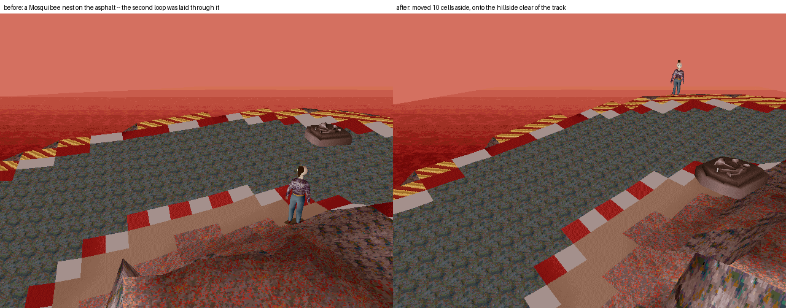

## Citadel Island in the storm: a track of its own (2026-09-29)

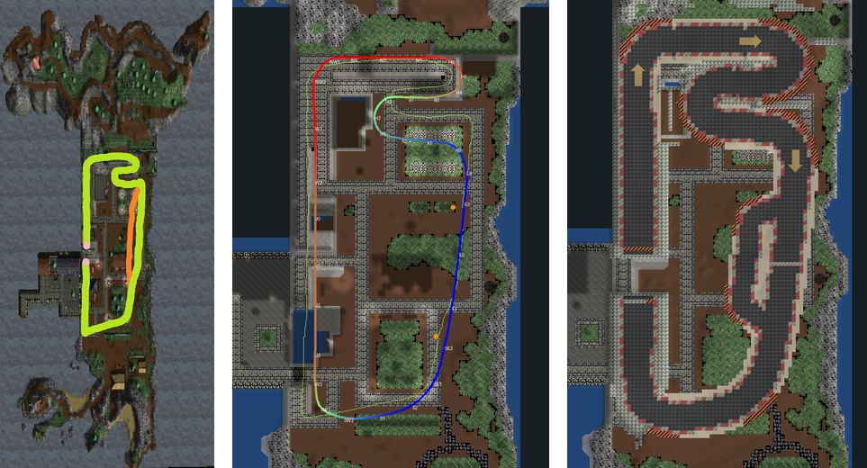

Citadel Island is two files: `CITADEL.ILE` while the storm lasts (the whole opening of the game, up to the lighthouse) and `CITABAU.ILE` once it is over (see "The rain" above). The town circuit was built into both. Now it stays in `CITABAU` alone -- byte for byte what it was -- and `CITADEL` gets a simpler lap of its own, from the user's drawing (`citadelTrack.png`: a loop round the town, the pink dots a jump, the orange line a pit lane). No opponents race it yet: Twinsen drives it on his own, with the lap timer and the checkpoints.

**The drawing** is the island's map turned a quarter turn clockwise and squashed, like the town circuit's; the land masks were matched (IoU 0.84: 5.4 pixels a cell across, 3.8 down) and the lime line skeletonised and walked (`tools/RaceTrackPlan/citadel_storm_design.py` has the method). What it runs over decided the design more than the line did:
- the west side follows the town's **west rampart**, a raised street 9 cells wide at 2,500 (the town itself is at 250), and the drawing's two pink dots sit exactly at the rampart's south end, where it drops to the harbour. So the lap was first built **south along the rampart, jumping off its end** (it now runs the other way: see "Reversed" below): level at 2,000 from 10 cells before the take-off lip to 14 after the landing lip (the gap jump's rule), an 11-cell gap over the drop, the flight (17.6 cells, the retail one) wholly inside cube (8,9) -- the drawn dots are 5 to 7 cells further north, where the flight would have crossed into cube (8,8) mid-air. The landing is a causeway over the harbour's little basin, and the road comes down to the harbour's level round the south-west corner (10.8 % at the steepest).
- the south and east sides are the harbour's level; the **pit lane** is on the inside of the east straight as drawn, and the **start line** (the pit lane's middle, as on every track) is on the east straight, in scene 42.
- the drawing's **wiggle** at the north-east corner had three roads 7 cells apart -- less than one road's width (9 cells of asphalt and curbs). It is a double hairpin with its legs 11 cells apart, and it climbs back up to the north rampart (5.6 %). Its bends, 4.4 cells round the middle, are the tightest on the lap.

The lap is 297 cells; the racer's line round it would be 29.1 s driven perfectly, and the test pilot drives it in 28.2 s.

**One island, two tracks.** An island's twin file can now carry a track of its own (`RaceTrackIsland.TwinPlanResource`: Citadel's plan is `citadel_storm_track_plan.json`, its twin's `citadel_track_plan.json`). What that changes:
- `RaceTrackService.BuildFiles` (the one build both the menu and `buildtrack` run) builds the island's own file from its plan with no opponents, and the twin from its own plan with the options as chosen -- the opponents, the story and the crossing style go with the twin's track, the town circuit. The dialog's crossing style stays available for it (the storm track draws its own jump).
- The scenes are the same for both files, so `RaceTrackScenes.Apply` takes both tracks: each gets its buggy and Twinsen at its own start line in its own start scene (42 in the storm, 49 once it is over; a buggy is waiting at each), its jump and its cube-edge crossings; the zones on either road go; the actors' heights follow the ground of the nearer road.
- The holomap's storm picture (entry 18) shows the storm track, the fine weather's (42) the town circuit. The jump's flight was one animation for the whole game (the storm track's); since 2026-09-30 each island's track, and the town circuit, has its own (see "Several tracks in one game folder").
- `RACETRACK.JSON` describes the storm track and has the town circuit as `Twin`. Play races one of them, the town circuit's cars kept out of sight when it is the storm track (`RaceTrackService.Raced`, `RaceCarEngineFile`) -- chosen at first by the car setup's weather, now by the race track window (see "Reversed" below).

**Two faults found on the way, both general:**
- **An edge zone that only touched the road's height.** The build adds a cube-change zone where the island's own don't cover the road, and counted one as covering when its height range merely reached the road's middle. The zone from 48 into 42 starts exactly at the street's 250; the car on the new road there stood at 245 and was held at the edge. A zone now has to reach 512 below and 1,024 above the road (`CoverBelow`/`CoverAbove`), or another is added: 2 more on the storm track, 8 on the Desert's lap, 2 on Mosquibees Island's. The Desert's and Mosquibees Island's edge walks are what they were (42/46 -- the four corner crossings walked into the next-but-one cube -- and 8/8).
- **Play's save was made in the wrong weather.** Play enters the scene in a short headless run and saves there, then loads that save in the real run. The headless run had no race car file, so it was always the storm -- harmless while both files held the same ground, but now the town circuit's start is, in the storm file, in the sea by Twinsen's house: the save held him drowning, and the fine-weather game went on to his house. Both headless runs now get the same car file as the game (`Lba2Play.PrepareSceneSave`).

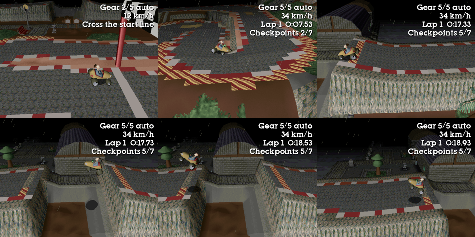

**Verified**:
- `CITABAU.ILE` and `CITABAU.OBL` are byte-identical to the town circuit's build before this; the Desert island's and Mosquibees Island's builds are byte-identical but for the edge zones above (their ground, bodies and `RACETRACK.JSON` unchanged). The menu build is byte-identical to the command-line build (all twelve files).
- In the engine, in the rain: the test pilot (`autodrive`, on the storm line) laps it in 28.2 s through all 7 checkpoints, jump included; every cube-edge crossing of the storm lap walked both ways, 4/4 (`edgetest.py`), and the town circuit's in fine weather (`EDGE_TWIN=1`, with a `weather=fine` car file), 24/28 as before (the four departures from scene 48 loaded cold, held by its scripted arrival).
- In the app: Play with the rain starts scene 42 on the storm track's start line, beside the buggy; with it stopped, scene 49 on the town circuit's grid with the opponents in the pits.
- The suites pass.

**Known limitations**:
- The story is the town circuit's: Zoe sends Twinsen to its start line, and the holomap's arrow points there. A game that runs its opening in the storm (as the real game does, without the car setup's fine weather) finds the storm track in town and, at the arrow, only the buggy on the storm file's own ground.
- The storm track's jump zone and controller stay in scene 42 in fine weather too. Since the storm track was reversed both run north there, and it is the height that keeps them apart: the zone reaches 500 above the ramp (3,006), the town circuit's deck is at 3,500 (see "Reversed").
- No opponents on the storm track yet (the build gives it no grid, so the race-track mode times laps from the first crossing of the line).

### Reversed, its own entry in the window, and the loose ground (2026-09-29)

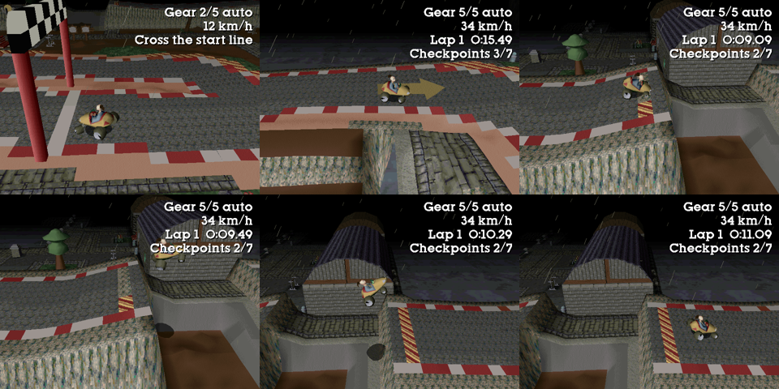

**The other way round.** The user asked for the storm track reversed: clockwise on the map now, north up the rampart's street, so the jump takes off on the harbour side and lands on the rampart's end, the start line on the east straight faces south, and the double hairpin comes down from the north rampart (`citadel_storm_design.py`'s `REVERSE`: the lap's points and heights in the other order, the gap jump's lip and landing swapped). The level stretch the jump needs now reaches 14 cells past the landing at the rampart's end, so its key moved 3 cells north (J0), and the pit lane's north end 2 cells south so that the start line (z 585.5) has the buggy (582.7) and Twinsen (581.0) behind it, clear of cube (8,8)'s edge at 576. The flight runs 596.5 to 579.0, inside cube (8,9); the painted arrows, the checkpoints, the start and the jump's zone and heading (turn 2048) all come from the lap's direction. The test pilot laps it in 28.35 s through all 7 checkpoints, jump included; the cube edges walk 4/4.

**Its own entry.** The race track window lists Citadel Island twice: "the town circuit (once the storm is over)" and "the storm track (in the rain)" (`RaceTrackIsland.CitadelStorm`, `RacesTwin`, `Title`). Both build the same files -- both tracks, since they share the island's scenes -- and differ in what `RACETRACK.JSON` names as built, which decides what Play races and in which weather (`RaceTrackService.Raced`, `FineWeather`): the storm track in the rain, starting in scene 42; the town circuit without it, in scene 49. The race car setup's rain box shows that weather greyed out for such a folder ("Citadel Island in the rain: its storm track is raced"); for any other folder it is the choice it was. A plan file is the chosen entry's track (the town circuit's goes to `CITABAU`). The menu build of the storm entry is byte-identical to the command line's (all twelve files); the two entries' game files are identical.

**The jump's zone and the town circuit's bridge.** Reversed, the storm track's jump runs north -- the same way as the town circuit on its bridge, which passes over it at 3,500 -- so the heading no longer tells them apart, and the zone reached 900 above the ramp (to 3,514). It now reaches 500 above (3,006 here; a car on a ramp is within a couple of hundred of it), for every island's jump; Mosquibees Island's still fires (its lap, 47.61 s, is what it was).

**Loose ground in the air.** On `CITABAU` the user saw a lump of rock floating by the town circuit. A decor follows the ground under its **origin** when the build reshapes it (`IslandOps.DecorFollow`, and since the Mosquibee leftovers only when it rested on the ground) -- and a 2 x 3-cell rock up by the Weather Wizard's tent, cube (7,7), had its origin's corner where the road's embankment rose: it went up 2,057 with it and hung 1,132 clear of everything under the rest of it. In cube (9,7), scene 50, a post and its sign had their ground cut away from under them and were left 517 and 2,392 up. `ScriptRoundTrip trackleftovers` missed all three: it measured an object from its origin's height (`Y`), which for many is 0, the body itself being at `YMin..YMax`; `RT_ADRIFT=1` now lists every decor whose underside is more than `RT_FLOAT` above the highest ground anywhere under its footprint, and with `RT_BEFORE`, whether it was so before. The build now removes any decor that rested on the ground before the ground was reshaped and is held up by nothing after it (`RaceTrackBuilder.ClearAdrift`, `AdriftBy` 400) -- not those already up there, which the island has plenty of: roofs on their walls, signs on their posts, planks over gullies. It took those 3 from `CITABAU`, and none from `CITADEL`, the Desert island or Mosquibees Island (their files are unchanged). What is left in the air on both Citadel files is the start gantries' beams.

### The jump that stalled, the start line that wasn't there, and the gantry (2026-09-29)

The user drove the reversed storm track and found three things: Twinsen stuck at the take-off, for a few seconds or for good, before he sometimes jumped; a post of the start gantry in the middle of the straight; and a lap timer that never started ("Cross the start line" all the way round).

**The jump.** The flight is Twinsen's animation (200) played from his track script once the controller puts him in movement 12, moved by his animation alone. A trace of every frame (the engine's `objtrace`, which now logs the generic animation and its `FlagAnim` too; `tools/RaceTrackPlan/jumptrace.py` drives it) caught it at 60 frames a second: one frame after take-off the flight was replaced by animation 34, `GEN_ANIM_SKATEG` -- Twinsen skating -- with `ANIM_ALL_THEN`, which nothing interrupts, and the car slid back down the ramp. When a falling object lands on a triangle whose blocking bit (Col) is set, the engine starts that slide (`OBJECT.CPP` `ReceptionObj`, `InitSkating`); the track script's `anim(200)` is refused while it plays, the flight's end label comes early, the controller hands the car back and the zone fires again -- stuck, then a jump seconds later, depending on where each frame lands. The blocking triangles were a stripe across the ramp: the ramp's warning stripe (hatching, the cell before the lip) had been turned into blocking rock by two painting rules meant for verges -- one within 2 cells of the sea, one for a planned lap's verge steps. Reversed, the take-off ramp stands over the harbour's basin, so the stripe was near water. A warning stripe is road, and neither rule applies to it now (`PaintRoad`). With it gone the flight is whole at every frame rate tried (10, 16, 20, 33 ms), with the default car and with the user's much faster one (80 km/h, 300 % acceleration); Mosquibees Island's jump likewise (its lap 47.60 s).

**The start line, and a native bug.** The user's `RACETRACK.JSON` had a start line of no length and no direction (`startline=8 9 23697 5019 23697 5019 0 0`), which no crossing counts. The same build on the command line was right, and so was the app's first build in a session; the next one, after the editor had redrawn its 3D view, was wrong. In it `Math.Round` itself gave wrong answers: -1.904 quarter turns rounded to -1, and `sin(pi/2)` to 0. The engine's triangle filler (`LIB386/pol_work/POLY.CPP`, `Draw_Triangle`), ported from the assembler, sets the thread's rounding mode to truncation for its maths -- the assembler's `fldcw [Status_Int]` -- and never set it back: the port kept only the comment for the closing `fldcw [Status_Float]`. The rounding mode belongs to the thread. The editor draws with the renderer on its worker threads, so a worker that had drawn a triangle went on truncating, and the race track build, run on one of them, snapped its start line to nothing (its sibling `POLYCLIP.CPP` saved and restored it properly). `Draw_Triangle` now restores it on both ways out, as the assembler did. That also changes the engine: its own maths after a frame's drawing no longer runs truncated. After the fix, five builds in a row in one session all come out right.

**The gantry.** One beam spans a road and its curbs, and the start line is always in the pit lane's middle, so a single gantry over the lap put its far post on the strip between the lap and the pit lane -- in the middle of the straight as a driver sees it. It is now as many beams end to end as reach over both (`PlaceGantry`, `RaceTrackReport.StartCurbs`: how far the outer curbs reach either side of the line), with posts only at the two outer ends; beams end to end come out longer than needed, and the spare goes where both posts have ground -- beyond the pit lane first (evenly, Mosquibees Island's lap-side post stood past the plateau's edge, over the sea). All four tracks get it: two beams, posts 4.9 cells out from the lap's middle and 16.1 on the pit lane's side.

**Also found**: after Play loads its save, Twinsen stands behind the buggy but facing across the road (the scene's start keeps his place, not his heading), so he has to turn to it before Action gets him in.

## Cars after the game's characters (2026-09-30)

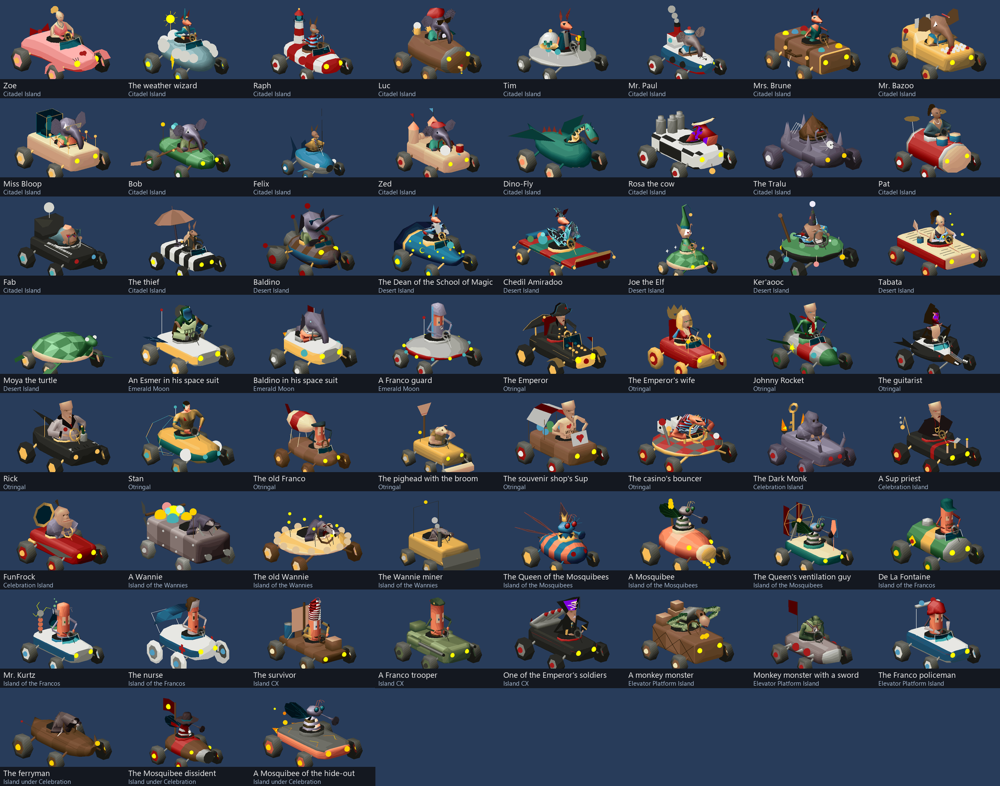

Fifty-eight more cars in the manner of Baldino's: each made after a character of the game and driven by it, so that every one of the game's eleven islands has at least three drivers of its own for the track it is to get, and the characters the game calls by name have one too (Twinsen has his buggy). They came in five rounds:
1. the three the user asked for: the Queen of the Mosquibees, the Emperor and Zoe;
2. one or two for the best-known character of each island;
3. enough to give each island three, and four from the user's notes (the wizard pedlar, the pighead with the broom, the souvenir shop's Sup, the casino's bouncer);
4. the named characters who had none yet -- and a correction: the guitar car is the heavy metal guitarist's, who plays at Rick's, and Johnny Rocket ("Zeelich's brightest star, the first explorer to set foot on Twinsun", says the Zeelich Gazette) has the rocket he did it in;
5. the Citadel Island thief, with the umbrella he steals as part of his car.

They are in the game's files after a build, as bodies 2 to 59 of the racer's entity (157; its own car is body 0, Baldino's 1). **No actor drives them yet**: the race-track mode still races the racer, Baldino and the biker. Each car says whose island it is (`RaceTrackCharacterCars.Car.Island`), for giving the tracks their casts once every island has one.

Who belongs where was read from the game's scenes: `ScriptRoundTrip islandcast` lists, for each island, the bodies its scenes' actors wear (so the old Franco with the Leontine is Otringal's, where he waits in the harbour; the Elevator Platform has only its monkey monsters, and the Franco policeman who guards the way to it makes its third). Who has a name was read from the game's texts (`ScriptRoundTrip lba2text find`) and the body list: the weather wizard is Bersimon on his diploma, the old Franco scientist is Mr. Kurtz on his door, Raph's two friends in the tavern are Pat and Fab (which of the two bodies is which is a guess: Pat the girl, Fab the sphero). The islands under the gas have few names.

| Island | Body | Driver (BODY.HQR) | The car |
|---|---|---|---|
| Citadel Island | 4 | Zoe (26) | A pink convertible flaring at the tail like her gown, a bow tied on it, a heart on the bonnet, long pink wings over the front wheels like her gloves, lamps with lashes. Zoe wears the pink gown and gloves of the user's picture (her body in the game is in red). [views](racetrack/build/cars/zoe.png) |
|  | 5 | the weather wizard (Bersimon) (111) | The thundercloud he keeps over the island: white puffs along its shoulders, a lightning bolt down each flank, rain under it, and the sun coming out on a mast behind. [views](racetrack/build/cars/weather_wizard.png) |
|  | 6 | Raph the lighthouse keeper (32) | A boat in the lighthouse's red and white, the lighthouse itself standing on its stern (banded tower, gallery, a lamp behind glass, red roof), a life buoy on each side. [views](racetrack/build/cars/raph.png) |
|  | 38 | Luc, the boss of the tavern (39) | One of his barrels on its side: staves and hoops, the tap in front, two mugs of beer on top. [views](racetrack/build/cars/luc.png) |
|  | 39 | Tim the waiter (40) | A silver tray on casters: a dish under its cover, a bottle and glasses (and his own tray still in his hand). [views](racetrack/build/cars/tim.png) |
|  | 40 | Mr. Paul (59) | A tugboat in his jersey's blue and white, red below: the wheelhouse behind him, its funnel smoking, old tyres down its sides, the anchor at the bow. [views](racetrack/build/cars/paul.png) |
|  | 41 | Mrs. Brune of the Inter-Islands ferries (62) | A traveller's suitcase: tan leather, two dark straps, brass corners and locks, a handle with its tag, the labels of everywhere it has been. [views](racetrack/build/cars/brune.png) |
|  | 42 | Mr. Bazoo the shopkeeper (99) | A brass cash register: the keys in rows on its front, the price tabs up at the back, the crank at its side, coins in the tray. [views](racetrack/build/cars/bazoo.png) |
|  | 43 | Miss Bloop of the museum (104) | One of her show cases: a marble plinth, the glass over a gold vase on its red cushion, the red rope on gold posts down each side. [views](racetrack/build/cars/bloop.png) |
|  | 44 | Bob (152) | A green rowing boat, an oar out on each side, his catch in a bucket behind him, a lantern. [views](racetrack/build/cars/bob.png) |
|  | 45 | Felix (161) | The fish he caught: blue back, silver flanks, fins, a tail, an eye on each side -- his rod up in his hand. [views](racetrack/build/cars/felix.png) |
|  | 46 | Zed (169) | A sandcastle: a tower with its flag on each back corner, battlements between them, a bucket and spade and a beach ball on the front. [views](racetrack/build/cars/zed.png) |
|  | 47 | Dino-Fly (167) | Himself on wheels: his green body and pale belly, the spines down his back, his tail, his wings spread, and his own neck and head in front. [views](racetrack/build/cars/dino_fly.png) |
|  | 48 | Rosa the cow (177) | A milk float in her black and white, three churns on the back, her bell under its nose; her head and horns out over the front. [views](racetrack/build/cars/rosa.png) |
|  | 49 | the Tralu (33) | A slab of his cave: stalagmites round it, a skull and crossed bones on the front, ribs at the back. [views](racetrack/build/cars/tralu.png) |
|  | 50 | Pat, of Raph's band (44) | The drums: the big drum on its side for a body, two toms, a cymbal on each back corner, the sticks crossed on the front. [views](racetrack/build/cars/pat.png) |
|  | 51 | Fab, of Raph's band (41) | The keyboards: black, the keys along both sides, a stack of speakers on the back and a mirror ball over them. [views](racetrack/build/cars/fab.png) |
|  | 59 | the thief (117) | A getaway car in a burglar's black and white hoops, two yellow eyes in the black of its nose -- and the umbrella he steals from the pharmacy's customer, open, planted in the back of it: its eight gores in the two creams of the game's own, the grey shaft and crook, the ribs underneath. His sack of loot beside it, coins spilling over the deck. [views](racetrack/build/cars/thief.png) |
| Desert Island | 1 | Jerome Baldino (139) | His rocket car (see "Baldino's rocket car"). The island's own racer in the game's own car is body 0. |
|  | 7 | the Dean of the School of Magic (123) | A wizard's hat on its side: the point curling up at the front, the brim round the back behind a gold band, blue with stars and a crescent moon, a crystal ball on the bonnet, sparks behind. [views](racetrack/build/cars/dean.png) |
|  | 33 | the wizard pedlar (Chedil Amiradoo) (240) | His flying carpet: red and green bands, gold down its edges, a tassel on each corner, the front curling up, his wares (a lamp, jars, a rolled rug) piled behind him. [views](racetrack/build/cars/carpet.png) |
|  | 52 | Joe the Elf (110) | The green shell his magic shut him in, on wheels, its sparks still flying. [views](racetrack/build/cars/joe.png) |
|  | 53 | Ker'aooc the healer (188) | His cauldron: black iron, the green cure bubbling in it, the ladle standing in it, his flasks hanging round the rim. [views](racetrack/build/cars/keraooc.png) |
|  | 54 | Tabata the wizard (189) | A spell book lying open: cream pages ruled with writing, the red cover under them, the ribbon out at the back, a quill in its inkwell, letters floating off the page. [views](racetrack/build/cars/tabata.png) |
|  | 55 | Moya the turtle (212) | Herself: the shell in plates of two greens, a flipper at each corner, her tail, her head up on its neck in front (nobody drives: her head is where a driver would be). [views](racetrack/build/cars/moya.png) |
| Emerald Moon | 8 | an Esmer in his space suit (255) | A moon rover: a white box wrapped in gold foil, solar panels either side, a dish and a whip aerial, four wheels alike. [views](racetrack/build/cars/moon_rover.png) |
|  | 14 | Baldino in his space suit (93) | A lunar lander: a capsule in gold foil with portholes, a flag, the engine's bell and its flame behind. [views](racetrack/build/cars/lander.png) |
|  | 15 | a Franco guard of the moon base (95) | One of the Esmers' flying saucers: a grey disc with a red rim and lights all round it. [views](racetrack/build/cars/saucer.png) |
|  | 63 | HAL, the moon base's computer (no body of its own: the room's bricks and screen sprites 228-230) | Itself, driving itself: the dark slate cabinet with the round green screen, the screen's grid and a red eye in it; a coil bottle with a white cap at each front corner; the red pipes arched over the top. It stands on the lilac-grey stand, which has rivets, the red grille and the teal horn. [views](racetrack/build/cars/hal.png) |
| Otringal | 3 | the Emperor (453) | A long black staff car: his coat's two rows of gold buttons down the bonnet, a gold radiator with his hat's red cockade, gold epaulettes over the front wheels, a red pennant on each wing, a throne's red seat back, and his two-cornered hat as the wing at the back. [views](racetrack/build/cars/emperor.png) |
|  | 58 | the Emperor's wife (454) | A coach in the red of her gown: gold down its edges, a crown over the back of her seat, a lantern on each side, gold wheels. [views](racetrack/build/cars/empress.png) |
|  | 9 | Johnny Rocket (154) | "Zeelich's brightest star, the first explorer to set foot on Twinsun": his rocket, silver with a green nose and fins and a red band, a star on each side, its engine lit. [views](racetrack/build/cars/johnny_rocket.png) |
|  | 37 | the heavy metal guitarist of Rick's bar (404) | An electric guitar in his colours: black with a white guard, silver pegs and strings down the neck that is its bonnet, an amplifier on the tail, a demon's wings, the fire of his show behind. [views](racetrack/build/cars/guitar.png) |
|  | 56 | Rick (425) | A grand piano: black, its keys across the front, the lid propped open, the champagne on ice. [views](racetrack/build/cars/rick.png) |
|  | 57 | Stan (from Time Commando) (439) | A time machine in the yellow of his suit: a clock on each flank, two rings round its tail, an aerial. [views](racetrack/build/cars/stan.png) |
|  | 12 | the old Franco (276) | His Leontine on wheels (he waits with it in Otringal's harbour): the wooden boat, the balloon over its stern on four ropes, the rudder and the propeller. [views](racetrack/build/cars/old_franco.png) |
|  | 34 | the pighead with the broom (438) | A road sweeper in the yellow of his overalls: the brush turning in front, his own broom standing at the back, a bin and a warning light. [views](racetrack/build/cars/sweeper.png) |
|  | 35 | the souvenir shop's Sup (430) | His stall: a wooden barrow, a red and white awning over little Twinsuns, the sign with the heart on the bonnet (and on his shirt). [views](racetrack/build/cars/stall.png) |
|  | 36 | the casino's bouncer (419) | A roulette wheel, red and black with gold on its rim and the ball on it, a pair of dice on the tail and a one-armed bandit's lever at his side. [views](racetrack/build/cars/roulette.png) |
| Celebration Island | 10 | the Dark Monk (311) | A block of his temple's stone: red eyes in front, lava in its seams, a horn on each front corner, a fire bowl on each corner of the tail and his gold key standing between them. [views](racetrack/build/cars/dark_monk.png) |
|  | 16 | a Sup priest (292) | A car like his robe, black with the red sash round it: a lectern with the book open on the bonnet, a candle on each front corner, censers swinging at the back. [views](racetrack/build/cars/priest.png) |
|  | 17 | FunFrock (313) | The Dark Monk unmasked: a blood-red car with a sabre down each flank and, behind him, the gold ring of one of his teleporters, glowing. [views](racetrack/build/cars/funfrock.png) |
| Island of the Wannies | 11 | a Wannie (194) | A mine cart off its rails: riveted iron plates, four small iron wheels, buffers, a heap of gems behind him, his lantern on a pole and his pick across the back. [views](racetrack/build/cars/wannie.png) |
|  | 18 | the old Wannie (386) | A slice of the family's firefly tart, as the game's own slice is (the inventory's): a wedge, its point forward, the red filling over its dark edge, a pink layer and the pastry, the crust standing up along its wide end at the back, three cream domes on top (the whole round tart until 2026-10-06). [views](racetrack/build/cars/tart.png) |
|  | 19 | the Wannie miner (342) | The mine's bulldozer: yellow, its blade out in front, an exhaust stack puffing, a bar over his head. [views](racetrack/build/cars/bulldozer.png) |
| Island of the Mosquibees | 2 | the Queen of the Mosquibees (196) | Herself on wheels: a fat abdomen in her blue and orange bands ending in a sting, see-through veined wings swept back over it, thin blue legs down to honey-gold hubs, and her own head (crown, red eyes, antennae, trumpet) looking out of a collar made like her crown. [views](racetrack/build/cars/queen.png) |
|  | 20 | a Mosquibee (192) | A honey pot on its side: an earthen pot, honey at its mouth and running over the lip, the dipper standing behind. [views](racetrack/build/cars/honey_pot.png) |
|  | 21 | the Queen's ventilation guy (197) | A fan boat: a flat hull, the great fan in its cage at the back, two rudders behind it (and his own fan in front of him). [views](racetrack/build/cars/fan_boat.png) |
| Island of the Francos | 22 | De La Fontaine (the burgermaster's brother) (450) | A gazogem tanker: the green tank with its yellow band and filler dome, a warning sign on each side, the hose reeled at the back. [views](racetrack/build/cars/tanker.png) |
|  | 23 | Mr. Kurtz, the old scientist (446) | His laboratory ("Retired Colonel - Specializing in non-scientific sciences", says his door): a see-through flask of something green bubbling at the back, a coil throwing sparks beside it, dials on the bonnet. [views](racetrack/build/cars/laboratory.png) |
|  | 24 | the Franco nurse (447) | A pram: a white tub with a blue band, its hood up at the back, the push handle, a red cross on each side, tall thin wheels. [views](racetrack/build/cars/pram.png) |
| Island CX | 13 | the Franco survivor (90) | The raft that got him off: planks, a patched square sail with a red cross daubed on it, an oil drum and a crate. [views](racetrack/build/cars/survivor.png) |
|  | 25 | a Franco trooper (290) | A tank in two greens, a gun down each flank, a whip aerial. [views](racetrack/build/cars/tank.png) |
|  | 26 | one of the Emperor's soldiers (260) | The island's rocket launcher: black, four red-nosed rockets on their rack at the back, a dish. [views](racetrack/build/cars/launcher.png) |
| Elevator Platform Island | 27 | a monkey monster (388) | One of the crates they heave about, braced and nailed, more of them roped on behind, his bananas on the bonnet. [views](racetrack/build/cars/crate.png) |
|  | 28 | the monkey monster with the sword (363) | An iron war cart: a ram in front, spikes and shields down its sides, his banner at the back (his sword stays in his hand). [views](racetrack/build/cars/war_cart.png) |
|  | 29 | the Franco policeman (86) | His patrol car, white over blue, the red and blue lights on their bar, a bumper bar in front. [views](racetrack/build/cars/patrol.png) |
| Island under Celebration | 30 | the ferryman (334) | His boat: long, dark, its prow curling up over a lantern, his pole lashed down its side. [views](racetrack/build/cars/ferry.png) |
|  | 31 | the Mosquibee dissident (270) | A dark car under his big red flag, a loud-hailer for a nose. [views](racetrack/build/cars/rebel.png) |
|  | 32 | a Mosquibee of the hide-out (193) | A slab of cooling lava: black crust, the glow showing at its edges and through its cracks, fire spitting out behind. [views](racetrack/build/cars/lava_slab.png) |

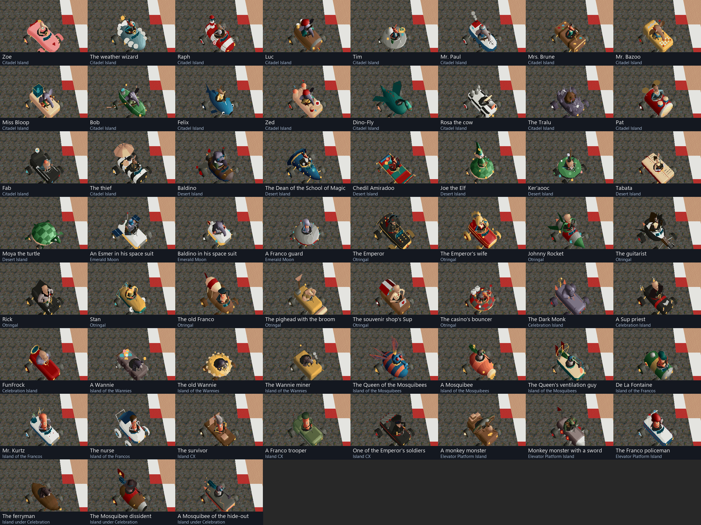

**The code.** `Terrain/RaceTrackCarMesh.cs` holds what every such car shares: `CarMesh`, a body being built on the racer's car's 18 bones (points per bone, faces turned to face out, plates, balls, lines, boxes, loops and the skin between them), and `CarDriver`, which takes a character from its own body in BODY.HQR -- the bones above its waist, each arm turned by a two-bone reach to put its hand on the wheel, then scaled and sat in the cockpit as the car's bone 13. Baldino's car was moved onto them. `Terrain/RaceTrackCharacterCars.cs` (the first three), `RaceTrackCharacterCars.Islands.cs` (one for each island), `RaceTrackCharacterCars.More.cs` (three for each) and `RaceTrackCharacterCars.Named.cs` (the named characters) build the cars from a small kit -- `Hull` (rings of a superellipse from nose to tail; `Lens` for one round as a plate), `Cockpit`, `Wheels`, `Mudguard`, `Windscreen`, `Flame`, `Dish`, `SeatDriver`, `SteeringWheel`, and `Finish` (the cockpit, the wheels and the driver from a `Driver` and a `Cabin`: a new car is some forty lines) -- and what makes each one itself. `ScriptRoundTrip driverinfo <game> <body>...` gives what seating a character needs: its size, its bones, and the arms found from them (`CarDriver.FindArms`). `RaceTrackCharacterCars.Install`, called by every build (`RaceTrackService.Finish`), appends the fifty-eight bodies to BODY.HQR after Baldino's and gives each to entity 157 in RESS.HQR entry 44. Each is inside the engine's 550 points and 550 polygons, lines and spheres (the Emperor's the fullest: 531 points).

**The light a point takes.** A lit polygon is drawn in its colour plus the light, in steps up its ramp of sixteen. How many steps is the length of each point's normal -- and the game's own bodies use that point by point: 16384 on most of Twinsen and Zoe (the whole ramp, fifteen steps), 8192 on the Emperor's coat (seven), less on what should stay dark; 455 of BODY.HQR's 470 entries have points whose normals are not 10240 long (`BodyPipeline lightscales`). The body writer wrote 10240 everywhere (nine steps). It now keeps a share per point (`Body.LightScale`, read back from the normals; the preview renderer uses it), and that is what makes two of these cars possible:
- **Zoe's pinks** are the last four of the reds (76-79). Lit the usual way, a polygon starting there runs past the end of the ramp into the next one, which starts nearly black. With a quarter of the light (0.26) its points take two steps at most: 76 to 78.
- **The Emperor's black** is the first four of the greys (48-51); with nine steps a lit grey comes out mid-grey (his coat in the game is a lit grey-brown for that reason). With 0.3 it stays black, with a sheen.

The drivers keep the shares of their own bodies, so they are lit in the car as they are on foot (Baldino too: his car's BODY.HQR entry changed for that).

Two more things the writer now does: a polygon whose material is 2 is written as the engine's see-through type (what is behind it, moved into the polygon's ramp: the Queen's wings, the windscreens, the lighthouse's lantern), and a driver's textured polygons keep their textures (Raph's striped jersey, the space suit).

**Found on the way, in the engine.**
- *Outside, the last colour of every ramp is never shown.* Everything drawn outside goes through the island's fog table, and its row for no fog is not quite the identity: each ramp's sixteenth colour becomes the fifteenth (79 shows as 78, 63 as 62). The lightest pink on a track is 78.
- *An actor drawn against the depth buffer has its shadow drawn over it.* The opponents' actors had the flag for that (`OBJ_ZBUFFER`: the bridge and the hills hide them as they should) and a shadow, and the shadow came out as a dark patch across the side of the car nearer the camera -- on the racer's car and Baldino's since they first raced, only nobody could tell on a dark car. It showed on Zoe's: the top of a pink car drawn five colours darker. The game itself never gives such an actor a shadow (Twinsen's buggy: `BUGGY.CPP`), and the opponents now have none either (`RaceTrackScenes.OpponentFlags`).

**Verified**: every car in the engine, four ways round (`carshow` stands any of the racer's bodies in a scene; the pictures above are the Desert track's start straight), the colours on screen counted against the palette (Zoe's car: nothing past 78 and nothing of the next ramp; the Emperor's hull: 48 to 51); Zoe's, the Queen's and the Emperor's cars drawn with Citadel Island's and the Island of the Mosquibees' own palettes; every one of the game's bodies still reads back after a write (`BodyPipeline bodyroundtrip`); the Desert, Citadel and Mosquibees builds, and a race started in the engine.

`ScriptRoundTrip charactercars <game> <scratch>` builds the cars into copies of a folder's BODY.HQR and RESS.HQR; `BodyPipeline carviews <file.hqr> <entry> <game folder> <png> [island palette entry]` draws a body from six sides; `ScriptRoundTrip carshow <game> <scene> <x> <y|ground> <z> <turn> <dx> <dz> <body>...` stands cars in a test folder's scene; `BodyPipeline lightscales <file.hqr>` lists the bodies whose points do not all take the same light.

## Celebration Island: round the statue (2026-09-30)

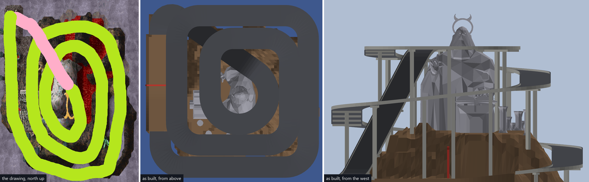

The drawing (`CelebrationTrackStatue.png`, the island's map turned a quarter turn): from where the taxi puts Twinsen down, up and round the statue in a spiral to its top (lime), and a long bridge back down to the start (pink).

**The island.** Celebration Island is one cube, (7,7), one outside scene, 95, and two files: `CELEBRAT.ILE` before the statue is there and `CELEBRA2.ILE` with it, which the engine loads once the story's flag (game variable 79) is set. The track is built into `CELEBRA2`; `CELEBRAT` is left alone. The taxi lands on a paved strip on the north-west corner, 6 cells wide and 26 long at 420. The statue is decor, not ground: seven bodies on one origin, 17,000 high from its base (3,891) to the crescent's tips (20,796), facing west -- 20 cells wide north to south at the shoulders (16,300), thin east to west, its head a box of 5.7 x 6.6 cells. The temple stands at its feet on the west side (top 11,140).

**Why the road stands in the air.** The engine's ground is one height map: a spiral of ground winding up to the statue's head would be a tower burying the statue, and the lap has to pass over and under itself twice over. The flat road bridge of the other tracks does not do either -- a decor object carries a car on its collision box, which is level and square to the map, so a slope made of them is a staircase, and a car that steps down from one box to the next *falls* and stops. So this lap's road is a **raised road**: decor bodies made for their own place, which only look like a road, and a floor of its own in the engine's race-track mode (below). The island and the statue stay as they are.

**The lap** (`tools/RaceTrackPlan/celebration_design.py`), 429 cells, counter-clockwise on the map, 41.8 s for the race car driven by the test pilot:
- **The start straight** down the dock, the line at its far end and the grid behind it, where the taxi lands. No pit lane (the dock is the only level ground there is): while Twinsen qualifies the opponents wait on the apron beside the dock (`pitSpots`).
- A short cutting through the hill south of the dock, and from there **the road leaves the ground**: two loops round the island, the first out over the sea along the coast, the second 6.5 to 8 cells inside it, corners of radius 8, **one even grade of 10.7 % for 296 cells**, up to 16,560 -- just over the statue's shoulders.
- **A level ring round the head**, radius 10.3 cells, 67 cells round: the inner rail is 6.5 cells from the head's middle.
- **The bridge**: straight, as drawn, 33.4 cells from the ring to the dock's corner. The ring is 16,000 above the dock and that corner is 33 cells away, so it is steep -- a parabola in at the top (5.5 cells) and out at the bottom (4), **109 % at the steepest** -- and it dives under the second loop's north leg and the first loop's north-west corner, 2,849 clear at the least. The car takes it at full speed and stays on the road. A gentler bridge would have to sweep round the island once more.
- A raised quay at the bridge's foot (a hairpin of radius 4, 150 over the dock -- two surfaces a few units apart flicker through each other) and a 3-cell ramp down onto the dock.

The road is narrower than the other tracks': 5.5 cells of asphalt and 7 with the curbs (9 and 11 elsewhere), 7.5 with the rails -- three levels of it have to fit side by side in one cube.

**The plan** (`docs/racetrack/celebration_track_plan.json`) adds: `raised` (the first and last point of the raised road; the span may wrap past the lap's first point), `raisedHalf`, the road's widths (`asphaltHalf`, `curbHalf`, `vergeHalf`, `blend`), `start` (the start line's point, for a lap with no pit lane), `pitSpots` (where the opponents wait: cell x, cell z, heading), `keepBodies` (decor the road may pass over: the statue and the temple) and `seaClearance`.

**What the builder does** (`Terrain/RaceTrackBuilder.cs` `PlaceRaised`, `Terrain/RaceTrackRaisedBody.cs`; none of it touches a plan without `raised` -- the Desert's, Citadel's and Mosquibees Island's builds are byte for byte what they were):
- **The road's pieces**: one decor body for every 4 cells of raised road, 99 of them, each made for its place from the lap's own cross-sections -- so the bends, the grade and the bridge's curve are in the mesh and no piece is turned. A slab 200 thick, asphalt, the red and white curb blocks running on from piece to piece, a rail 220 high each side, and an arrow cut into the asphalt of every third piece.
- **The piers**: a column and a cross beam every 10 cells where the road is 900 or more over the ground, 38 of them, moved along the road by up to 4 cells to stand clear of the lap's other levels, the opponents' waiting spots and the island's own objects.
- **The boxes carry nothing.** A piece's collision box is put out of reach (its top at -32,000) and a pier's ends below any road near it: the engine lifts an object onto any box top between the floor and the object within its footprint (`ReajustPosDecors`), and on the bridge each piece's little box was a ledge the car hung on and then fell from.
- **What is under the road stays**: only decor reaching into the road's own space goes (4 solid objects, all body 3, and 7 props), and the collision boxes of the statue and the temple are cut down to end under the road that passes over them (2).
- **The ground** is levelled and painted only where the lap is on it, the dock and the cutting: 400 vertices, 370 cells. No banking on a raised lap (the hairpin's curvature tilted the dock's first cells).
- **The textures.** This island's ground texture has no free space for the road's tiles, so the road is painted with the island's own: asphalt from its darkest even patch, white from its whitest pixel, its cliff for the walls, the arrows' flat colour for the hatching (`RaceTrackTextures.Borrowed`).
- The 137 new bodies are added to `CELEBRA2.OBL` (from 30 on, after the copied gantry and arch); `RACETRACK.JSON` carries the road's line (`Raised`: x, z, height and half width at every point) and a height for the start line and each checkpoint.

**The engine** (`native/lba2-classic-community`, the race-track mode only; the car file's `raised=<file>` and `statue=1`):
- **A floor of its own** (RACEMOD.CPP `RaisedAt`, through a hook in 3DEXT/MAPTOOLS.CPP `CalculAltitudeObjet`): for an object at a given height the floor is the highest level of the road not more than 700 above it, else the island's ground -- so a car on the first loop is not lifted to the second, and one under the bridge stays on the dock. It carries every object: Twinsen on foot, the opponents, the shadows.
- **The rails** (`RaceMod_Rail`): Twinsen and his car are kept inside the road's edge while on it; the road's triangles never block (`GiveTerrainCol`), at any grade.
- **The lines count at their height** (the ninth number on `startline=` and `checkpoint=`): the bridge passes over the dock and under the loops, and a line is crossed only by a car on its own level.
- **The statue's island whatever the story says**: the race-track mode loads `CELEBRA2` and its holomap picture (HOLOMAP.HQR entry 44) when the track built is the statue's (EXTFUNC.CPP, HOLOPLAN.CPP).
- **Twinsen faces his car** when a game starts beside it (`FaceTheCar`; on every track -- a scene's start keeps his place, not his heading, and the car takes him only when he faces it).

**The camera.** The classic camera stands still until Twinsen leaves the screen, and on this lap the car goes out of sight behind the road's other levels without leaving it, so a raised road turns the camera that follows the car on. Getting that camera to show the car on the bridge took four fixes (FOLLOWCAM.CPP):
- Its lift over the ground in front of the eye was worked out and then thrown away before anything was drawn: every full redraw goes through `AffGrilleExt`, which sets the camera again from its angles. It is applied again after that (`FollowCamReapplyLift`). This was so on every island -- an eye behind a hill stayed behind it.
- The lifted eye was aimed with `SetTargetCamera` (LIB386/3D/CAMERA.CPP), which takes the target's height from the camera's z and its z from the camera's height. The follow camera now aims its own (`FollowCamLiftEye`); the library's function is left as it is.
- The road counts as ground in front of the eye (`SightFloorHook`), and behind a car coming down the bridge it rises faster than any camera can see over at the arm's usual length, so the arm shortens as the road steepens behind the car (`FollowCamArmHook`, `RaisedArm`): a close view from above, under the levels overhead.
- The higher the lift, the less of the forward lean the aim keeps, so the car stays in the frame.

**The scene** (95): 27 actors removed and 4 left, 6 fixed camera zones and 4 zones on the road removed, the buggy copied from the Desert's scene 67 (the island has none of its own), the racer, Baldino and the biker added. The characters' cars are not cast yet.

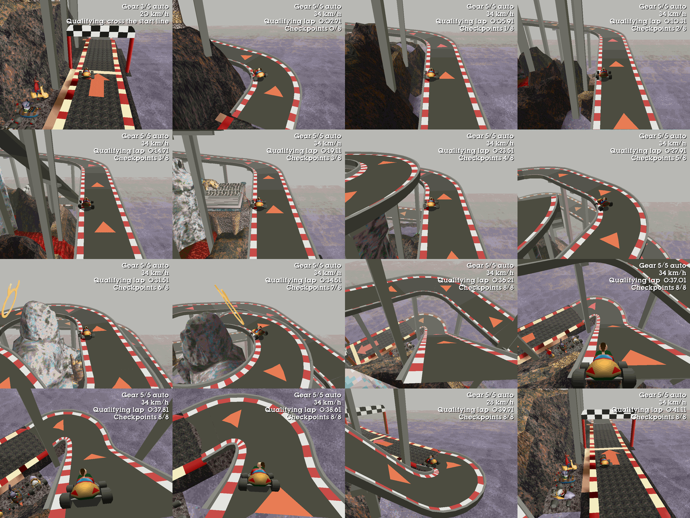
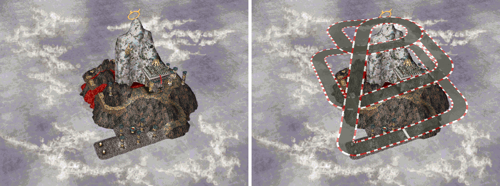
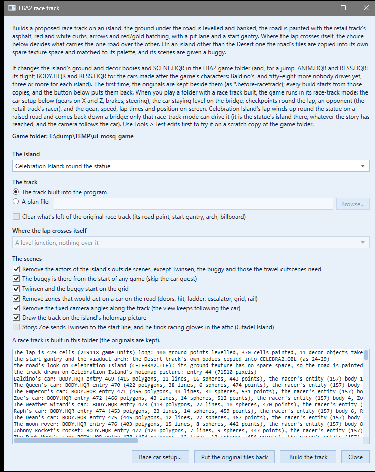

**Verified**, on a copy of the game:
- The test pilot drives it all: the qualifying lap through all 8 checkpoints in 41.82 s, the grid (Twinsen, the racer, Baldino, the biker), GO, race laps of 41.82 s, the opponents lapping in 42.9-45.1 s on the raised road.
- `tools/RaceTrackPlan/raisedtest.py`, 15 of 15: the car put on the loops and the bridge and driven ahead, steered hard into either rail, reversed, started from the rail, driven back *up* the bridge, and Twinsen on foot walking along and across the road -- never more than half a unit off the road's height (150 for Twinsen walking down the bridge, a step behind the floor), never past the rail.
- Mosquibees Island's lap is what it was (47.60 s); the Desert's, Citadel's and Mosquibees Island's builds are byte-identical to before.
- The menu build is byte-identical to the command-line build; Play from the app starts scene 95 on the grid, on the statue's island. The suites pass.

**Known limitations**:
- **Only the race-track mode can drive it.** In the retail game, or the engine without that mode, the road is there to look at and carries nothing: a car leaves the dock's cutting onto the ground under the road.
- **No track on the island without the statue** (`CELEBRAT`), and with a track built Play always shows the statue's island. (Since 2026-10-01 there is: "Celebration Island: the lava lake" below, in a scene of its own.)
- **Piers are left out where there is no room**: over the lap's other levels and close to the statue the road hangs unsupported for up to a few pieces.
- **A piece of road crossing the camera's near plane loses polygons** (a body's polygon with a point behind the plane is not drawn), so the road right under a close camera can show a hole for a frame.
- The holomap picture draws the road at its height over the island as it was.

`ScriptRoundTrip decorpoints <ISLAND> <out.csv> [body ...]` writes the points and triangles of an island's decor bodies in island coordinates (how the statue was measured), and `sceneactors <game> <scene>` lists a scene's actors.

## The Elevator Platform: a rollercoaster (2026-09-30)

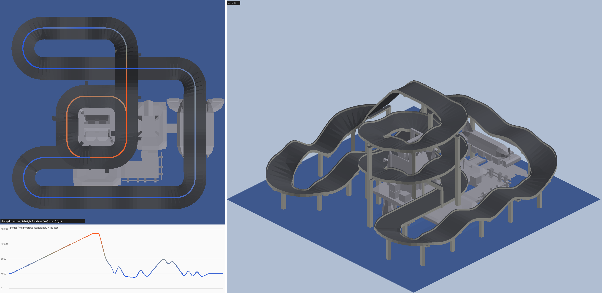

The request: a track for the Elevator Platform, "a very small area, so we may need to build vertically, perhaps with a rollercoaster inspired design".

**The island.** `ASCENCE.ILE` (island byte 10) is one cube, (7,7), and one outside scene, 120 -- the foot of the elevator down from Otringal. Its ground is nothing but sea (heights 0 and 50): the platform is all decor, 28 cells by 24 -- a main deck at 4,028 on legs, two lower decks and a landing at 3,270, the elevator's tower in the middle of the main deck (x 23-32, z 31.4-40.4, up to 10,802, with a lamp on a bracket at two of its corners), a crane house on legs east of it (from x 39.3, its cabin 4,775-7,275) and an airship moored beyond that (its fins up to 7,381). Twinsen comes out of the elevator's door on the south side of the tower.

**The lap** (`tools/RaceTrackPlan/elevator_design.py`), 354 cells, all of it a raised road on piers:
- **The station**: level with the main deck (4,028), its rail along the deck's south edge in front of the elevator's door. The start line is there, the grid behind it; the start gantry is one of the road's own (below).
- **The lift**: a helix round the tower, two turns and a quarter at 15.6 %, its levels 4,800 apart (the camera has to fit between them, and the second level has to pass over the tower's lamp at 8,060), up to **14,844** -- 4,000 over the tower's top. The ring is as tight to the tower as it goes: its sides half a cell off it (a rounded corner has to clear a square one), its outer rail inside the crane house's legs.
- **The first drop**: north off the top, a short level stretch, a crest and **125 %** down, into a banked diving turn onto the north edge, where a camelback takes it up again (to 6,200) and a turn-round brings it back east.
- **A hill that passes under the drop** -- the lap's one crossing, at 90 degrees -- and a climb to **the airship**: over its fins at 7,800, down between them to 6,500 over the hulls, up to 7,300 over the tails, then a dive round the south-east corner.
- **Three hops** along the south edge, and a turn up into the station.
- **Banking**: every bend leans in, up to 0.40 (the height across the road per unit across it; 0.25 on the helix, whose inside edge passes close to the tower); the station and the first bend out of it stay level.

The road is the narrowest yet: 4.8 cells of asphalt, 6 with the curbs, 6.5 rail to rail (Celebration Island's is 7.5, the others' 9 of asphalt).

**The plan** (`docs/racetrack/elevator_track_plan.json`) adds `bank` (one number a point), `gravity`, `railCamera` (below), `pierBodies` (the decks a pier may stand on), heights on the `pitSpots` (a deck of decor, which the ground knows nothing of), and a `raised` span that is the whole lap.

**What the builder does** (`Terrain/RaceTrackBuilder.cs`, `RaceTrackRaisedBody.cs`, `RaceTrackScenery.cs`; the other islands' builds are byte for byte what they were):
- **A lap that is all raised road** is a loop: the road's file closes on its first point, the pieces run on round it, and the start line is painted on the piece it lies on -- a white cell, red curbs either side.
- **Its own start gantry**, one body on the road: red posts on the rails and a chequered beam, 2,940 to its top. The retail gantry (3,990) does not fit under the helix's next level: the car stuck against its box a lap up.
- **Banked pieces**: each cross-section leans with the road, rails and all.
- **Piers on what is really there** (`RaceTrackScenery`: the island's decor as the triangles they are drawn with, not their boxes). A pier stands on the sea or on one of the plan's decks, never on a crate or the airship, and its column may not pass through anything or through another part of the lap. Where it cannot stand under the road's middle it stands beside the road, just outside the rail, its beam reaching under the road from there -- on the helix that puts every level's columns beside the levels below it, like a real coaster's. 33 piers; over the airship there is no place, so the road spans it.
- **What is in the way**: crates and barrels on the decks (14) are taken away; the platform's own structures -- the decks, the tower, the crane house, the airship, the fences -- stay, their collision boxes cut down under the road that passes over them.
- **The scene** (120): the grid on the road's own level at the station (`RaceTrackReport.RaisedFloor`), Twinsen and the buggy there, the opponents waiting on the landing east of the station (3,270), 3 actors removed, a door zone and 8 fixed camera zones removed; the holomap picture (entry 38) drawn.
- A checkpoint may lie across the road under or over another level of it (the engine counts a line within 1,200 of its height).

**The engine** (`native/lba2-classic-community`, all of it the race-track mode's):
- **The banked floor** (`RaisedAt`): the road's height at a place is its surface's there, from a fifth number on each point of the road's file (the banking in ten-thousandths). The car's pitch and roll follow it.
- **Gravity** (`gravity=`, BUGGY.CPP `RaceSpeedOnSlope`): on the raised road the slope pulls at the car, 5,000 units a second squared times its sine -- a cell being about a metre, that is gravity. Up a climb the engine holds a share of the gear's top speed only (1 - 0.6 x the slope); down a drop the car runs past its top gear's speed, and loses the excess to drag over a second or two, so what it gathers down the first drop carries it over the camelback. Over its top speed the car steers as much quicker as it goes faster, and a banked bend turns it quicker still (1 + 2.2 x the banking), so a bend it can take at its top speed it can take at any. The rail, while it holds the car, takes the excess speed off (2,000 a second). The opponents' speeds are planned with the same physics (`PlanSpeeds`), and so is the builder's report of them. With the test pilot's line the car reaches 50 km/h at the foot of the drop; a perfect lap is 32 s.
- **The rail camera** (`railcam=`, `RailCamera` through FOLLOWCAM.CPP's new `FollowCamEyeHook`): while Twinsen drives, the eye rides the road itself -- over its middle 9 cells behind the car, 3,400 up, looking between the car and the road 4 cells ahead; nearer and lower round a tight bend (so it looks along the car's way), high enough to see the car over a crest, and under the level of the road above it. An arm behind the car did badly here: the helix's levels hid the car, the drop's crest hid it, and the arm swung out over nothing in the bends. The view moves onto the rail camera over a few frames when Twinsen gets in.
- **On foot, under a level of the road that runs with his** (the helix over the station), the camera that follows him keeps its eye under that level (`RaisedArm`); a level that only crosses overhead is let pass.
- **A scene that starts on the raised road starts on it** (OBJECT.CPP): the scene's start and a restart put Twinsen on the ground under him -- here the sea, where he drowned -- and now on the road.
- **The rail holds after actors' collisions too** (EXTFUNC.CPP): an opponent's car sideswiping Twinsen's pushed it over the rail into the sea. It showed only in races where Baldino started on pole; the player's car is now held on the road after the push as before it.
- **The opponents start at the grid's own level** (`OnSpot`): their line's nearest point to a grid spot was taken in plan alone, and the helix's levels are over the grid -- a car put on one started the race a third of a lap ahead, lapping in 27 s.
- The road counts as a level over a place only away from the stretch the place is on (`RaisedBetween`): on a 125 % slope the road a few cells up it is "over" a place on it too, and the camera was put under it. The test pilot looks further ahead the faster the car goes.

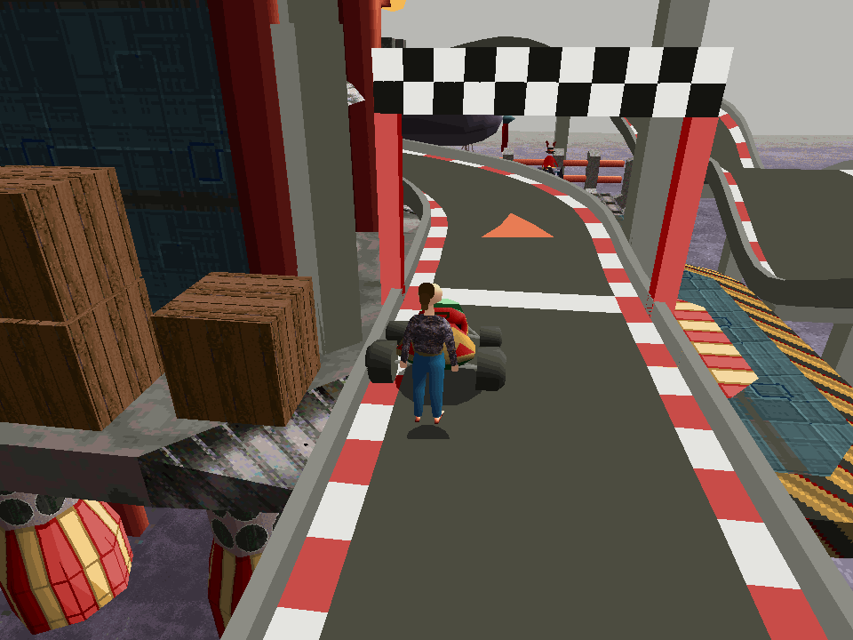
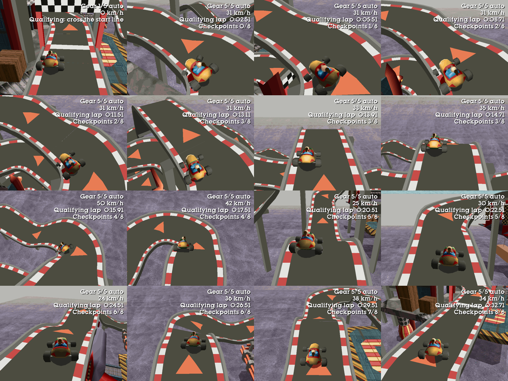
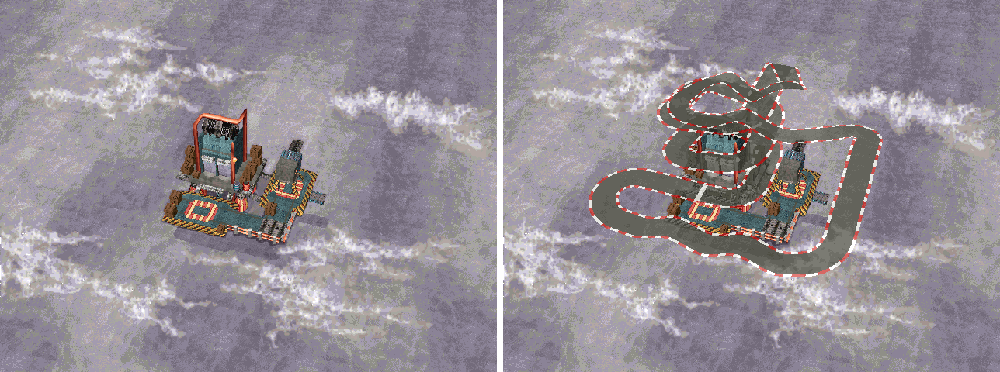
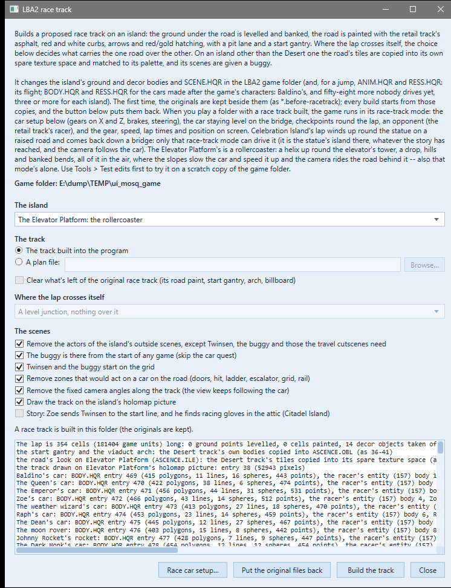

**Verified**, on a copy of the game:
- The test pilot drives it all: the qualifying lap through all 8 checkpoints in 34.02 s, the grid, GO, race laps of 35.3-35.8 s against the three opponents' 34.6-36.5 s. The pilot's trace of every frame: never off the road, never off its height by more than a unit (`tools/RaceTrackPlan/pilottrace.py`).
- `raisedtest.py`, 18 of 18: the car on the helix, the upper helix and the drop, steered hard into either rail, reversed, driven back up the drop, started from the rail, on the most banked bend steered either way, and Twinsen on foot walking along and across the road, the banked one included.
- The races with Baldino on pole, which threw Twinsen off the road before the rail held after collisions, race through (qualifying seeds 2 and 3).
- The Desert island's, Citadel Island's, Mosquibees Island's and Celebration Island's builds are byte-identical to the last commit's (every file); Celebration Island's lap is 41.82 s and its raised-road test 15 of 15, Mosquibees Island's lap 47.60 s, as before.
- The menu build is byte-identical to the command-line build (all ten files); Play from the app starts scene 120 in the station, Twinsen beside his car. The suites pass.

**Known limitations**:
- **Only the race-track mode can drive it**, as Celebration Island's.
- **The helix's bends are tight** (5 cells round the middle of the road): the test pilot touches the rail in about a quarter of its frames there. Under its top speed the rail costs a car nothing; over it, the excess.
- **No airtime**: the car keeps to the road over the crests however fast it goes.
- **The road spans the airship unsupported** (17 cells), and one more pier finds no place.
- The Desert track's gantry and arch are still copied into the island's OBL (unused).
- The rail camera is a close chase view on the helix, where the level above leaves it little room.

### Through the road behind Baldino (2026-09-30)

The user raced it against Baldino and now and then went through the road and fell to the level below -- never alone or against the biker. Both were the engine moving Twinsen after the rail had had its say, when an opponent's car was against his (their collision boxes overlapping):
- **Pushed over the edge.** An actor's box pushes the hero out of it, sideways, and the engine does that in more than one place in his move: the rail was applied after the first, not the others. Racing a deliberately slow Baldino so that the test pilot rams him 2,300 frames over, Twinsen's car was pushed to 1,731 from the road's middle -- past the road's edge (1,664), where the next level down of the helix is the floor.
- **Lowered into it.** An object that nothing of the ground holds up is lowered half a brick (128) to see whether it stands on another object, and left there when one is found: against Baldino's car Twinsen rode 128 into the road, 305 frames of that run.

The rail and a new floor (`RaceMod_Floor`: not under the surface of the road he stood on) now hold after everything else in the hero's move (EXTFUNC.CPP `DoAnimExtGround`). Baldino did it the most because his car's box is the widest of the three (1,396 across, the racer's 1,266, the bike's 894) and his line the closest to the player's. The same ramming run now: never under the road, never past the rail (1,025 from the middle, the rail holding at 1,024); races with all three opponents on three grids, both tracks' raised-road tests (18 and 15), Celebration Island's lap (41.82 s) and Mosquibees Island's (47.60 s) are as they were. `pilottrace.py` now checks every frame for both. To ram an opponent: a car file with only that opponent (its `opponent2_` lines renamed `opponent_`, the others' actors in `hide_actor=`), `opponent_pace=45` and `opponent_catchup=0`, and the test pilot, which follows the first opponent's line, run long enough to lap it.

`tools/RaceTrackPlan/builtviews.py <game> <ISLAND> <scratch> <first new body> [views]` draws a built island from its sides, from above and at a slant; `pilottrace.py <engine log> <raised road file>` tabulates the speed along the lap from a headless run of the test pilot with `objtrace 0`.

### A car for every character (2026-10-05)

The user's: "Generate a vehicle for every unique character in LBA2 then produce an image that displays all of them along with a description and number".

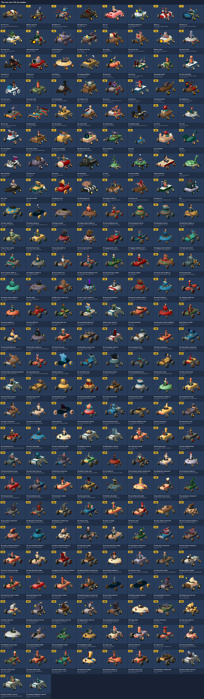

(Pages of 48: [1](racetrack/cars/all_cars_1.png), [2](racetrack/cars/all_cars_2.png), [3](racetrack/cars/all_cars_3.png), [4](racetrack/cars/all_cars_4.png), [5](racetrack/cars/all_cars_5.png).)

**The cast.** 154 more characters, numbered 64-217 after the 64 cars before them (0 the racer's, 1 Baldino's, 2-63 made by hand): one body for each character of BODY.HQR -- a character's variants with something in its hand or in another pose are one -- less Twinsen (his buggy), the characters that already had a car, and what isn't a character (props, vehicles, doors, silhouettes; "Dot", 29, is a static model). `RaceTrackCharacterCars.Cast` (Terrain/RaceTrackCharacterCars.Cast.cs) lists them with their island (from the scenes each body stands in) and kind.

**Made by steps, not by hand.** Each car is the style its kind drives -- Sups roadsters, Francos jeeps (police and guards with a light bar), grobos trucks, rabbibunnies and children karts, quetches bubble cars, spheros ball cars, Wannies mine carts, Mosquibees and flyers gliders, glooms and bathers swamp boats, pigheads and monsters monster trucks, robots robot cars, animals basket cars, ghosts and gas clouds see-through ghost cars -- in the colours its driver's body covers most (by area; each a ramp start the light keeps in its ramp), with the driver:
- *with arms* (CarDriver.FindArms): cut at its waist (the hips its legs hang from), sized to show about as much as a Sup does in the cars made by hand (narrower than the cockpit), its hands on the wheel;
- *grobos*: the hand-made grobo cars' seat (arms 9 and 11 -- FindArms takes their ears -- waist and size for the grobo's height);
- *without* (animals, creatures, robots on legs -- FindArms takes the legs -- clouds): sat whole on the cockpit's floor;
- *too big for the engine together* (550 points, 550 polygons, lines and spheres): leaner cars in steps (fewer sides, five-sided wheels, no trimmings), then the driver's smallest polygons left out.

The sheet showed what the first steps got wrong -- creatures cut away under the rim or the cockpit's floor (the snake, the flying rat, the dogs), grobos holding the wheel by the ears, robots seated by the legs, spheros buried in their ball -- and the rules above are what put them right.

**In the game's files.** Bodies of two new entities (345 and 346 in the sandbox), copies of the racer's animations, a hundred cars each -- an entity's body numbers are one byte and each car has its half-size copy beside it (+100). The build installs them once per build (`InstallCast`, after the cars made by hand and their small copies; +0.8 s; BODY.HQR 7.6 MB). **RACECARS.JSON** in the game folder lists every car by number: name, driver, island, entity, body number, BODY.HQR body and small copy. "Put the original files back" removes it.

**Driving them.** Race car setup > Your car lists all 218 (by number, name and driver) from RACECARS.JSON; `drive_as=` takes the car's BODY.HQR bodies from it. They aren't raced by anyone yet: every one is a body of an entity, so a line-up can use it.

**Tools:** `ScriptRoundTrip castcars <built folder> <scratch> [numbers]` (the cast installed into a copy of BODY.HQR and RESS.HQR, each car's counts); `BodyPipeline castsheet <built folder> <out.png> [columns] [per page]` (the sheet and its pages, from RACECARS.JSON).

**Verified:** all 154 made (none over the engine's limits); the sandbox's seven islands rebuilt with them; the Desert track driven as the baggage grobo's truck (76) and the camel's monster truck (124); the race car window lists 219 choices (the buggy and 218 cars).

## A jump flown at the car's speed (2026-09-30)

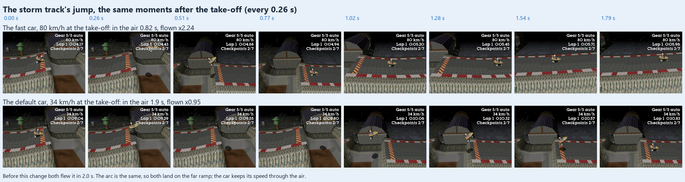

The user asked whether a jump, a scripted flight, could go faster when the car comes to it faster. It does now. The flight is Twinsen's animation 200 (see "The jump"): its keyframes' steps carry him along its arc in the animation's own time, so until now every car flew every jump in the same time, about 2 s -- a car at 80 km/h slowed at the take-off to the flight's own speed (36 km/h; 32 as flown, see below), and the default car (34 km/h) went on at about its own.

**How.** The engine's race-track mode now runs the flight's clock faster or slower (`RACEMOD.CPP` `RaceMod_JumpClock`, around the hero's `ObjectSetInterDep` in `OBJECT.CPP` `GereObjAnim`): as many times as fast as the car's speed at the take-off is over the flight's own speed, which it works out from the animation (its keyframes' steps along the ground over their times: 36 km/h on the storm track, 41 on Mosquibees Island's longer flight). Each frame the keyframe's start and end times are brought nearer by the extra time, so the animation finds itself that much further on. The arc is the same, so the landing is too: the car comes down on the far ramp whatever its speed, and keeps its speed through the air (the buggy's speed is left alone while the animation carries it), so it lands going as fast as it took off.

The engine drops the time an animation runs past a keyframe's end (the next keyframe starts from the frame's time). At the flight's own speed that cost little, but flown twice as fast at 60 frames a second it would lose a third of the rate; the time run past is carried into the next keyframe instead.

**The limits.** The rate is kept between 0.6 and 4: a car that crawls onto the take-off still jumps (in 3 s at most on the storm track), not in slow motion. The car file's `jump_speed=<lo> <hi>` sets them, and `jump_speed=0` turns it off (the flight in its own time, as before). The app doesn't write the key; the engine's defaults apply.

**Verified** (headless, the test pilot, `tools/RaceTrackPlan/jumptrace.py`, which now reports each flight's time, length and speed and the car's speed down the far ramp, and reads any track's log):

| | Take-off | Flight | In the air | Down the far ramp | Lap |
|---|---|---|---|---|---|
| Storm track, the user's fast car, before | 80 km/h | 32 km/h | 2.00 s | 78 km/h | 13.97 s |
| Storm track, the user's fast car, now | 80 km/h | 78 km/h (x2.24) | 0.82 s | 77 km/h | 12.78 s |
| Storm track, the default car, now | 34 km/h | 33 km/h (x0.95) | 1.90 s (2.00 before) | 32 km/h | 28.29 s (28.38) |
| Storm track, a slow car (12 km/h) | 12 km/h | 21 km/h (x0.6, the limit) | 2.99 s | 12 km/h | |
| Mosquibees Island, the default car | 34 km/h | 34 km/h (x0.84) | 2.50 s | 34 km/h | 47.81 s (47.60) |
| Mosquibees Island, the fast car | 80 km/h | 79 km/h (x1.97) | 1.07 s | 81 km/h | 20.54 s |

The same peak (2,022 over the take-off on the storm track, 2,579 on Mosquibees Island) and the same landing in every run; the fast car's flight is the same at 10 and 16 ms a frame. The default car's flight on Mosquibees Island takes 0.4 s longer than before: that flight was drawn out for a longer gap and flew faster than the car (41 km/h), and now keeps to the car's 34. The tracks without a jump are unchanged (the Elevator Platform's pilot lap 34.02 s).

Found on the way, and not changed: with the simulation stepped at 33 ms a frame (`--fixed-timestep 0 --fixed-dt 33`; the engine steps at 16 ms whatever the frame rate unless its `FixedTimestep` setting is changed), the fast car stalls at the cube edge just past the storm track's far ramp, with or without this change -- 375 units a step overshoots the edge.

## Several tracks in one game folder (2026-09-30)

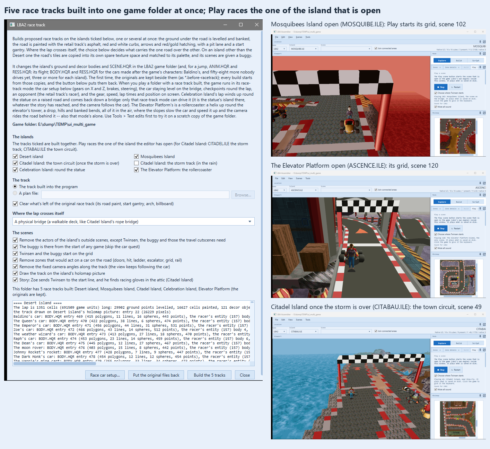

The user asked for more than one track to be built at the same time, and for Play to start the one of the island the editor has open, to speed up testing. Until now a folder had one track: a build started from the originals (`*.before-racetrack`) of that island's files and the shared ones, so building a second island took the first one's scenes, cars and flight away (and, since only the files of the island being built were put back, left the first island's ground and decor bodies half there).

**The window.** The island box is now a list of ticks, two to a row, one for each island: Citadel Island's one tick builds both its tracks, the storm track in `CITADEL.ILE` and the town circuit in `CITABAU.ILE` (it first had two entries, the town circuit and the storm track, which built the same files and so unticked each other -- which read as though only one could be built; see "Fixed choices" below). It opens with the folder's tracks ticked, and builds exactly the ticked ones: a track built before on an island left unticked goes, and the question before the build says so. The story goes to Citadel Island; a plan file is one island's (Citadel Island's: its town circuit's), so it can be chosen only with one island ticked. The window scrolls when it would be taller than the screen.

**The build** (`RaceTrackService.Build` with a list of `TrackBuild`): every file any earlier build changed is put back from its original first, then the tracks are built one after another, each with `BuildFiles` as before. Each island's ground, decor bodies and outside scenes are its own; what they share is added to, not replaced:
- **The jump's flight.** There was one, generic animation 200, for the game. Each island's jump now has its own, 200 plus the island's number (a scene's island byte: the storm track 200, the Desert island 202, Mosquibees Island 207), and 12 more for Citadel Island's town circuit, so a town circuit with a jump no longer shares the storm track's flight either (the old "one flight, made for CITADEL's" warning). The engine's race-track mode flies 200 to 223 at the car's speed (`RACEMOD.CPP` `RACE_JUMP_ANIM_FIRST..LAST`; since 2026-10-01 200 to 295, 24 more for each jump after a track's first: "the lava lake" below).
- **The cars.** Baldino's car and the 58 character cars go into `BODY.HQR` and `RESS.HQR` once for all the tracks of a build (`BuildSession`); the scenes name them by their body number in the racer's entity, not the file's entry, so every island finds them.
- **The actors copied from other islands' scenes** -- the retail racer (Desert scene 57), the biker (Citadel Island's outside scenes) and the buggy (Desert scene 67) -- are taken from the original `SCENE.HQR`: a track built before in the same build has changed those scenes (`RaceTrackScenes.Apply`, `SceneStore` on another file). So is the Desert island's texture page the road tiles are copied from (`RaceTrackTextures.Import`).
- **RACETRACK.JSON** has the first track as its own record, as before, and the others under `Others`, each a record of its own. A folder built by an older version (one track, no `Others`) reads as before.

**Play** (`MainWindow.Play.cs`, `RaceTrackService.RaceFor`) races the track of the island file on screen -- `CITADEL.ILE` the storm track, `CITABAU.ILE` the town circuit, `CELEBRAT.ILE` or `CELEBRA2.ILE` Celebration Island's -- else, for an inside scene, the track of its island (Citadel Island's as its entry was built), else the first track built. It writes the engine's car file for that track only (its start line, checkpoints, opponents, raised road, weather, statue) and starts on its grid. The Play button says which: "▶ Race: Mosquibees Island", with the start scene in its tooltip. The scene editor's own Play races the track of its scene's island (`RaceForScene`), and the race car window shows the weather of the track about to be raced.

**Verified:**
- All five islands' tracks built together on the command line (`buildtogether`) in 20 s, and from the window (five ticked, and three): each island's ground and decor files, and its scenes, byte for byte the same as its own track built alone; no other scene of `SCENE.HQR` touched.
- Each island built alone, before and after: byte-identical for the Desert island, Citadel Island (both files), Celebration Island and the Elevator Platform; Mosquibees Island differs only where its jump's animation number is (207 in the hero's track script and the buggy entity's record).
- In the engine, from the joint build: Mosquibees Island's lap 47.81 s with its jump flown (animation 207), the storm track 28.29 s with its jump (200), Celebration Island 41.82 s, the Elevator Platform 34.02 s -- each as its own build gives.
- In the app on the joint build: the Play button named the right track for each of `MOSQUIBE`, `ASCENCE`, `CITADEL`, `CITABAU`, `CELEBRAT` and `DESERT`, falling back to the first track on an island without one; Play started Mosquibees Island's grid (scene 102), the Elevator Platform's (120) and the town circuit's in fine weather with its three opponents (49), one after another without building again.

### Fixed choices: one tick for Citadel Island, the Desert island's jump, the town circuit's bridge (2026-09-30)

The user found that Citadel Island's two tracks couldn't be ticked together (ticking one unticked the other), and asked for the choices that are always made the same way to go: the Desert island's lap always jumps where it crosses itself, the town circuit always has a bridge, the Desert island's leftovers of the retail track are always cleared and every track is always drawn on its island's holomap picture.
- Both Citadel tracks were in fact always built together (the island's two files share its scenes); the window now lists the island once, "Citadel Island: the storm track and the town circuit" (the town circuit's entry underneath: the one Play races when neither of the island's files is open, the one with the opponents and the story). A folder built with the old storm-track entry opens with it ticked.
- The crossing style is gone from the window: it is the island's own (`RaceTrackIsland.Crossing`: the Desert island's `Jump`, Citadel Island's `Bridge` for its town circuit; the other tracks' plans draw their own crossings), and `RaceTrackOptions.For(island)` gives it -- with the retail track's clearing on the Desert island -- to the window's builds and the command line's alike (`RT_CROSSING` still overrides it there, for tests).
- "Clear what's left of the original race track" and "Draw the track on the island's holomap picture" are gone too: always done.
- After a build (or putting the files back) the editor now reloads whichever island file it has open if the build changed it, and forgets every scene's cached scripts (not only the Desert island's, as when there was one track), keeping any with unsaved edits.

Checked: each other island built alone byte-identical to before; the Desert island's default build is byte-identical to the previous jump build (`RT_CROSSING=Jump`); built from the window (the Desert island and Citadel Island ticked) the same. In the engine the test pilot drives the Desert island's jump lap whole: its qualifying lap 132.51 s through all eight checkpoints, the jump flown with its own animation (202) at the car's speed (x0.86) and landed at 34 km/h.

Found on the way: on the Desert island's bridge layout (no longer built from the window) the test pilot stopped for good near the south edge of cube (9, 10) after the second checkpoint; the jump layout re-shapes the lap round the crossing, and it doesn't happen there.

The command line: `buildtogether <pristine> <game> <island>...` builds several tracks as the window does (`RT_LOG=1` prints the log), and `racecarfile` takes `RT_RACE=<island file>` for the car file Play writes with that island open.

## Celebration Island: the lava lake (2026-10-01)

*Replaced later the same day by a lap round the whole island: see "The lava lake, round the whole island" below.*

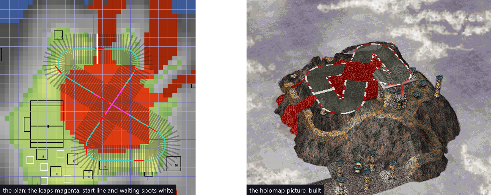

The user asked for a track on `CELEBRAT.ILE` -- Celebration Island before the statue rises -- "perhaps a track with a few jumps", that feels different from the statue's lap but is still fun to drive. The statue's lap is long (429 cells, 42 s), all of it a raised road winding up round the statue; this one is short and on the ground, and its jumps go over lava.

**The island.** One cube, (7,7): a mesa whose top is a plateau, 5,700-6,500 high and about 30 cells across, round a **lake of lava level with it** (5,700-5,800), with the temple on its west edge and lava channels pouring off its north side down to the sea. The sides drop 1,000-2,000 a cell, so the lap stays on the top: there is room for about 100 cells of road.

**The lap** (`tools/RaceTrackPlan/celebrat_design.py`), 92 cells, 10-11 s for the race car driven by the test pilot: **a figure of eight**. A loop over the north -- the plateau's north-west block, a causeway over the mouth of the north channel (where it leaves the lake, still nearly level with it), the tongue of rock east of it -- and a loop over the south, the ruins' terrace; between them **two causeways across the lake that cross in its middle at 87 degrees, and both jump there**: each has a ramp up to a lip 4.5 cells before the crossing and a ramp down from 4.5 cells after it, so the two leaps cross over one crater of lava, its four ramp mouths round it. Each flight is 15.1 cells (the retail flight x0.86, the first one shorter than the retail one: `jumpMinScale`), with ramps of 6 cells. The road is the statue lap's width (5.5 cells of asphalt). The start line is on the north side just before the channel, the grid behind it round the north-west corner, and the other cars wait for the qualifying lap in the ruins south of the temple. Every corner is on the plateau; the temple is 1.5 cells clear of the curbs.

**The road keeps within 1,150 of the ground under its middle.** Further, the builder walls a planned road (blocking rock at its edges, `PlannedProfile`), and the walls spread 4 cells either way: on the first version the north side crossed the channel on a bridge 2,000 over its lava, and a small knoll and a mound needed cuts of 1,260, and the car hit the walls on the inside of the corners next to them and stopped dead. Now the north side crosses the channel where it is still nearly level with the lake (no bridge), and the road rises over the knoll and the mound instead of cutting them down (`WALL_FREE`): no cell of the lap is walled.

**The plan** (`docs/racetrack/celebrat_track_plan.json`) adds `gapJumps` (several gap jumps, each [take-off lip, landing lip] as `gapJump`'s), `jumpRampLength`, `jumpLandingLength` and `jumpMinScale`.

**What the builder does** (`Terrain/RaceTrackBuilder.cs`, `RaceTrackScenes.cs`, `RaceTrackService.cs`):
- **Several jumps a lap** (up to four), each with its own zone number (40, 41...), its own controller actor and its own pair of labels in the hero's track script (90/91, 92/93...) and **its own flight**: 200 plus the island's number, 12 more for an island's other file, and **24 more for each jump after a track's first** -- this one's are 217 and 241. The engine flies 200-295 at the car's speed.
- **A crossing inside a jump's gap needs nothing over it**: the cars fly over it (no "the roads meet there" warning), and where both roads jump the checkpoints keep off it through the jumps' own margins (4 cells either side of a flight on a lap this short, where 20 left room for none).
- **The opponents' line over a flight is the flight's arc only on the stretch of lap the flight is over** (`JumpInfo.S0`, `S1`). It used to be every point near the flight's line, and on the Desert island's lap that took in the other road where it passes *under* the jump: the opponents driving there were given the arc's height, about 2,000 up. Fixed for the Desert too.
- **The grid follows the lap round a bend** behind the start line (`RaceTrackScenes.Behind`), where it used to stand in a straight line back from it. On this lap the line is just out of a corner, and the back of the grid stood off the plateau, 3,000 down; on Mosquibees Island's lap the last spot was 4.3 cells off the road, on the town circuit's 2.3, on the Elevator Platform's 1.9 (at the rail) -- all now on the road. A straight grid is as before.
- **The start line stops short of another part of the lap** that would cross its ends (a car on the other road crossed it there first); a raised road's other levels don't count.
- **A bridge's railings stop at the deck** at an end where the road turns off the bridge's line, instead of running 4 cells on into the corner.
- **Its own scene: 223**, a copy of the original scene 95 that the build adds to `SCENE.HQR` (222 left empty: it is the holomap position of the story's arrow), with scene 95's place on the holomap copied to 223's (`AddScene`, `RaceTrackIsland.CopiesScene`). The island's one outside scene carries the statue's track, so both tracks can be built into one folder. The engine loads `CELEBRAT` for it in the race-track mode whatever the story has reached (the car file's `statue=0`; `statue=1` still means the statue's file, and without it the game decides: `RaceMod_StatueShown`), and the track is drawn on CELEBRAT's holomap picture (entry 28).
- The texture page has no spare space, so as on the statue's island the road is painted with the island's own pixels: dark rock for the asphalt, its palest pixel -- a pale lilac -- for the white curbs.

**Back on the road** (the engine, every track's race-track mode): a car that goes into the lava or the sea used to burn or drown Twinsen, and the game started again from his last save -- on this lap, after a leap that fell short. Now, while he races, the car is put back on the road instead: on the first opponent's line, two cells behind the last place it was on the ground beside it, facing the way the lap runs, stopped, with "Back on the road" on the display (`RaceMod_Rescue`, from `GereCodesJeu`; the lap's count doesn't see the move). The car file's `rescue=0` turns it off; a track with no opponents has no line, and there the game's own death stands.

**The opponents' qualifying times** were their lap at their skill, 3 s either way at random -- more than a perfect lap's worth of luck on a 10-second lap. The spread is now a tenth of their lap, if that is less (`RACE_QUALIFY_SHARE`; laps over 30 s are as before).

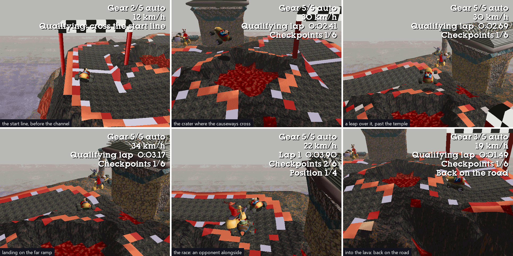
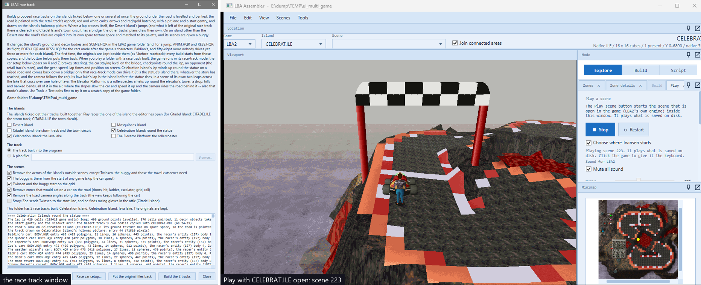

**Verified**, on copies of the game:
- The test pilot: the qualifying lap through all 6 checkpoints in 10.19 s, the grid, GO, race laps of 10.2-11.3 s, both leaps every lap (20 flights in a row: 14-15 cells along the ground, peaking 1,800 over the take-off), the three opponents lapping in 10.5-10.9 s.
- Dropped into the crater: back on the road two cells behind, then the leap and the lap finished.
- Both Celebration Island tracks built together, on the command line and from the window: each car file names its own scene and island file, the statue's lap 41.82 s and the lava lake's 10.19 s from the one folder. In the app, `CELEBRAT.ILE` open: "Race: Celebration Island, lava lake", scene 223; `CELEBRA2.ILE`: the statue's lap, scene 95. Play started 223 on its grid.
- The other islands built alone against the last commit's code: every island and decor file byte-identical; their records differ only by the fixes above (the Desert's opponents' line under its jump; the grids of Mosquibees Island, the town circuit and the Elevator Platform, and the Desert's by a quarter of a cell at most). The suites pass.

**Known limitations**: a short lap -- the plateau holds about 100 cells of road. Two cars in the two leaps at the same moment can meet over the crater (the rescue puts one back if it falls). The white curbs are pale lilac.

## Walls, mines, checkpoints, Sendell's Well and a loop (2026-10-01)

**Mosquibees Island: a wall you could drive up.** Under the bridge, the end of the bridge's deck stands on a face of ground about 5,000 high that the shaping makes nearly vertical. The planned laps' painting left it as the island's own rock, which the engine doesn't block, so a car could climb it. Now, on a planned lap, sand, hatching and rock whose cell rises more than `SteepVerge` (300) become the blocking wall (`PaintRoad`). A scan of the built island for steep triangles that don't block finds none the build made (the 49 left are the original island's own, away from the road).

**Mosquibees Island: land mines round the jump.** To the right of the jump the ground let a car go round it. The plan now has `mines` (cells from its origin): six, in two rows across that way round. Each is a copy of the retail Desert island's mine (scene 66, actor 7: entity 16, body 30) with a track point under it and a life script of its own: when the car comes within 900 it goes off (`impact_point(P, 15)`) and is gone (`RaceTrackScenes.AddMine`). In the engine's race-track mode a hit on the race car (`RaceMod_CarHit`, from `HitObj`) **stops the car dead and holds it for 600 ms**, and costs Twinsen no life: in the blast the car takes a dozen hits, and one pass through the field took 70 of his 100 life points. Taking that way round now costs about 3 s.

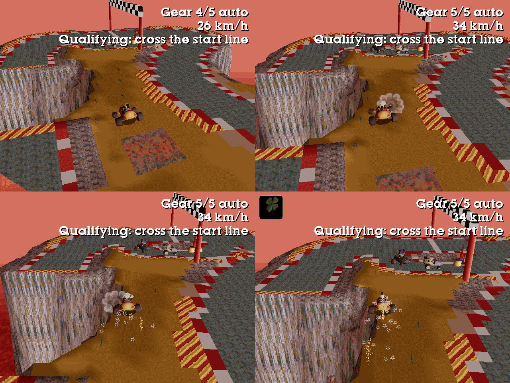

**Checkpoints, generously zoned.** The town circuit had 8 checkpoints on a lap of 1,044 cells, and none in the 120-cell hairpin loop under the bridge, so a car could skip both long sections there. Now:
- **One line about every 60 cells**, 8 at the least and 24 at the most (`CheckpointSpacing`, `MaxCheckpoints`): the town circuit has 17, the Desert 23, the storm track 8, the others 8 (the lava lake 4: its two leaps leave little room). The town's lines 14 and 15 stand at the hairpin ends of the two long sections under the bridge, so cutting across between them misses a line.
- **Each line reaches 6 cells past the verge** on each side (`CheckpointReach`), as far as its cube and the rest of the lap allow, and stands where the road is straightest near its place (a cell of bend counts as 10 of distance).
- **Each side reaches past the verge, or as far as another part of the lap allows.** A side cut off by another part of the lap must still reach past the curb; a side cut off by the cube's edge must reach past the verge. A line that can't is passed over, and where no place near its own works, one up to twice as far away is taken. Each line comes after the one before it. The lava lake's first loop had a line that stopped at the curb on its inner side, and the test pilot cutting the loop drove round its end.
- **The engine counts a line 1.5 cells past either end** for a car crossing it the lap's way (`RACE_CHECKPOINT_SLACK`, 768); crossed backwards it counts only along its own length, because past its ends the road comes back the other way.
- **Every line has its height** (the engine counts it only for a car within 1,200 of it), on every lap, not only a raised road's: a line under a bridge isn't crossed from the deck.

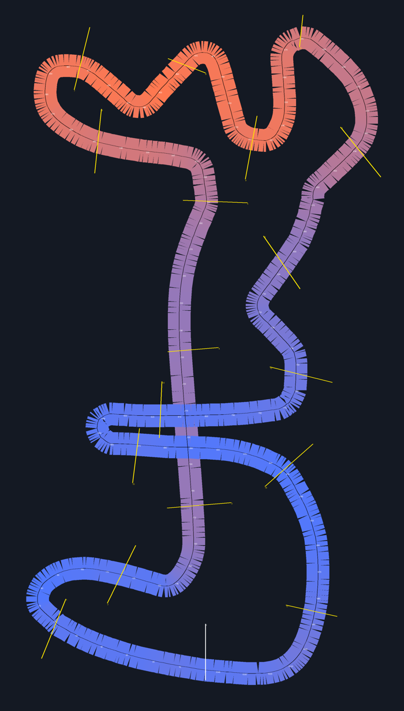

**Sendell's Well in the race track window.** The island made yesterday (`docs/LBA2_SENDELL_WELL.md`) is now one of the islands the window lists (`RaceTrackIsland.Sendell`). The build makes it every time, from the originals (`Terrain/SendellWell.cs`, which the `sendell build` test command now uses too): `SENDELL.ILE` and `SENDELL.OBL`, island 1's sky and palette in `RESS.HQR`, its holomap picture and camera, and **scene 224** (222 is the story's holomap arrow and 223 the lava lake's scene), placed on the holomap at island 1's place on the globe. These files have no originals, so the backups leave them out (`RaceTrackIsland.Created`, `KeptFiles`). A build without the island deletes them, and so does putting the folder back. The main window now refreshes its island and scene lists after a build or a restore, so `SENDELL.ILE` appears and disappears without restarting.

The lap (`tools/RaceTrackPlan/sendell_design.py`, `docs/racetrack/sendell_track_plan.json`) runs round the well, clockwise: along the plateau's north edge, down the east slope, a straight on the south beach (the start, heading west), and back up the west slope through an S. It is 103 cells long and climbs and drops 1,200 at up to 9 %, on a road a little narrower than the retail one. The other cars wait for the qualifying lap on the plateau round the rim. The start was first on a bend, where the racing line cut into the gantry's inner leg and the test pilot stuck there; it is now on the straight.

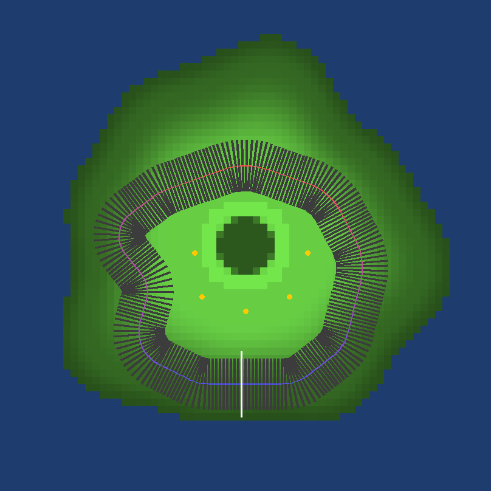
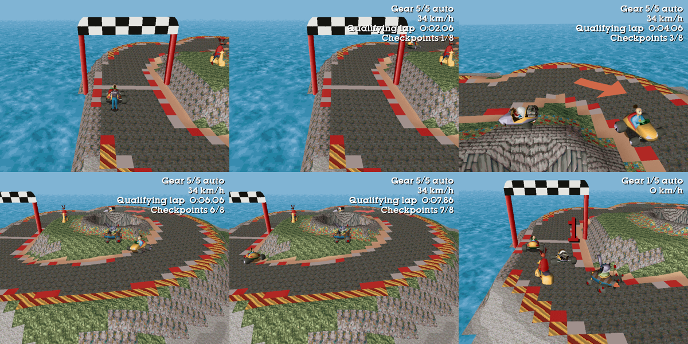
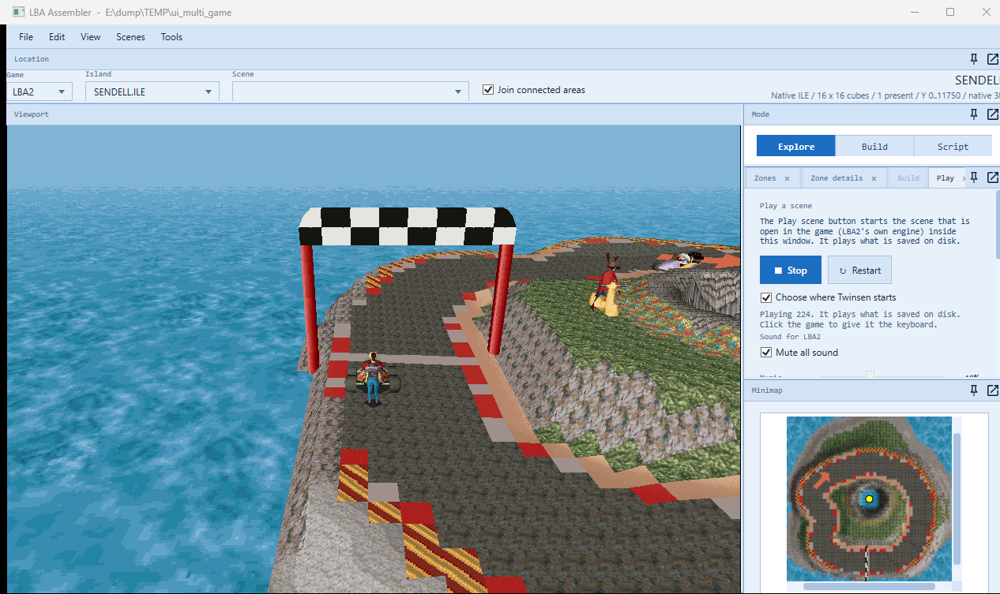

**Can Twinsen drive a loop?** As a scripted flight, yes. A jump's flight is a generic animation of the car (`RaceTrackJumpAnim`). Its slot 0 can carry a **master rotation**: bit 0 of its type adds the keyframe's Alpha (pitch) to the car's own (`LIB386/ANIM/INTERDEP.CPP`), and the step is turned by the car's whole orientation, pitch too. Bit 1 switches gravity off. So keyframes that pitch the car steadily while stepping it forward along its own nose carry it round a vertical circle. `ScriptRoundTrip loopanim <game> <generic> <radius> <drift> <keyframes> <ms> <sign>` builds one from the retail flight's pose and gives it to the buggy as a jump's flight. On a copy of the lava lake (flight 241: radius 3 cells, 15 cells forward, 32 keyframes of 90 ms, sign -1), the car took off, went over the top upside down (pitch 2,048 of 4,096, 2,800 above the take-off), came down 15 cells on and raced on. With sign +1 the pitch turns the wrong way: the car points down and the engine's ground check ends the flight. A loop section of a track would also need:
- **The ring itself**: a road body bent into a vertical circle (built like the raised road's pieces), with no collision box of its own, since the car inside it would hit it.
- **Landing level**: the flight ends 30/4,096 short of level and the car stays pitched that much. The engine should set Alpha back to 0 when a master-rotation flight ends or is cut short.
- **The flight's speed**: the jump clock judged this flight's own speed as 23 km/h from its steps and played it 1.32 times faster. A loop's own speed should be measured along its circle.
- **The opponents**: they follow their lines without pitch, so they would go round the loop level. The engine would have to pitch an opponent's car from its line's slope.

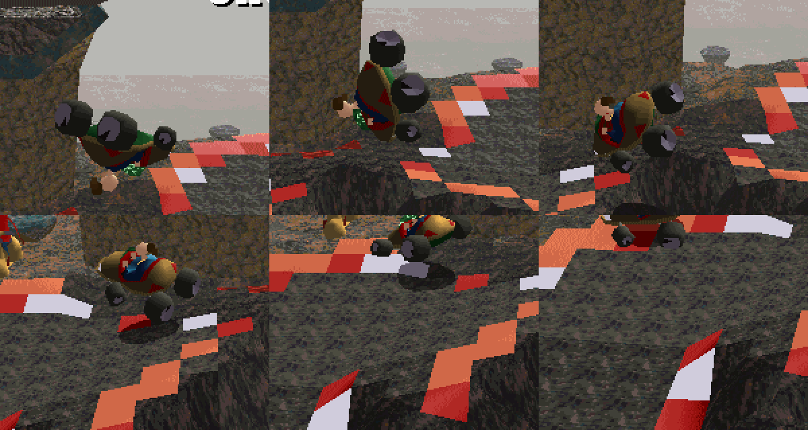

**Verified**, on copies of the game: all seven earlier tracks built into one folder with the new builder, then the test pilot on each: no checkpoint missed anywhere. Lava lake 4 lines, laps 10.2-11.4 s; storm track 8 lines, 28.3 s; Mosquibees 47.8 s; Celebration 41.8 s; Elevator 34-35 s; town circuit 17 lines, 99.0-99.1 s; the Desert stalls at checkpoint 7 as before these changes. Sendell's Well: 8.9 s laps, no checkpoint missed. From the app on a sandbox folder: built Sendell's Well alone, picked `SENDELL.ILE`, played its race (muted), put the folder back (the island's files went and the window moved to another island), and built it again. selftest, commenttests and areatests pass; scenetests show the same 49 failures (of 3.4 million checks) as the last commit's code.

## The old moon: two vertical loops (2026-10-01)

The user asked for two vertical loops on `MOON.ILE` (which no version of the game loads): one with an upside-down scripted jump at its top, and one that is just a natural vertical loop.

**The island.** `MOON.ILE`/`MOON.OBL` (14 February 1997) are an older copy of the Emerald Moon, island 3 (`EMERAUDE.ILE`): four cubes, (7,7)-(8,8), the same heights all but a little, different texturing, and the Zeelich moon base on a crater floor about 300 high. The race-track mode draws island 3 from it instead (`island_file=3 moon` in the car file: `RaceMod_IslandFile`, used by `InitGrilleExt`), with island 3's sky and palette (RESS 30). The track races in scenes of its own, **225-228**, copies of the Emerald Moon's four outside scenes 74-77 (`RaceTrackIsland.CopiesScenes`, `RaceTrackScenes.AddScene`). Their cube changes to one another point at the copies, and Twinsen's own life script in them is emptied: the Emerald Moon's scenes put him in his space suit (behaviour 10 or 11) whenever he comes in, which took him out of the car at the first cube edge. The original scenes are left alone. There are no opponents, because their cars don't go round loops, and nothing is drawn on the holomap, because island 3's picture is the Emerald Moon's. A track with no opponents has no grid, so Play no longer calls it outdated (`IsOutdated`). At the start the race-track mode now turns Twinsen to face the car itself and brings him within the action key's reach (`FaceTheCar`); before, it used the grid's pole spot.

**The lap** (`tools/RaceTrackPlan/moon_design.py`, `docs/racetrack/moon_track_plan.json`): an oval of 174 cells on the crater floor round the base, anticlockwise on the map, with the start line on its east side. Both loops are on the south side, its "loop alley": first the jump loop, then the whole loop after a 30-cell run-up. Each ring is within one cube (the engine carries the car round in that cube's coordinates), on road kept level for its radius plus 6 cells either side of its foot. The builder clears the base's buildings where the road runs through them.

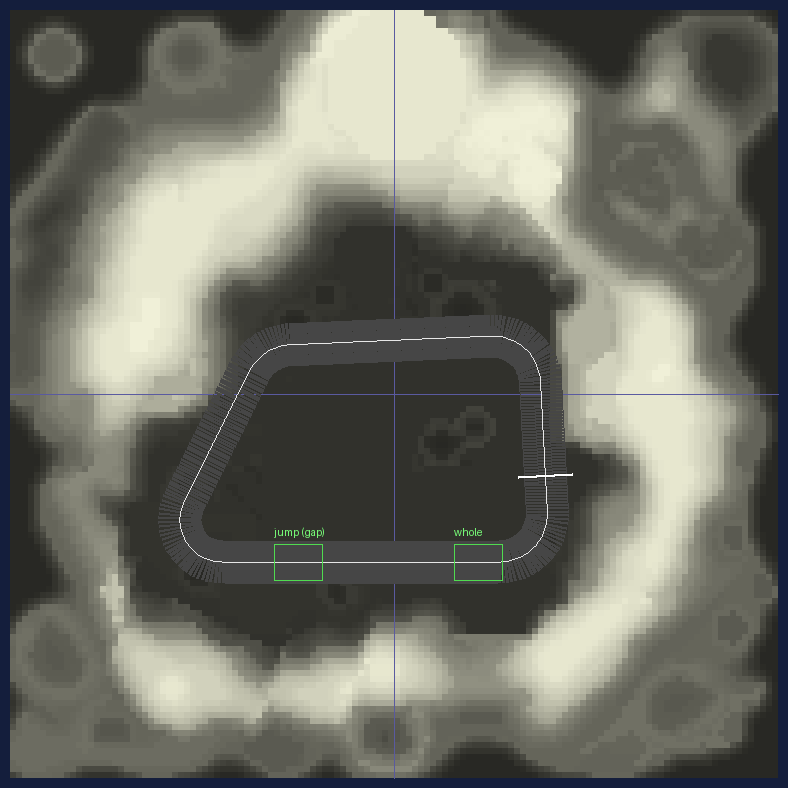

**The plan's `loops`**: each is [the point at the ring's foot, its radius (cells, to its road surface), the shift across (cells), the gap at its top (degrees, 0 for none)]. Here both are 4 cells, 3 across; the jump loop has a gap of 70 degrees. The builder (`RaceTrackBuilder`: `LoopInfo`, `PlaceLoops`, `RaceTrackLoopBody.Ring`):
- **The ring**: a band of road bent into a vertical circle in the plane of the lap's way, wound 3 cells across over the turn so the car comes out beside where it went in and drives on past the ring's foot. Grey road on the inside, red and white rails, green outside, two green legs at its widest. It is a decor body of its own, in world axes from its foot, and its box touches nothing (top far under it), because the engine carries the car round. The jump loop's ring stops short of its top for 70 degrees, its ends capped.
- **No checkpoint lines** within the ring's radius plus 6 cells of a loop: the car is in the air there.
- **The racing line**, which only the test pilot drives on this lap, runs into each ring on its own lane (left of the middle by half the shift) and away from it on the other.
- **RACETRACK.JSON's `Loops`**, written to the car file as `loop=<cube x> <cube z> <x> <y> <z> <dir x> <dir z> <radius> <shift> <gap>`.

**The engine** (`RACEMOD.CPP RaceMod_Loop`, called by `DoAnimExt` for the hero after his car's move). A car crossing a ring's foot the lap's way (anywhere across the road; where it went in across fades into the ring's lane over the first quarter) is carried round the ring instead of over the ground. Nothing else moves it while it is in the loop: no ground, no collisions, no safe place recorded.
- **The whole loop is physics.** The speed changes with the climb and the drop. The car stays on while v²/R + g·cos θ is positive (`RACE_LOOP_G` 1,600 units/s²), which over the top takes about 28 km/h with nothing pushing it, 21 km/h with the throttle held. The throttle pushes it on with `RACE_LOOP_PUSH` (600) as far as the ring presses back on the wheels, and the brakes slow it as far too. Too slow, it falls off: thrown along the ring and still turning, it lands, stands level, stops, and is held for 0.9 s ("Fell off the loop"). Below the quarter, where nothing throws it off, it rolls back down and out backwards.
- **The jump loop is scripted.** The car is carried round at the speed it came in with (2,500 units/s at the least) and never falls. Over the gap it leaves the ring upside down and passes 300 units inside the ring's line at the gap's middle (`RACE_LOOP_DIP`), landing on the far side.
- **The camera**: while the car is in a loop, the camera that follows it looks from the ring's side, 3.2 radii out on the side the car goes in on, at the ring's middle drawn a little towards the car. From behind, the ring's own back section, coming down behind its foot, was between the camera and the car. The race-track mode now switches the follow camera on for a lap with loops, as it does for a raised road.
- **The car stands level again** whenever neither a loop nor a flight's master rotation pitches it. The earlier loop test (a jump flight with a master rotation, `ScriptRoundTrip loopanim`) left the car 30/4,096 short of level.

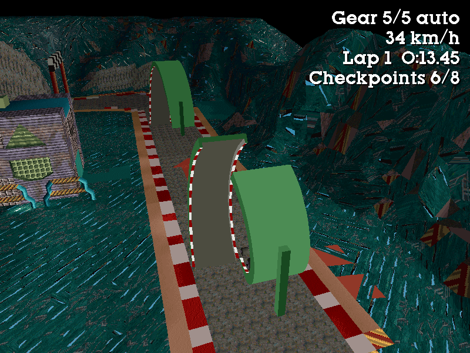
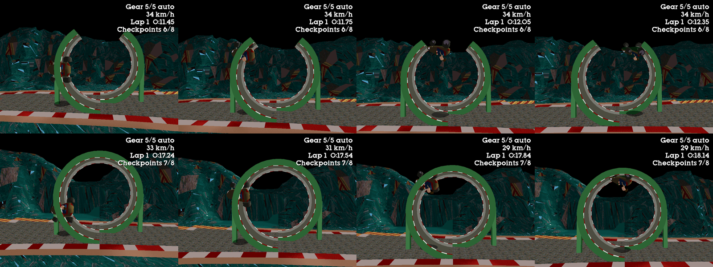
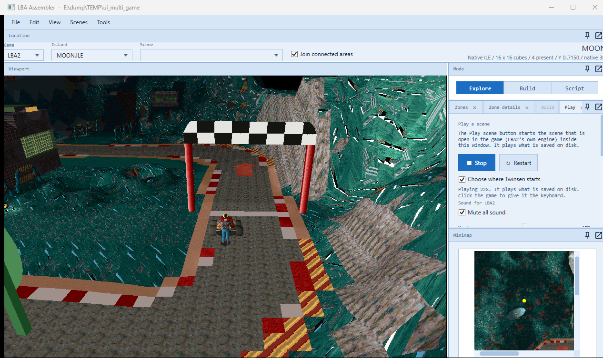

**Verified**, on copies of the game: the test pilot at full speed, laps of 22.1 s. Every lap, the jump loop: in at 4,836 units/s, over the gap, round. Every lap, the whole loop: in at 4,836, round at about 5,050, its speed dropping to 29 km/h over the top. With the car's top speed cut to 2,700 (19 km/h): the jump loop is carried round, and on the whole loop the car falls off at 120 degrees, lands, and rolls back out of each slow try after it. From the app, on a sandbox folder: built, `MOON.ILE` picked ("Race: The old moon", scene 228), Play starts on the start line with Twinsen at the car. All seven earlier tracks raced again with the new engine: the same laps, no checkpoint missed.

**Known limitations**: no opponents on this lap. A car that falls off the whole loop lands near its foot and has to back up for a run-up. The rings are seen side-on only while the car is in them.

**Correction (later on 2026-10-01): the car rolled instead of pitching.** The engine turns a body -- and an animation's step -- by `M = M(Alpha) M(Gamma) M(Beta)` (`LIB386/3D/IMATSTDF.CPP`): the heading first, then Gamma about the world's Z axis and Alpha about its X axis. So Alpha alone pitches only a car heading along Z; both moon loops run along +X, where Alpha rolled the car round its own long axis (in the pictures above, the rear wheels stacked one over the other at the ring's side). `RACEMOD.CPP CarPitch` now sets all three angles for a pitch `phi` in the car's own frame at heading `beta`: Alpha = atan2(cos b sin p, cos p), Beta = atan2(sin b cos p, cos b), Gamma = asin(-sin b sin p). When neither a loop nor a flight's master rotation turns the car, Gamma is put back to 0 along with Alpha. Nothing in the built files changes; the engine does it.

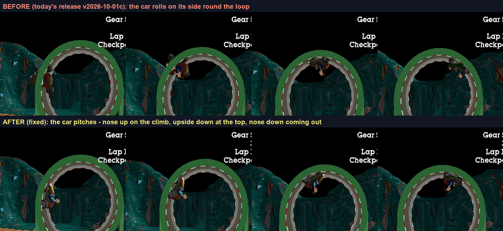

## The lava lake, round the whole island (2026-10-01)

*Reshaped later the same day from the user's sketch: see "The lava lake, third version" below. The drop, the drop camera and the cutting stay in the builder and engine for any track.*

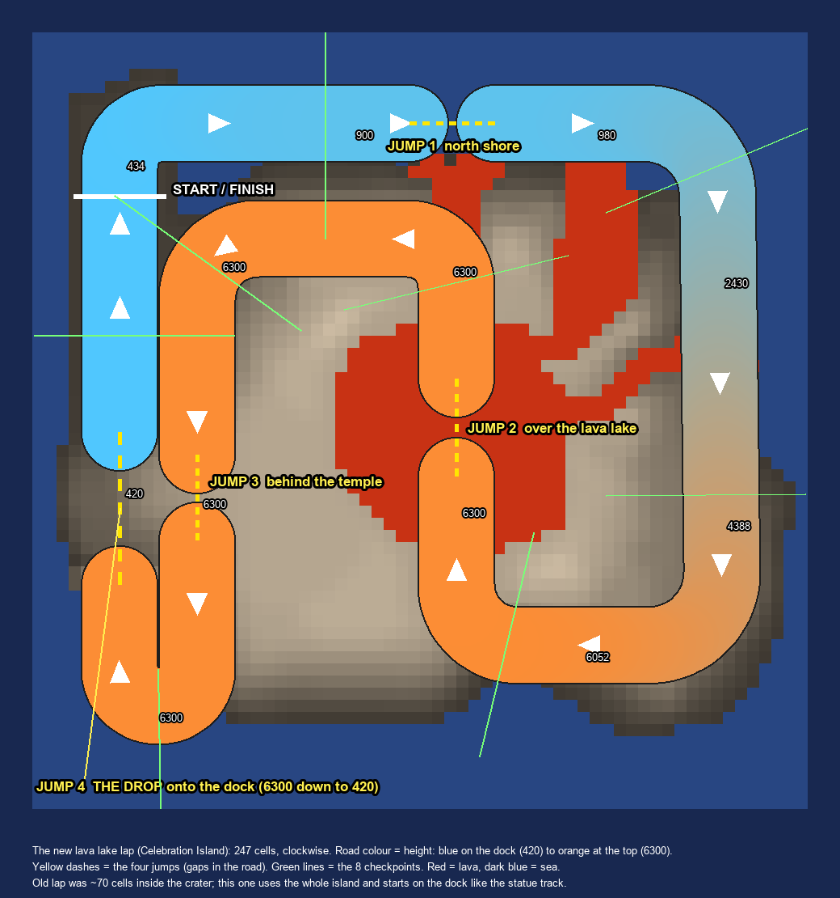

The first lava lake lap (above) was far too small: about 70 cells on the crater's plateau. The user asked for as much of the island's footprint as possible, perhaps more jumps, the start and finish where the statue track's are, and height used in a way unlike the statue track's helix. The new lap (`tools/RaceTrackPlan/celebrat_design.py`, `docs/racetrack/celebrat_track_plan.json`) is 247 cells, clockwise, raised road everywhere except the dock:

- **The dock** (420): the start line at (7.2, 13.5) heading north, the pits beside it, the statue track's area.
- **The north shore** (900, along the sea at the foot of the crater's cliffs): jump 1, a 7-cell gap over a lava channel.
- **The east coast**: a long climb from 900 to 6,300 (19 % at the steepest) round the north-east corner and down the coast to the south rim.
- **The south rim** at 6,300, then north across the middle of the lava lake on a causeway: jump 2, an 8-cell gap over the lava.
- **The north rim**, west, then south behind the temple: jump 3, a 7-cell gap, then a hairpin at the south-west corner.
- **The drop** (jump 4): north from the hairpin, the road ends at a lip on the mesa's west edge at 6,300 and the car flies 18.6 cells down the hillside onto the dock, 6,112 below.

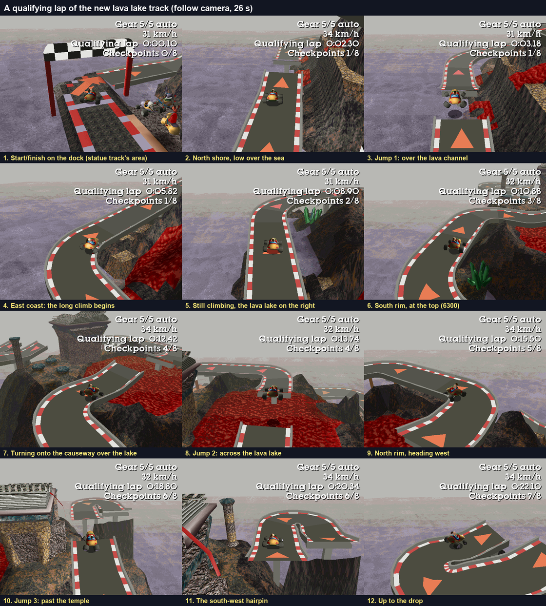
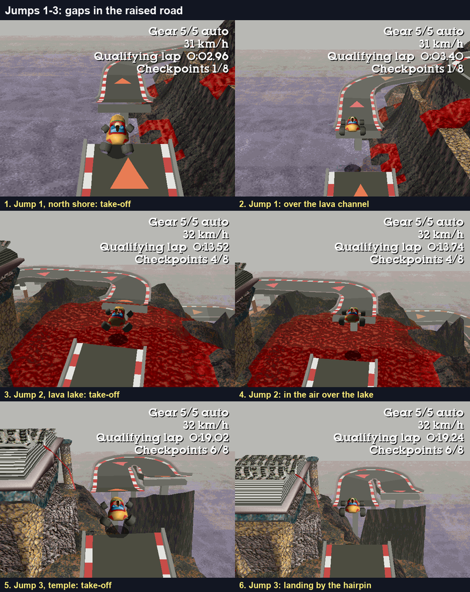
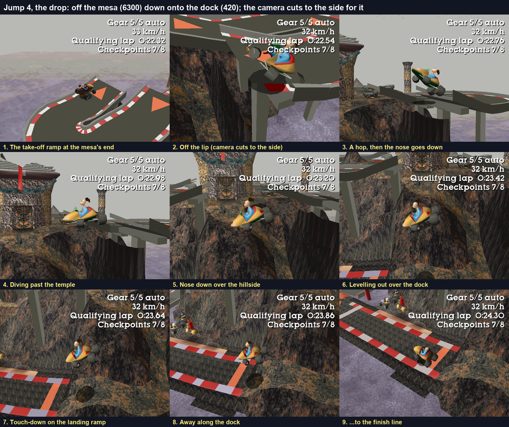

**Gaps in a raised road.** A gap jump on a raised road leaves a hole in the deck between its lips. `report.Raised` points in the gap have no width (Half 0); the engine skips any segment that touches one (`RaisedAt`, `RaisedBetween`), and no longer rounds off a segment's end where the road stops -- at its last point or a lip (`RaisedOpenEnd`; a segment's round end held the car up half a road's width past the drop's lip). The pieces and piers are laid along each stretch between gaps.

**The drop.** A gap jump whose landing lip is more than 600 below its take-off lip (`DropFrom`) is a drop: its landing ramp is 200 high, and its flight is drawn instead of scaled from the retail one (`RaceTrackJumpAnim.Drop`, `InstallDrop`). Its arc is `DropAt(u, drop) = 4·1200·u(1-u) - drop·s((u-0.2)/0.8)` (s the smoothstep): a hop as steep as the retail flight's first climb, clear of the take-off lip, then a smooth dive. The car's pitch follows the arc, eased in from level and back to it at both ends (53° nose down at the most), set in each keyframe as the change of all three angles (`Pitched`, the same decomposition as `CarPitch`) with the step in the car's own pitched frame. The opponents' lines fly the same arc. The engine's estimate of a flight's own speed (`FlightSpeed`, which sets the rate the flight is flown at) now turns each step by the whole of M, as the engine moves the car.

**The camera for the drop.** The camera that follows the car went down the hillside behind it and into the hill, and the landing was never seen. The builder now picks a place beside a drop's flight (`PlaceJumpCameras`: either side, 12-18 cells out, from the landing's height to a little over the take-off's) that sees the most of the car's places along the flight and past the landing -- each line clear of the ground and of the raised road's slabs and rails -- and writes it to the car file (`jumpcam=<anim> <cube x> <cube z> <x> <y> <z>`). While the hero flies that animation, and 1.5 s after he lands, the follow camera's eye moves there and looks at the car (`JumpCamera`). For the lava lake: 12 cells out over the sea to the west, 7,814 up, seeing 14 of its 15 places.

**Cutting under the deck.** The lap runs along cliffs and the crater's rim, where the rock beside the road came above the deck: the test pilot, cutting a corner on the north rim, stopped dead against it. With the plan's `raisedCut` (only this lap's), the builder lowers the ground to 450 under the deck out to a cell past its edge, then banks back up to the ground as it is (`CutUnderRaised`): 279 vertices, 2,330 at the most. Never within 8 cells of where the deck rises from the ground road, nor near the ground road itself. (Tried on every raised road first, it cut a 300-deep hole in the statue track's dock.)

**Test tools.** `--exec-at` takes 128 commands a run (16 before), so one run can screenshot a whole lap; `teleport <x> <y> <z> [beta [alpha [gamma]]]` sets the hero's angles too.

**Verified**, on copies of the game: the test pilot round the lap, qualifying 26.1-26.3 s, race laps 26.1-29.7 s with the three opponents (their qualifying 24.7-28.8 s), no checkpoint missed, no rescue. The drop: up to 7,440 off the lip, down to 431 on the dock's landing ramp and away at speed. All seven tracks of the joint build raced again with the new engine and builder: every lap completed, no checkpoint missed, no rescue (the Desert island's stall at checkpoint 7 is the known one). The old moon's loops re-shot: the car now pitches round both.

**Known limitations**: the first moment of the drop is hidden from its camera by the take-off ramp, and the camera swings out to its place over 12 frames rather than cutting. The cuttings under the deck are plain rock.

## The lava lake, third version: the user's sketch (2026-10-01)

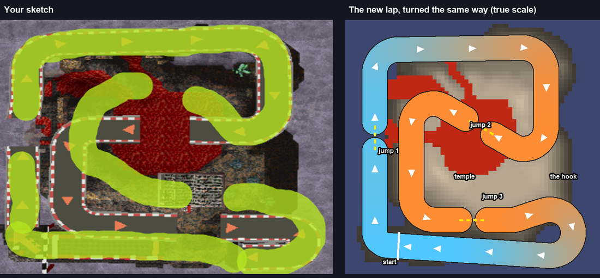

The user liked the second version's basics, but its last corner was too tight and the drop would be better as a ramp. Their sketch, drawn over the editor's minimap (which turns with the 3D view: up was east there), kept the start, made the third and fourth corners turn back more on themselves into the lake's jump, shifted the inner part of the lap over, and opened up the last turn; the jumps keep their lengths. The design (`tools/RaceTrackPlan/celebrat_design.py`) now draws the lap as circles it turns round joined by the lines that touch them, so a turn can go round more than half a circle:

- **The hook**: from the south rim the lap turns 120 degrees back on itself onto a causeway north-east across the lava lake; jump 2 (8 cells) is in its middle, heading 30 degrees east of north.
- **The S**: off the causeway round to the west onto the north rim (z 16.7), and round its corner south beside the temple.
- **Jump 3** (7 cells) stays just west of the temple: its roofs are 11,140 high, nearly 5,000 over the road, so the sketched line across the temple can't be flown. The road there is the plateau's west edge.
- **The last turn**: a kink left, then round to the right 204 degrees on a radius of 5.8 (the hairpin was 3), over the south-west corner.
- **The ramp** instead of the drop: from the end of jump 3's landing round the last turn and north along the island's west shore (x 4.6: the island's edge must be 4.3 cells off, the verge and half a cell -- not the 6.5 the design script had assumed) onto the dock, 6,300 down to 420 over 55 cells, its grade eased in and out and steepest near its foot (28 %). The south-west hill is the mesa's west flank and stands across the whole dock's width; every way onto the dock from the south crosses it, so the ramp runs through a cutting there (`raisedCut`: 427 vertices, 3,300 at the most at the cutting's uphill edge): a rock face beside the road.
- **The grid** stands two abreast (`gridStep` 1.75, a new plan option; 3.5 elsewhere), so it ends at z 23.5 and the ramp comes down just behind it.

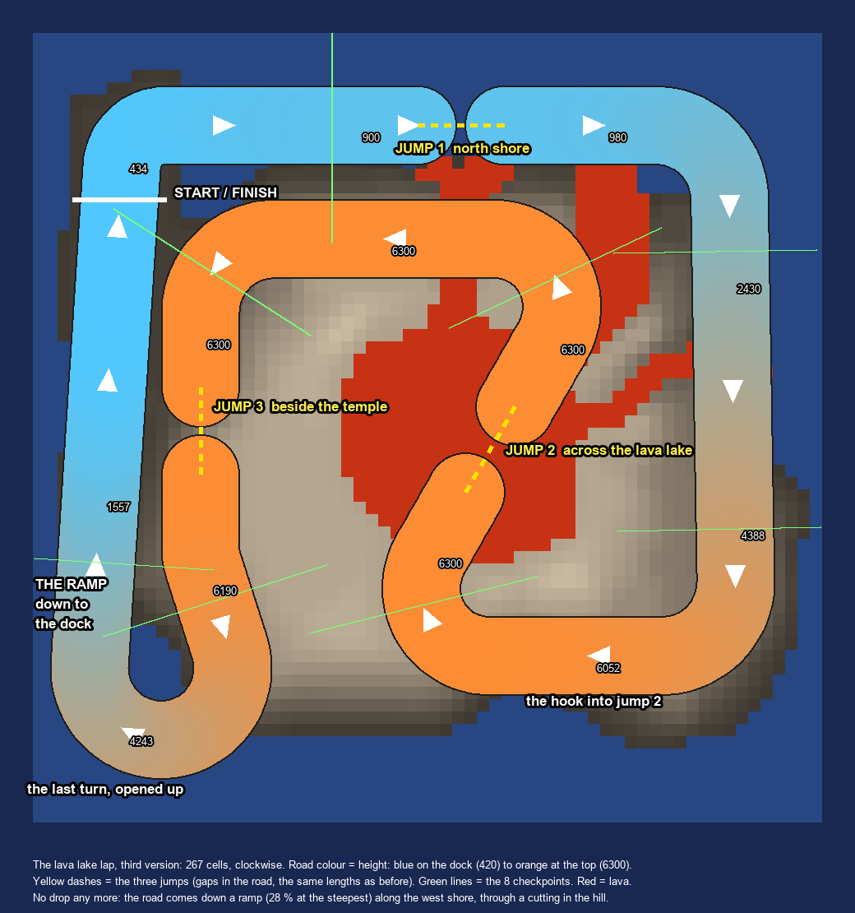
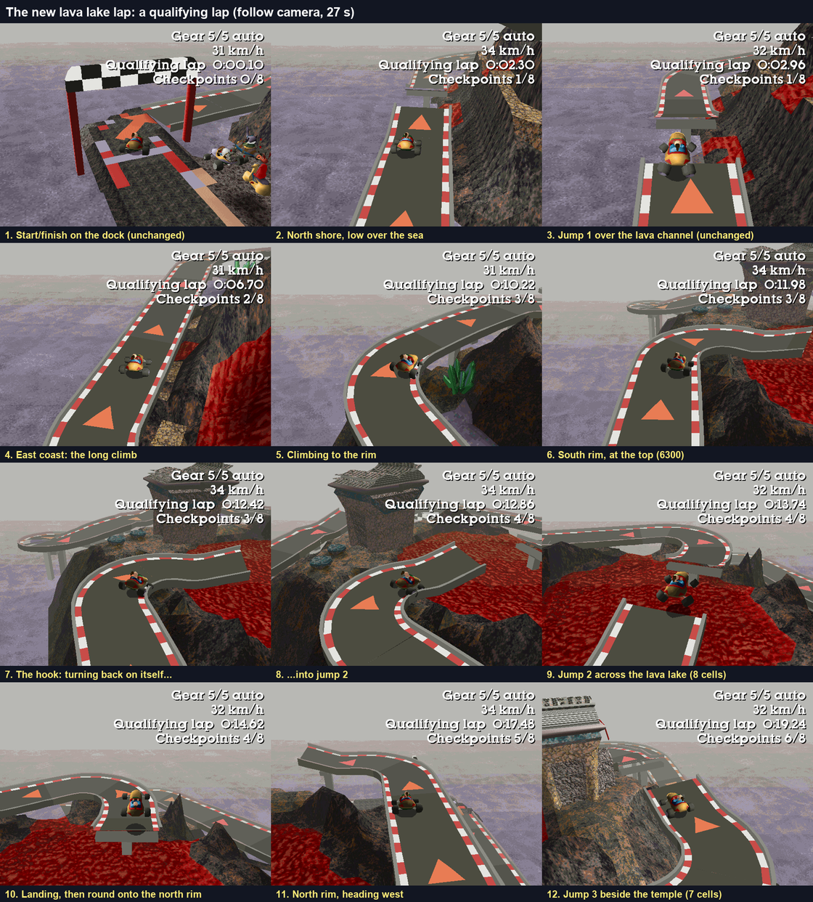
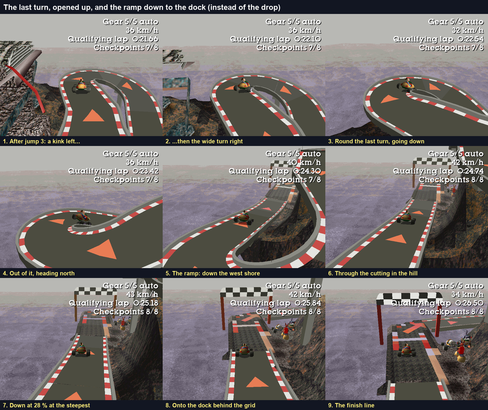

**Verified**, on copies of the game: the test pilot, qualifying 27.0 s, a race lap 29.5 s with the three opponents (their qualifying 26.7-32.0 s), no checkpoint missed, no rescue; down the ramp at up to 43 km/h. Built with the other six tracks into one folder: theirs keep the 3.5 grid. Built and raced from the app on a sandbox folder.

### The start/finish area: ground under the deck's ends, and footings for the gantry (2026-10-01)

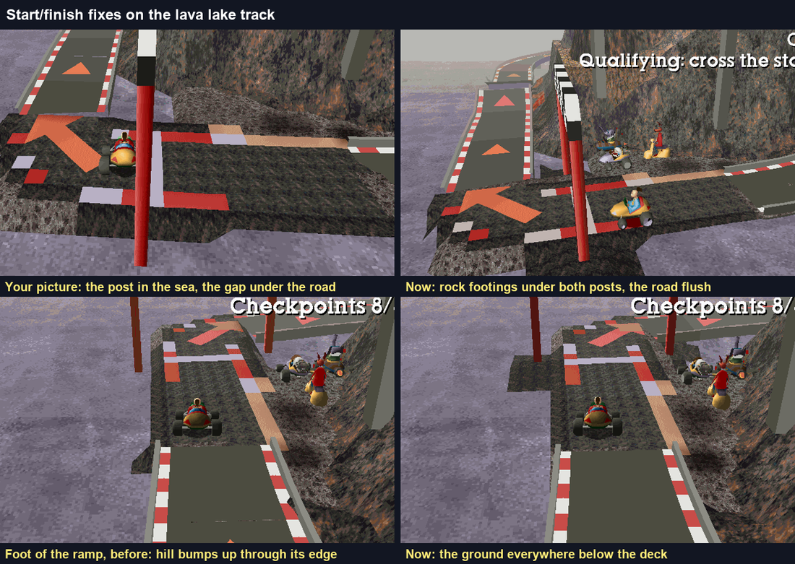

The user found the ground showing through the road at the foot of the ramp (cars rode up over the rail there), a slit under the start of the north shore's raised road, and the start gantry's post standing in the sea.

- **The raised road's ends** (`FlushRaisedEnds`, part of `raisedCut`): the engine takes the higher of the deck and the ground under it, so where the hill's toe stood up through the deck's edge a car rode up onto it and over the rail. Under each end of the raised road, as far as the deck stays within 600 of the ground under its middle (and stops where it runs into the hill: that is the cutting's), the ground is now the deck's own surface, 50 under it (15 under showed through the asphalt at a distance), out to its rails; beside it, ground below is filled up towards it and ground above brought down to it out to a cell past the rail (the engine's floor reaches a fifth of a cell past it), then banked up. The cutting leaves that ground alone. Checked over the whole lap, across the deck and that fifth of a cell past each rail: no ground above the deck anywhere.
- **Gantry footings** (`gantryFootings`, a plan option, only this lap's): the dock is narrower than the start line's gantry, and both posts stood in the sea. Under a post over a hole the ground is raised to the gantry's foot out to 0.9 cells from it and eased down over 1.6 more -- never on the road or its verge -- and the sea's cells there are drawn as rock (29 vertices, 27 cells). Tried on every track first, it would also have put a rock mound by the Desert island's pit lane and drawn rock under the statue track's west post (the same hole as here): left to the plans that ask for it.

**Verified**: the test pilot, three race runs in this folder and one in the folder with all seven tracks, qualifying 27.0 s, race laps 29.5-30.2 s, no checkpoint missed; one rescue in one run (an opponent's bump on the north shore, far from these changes; the other three runs had none).

### Over the cliff at the foot of the ramp (2026-10-02)

The user found a place on the left of the ramp down to the start/finish line where the car went out of the track and died. The ramp's last 11 cells run along the island's west cliff (x 2: the ground falls from the deck's height to the sea), and there the deck lies on the ground (the flush ends above): the engine let go of the rail wherever the road was less than 300 over the ground under the car (`RaceMod_Rail`), so that a car can drive off the road where it comes down onto the ground. A car against the left rail there slid off the deck, over the cliff, into the sea, and was put back on the road ("back on the road: line point 251").

- **The engine** (`RACEMOD.CPP`, `RaceMod_Rail`): where the road lies on the ground, the rail now still holds on a side where the ground just past the floor's edge (`RAISED_BESIDE` 384 out) is 300 or more below the road; where it is about as high (the dock beside the ramp's right, any road ending on flat ground) the car drives off as before. Past the road's own first or last point it is always free (`RaisedPastEnd`: otherwise the segment before the open last one, clamped to its end, held a car at the ramp's end).
- **The test pilot** has a sideways offset (`autodrive 1 5 <cells>`: to the left of the line, x east and z south), to drive a lap against a rail. Against the left rail down the ramp (2.2 and 2.5 cells): the old engine slides off at x 2.8 and is rescued or stuck on the cliff; the new one stays on the deck (x 3.6 and over), rolls off the end onto the dock and finishes the lap (29.15 s). On the ordinary line nothing changed: lava 27.04 / 30.18-30.19 s, statue track 41.82 / 41.86 s, storm, mosquibees, elevator and town identical (desert's checkpoint-7 stall and sendell's crash are older).
- **Not changed, found on the way**: taken from the far right of the road (1.9 and 2.6 cells right of the line, either engine), the causeway jump over the lake (jump 2, line point 128) can fall short into the lava. (Fixed the same evening: below.)

### Jumps 2 and 3 from the right side (2026-10-02, later)

The user found the car going through the right side of jump 3 and dropping to the track below; jump 2 dropped a car on its right into the lava (found with the pilot). Two different faults:

- **Jump 3: the ramp-foot fix's own fault.** `RaisedPastEnd` (the place past the road's own last point, where the rail lets go) looked at any place within seven cells of the ramp's foot (6.33, 24.44) beyond it, at any height -- and the right side of jump 3's run-up (x 11-12, z 19.5-24.4) is within that, 6,000 higher. A car on that rail was let off the deck and fell onto the ramp's foot below. (Reproduced by placing the car on the rail there, `teleport`, and holding right: the release of that afternoon dropped it to y 428 at (10.6, 23.3); the engines before and after held it at x 11.80.) Now a place counts as past an end only beyond the end's point, within the road's width there, and level with it (`RAISED_LEVEL`).
- **Jump 2: the rail during the flight (older).** The flight starts in the trigger zone, two or three cells before the lip, and the car is still over the take-off deck. Past the last segment before the gap, `RaisedAt` measures the car against the segment before it, clamped at its end point; a car on the rail line is a little outside its limit there, and the rail put it back beside that point -- every frame. The flight went nowhere and the car dropped into the lava when it ended. On the middle of the road the car never touches the limit, which is why the pilot's ordinary laps never showed it. The rail now stays out of a jump's flight (`s_flying`), and every open end of the road -- each jump's lip as well as the road's own ends -- counts as an end for `RaisedPastEnd` (a car on the rail rolling off a lip whose jump didn't start then falls, as it should).
- **The triggers were checked too**: every place across the road the rail allows (1.8 cells either side of the middle) runs through at least a cell of each jump's trigger zone in the last four before its lip.

**Verified** (the lava lap, `rt_lava`): whole laps with the pilot 2.2 and 2.5 cells left and 1.9, 2.2, 2.6 and 3.0 cells right of its line: no rescue (before, 1.9 and 2.6 right fell at jump 2); the ramp's foot against the left rail still holds; the jump-3 rail test holds at x 11.80. Every track's ordinary pilot laps as before.

## The Emerald Moon: over the reactor (2026-10-02)

The user drew a lap for `EMERAUDE.ILE` (the Emerald Moon, island 3) over the editor's minimap:
- a jump on either side of the reactor (the large pink dots), the road there as wide as the top of the reactor, and wider coming into it;
- large, banked curves (red) into the jump and after it;
- a straight along the middle of the moon base's building, with a pit lane on its right;
- the vertical loops tested on the old moon (blue), each twice the road's width, the road coming out of a loop offset sideways from where it went in;
- two arrows for the way round.

Asked how the jumps and the straight should work, the user chose one jump right over the reactor, the pink dots being its take-off and landing, and a road on the building's roof.

**The island.**
- **The terrain.** Four cubes, (7,7)-(8,8), cells 448-576 both ways. A crater floor about 325 high is ringed by a rim 4,000-7,150 high.
- **The moon base** stands on the crater floor: a cross of tube-roofed buildings. The long arm runs north-south along x 57-64, its roof 4,538 high at the middle. The short arm runs east-west along z 56-64.
- **The reactor** is on the north rim (body 6): a plateau 6,695 high, then a cylinder 26 cells across up to 12,000, then a dish 17.3 cells across up to 18,716. Its middle is on the border between the cubes, at x 64, z 13.
- **The sketch** was fitted to the island by landmarks with a projective fit, because the minimap is tilted. Up on the minimap was east, right was south.

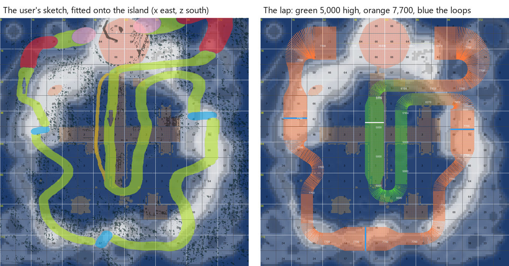

**The lap** (`tools/RaceTrackPlan/emerald_design.py`, `docs/racetrack/emerald_track_plan.json`): 540 cells, all of it a raised road. Rounded corners join straight runs (every 0.5 cells), the way the sketch's arrows go:
- **The straight** runs south along the long arm's roof, 5,000 high. The race lanes' middle is on the roof's middle (x 60.5). One deck carries both the race lanes and a pit lane 3.5 cells wide on their right (west), with a white stripe between them (`pitStripe`). The start line and its gantry are on the straight.
- **The inner U**: a hairpin at the south end, then back north over the short arm, still at 5,000. Then east along z 42, climbing to the outer ring's 7,700 (grades eased in and out, 15 % at the most).
- **The rim**: south down the east rim through the first loop (whole), west along the south side through the second (a 70-degree gap at its top), and north up the west rim through the third (whole). The outer ring is at 7,700 because the west rim reaches 7,150.
- **The red curves** are a wide banked turn onto the reactor's line (z 13, radius 10) and, after the jump, a banked U-turn (radius 11), banked up to 0.32. Through both, the road widens to 8.5 cells from its middle to its rail, the width of the reactor's dish, and narrows again after the U-turn.
- **The way back**: west along z 35, past the reactor's south side, coming down to 5,000 and onto the straight.

**The loops**: each has a radius of 4. The deck is 6.1 cells from its middle to its rail for 10 cells either side of the foot, twice the road's width, and narrows back over 8 more. The ring's band is as wide as the road (the plan's loops gain a fifth number, the band's half width: 3.05). The band drifts 6.1 cells across, a whole road width, so the car goes in on the left half and comes out on the right. Each ring is within one cube.

**The jump: one leap over the whole reactor** (the plan's `arcJumps`: [ramp foot, lip, landing lip, hill foot]).
- **The ramp** curves up from the deck, 6 cells long, to 60 degrees at its lip: a circle's arc, from x 33 to the lip at x 39, 9,474 high.
- **The flight** is a parabola from the lip to the landing lip at x 90, with the lip's slope at both ends. It tops out at 20,780, 2,000 over the dish, clearing the reactor's top across the whole deck's width by 900 at least. The design script picks the gentlest ramp angle that clears it.
- **The landing hill** curves back down, 6 cells, to the deck at x 96.

The plan's heights from the ramp's foot to the hill's foot are that path. The road has no deck between the lips.

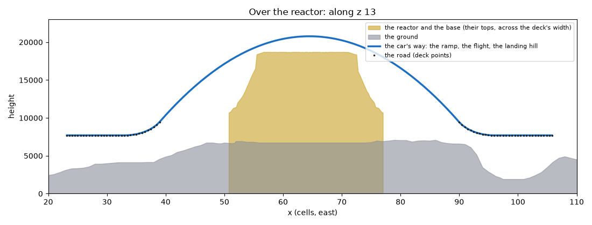

No flight animation could fly this jump. An animation moves the hero in his cube's own units, and this flight crosses from cube (7,7) into (8,7) high over the reactor. So the race-track mode carries the car itself (`RACEMOD.CPP RaceArc`, called first by `RaceMod_Loop`):
- **Taking the car on.** A car that crosses the line across the road at the ramp's foot, going the lap's way and level with the deck, is taken onto the jump. It is carried along the plan's path at its speed along the ground (4,500 units/s at least), at the same distance across the road as it came in, and pitched with the path (`CarPitch`).
- **The cube change.** Where the path crosses into another cube, the engine changes the scene itself: `NewCube` is set from the car file's `cube_scene=` lines, along with the place in the new cube's units, `FlagChgCube` 1 and no re-seating. In the new scene the car is carried on. The builder makes no crossing zone at a carried jump's edge.
- **The landing.** The car is set down on the landing hill's foot, level, going as fast as it was carried, and its lap check forgets its last place.
- **The camera** flies beside the car, 18 cells out to the south, a little behind it and 1,800 over it, looking at the car with the reactor passing under it. It stays there half a second after the landing.
- **The rail** stays out of the carried flight.
- **The car file** gets `arcjump=<foot> <lip> <land> <land foot> [side]` (places in the raised road's file) and `cube_scene=<cube x> <cube z> <scene>`.

At full speed the jump takes about 6.6 s from the ramp's foot to the hill's foot.

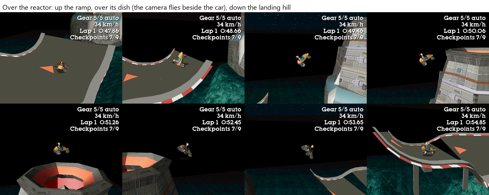

**What else the builder does for it:**
- **Widths point by point** (the plan's `raisedHalfs`). They go to the engine's raised road file, the deck pieces (`RaceTrackRaisedBody.Tile` widens the asphalt and moves the curbs and rails out), the start gantry, the piers, the raised floor and decor clearing.
- **The engine looks further** for the road's points: by the widest half width in squares of four cells (`s_rbExtra`). The 8.5-cell road was wider than the one square either way that it searched.
- **The cube edges' crossing zones** stand at the raised road's own height, not the ground's. The straight crosses z 64 at 5,000, over a crater floor at 325.
- **Decor under the jump is left alone.** Under a carried jump's gap, nothing is cleared or cut down: the reactor stays as it is. The other decor bodies are kept (`keepBodies`). The egg-shaped building beside the west rim had its box cut down under the road (the road keeps clear of the building itself).
- **Checkpoints** keep 6 cells clear of a carried jump.

The track races in scenes of its own, **229-232**, copies of the moon's outside scenes 74-77 (Twinsen's own life script emptied, as on the old moon), with no opponents and nothing drawn on the holomap. Nine piers were left out where there was no clear ground under the road. On the straight, the deck lies 260 over the long arm's roof.

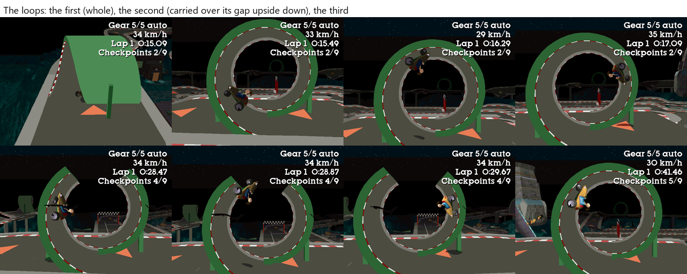
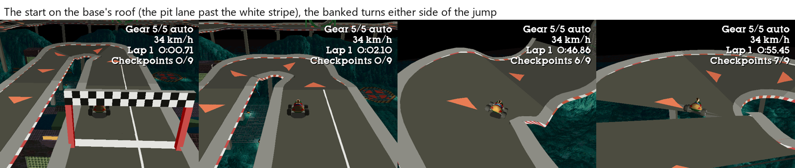
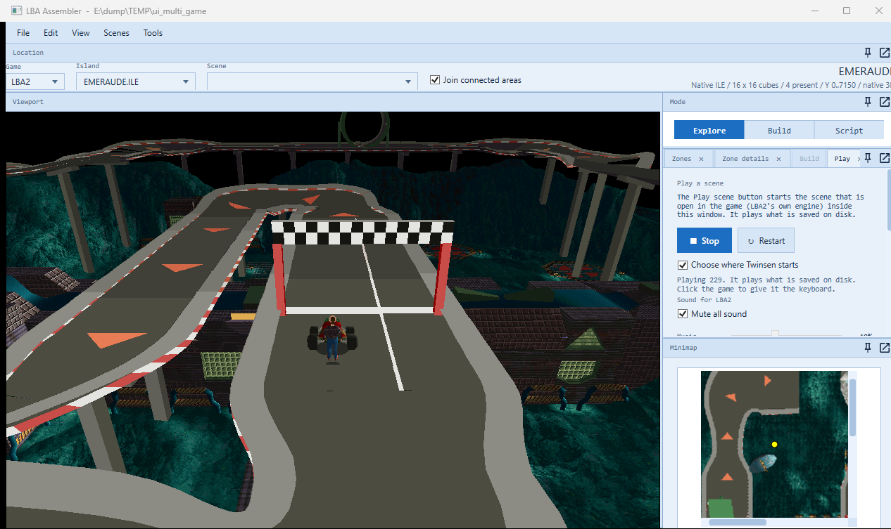

**Verified**:
- **Headless pilot** (`rt_emer`): a lap of 64.05 s, all 9 checkpoints, no rescue. All three loops round (in at 4,836 units/s). The jump: carried at 4,836, into scene 231 at the top (20,777 high), down on the hill's foot. The car's place, dumped every 25 ticks against the road, stays on the deck all the way round, banking included, apart from the loops.
- **Other tracks unchanged**: the eight other tracks built together are byte-identical to the last commit's build (38 files). The elevator and lava laps raced with the new engine qualify in the same times as before.
- **From the app**, on a sandbox folder: the Emerald Moon ticked and built in the race track window. With `EMERAUDE.ILE` open, the Play button reads "Race: The Emerald Moon". Play starts in scene 229 on the grid under the start gantry, muted.

**Limits**:
- The pit lane was only a lane: there were no opponents to wait in it. (Since 2026-10-03 they race it and wait there: below.)
- A car driven backwards up the landing hill would fall off its lip onto the reactor's plateau (not tried).

## Driving the loops, and opponents round them (2026-10-03)

The user asked for two changes. Opponent cars should be able to do the loops. The car should be driven upside down, instead of the top of a loop being scripted. Until now the engine carried the car along the middle of the ring's band, and the player had only the throttle and the brakes. On a ring with a gap, the car was carried round at the speed it came in with and over the gap on a fixed path, whatever that speed was. Neither moon track had opponents.

**The ride** (`RACEMOD.CPP LoopStep`, the same for the player's car and for every opponent's): the car is driven round the ring as it is on a road bent into a circle.
- **On the ring.** The speed changes with the climb and the drop. The throttle pushes the car on, as far as the ring presses back on its wheels; the brakes slow it as far. The steering turns the car across the band: up to 20 degrees, at the car's own steering rate. The rails keep its middle a car's half width inside the band. While steering, the car yaws on the ring's surface: `CarPose` adds a yaw about the car's own up axis to the heading and the pitch. A car that came in wide of its lane is pushed onto the band over the first part of the ring.
- **Off the ring.** A car that is too slow over the top leaves the ring and flies inside it, as a falling body. It comes down on the ring again further round and rides on with its speed along the ring; a landing into the ring at more than 2,400 units/s keeps only a third of that speed ("Hard landing"). If it falls through the middle onto the road at the ring's foot, it has fallen off: the car is held for 0.9 s ("Fell off the loop").
- **A ring with a gap** is now a real leap. At the gap's edge the car flies on as it was going, upside down, and lands on the far side. The far edge catches a car up to 500 over it ("Over the gap"). A car that is too fast sails over the far edge and falls outside the ring ("Overshot the loop"); it lands on the road or the deck, held for 0.9 s. A car that is a little too slow loses the ring just before the gap and comes down hard further round the far side, but still gets round.
- **Under a quarter turn**, a car that is too slow rolls back down and out backwards, as before.
- **The camera** stays beside the ring, as before.

**The speeds.** For each ring the engine works out, at load, the speeds at its foot that a car with the throttle held gets cleanly round at (`LoopWindow`): every entry speed is tried with the same step at the engine's 16 ms frame. Cleanly means on the ring all the way to a gap, and no hard landing.

| Ring (radius 4 cells) | Clean entry speeds | Falls off below | Overshoots above |
|---|---|---|---|
| Whole | 22 km/h and over | about 19 km/h | n/a |
| 70-degree gap at its top | 21–24 km/h (3,000–3,375 units/s) | about 19.5 km/h | 24 km/h |

A ring with a gap is taken at about third gear's speed. Coming up to one, 15–30 cells before its foot, the display says how fast to take it ("Jump loop: 22-23 km/h", rounded inwards). (Since 2026-10-04 a car that is too fast is slowed to it, and the display gives only the least: see "Oil slicks on the road; the open loop slows a car that is too fast".)

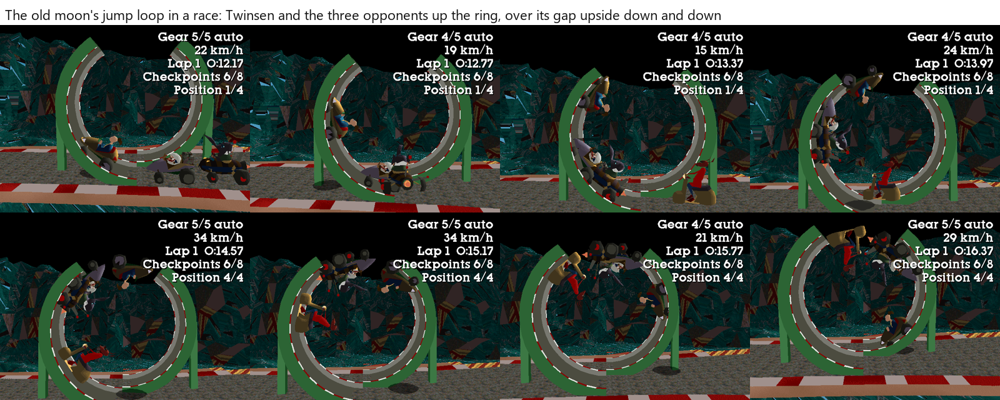

**Steering, tested.** On the Emerald Moon's first loop the test pilot came in on the right rail of the band. Holding left for 40 ticks over the top took the car from that rail (+922 across the band's middle) to the band's middle, its heading yawed 20 degrees while steering. Holding right against the rail changed nothing.

**The road before a ring** (`RaceMod_Loop`): its right half closes over the RACE_LOOP_FUNNEL (8) cells before the ring, down to the entry lane. The ring's way down stands there, and a car on the right half used to drive past under it and skip the loop.

**The opponents** are driven round the same way (`RaceMod_Frame`):
- **Entry.** Each opponent's line has each loop's foot on it (`OpponentLoops`). When an opponent crosses the foot, its line waits there while it goes round. It takes the ring at a speed inside the clean ones (`LoopEntry`), with the throttle held, and its car is placed and pitched by the ride.
- **No falls.** An opponent never falls off: too slow over the top, it is held on.
- **Planned speeds.** Their speeds are planned to brake to the middle of a gap ring's speeds (`LoopCaps`). The time round the rings is added to their planned laps, which set their qualifying times.
- **The reactor jump.** Over the Emerald Moon's reactor jump, an opponent follows its line's own arc (the plan's heights), pitched with its slope. It disappears from the player's scene as it crosses into the next cube.

**Opponents in other cubes.** The engine keeps every object of a scene within its cube (`DoAnimExt`). An opponent's car standing in the next cube was therefore pinned to the cube's edge, an invisible wall. The old moon's grid is just over the border from the lap's crossing, and the player's car was stopped there, jittering over a checkpoint line. An opponent outside the player's cube is now kept out of sight and out of the way. This was also the Desert island test pilot's old stall at checkpoint 7: its qualifying lap now completes (132.6 s).

**The tracks.**
- **The old moon:** opponents now race it. They wait beside the start line's straight, inside the oval on the crater floor (the plan's new `pitSpots`). On the grid behind the line they stood on the lap's last bend, in the player's way.
- **The Emerald Moon:** opponents now race it too, waiting in the pit lane beside the start while the player qualifies (the plan's `pitSpots`). The start line moved to z 62 so that its grid stands on the level part of the straight.
- **The loop record** (`RACETRACK.JSON` `Loops`, the car file's `loop=`) gains an eleventh number, the band's half width, for the steering.
- **The test pilot** holds the throttle round a ring. Coming up to a ring with a gap, it keeps close to the middle of its speeds (coasting a little over them, braking well over them).

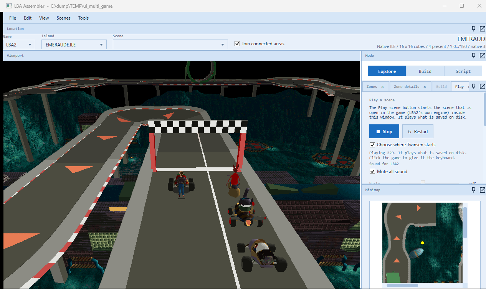

**Verified**:
- **The old moon** (`rt_moon`), the pilot and three opponents:
  - qualifying 25.34 s, the grid, the count-down;
  - race laps 25.53 and 25.62 s, the opponents' 27.1–28.3 s;
  - every lap, all four cars round both rings, the opponents taking the jump loop at 22 km/h.
  - The pilot leapt the gap cleanly ("Over the gap") or a little slow (off at 145 degrees, down further round); it never fell.
- **The Emerald Moon** (`rt_emer`):
  - qualifying 67.77 s; the opponents waited in the pit lane, then the grid;
  - race laps 67.13 and 67.76 s, the opponents' 68.9–71.5 s;
  - all three loops every lap by every car;
  - the opponents over the reactor: up from 7,700 to 20,725, out of the player's scene at the cubes' border.
- **The other tracks:** the seven others build byte-identical (38 files). With the new engine their solo qualifying laps are identical (lava 27.04, storm 28.30, Mosquibees 47.80, statue 41.86, elevator 34.02, town 99.02 s); Sendell's Well's crash is older.
- **From the app**, on a sandbox folder: both moons built in the race track window. With `EMERAUDE.ILE` open, Play starts on the grid with the opponents in the pit lane, muted.

### The Emerald Moon, second round: the cut-out loop, holes, borders, the pit lane, a wider road (2026-10-03, later)

The user found five things on the Emerald Moon:
- Twinsen couldn't drive the cut-out loop: he was sent flying into the air.
- Parts of the track showed as holes, though they could be driven over.
- The track's border was much wider than on other tracks.
- The pit lane should be a separate strip or have a fence, perhaps Citadel Island's white one.
- The track was too narrow in places.

**The cut-out loop.** With a 70-degree gap at its top, only entry speeds of 21-24 km/h got the car over cleanly. Anything faster sailed past the far edge ("Overshot the loop") -- and a player comes in at full speed. The engine's own step, run over the gap's size (radius 4 cells, throttle held), gives:

| Gap | Clean entry speeds | Above that |
|---|---|---|
| 70 degrees | 21–24 km/h | overshoots |
| 40 degrees | 22–37 km/h | overshoots |
| 35 degrees | 22–43 km/h | still gets round |
| 30 degrees | 22–46 km/h | still gets round |

Both moons' cut-out loops are now 35 degrees. They are taken at full speed (34 km/h), still a real leap upside down over the gap: off the ring at 162 degrees, over the gap, round at 5,386 units/s. The display's "how fast" hint, the opponents' braking for such a loop and the test pilot's now apply only where the car's top speed would overshoot it.

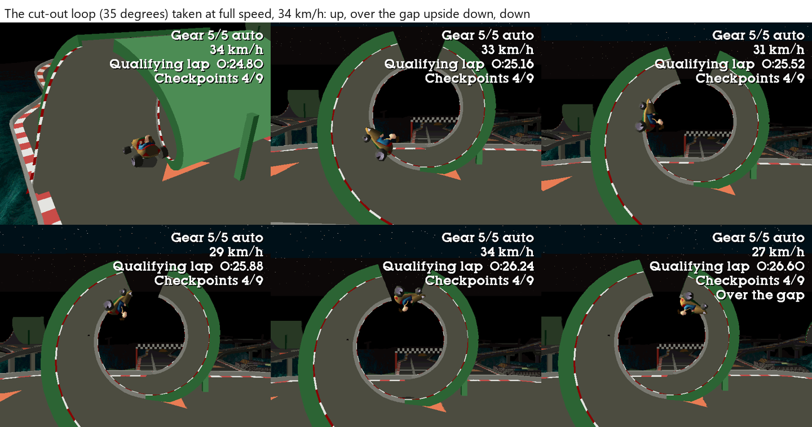

**The border.** The plan never set the asphalt's and the curbs' widths. The road was drawn with the ground tracks' own (asphalt 3.5 cells, curbs 4.5) inside a rail at 3.05. So the curb and the rail top folded back outside the rail: a grey band a cell and a half wide along both edges, and faces turned the wrong way. The plan now gives them like the other raised roads: the rail at the road's half width, the curb a quarter cell inside it, the asphalt a cell inside it.

**A wider road.**
- **Base road:** the rails are now at 4.5 cells from the middle (they were at 3.05), where the ground tracks' curbs are. A car's middle can go 3.25 cells either side of the road's middle (it was 1.8).
- **Loops:** the decks are twice that, 9 cells, and their rings' bands are as wide as the road.
- **Layout room:** three moves keep the wider road clear of itself.
  - The leg past the reactor's south side moves to z 33 and starts down after the rim's crest, not on it.
  - The inner U moves to z 43, and the U-turn after the jump narrows over its first half.
  - The east and west loops move along their straights: the west one's wider deck had reached the egg-shaped building.

**The pit lane.**
- **The fence:** Citadel Island's white fence (CITADEL.OBL's body 53, a section a thousand units long, and 54, its end post) is copied into EMERAUDE.OBL as it is; the island palettes share its colours. It stands solid along the line between the race lanes and the pit lane, 18 sections and an end post over 34 cells (the plan's `pitFence`). The pit lane is 4.5 cells wide behind it, open at both ends where the deck widens and narrows.
- **Tested:** the test pilot steered 4 cells towards the pit lane is stopped with its middle a car's half width from the fence, and slides along it to the straight's end.
- **The racing lines** keep 1.6 cells on the race lanes' side of it.
- **The grid** is moved onto the race lanes (the plan's `gridShift`, half the pit lane's width).
- **The opponents** wait in the pit lane behind the fence while the player qualifies.

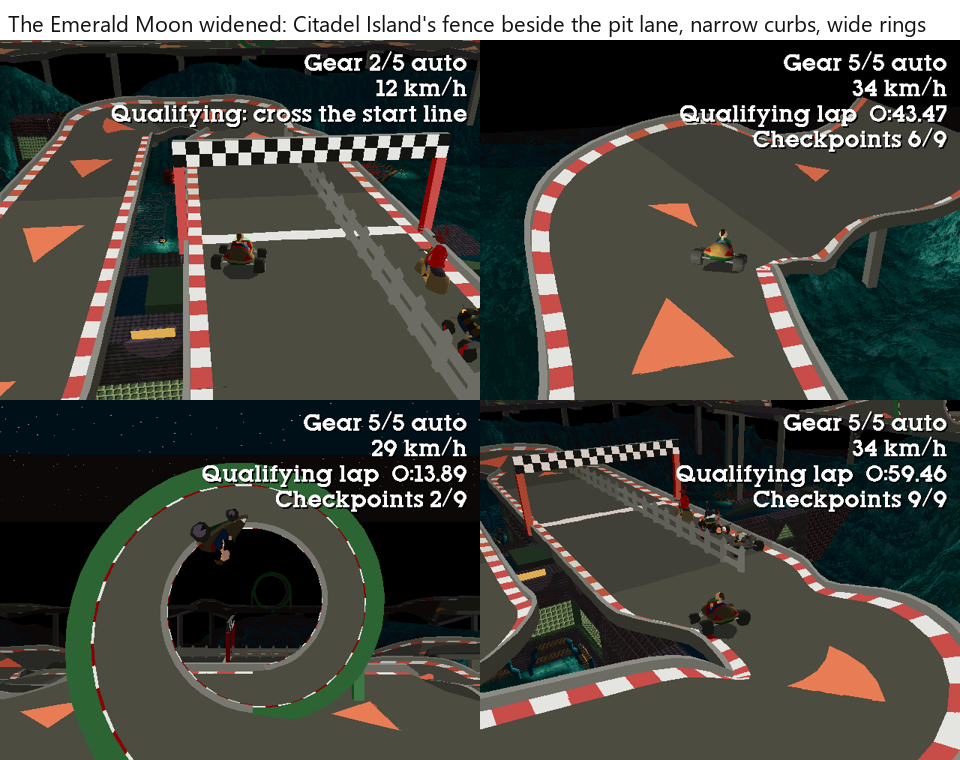
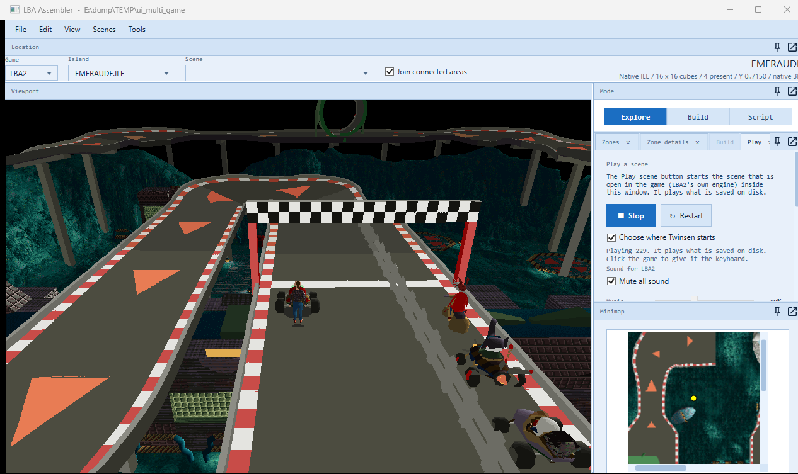

**The holes.** There were three causes:
- **The engine leaves out a polygon any point of which is behind the camera's near plane.** The road was one quad from rail to rail per cell, 17 cells across at its widest. Now the asphalt and the underside are strips, as many across as the widest asphalt needs, the same number for every piece of a road (`RaceTrackRaisedBody.StripsFor`). The rings' road and outsides are strips too. A ring is too many points for one body then (the engine takes 550 a body), so each ring is four quarter rings, a decor each at its foot.
- **The engine leaves out a whole decor whose middle is behind the camera** (`3DEXT/DECORS.CPP`): a piece of road whose middle had just passed under a close camera went whole. Now a decor whose box touches nothing (its top under its bottom, as only the race tracks' pieces have) is still drawn while any corner of its box is in front of the camera. The road pieces' boxes now cover their footprint, still touching nothing.
- **Pieces only meeting left a crack of a pixel between them**, the background through a dotted line across the road, because each body is projected on its own. Now each piece runs 24 units into the next, and each ring quarter into the next.

**Arrows.** The strips' points, the same on both sides of every joint, leave no room for an arrow cut into the asphalt; an arrow drawn over it flickered with it. An arrow is now the strips' own quads coloured, halved along their diagonals at its edges: a triangle 4 cells long, its base about the old arrow's width (2 strips either side on a wide deck).

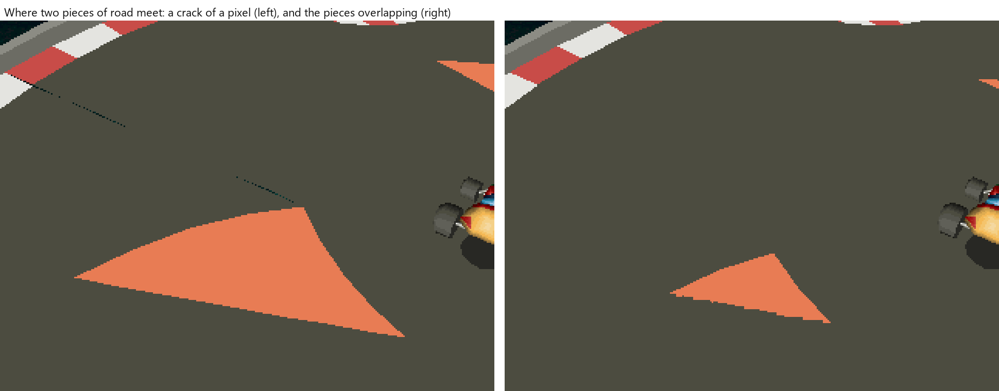

**Verified**:
- **The Emerald Moon** (`rt_emer`), the pilot and three opponents:
  - qualifying 61.52 s;
  - race laps 61.52 and 61.54 s, the opponents' 65.2–69.7 s;
  - the cut-out loop at full speed every lap, and every loop by every car.
- **The old moon:** qualifying 22.47 s, race laps 22.44 s.
- **The other tracks:** built again, the seven others' files are byte-identical but for the three raised roads' island and decor files (Celebration Island's two, the Elevator Platform's), whose road pieces are now strips. Their solo qualifying laps are unchanged (27.04, 41.86, 34.02 s), and the statue track was looked at too.
- **From the app**, on a sandbox folder: both moons built in the race track window. Play on the Emerald Moon shows the grid, the fence and the opponents in the pit lane, muted.
- **The body tool** (`tools/BodyPipeline`) builds again: it now leaves out `Scenes/SceneNuke.cs`, which needs the editor's own island code. It has a new `oblsheet <island .OBL> <palette> <out.png>` to look at an island's decor bodies, which is how Citadel's fence was found.

## The story and each track's drivers (2026-10-03)

The user's two notes, in the repository's folder (not committed):
- **StoryNotes.txt:** Zoe is sick of the rain and sends Twinsen to the Weather Wizard. The wizard would clear it from the top of the lighthouse, but Raph is too busy at the track and won't let him. Raph: beat my time and I'll come to the lighthouse. Mr. Paul runs the track and wants racing gloves. The aliens thank Twinsen for the rain: they'll build an even better race track, ready tomorrow. Twinsen has to go home and sleep (everyone tells him he looks tired) and uses his bed.
- **CharactersForTrack.txt:** who races each track.

Their follow-up: the story isn't fully worked out yet, so implement what can be.

### The drivers

`Terrain/RaceTrackDrivers.cs` (`RaceDriver`). A driver is one of the racer entity's car bodies (0 the retail racer, 1 Baldino's rocket car, 2-63 the character cars) or the motorbike. It has a racing line of its own, planned with its character (side of the road, top speed, cornering), and its skill a few points either side of the car setup's. An island's `Roster` replaces the racer, Baldino and the biker; an island with none keeps them.

| Track | Drivers |
|---|---|
| Citadel Island, storm track | Raph: his lap at the setup's skill less 6 is the time to beat (no car on the track) |
| Citadel Island, town circuit | Raph, Zoe, Mr. Paul, the Tralu, the thief |
| Desert island | Moya, the Dino-Fly, the Dean, the retail racer, Baldino |
| The Emerald Moon | Baldino in his lander (space suit), HAL |
| Mosquibees Island | the Queen, the monkey monster with the sword (war cart) |
| Otringal palace | (no track yet: Stan, the pighead with the broom, the two-headed monster) |
| the others | the retail racer, Baldino, the biker, as before |

- **The engine** races up to six opponents (`RACE_MAX_OPPONENTS`, keys `opponent2_` to `opponent6_`), and every grid has six spots.
- **The race car setup** lists the drivers of the track Play races, each with its own box, and one skill slider for all of them. This replaces the racer's, Baldino's and the biker's own boxes and sliders (`RaceCarSetup.LeftOut`).
- **RACETRACK.JSON** keeps the drivers as `Drivers`. A folder built before this still races its racer, Baldino and biker.

### The story

`Terrain/RaceTrackStory.cs` tells it through the game's own storm plot, which already has the lighthouse, the spell and the aliens:

| Game variable | Meaning |
|---|---|
| 51 | storm plot: 1 the wizard spoken to, 2 Raph spoken to, 3 Raph freed, 4 the storm over |
| 56 | the keeper: 3 back at the lighthouse |
| 70 | the aliens' landing done |
| 253 | chapter: 2 once the storm is over |
| 200-202 | new (variables no script uses): the day (1 tired, 2 slept), the town circuit won (1, 2 once paid), Raph's time beaten (1, 2 once Raph has said so) |

1. **Zoe** (scene 0, actor 4). She walks up to Twinsen as ever and says: "Twinsen, I am sick of all this rain! Go and find the Weather Wizard and get him to fix it!" She switches on the game's own arrow to his tent (holomap 21, which his script clears).
2. **The Weather Wizard** (scene 21). In place of "I can't find the keeper", he says the notes' line about Raph, and an arrow (222) points to the storm track's start line. Once Raph is back at the lighthouse he says to meet him there. Twinsen's own next line (he had seen the keeper held in a cave) is gone.
3. **At the start line** (scene 42, in the storm): Raph and Mr. Paul, copies of the game's own (Raph from the Tralu's cave, scene 2; Mr. Paul from his house, scene 7). They stand off the road and the pit lane, and both are gone once the storm is over.
   - Raph says the notes' line (variable 51 goes to 2, as talking to him in the cave did).
   - Mr. Paul: "Sorry Twinsen, for safety reasons you'll need some racing gloves to take part", or, with the gloves, to beat Raph's time.
   - The start line itself stays shut without gloves (`gate=`): crossing it says "Mr. Paul: racing gloves first!". The gloves are in the attic as before.
   - Raph is no longer held in the Tralu's cave, and Zoe no longer comes to fetch Twinsen there.

   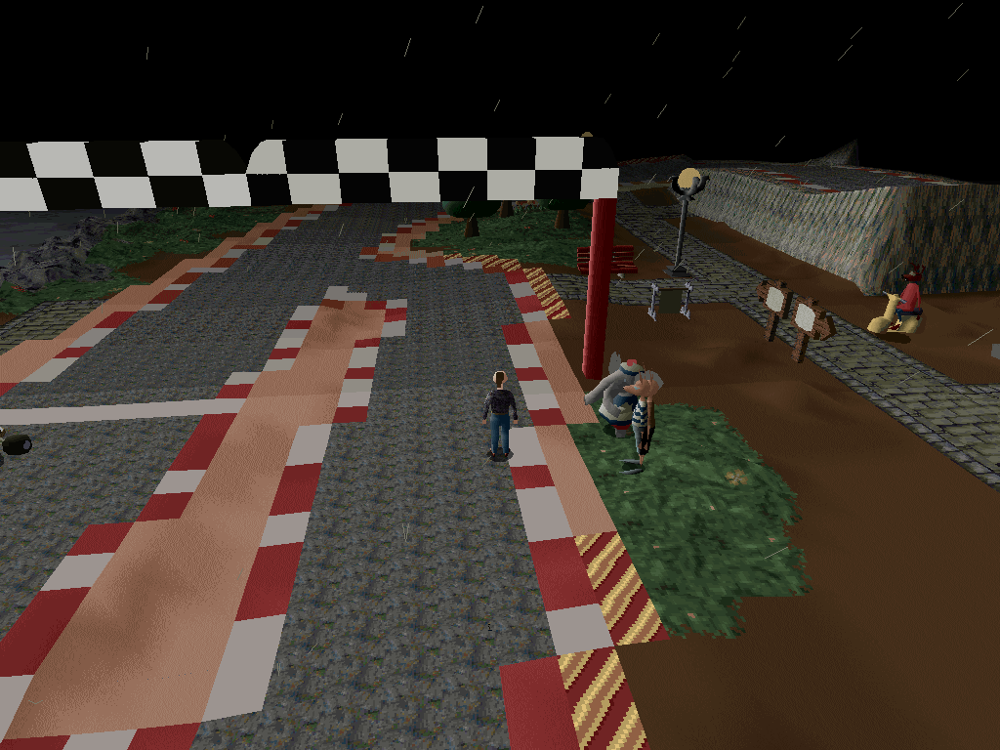
4. **Raph's time.** The display shows it ("Raph's time 0:33.90"), and a lap under it beats it (`beat=`). Raph says "You beat my time, Twinsen! A deal is a deal: I'm off to the lighthouse. Bring the Weather Wizard!" and goes. Variables 51 and 56 go to 3, as when he was freed in the game, so the game's own lighthouse scene follows: the wizard at the door, "We are ready, Master", the spell, chapter 2.
5. **The aliens.** The game then takes Twinsen to the tavern square (scene 42) in a cutscene that waits for an alien to speak. The island's actors who played it were taken off the road by the track's build (the cutscene would have waited forever). One alien, a copy of the game's own, now stands off the town circuit's road by Twinsen and says: "People from the planet Twinsun, we come to you in a spirit of peace. Thank you for clearing the rain which was preventing us from landing. As a thank you, we'll build you an even better race track. It should be ready tomorrow." That ends the cutscene, and variable 200 goes to 1.

   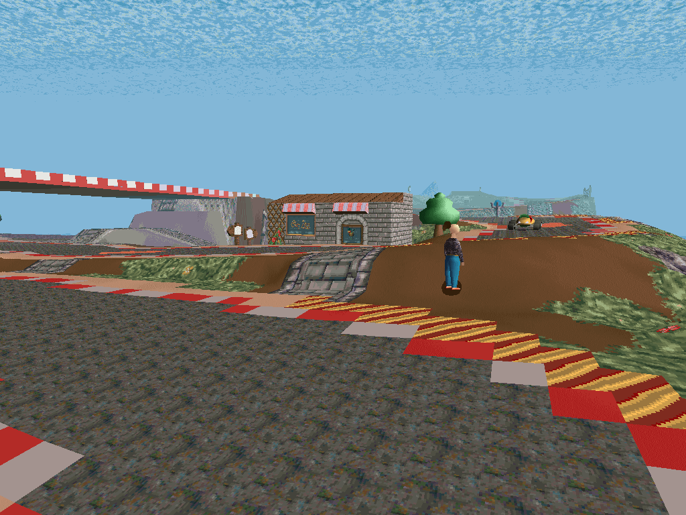
6. **Tired.** While variable 200 is 1, anyone Twinsen talks to on Citadel Island (anyone but Twinsen himself) says "You look tired, Twinsen. You should go home and have a nap." instead of their own line. The engine swaps the text (`tired=`; GERELIFE.CPP's four message opcodes ask `RaceMod_Dial`).
7. **The bed** (scene 0). It has a zone of its own (scenaric zone 5). Action there while tired: "What a day! A good night's sleep... Morning already! The aliens' new race track should be ready by now." Variable 200 goes to 2, and an arrow (223) points to the town circuit's start line.
8. **The town circuit.** It is shut until then ("The new track opens tomorrow"). Afterwards it races Raph, Zoe, Mr. Paul, the Tralu and the thief over three laps; the display shows "Lap 1/3" and, at the end, "Finished 1st of 6".
   - A win sets variable 201.
   - Once Twinsen is out of his car anywhere on the island, Mr. Paul says "Well raced, Twinsen! You've won the prize: a ferry ticket." and gives it (inventory slot 13: the game's own ticket, for its ferry to the Desert island).

   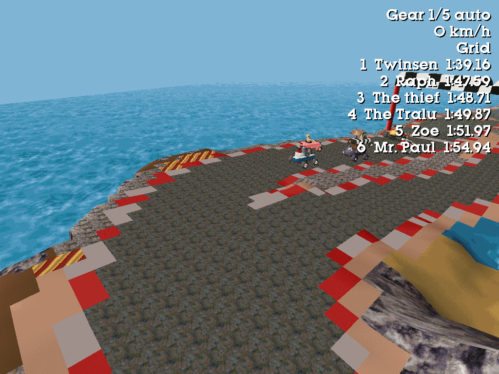
   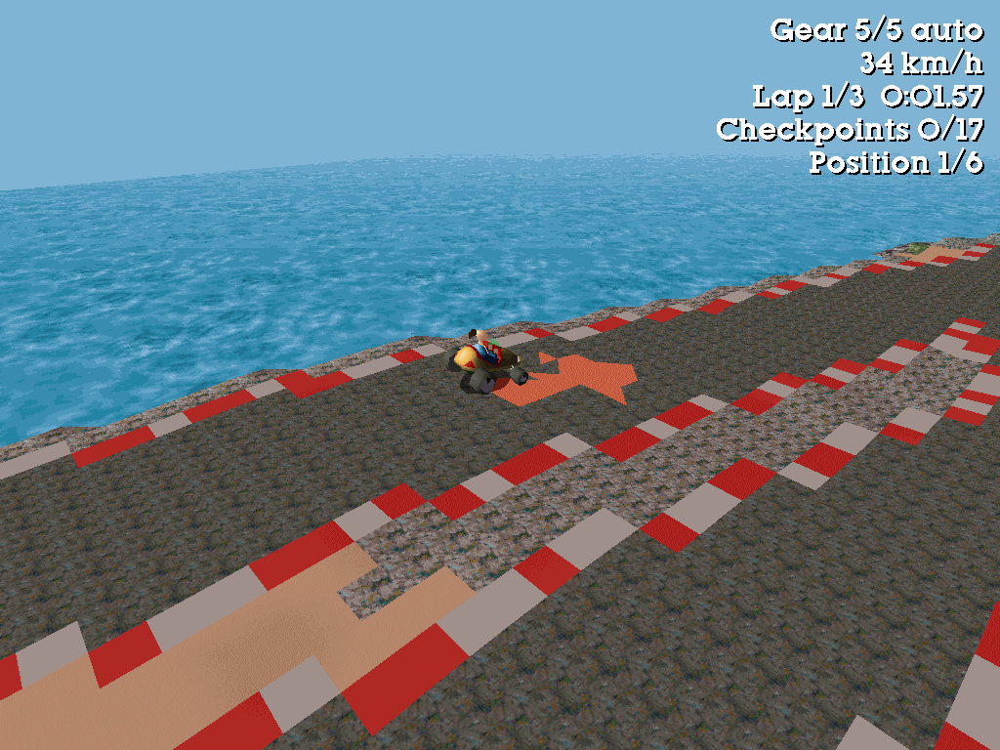

**The texts.** Eleven new lines at the end of Citadel Island's texts and two holomap labels, in all six languages, using the game's own names: the Mage Météo, the Wettermagier, the Mago Meteo, the Mago Metereologo, the Mago do Tempo. They are shown, not spoken (see the 2026-09-29 section). Zoe's race-track line of 2026-09-29 is replaced. The gloves stay as they were.

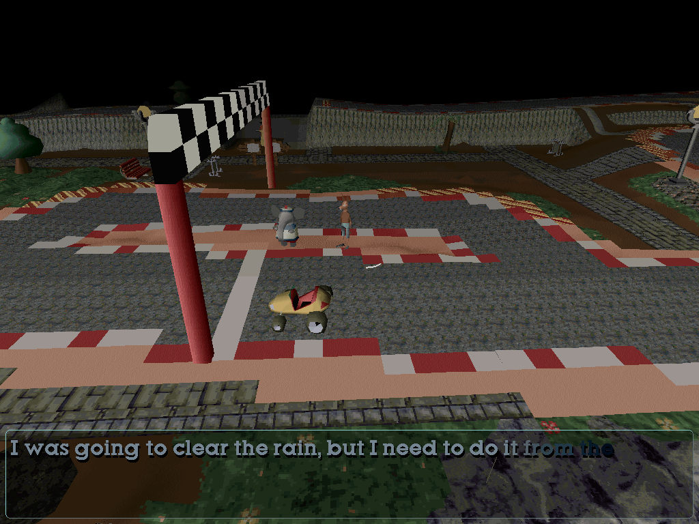

### Playing it

- **A track set.** The race-track mode used to load one track. A game played as a game now loads a set:
  - The car file Play writes holds the car and `track=<island> <when> <first scene> <last scene> <file>` lines, one per track. Each track's own file sits beside it.
  - When the game enters an island's outside scene, the engine loads the track raced there now (`RaceMod_Island`, EXTFUNC.CPP `InitGrilleExt`, before the island's file is chosen).
  - On Citadel Island that is the storm track while it rains (chapter below 2) and the town circuit once the storm is over; the weather is the game's own.
  - Celebration Island's two tracks go by the statue, and the moons' by their scenes. An island with no track keeps the car alone.
  - Everything one track set up is undone before the next loads (`ResetTrack`).
- **The new keys** (RACEMOD.CPP's description): `track=`, `gate=<var> <least> <text>`, `beat=<n> <var> <value>...`, `race_laps=`, `win=<var> <value>...`, `tired=<var> <value> <text>`.
- **The race car setup** has a new box: "Play the story from a new game".
  - Play then starts a new game, Twinsen in his house, every track raced where and when the game is. The engine's command harness starts it past the menu.
  - A Play that doesn't start on the start line is played the same way (the set, with the story's gates).
  - A race started on its line is that track alone, as before, with no gates. Its time to beat is still shown.

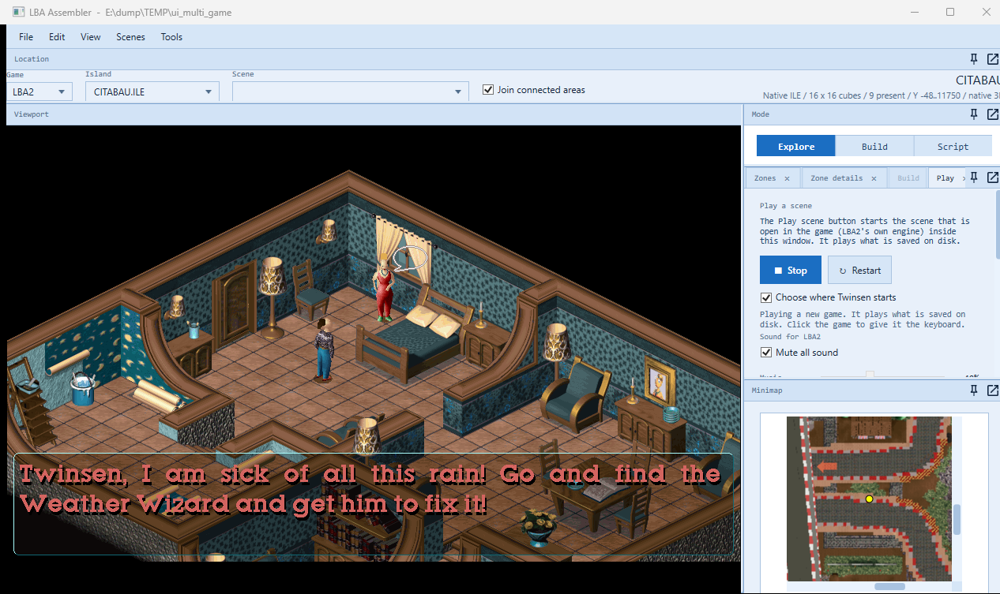

### Verified

All runs below were headless and muted, on a sandbox game folder built with the Desert island, Citadel Island, Mosquibees Island and the Emerald Moon (`E:\dump\TEMP\story`). The test pilot drove where there was driving.

**The story, step by step:**
- **A new game:** scene 0, chapter 1, Zoe's line. The engine loads the storm track for Citadel Island ("island 0 (storm): its track").
- **The storm track without gloves:** "start line crossed, but the race is closed: Mr. Paul: racing gloves first!".
- **With the gloves:** lap 1 in 28.44 s against Raph's 33.90 s. Variable 202 went to 1; then Raph's script set 51 = 3, 56 = 3 and 202 = 2.
- **The lighthouse:** with 51 and 56 at 3, Action by the wizard at the door ran the game's spell. That gave chapter 2 and scene 42, and the engine switched to the town circuit ("island 0 (fine weather)"). The alien's thanks set 70 = 1 and 200 = 1; Twinsen is back with his body and free to walk.
- **Tired:** the alien's second line came out as the tired line ("text 388 said as the tired line 1004").
- **The bed:** variable 200 went to 2, and arrow 223 is on.
- **The town circuit on day 1:** "the race is closed: The new track opens tomorrow".

**The town circuit on day 2,** with the setup's skill at 70 so the pilot would win:
- qualifying 99.17 s, a grid of six;
- laps 98.48, 98.42 and 99.06 s, the opponents' 133-140 s;
- "race over after 3 laps: 1st of 6" set variable 201.
- Out of the car, Mr. Paul's ticket: 201 went to 2 and 13 to 1.
- At the normal skill the opponents' qualifying laps were 107.6-115.0 s.

**The other tracks,** raced alone as Play's start on the line does:
- **Desert island:** qualifying 132.04 s (unchanged), the race with Moya, the Dino-Fly, the Dean, the racer and Baldino.
- **Mosquibees Island:** 47.87 s, with the Queen and the monkey monster.
- **The Emerald Moon:** 61.29 s, with Baldino's lander.
- **The old moon** (no line-up: the racer, Baldino and the biker): 22.47 s, unchanged.

**From the app** (sandbox settings):
- Desert and Citadel built from the race track window.
- The race car setup shows the town circuit's five drivers and the new box.
- Play started a new game in the editor's window, Zoe saying her new line.

**Not done** (the notes leave these open):
- Otringal's palace has no track, so its drivers aren't raced yet, and the two-headed monster (BODY.HQR 259) has no car.
- What the ferry ticket leads to beyond the game's own ferry is for the story to say.
- Mr. Paul is "in charge of the track": in the game Raph is the lighthouse keeper (Mr. Paul's house is scene 7), and the story reads right that way.
- Zoe ("Zoe?" in the notes) races on the town circuit, and can be left out in the setup.

### Celebration Island's drivers, the one to beat, and power-ups (2026-10-03, later)

The user asked for three things:
- On the lava lake (CELEBRAT), the drivers a kangaroo, the souvenir seller Twinsen talks to, and a policeman. Twinsen has to beat the seller to get the information he needs to progress.
- On each track, random speeds for the opponents, except the main one Twinsen has to beat, who should be beatable but a slight challenge.
- The power-ups of powerupNotes.txt, hidden in the game's small brown mushrooms until a car drives over them.

**The lava lake's drivers.** They are three new cars of the racer's entity (`Terrain/RaceTrackCharacterCars.Celebration.cs`):

| Body | Driver | Car |
|---|---|---|
| 60 | a kangaroo (BODY.HQR 308, a tourist with a camera) | a khaki safari car with a roll bar, the camera on the bonnet, a spring under its tail and the kangaroo's own tail off the back |
| 61 | the souvenir seller (BODY.HQR 307: the Franco who came back from Island CX, his head still bandaged) | a stall on wheels, a red and white striped awning over little Dark Monks for sale, and a price tag |
| 62 | a policeman (BODY.HQR 80: one of the island's Franco guards, green helmet and spear) | a green and white car with a red light, the spear's blade on its nose |

The seller's case and its straps are left out of the seated driver: a car takes the engine's 30 bones at most.

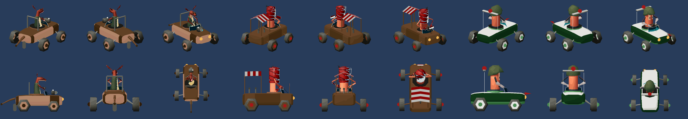
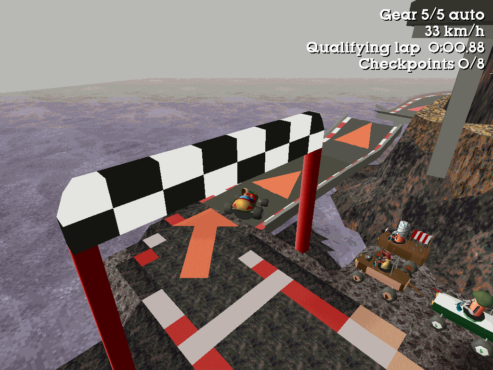

**The one to beat** (`RaceDriver.Main`):

| Track | The one to beat |
|---|---|
| Citadel storm track | Raph (his time) |
| Citadel town circuit | Mr. Paul |
| Desert island | the retail racer |
| The Emerald Moon | Baldino |
| Mosquibees Island | the Queen |
| Celebration lava lake | the souvenir seller |
| the others | the racer |

- **His skill** is a setting of its own: the race car setup's "The one to beat's skill", 86 % by default. At 92 % the test pilot, a better driver than most, lost the lava lake to the seller by half a second.
- **The others' skills** are drawn at random each time the track loads, 14 under to 12 over his (`opponent_pace=<lo> <hi>`).
- **The display** says "Ahead of …" or "Behind …" him through the race.
- **A race's result** (the town circuit's ferry ticket, the seller's information) is finishing ahead of him (`main=`), not first. The end says "You beat the souvenir seller!" or "The souvenir seller beat you".

**The souvenir seller's information.** In the game he is scene 95's actor 5 (entity 213). Asked what he saw on Island CX and how to get there, he tells of the fortress and of Rick's gang at the bar by Otringal's harbour (texts 171 and 172, Rick's holomap arrow 136, variable 124).
1. Until Twinsen has beaten him, after "What did you see over there?" he says: "That'll cost you more than a statuette, mister. Race me round the lava lake, and if you beat me I'll tell you everything." He takes Twinsen to the lava lake's race scene (223), on the grid by the buggy.
2. Three laps follow (story only), against him, the kangaroo and the policeman.
3. Out of his car after the race, Twinsen hears one of two things:
   - won: "You beat me fair and square, mister! A deal's a deal: here's what I saw on Island CX." The game's own information follows, with its arrow and variable.
   - lost: "Ha! Not fast enough, mister. Come and find me at my stall when you want a rematch."
4. Either way he is back in scene 95, by the dock.

New variables: 203 (seller beaten; 2 once told), 204 (his race run). The three lines are in all six languages.

- **The seller stays on the island.** The statue track's build took everyone off scene 95, the seller too. Now the people the story needs stay where the game has them (`RaceTrackIsland.StoryEntities`). He isn't moved out of the statue track's way either: he only exists before the statue rises, and moved, he stood in the lava.
- **A race over and come back to** is a race afresh (`RaceMod_Island`): a lost challenge can be raced again.

**Power-ups** (RACEMOD.CPP, `powerups=`).

*The mushrooms.* The game's small brown mushroom (entity 112, BODY.HQR 171; Citadel Island's by the weather wizard's tent, scene 45) is copied onto every track's road every 40 cells from 30 after the start line (`RaceTrackScenes.MushroomSpots`).
- Each sits a little left of, right of or on the middle of the road, and never on or near a jump, a loop or a carried jump.
- Any car that comes within 1,000 units of one takes it, and it grows back 15 s later.
- Its box is made a point, and the reach is longer than a car's own box: the engine stops a car at any object's box (CheckObjCol), and the first test pilot sat jammed against one.

*The seven power-ups,* from powerupNotes.txt, chosen at random by weight:

| Power-up | Weight | What it does |
|---|---|---|
| Gazogem fuel | 24 | a boost: the car's top speed and pull × 1.5 for 4 s |
| Protection spell | 12 | 30 s in which no mine, penguin or lightning hurts the car |
| Lightning spell | 12 | the other cars shrunk and slowed (× 0.7) for 20 s |
| Clover | 8 | life and magic full |
| Health | 16 | a quarter of the life back |
| Nitro penguin | 16 | dropped behind the car; 2 s later it goes off (the land mines' blast) and stops every car within 4 cells for 1.5 s |
| Super jet-pack | 12 | the game drives for 10 s, faster (× 1.35): the test pilot's steering, the player's keys left out |
| Oil (since the same evening) | 14 | dropped behind the car: a slick on the road until a car drives over it, and that car skids for 2 s |

- **Opponents take them too:** a boost, a penguin dropped, or Twinsen shrunk (unless protected).
- **The shrunk cars:** the engine can't scale a body as it draws it, so every car of the racer's entity gets a copy at half its size as its body 100 + its own (`Terrain/RaceTrackSmallCars.cs`). The copy is the body's own bytes with its points, spheres and bounding box halved. The engine switches a shrunk opponent to it (`opponent_small=`).
- **The penguin seen** is the shop's nitro penguin (scene 14, entity 46): a copy of it waits out of sight in each scene and stands where the newest one was dropped.
- **The display** shows what is on and for how long ("Protected 27").
- **The setting:** the race car setup's "Power-ups in the mushrooms along the track", on by default. A test key, `powerup_only=<n>`, puts one power-up in every mushroom.

**Oil, from the user the same evening** ("we may need to create an object for this").

*The slick* (`Terrain/RaceTrackOil.cs`) is a new body:
- a black puddle two cells across, irregular round its edge, with an oily blue and violet sheen on it, drawn flat (no light);
- made the mushroom's entity's body 1 (entity 112, whose body 0 is the mushroom: a fixed object of one bone, as the slick is), so a slick is a copy of the mushroom's actor with another body;
- three copies in each scene, out of sight until oil is dropped. The race-track mode keeps up to six slicks on the lap and shows a scene's with its copies, 20 units over the road.
- *A bug on the way:* its triangles were first wound facing down, and the engine left them out, seen from above.

*The skid:*
- **Twinsen's car:** for 2 s his keys are left out (as the jet-pack does), the car turns round three times as quickly as it steers, and slows only a third as fast, so it slides on, spinning (`RaceMod_SkidSteer`, `RaceMod_SkidCoast` in BUGGY.CPP's RaceSpeed).
- **An opponent's car:** it turns round one and a half times as it slows to under half its pace.
- **Who:** an opponent that takes oil drops it behind itself. The protection spell keeps Twinsen's car off a slick.

*Verified* (Mosquibees Island, every mushroom oil):
- Twinsen dropped a slick, and reversed back over it: he skidded, his heading swinging through a full turn in under a second.
- In the race, the Queen and the monkey monster skidded on his slicks, three and one times in a lap.

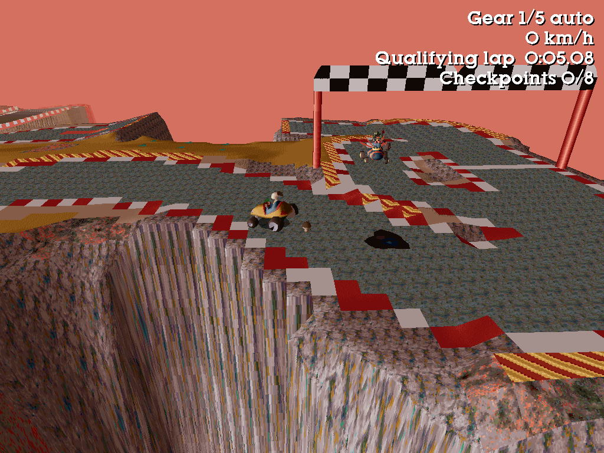

**Oil, penguins and a key to drop them** (the user, the same evening):
- **Slicks last until a car drives over one,** and that car takes it with it. With no time limit, the oldest of six goes when a seventh is dropped.
- **Twinsen holds the oil or a penguin** until he drops it with Shift (either). The display says "Oil: Shift drops it".
  - The left Shift is the game's inventory key. While he holds something, and until the key is let go after a drop, the race-track mode keeps it from opening the inventory (`RaceMod_BlocksInventory`, PERSO.CPP's input).
  - The test pilot drops what it holds a second on (`autodrop_ms=`, 0: never).
  - Opponents still drop theirs at once.
- **A penguin dropped walks the track** (`penguin_mode=walk`, the default):
  - It walks at about a cell a second along the first opponent's racing line, this way or that, wandering up to a cell and a half to either side, turning now and then. With no line, it wanders round where it was dropped.
  - From a second after it is dropped, it goes off when any car comes within two cells.
  - Three penguin copies wait in each scene, so several can walk in one at once.
- **The setting** "Penguins walk the track until a car comes near", on by default. Off: a penguin goes off a second after it is dropped (`penguin_mode=fuse`).
- **Verified** (Mosquibees Island):
  - Holding oil, two presses of Shift (scancode 225 held from the console) dropped it twice, and the race went on with no inventory opened.
  - Walking penguins moved about 450 units a second and turned round now and then; after the start both opponents walked into some and were blown up and stopped.
  - On the fuse, each penguin went off within the second after it was dropped.

**Later the same day, two changes from the user:**
- **The lightning spell fills Twinsen's magic.** The game's own lightning spell takes all of his magic, so picking it up now fills it too, as a clover does (magic level × 20). It also shows the game's own lightning flash (INCRUST_ECLAIR, 0.7 s). With no magic level yet (the start of a game) there is nothing to fill.
- **No one dies in a race** (`RaceMod_NoHarm`: the race-track mode is on and Twinsen is driving).
  - *Penguins.* A car a penguin blows up stops with the hit reaction a land mine gives Twinsen's car: for his, the game's own `HitObj` (the hit animation, the stars, the car stopped, no life lost, as `RaceMod_CarHit` already made it for the mines). An opponent's car plays its own hit animation (the racer entity has one: its generic 6) under the stars, and its driving animation waits until it is over.
  - *Falls.* A fall long enough to kill Twinsen (16 bricks: OBJECT.CPP's "trop haut mort directe") or to hurt him (8) now stops his car a moment, as a mine does, with the landing animation and no life lost.
  - *Lightning strikes.* A strike stops his car with the stars instead of killing him (FoudroieObj).
  - *Already safe:* the sea and the lava put the car back on the road (`RaceMod_Rescue`), and the opponents are never hurt (NO_CHOC).
- **Verified** (Mosquibees Island, every mushroom a penguin):
  - Both opponents were blown up and stopped with their hit animation.
  - Braked and reversed back over his own penguin, Twinsen's car played generic animation 22 (the second of the game's two hit animations) and stopped, his life still 200.
  - The lightning pickup logs the magic filled.

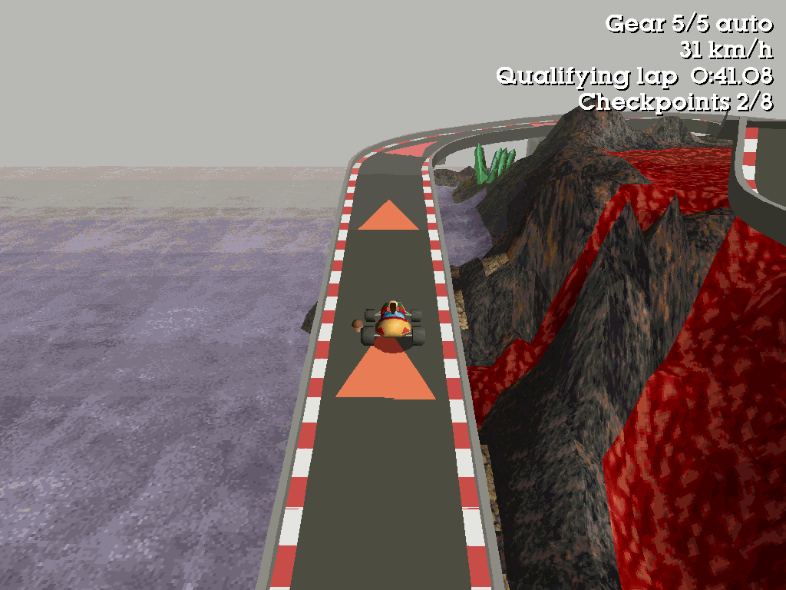
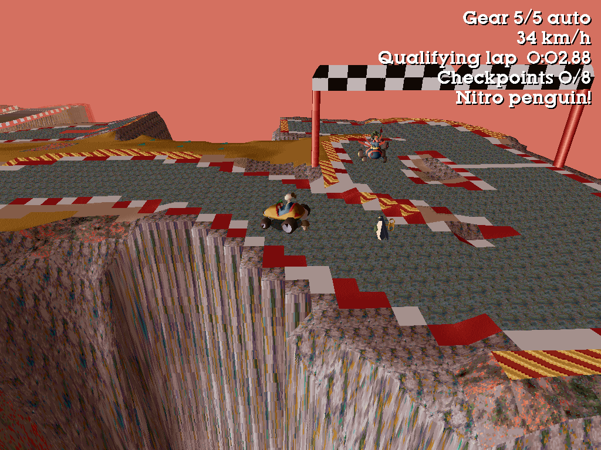

**Verified** (headless, muted, `E:\dump\TEMP\story`, the test pilot driving):

*The souvenir seller:*
- Talking to him in scene 95 took Twinsen to scene 223, where the engine loaded the lava lake.
- **Lost** (one-to-beat skill 92): "3rd of 4, behind the main opponent". Out of the car, the rematch line; back in scene 95 with variable 203 at 0.
- **Won** (skill 86): qualifying 27.23 s; laps 27.22, 26.80 and 26.80 s against the seller's 28.1-29.6 s; "1st of 4, ahead of the main opponent". Out of the car: variable 203 = 2, 124 = 1, Rick's arrow on, back in scene 95.

*Each power-up* (one at a time with `powerup_only`):
- **Clover:** life 200 to 255.
- **Lightning:** the opponents' cars switched to their half-size bodies.
- **Jet-pack:** with the pilot switched off just after the pickup, the car drove on through three cubes.
- **Penguin:** dropped behind the car, it went off 2 s later.
- **In the random mix:** Gazogem fuel's lap 26.80 s against 27.22 s; the kangaroo took penguins, jet-packs, protection and health.

*The other tracks*, with mushrooms on and no car jammed:
- Desert: qualifying 132.23 s (132.04 before).
- The Emerald Moon: 61.29 s.
- Mosquibees Island: laps complete.

*From the app:* the race car setup shows the one to beat's skill (86 %), the random range and the power-ups box, and Play starts.

### The item box, rows of mushrooms, a lighter display (2026-10-03, night)

The user's asks:
- The jet-pack froze Twinsen in place when he raced no opponents.
- Pickups go in an item box in the top left corner, with the retail game's spinning item display, and Twinsen can hold a second item, with a key to choose between them.
- The display was too much: drop it, drop the checkpoints totally, put the speed and gear bottom right and the lap time bottom left.
- Rows of two or three mushrooms side by side, depending on the road's width, and a pseudo-random pick shown as an animation, the more powerful items for the cars further behind.
- The game's own protection spell animation while Twinsen is protected.

**The jet-pack freeze.**
- *The cause:* the jet-pack drives by the first opponent's racing line, and the player's keys are left out while it lasts (`RaceMod_Takeover`). With no opponent raced the car file had no line at all, so the jet-pack gave no keys back and the car stood still until it ran out.
- *The guide line:* when no opponent is raced, the car file now carries the one to beat's line all the same (`guide_path=`, `guide_top=`, `guide_grip=`; `RaceCarEngineFile.Guide`, written as `raceguide.txt`). Everything that follows a line uses it: the jet-pack, the walking penguins, the laps, and the "back on the road" rescue, which also had nothing to go by with no opponents.
- *With no line anywhere* (an old car file), the jet-pack is only a boost and the keys stay the player's.

**The item box** (`RaceMod_Draw`, `ItemBox`):
- *Two slots, top left,* each the retail found-object display (OBJECT.CPP's INCRUST_OBJ): black in the game's own frame, the item's OBJFIX model turning about once a second. They are 1/8 of the screen's height across (60 pixels at least, the retail size). The selected slot is ringed in the palette's gold (244).
- *The models* are the inventory's own:

  | Power-up | Shown as |
  |---|---|
  | Gazogem fuel | OBJFIX 15, the Gazogem can |
  | Protection spell | 39, the spell's ring of beads |
  | Lightning spell | 19, the lightning ring |
  | Clover | 60, the clover |
  | Nitro penguin | 14, the meca-penguin |
  | Super jet-pack | 48, the protopack's second look |
  | Health | the heart sprite of the game's bonuses (a sprite, not a model), beating |
  | Oil | a new model: a blue oil drum with two grey hoops, its lid and bung, a black drop over it (`RaceTrackOil.BuildIcon`), appended to OBJFIX.HQR by the build (`oil_icon=`) |

- *Lit as the inventory lights them:* the light is set with the camera level (`SetAngleCamera(0,0,0)`), not with the scene's camera as the found-object display does. The box is drawn without the outside's fog filler and depth buffer, with the colour table of things near (`SetCLUT(PalLevel)`; outside, the fog is the colour table of each object's distance, and the box would have the last object's). The protection spell's beads and the clover are dark in the retail inventory too.
- *The roulette:* an item taken goes into the first free slot and the items go by in it, slowing down over 1.5 s to the one drawn, which can't be used until it stops.
- *Keys:* Shift uses the selected item (the other slot's if that one is empty), and Q selects the other slot. Every item is held now, not only oil and penguins, so while Twinsen has one, Shift doesn't open the inventory. With both slots full the mushrooms still give way to the car, empty. The test pilot uses each item `autodrop_ms` after its roulette stops (default 1 s, 0 never).

**Who draws what** (`RandomPowerUp`, `BackShare`):
- Each power-up has a strength:
  - weak: the clover, health, oil
  - middling: Gazogem fuel, the protection spell, the nitro penguin
  - strong: the lightning spell, the super jet-pack
- Each weight is multiplied by a factor running from the leader to the last car:

  | Strength | The leader | The last car |
  |---|---|---|
  | weak | × 1.6 | × 0.4 |
  | middling | × 1.0 | × 1.2 |
  | strong | × 0.05 | × 2.4 |

- Opponents draw by their own place.
- Outside a race (qualifying, alone, before GO) the plain weights.
- A car takes one item from a row: the others it passes in the next 0.7 s give way, empty.

**The rows** (`RaceTrackScenes.MushroomRow`): every 40 cells as before, now a row across the road.
- Three mushrooms where the road is 6 cells wide or more (the default asphalt, 7 wide, has three), two where it is 3.8 or more, else one; each row keeps a cell from the road's edges.
- They are 2.4 cells apart, more than the 2 cells a car's middle takes one from, so a car down the middle of one takes only that one.
- On a raised road the width is its own, rail to rail.
- A scene keeps room for its penguins and slicks under the engine's 100 actors, and a row that doesn't fit is shorter.
- Engine limit: 512 mushrooms a lap (was 128).
- Desert island has 93 now, the Citadel town circuit 75, Mosquibees Island 33.

**The protection spell's animation** is the game's own: the power-up casts `ToggleSortProtection`, the 16 orbiting sprites and the hum.
- The spell takes magic as it lasts, and ends when the magic runs out. While it is the power-up's, EXTRA.CPP takes none (`RaceMod_ProtectionFree`), and the sprites blink for its last 3 s (`RaceMod_ProtectionEnding`).
- It goes off after its 30 s, or when a new track loads.
- A spell Twinsen cast himself is left alone.

**The display:** bottom right the gear and the speed; bottom left the lap and its time. On Raph's storm track that line adds his time to beat. Before the start it shows the start line's text or the story's gate, and after the race the place. Everything else is gone: position, ahead of or behind the one to beat, last/best laps, the grid list, power-up timers, messages. The count-down stays.

**No checkpoints.**
- The build still finds them, but the car file no longer has them, and the engine reads none.
- A lap counts when the car crosses the start line after being halfway round the line it follows: a third to two thirds along the line, the first opponent's or the guide. So backing over the line and driving on again is no lap.
- With no line at all, any crossing the right way counts.
- At the line itself, the line's nearest point can be either end of it. Once the car has been halfway round, a point near the start reads as the lap's end (`PlayerProgress`).

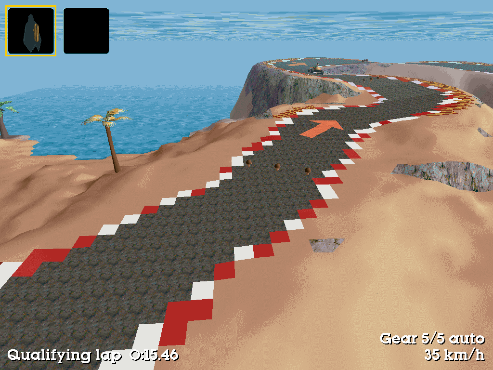
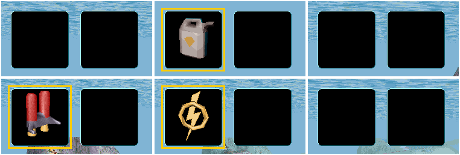
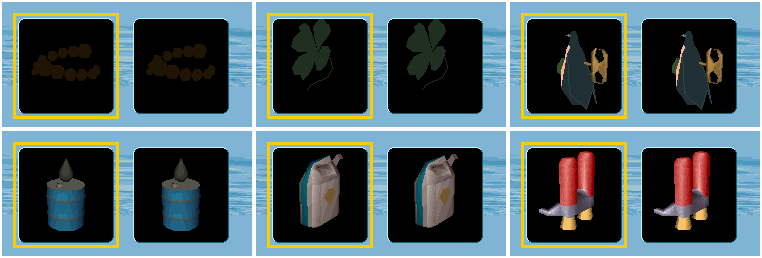
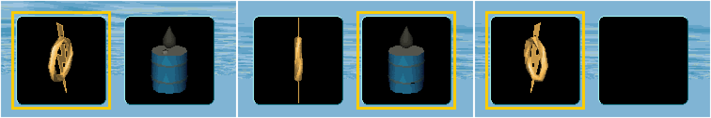
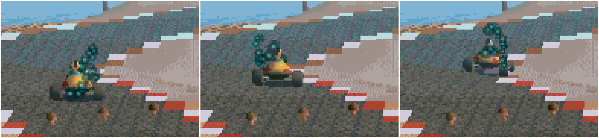

**Verified** (headless, muted, `E:\dump\TEMP\story`, rebuilt with `buildtogether`):
- *No opponents, the jet-pack in every mushroom:*
  - With the guide line, the pilot drove on through every jet-pack.
  - With no line at all and no pilot (up held, Shift pressed from the console), "Super jet-pack! (no line: a boost, the keys his)" and the car went on at 46 km/h under the player's own keys.
  - Before, the car stood still until the jet-pack ran out.
- *Two slots:* lightning in slot 1 and oil in slot 2; Q selected slot 2, Shift dropped the oil, and the selection went back to the lightning.
- *Each item's picture* is as in the screenshots above.
- *The protection spell:* its 16 sprites orbit the car for the 30 s.
- *Laps without checkpoints:*
  - The lava lake: qualifying 27.20 s, race lap 1 27.62 s.
  - Mosquibees Island: qualifying 46.72 s, race lap 50.11 s.
  - The Emerald Moon (loops, the carried jump): 60.87 s (61.29 s before).
  - Celebration Island's raised road: 40.67 s.
- *The draw by place:* in the Mosquibees race the leader drew Gazogem, oil, penguins, clovers, protection and health; the opponents took 15 mushrooms.

### Opponents in sight over cube edges, no health or clovers, penguins that go off at what they hit (2026-10-03, night)

The user's report from a test lap on Desert island:
- The opponents kept going invisible and coming back. They should always be visible.
- Health and clovers are meaningless as pickups in a race.
- Twinsen drove into a penguin standing on the track and it didn't explode. Penguins should blow up when they hit something.

**The opponents vanishing.**
- *The cause:* the engine keeps every object of a scene inside its cube (EXTFUNC.CPP DoAnimExt, half a cell from each edge). An opponent's car placed in the next cube stood on the edge itself, a wall Twinsen's car stopped at. That was the old moon's grid and Desert's checkpoint-7 stall.
- *The earlier fix* (2026-10-03, "Driving the loops") hid such a car instead. On a lap that crosses cube edges as often as Desert's, the cars just ahead vanished at every edge until Twinsen's car crossed it too.
- *Now:* the cars the race-track mode places this frame are let out of the cube (`RaceMod_FreeOfCube`). They stand where they are on the lap, over the edge too, in sight and in their true place, so they make no wall.
- They have no shadow and no ground or wall checks of their own (flags 0x1A1000: NO_SHADOW, NO_CHOC, NO_PRE_CLIP, OBJ_ZBUFFER), so nothing about them reads past the cube's map.

**Health and clovers** are no longer power-ups. No one dies in a race, so they did nothing.
- The six left, with their weights and strengths:

  | Power-up | Weight | Strength |
  |---|---|---|
  | Gazogem fuel | 24 | weak |
  | protection spell | 12 | middling |
  | lightning spell | 12 | strong |
  | nitro penguin | 16 | middling |
  | super jet-pack | 12 | strong |
  | oil | 14 | weak |

- Gazogem fuel moved from middling to weak, so the leader still has something besides oil.
- `powerup_only=` numbers changed: 0 Gazogem, 1 protection, 2 lightning, 3 penguin, 4 jet-pack, 5 oil.

**Penguins that go off at what they hit** (`PenguinHits`).
- *The cause:* a walking penguin could go off only a second after it was dropped, for every car. The second was meant for the car that dropped it, to get away. But a car right behind the one that dropped it reached it inside that second and drove through it.
- *Now that second is the dropper's alone* (`T_RACE_PENGUIN.Dropper`). Any other car's middle within 1,100 units sets it off at once.
- It also goes off at:
  - another penguin within 500 units (both go off);
  - a mushroom standing on the road within 500 (the mushroom is taken, and grows back);
  - a wall: the ground where it stands more than 512 units higher than the penguin. With no line, a penguin now walks on the ground up and down slopes, so only a real step counts.
- On the fuse (`penguin_mode=fuse`) it goes off at what it runs into too, or when its second is out.
- The log says what it ran into.

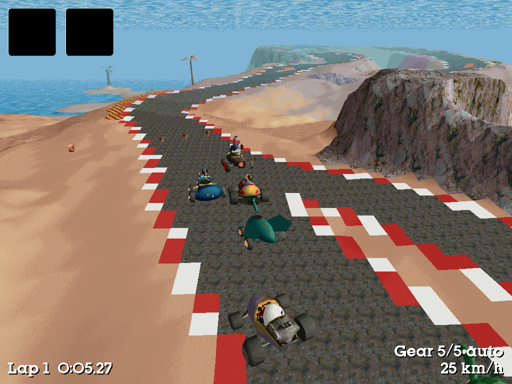

**Verified** (headless, muted):
- *Desert, the opponents faster (skill 115), no qualifying:* six times a car stood in the next cube within 20 cells of Twinsen's, and the engine drew every one (its WAS_DRAWN flag; the field ahead is in the screenshots).
- *Desert, qualifying with the opponents waiting in the pit lane:* 132.14 s (132.04 s before), with no wall at any cube edge.
- *Mosquibees Island, every mushroom a penguin, the opponents faster:*
  - Penguins the Queen dropped blew up the monkey monster right behind her, four times.
  - One she dropped ran into Twinsen's car: "Twinsen's car blown up by a penguin: stopped".

### Checkpoints at the corners, two jet-packs, oil and penguins to the front (2026-10-03, night)

The user's asks:
- *Checkpoints.* "Remove checkpoints" had meant the display's text, not the checkpoints themselves. Bring them back, one in the middle of every corner, for now drawn as a solid red line (to be made unseen later). Each should reach a little past the road's edge: a car half off the road still counts. The aim is to stop cutting the track on purpose without penalising a car on the edge, overtaking.
- *The super jet-pack* doubles the car's speed while the game drives, and goes to the cars at the back of the pack. A plain jet-pack does the same at one and a half times.
- *Oil and penguins* are more common the nearer a car is to the front.

Then four reports from the user's play:
- On Ascence, Twinsen's car sank through the deck, only part of him showing (the protection spell on).
- A protected car hit an oil slick as if it were a wall.
- The automatic gearbox stuck in first gear for no clear reason.

**The checkpoints** (`RaceTrackBuilder.PlaceCheckpoints`, RACEMOD.CPP).
- *Where they go:* a corner is a stretch of the lap bending one way tighter than a 40-cell radius, its bend smoothed over 3 cells, through 0.5 rad (29°) at the least. Two such stretches 8 cells apart or less are one corner. Its line goes where the corner has turned half its turn. A corner of more than a half circle gets a line in the middle of each half circle.
- *Where they don't:* clear of the pit lane's stretch, the jumps, the carried jumps, the loops, the crossings and the cubes' edges, as before. In the corner, the line goes as near its middle as is clear.
- *How far they reach:* 2 cells past the road's edge on both sides (its curbs, 4.5 cells from the middle by default, or a raised road's rail). Where another part of the lap comes near, a line stops short, but never inside the road's edge. The engine counts exactly that line (no slack past its ends).
- *How many:*

  | Track | Checkpoints |
  |---|---|
  | Desert island | 22, of 26 corners |
  | Citadel Island's two tracks | 5 and 15 |
  | Mosquibees Island | 8 of 9 |
  | The Emerald Moon | 12 |
  | Celebration Island | 9 |
  | the lava lake | 5 |
  | the Elevator Platform | 8 |

- *The rule:* a lap counts once they have all been crossed, in order. A track with none counts a lap halfway round, as since the item box.
- *The red lines* (`checkpoint_lines=1`; the race car setup's "Show the checkpoints as red lines across the road (for testing)", on): the engine follows each line of this cube along the ground (or a raised road's deck), and draws it 1/128 of the screen's height thick over the scene.
- *The display* still says nothing about them. A lap with a checkpoint missed doesn't count, and the log says which.

**The jet-packs** (`PU_SUPERJET`, `PU_JETPACK`):

| | Speed while the game drives | Item box shows | Who gets it |
|---|---|---|---|
| Super jet-pack | × 2 | OBJFIX 48 | the back of the pack |
| Jet-pack | × 1.5 | OBJFIX 12, the protopack | the back half |

- *The car's top speed and pull* scale by the factor, and so does the speed the game drives the line at. On the level the car also steers as much quicker over its top gear's speed (BUGGY.CPP, as it already did on a rollercoaster's slopes), so it takes the line's bends at twice the speed.
- *The look-ahead:* the test pilot's look-ahead grows only over the jet-pack's own top speed. Grown with the car's speed, it cut inside the corners' checkpoints and into a wall on Mosquibees Island.
- *Measured:* 9,672 and 7,254 units a second against the top gear's 4,836.
- *Opponents* that take one go at their pace times its factor for 10 s.

**Who draws what** (`s_puLead`, `s_puLast`: each weight's factor for the leader and for the last car; between them by place):

| Power-up | Weight | Leader | Last |
|---|---|---|---|
| Gazogem | 20 | 1.0 | 1.0 |
| protection | 12 | 0.8 | 1.2 |
| lightning | 10 | 0.05 | 2.0 |
| penguin | 16 | 1.8 | 0.4 |
| super jet-pack | 8 | 0 | 2.5 |
| jet-pack | 12 | 0.3 | 1.6 |
| oil | 16 | 2.0 | 0.4 |

- *The leader* draws oil or a penguin about two times in three.
- *The last car* draws a jet-pack or lightning more than half the time (56 %).
- `powerup_only=` takes several now, one at random: 0 Gazogem, 1 protection, 2 lightning, 3 penguin, 4 super jet-pack, 5 jet-pack, 6 oil.

**The oil slick a protected car hit.**
- *The cause:* the engine stops a car at any object's box (OBJECT.CPP CheckObjCol), and the race's props had boxes made only points across. A mushroom has to vanish before a car's box reaches it. But a slick a protected car drives over stays on the road for the next car, and was a post in its way.
- *Now* this scene's mushrooms, penguins and slicks are left out of CheckObjCol (`RaceMod_NoCollide`, a per-scene table).
- *Verified* on Mosquibees Island, protected the whole race with every mushroom oil: Twinsen drove over the Queen's slicks 14 times, never stopped, with a normal lap (47.71 s); the monkey monster skidded on them 11 times.

**Twinsen sunk into Ascence's deck.** The props' boxes were not the cause (left out of a car's way all the same); the item box was. See the next section.

**First gear.**
- *The cause:* the automatic gearbox changes up at the gear's top speed. Shrunk by an opponent's lightning (× 0.7 for 20 s), a car slowed to first gear never reached first gear's top, so it stayed in first. Since the item box, nothing on screen says the car is shrunk.
- *Now* the gears change by the speed the car would have without a boost, a jet-pack or the shrinking (`speed / RaceMod_SpeedFactor()`, as a climb already did).

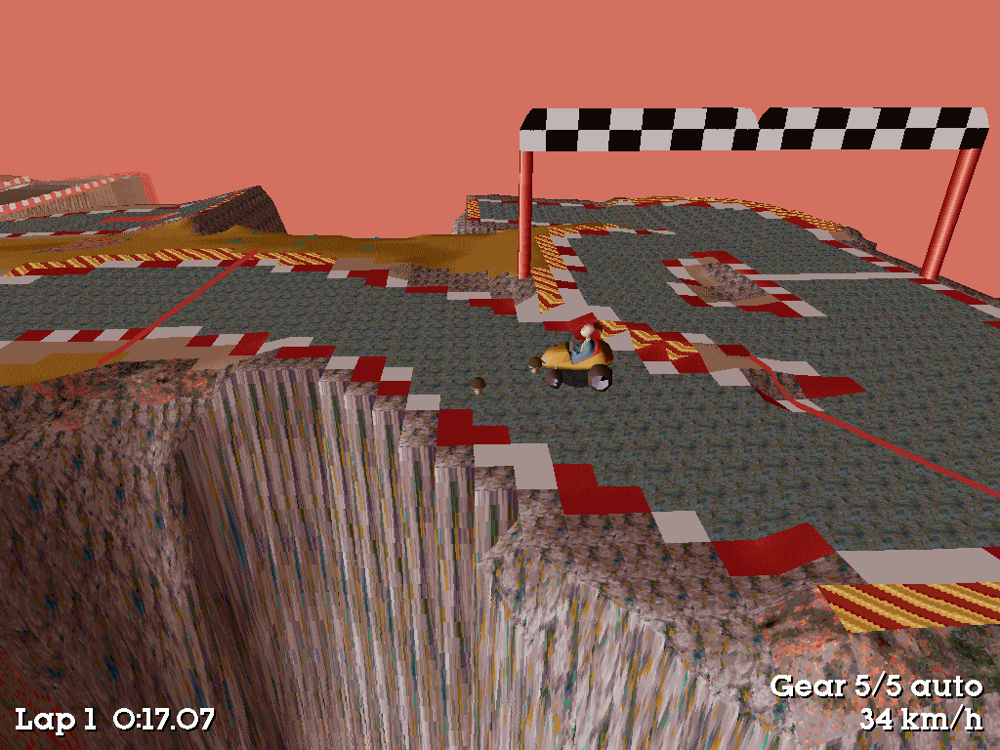

**Verified** (headless, muted, the folder rebuilt with the Elevator Platform's track too):
- *Desert, alone, every mushroom a jet-pack:*
  - The pilot crossed all 22 checkpoints in order, the lap counting at 78.24 s (132 s without).
  - Before the look-ahead fix it missed the third; on Mosquibees Island it drove into a wall.
- *Mosquibees Island:* all 8 checkpoints, twice, in a race.
- *Shrunk from the start* (`shrunk_ms=`, a test key, as is `protect_ms=`): the automatic gearbox went up through all five gears.
- *Ascence, protected, every mushroom oil, opponents ahead:*
  - With the props in the car's way (switched back for the test), Twinsen drove over 3 slicks, and once his car stood 124 units under the deck against a slick's box.
  - Out of the way: 20 slicks, never under the deck, laps 34.26 and 34.02 s.

### Twinsen sinking into Ascence's deck: the item box's view (2026-10-04)

The user, after the fix above: "Twinsen still seems to be getting pushed into the ground both with and without other racers, it seems to be when Twinsen gets to the first lot of mushrooms."

**Finding it.**
- *The user's own log* (`release/lba2-play/adeline.log`): the first mushroom's item, then the automatic gearbox down from fifth to first, the car slowing to a stop.
- *Headless, it never showed.* A height log every quarter second had the car on the deck to the unit, through:
  - the user's car setup (fifth gear 11,378);
  - Play's own start (a save made in the scene, then loaded);
  - the protection spell;
  - driving through the outer mushrooms;
  - longer frame steps.
- *What headless never draws:* a frame that draws only the objects over the last drawn ground (AFF_OBJETS_FLIP). At its fixed 50 frames a second, every frame while driving was a full redraw. At 200 frames a second (`--fixed-dt 5`) two thirds of them were objects only, and there the car sank to Twinsen's shoulders, or was hidden, from the first item on.

**The cause.** The item box drew each item as the game's found-object display does, then reset the view with PtrInit3DView. That resets the plain follow camera without the race-track mode's own eye and lift (FOLLOWCAM.CPP FollowCamReapplyLift: Ascence's rail camera). A full redraw sets the camera again before it draws anything. An objects-only frame draws the cars with the camera it finds, so from another eye than the deck under them, with their depth tested against the deck's. A real frame rate higher than the redraws makes most frames objects only.

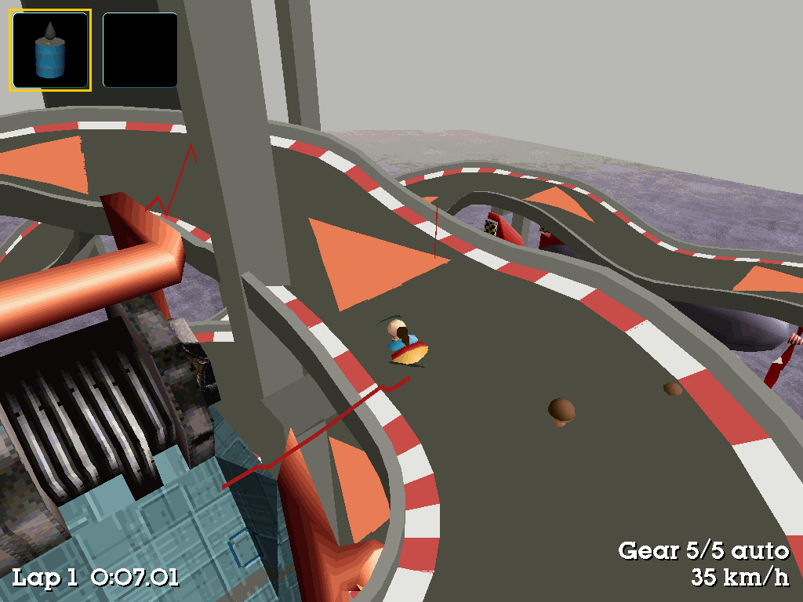

**The fix.** The item box saves the library's whole 3D view before drawing an item and puts it back exactly after (`SaveView`, `RestoreView`):
- the projection (centre, near clip, factors, ratios, the projection functions);
- the camera (angles, position, rotated position, clip, MatriceWorld);
- the light (angles, normal, camera-space vector).

At 200 frames a second, the car stayed on the deck in every frame.

**The red lines on Ascence** leapt up and down: a line's points took another level of the road, or the ground far under the deck. Now a raised road's line follows the deck at its own level (`RaisedAt`, within 600 of the line's height), and past the deck's edge carries on at the edge's height.

### Wider raised roads, the super jet-pack as the car, through the cars in its way (2026-10-04, later)

The user's asks:
- Some raised tracks, like the Elevator Platform's (ASCENCE.ILE), are too tight to overtake on: widen them, where they can be if not everywhere.
- Remove the jet-pack power-up, keeping the super jet-pack.
- While the super jet-pack is on, the car turns into a model of it, tilted forwards and about the car's size.
- A car with it got stuck behind an opponent on the same line: it should push any car in its way aside, or pass through it.

**Wider raised roads** (`RaceTrackBuilder.WidenRaised`).
- *Which:* a raised road whose plan doesn't give its own widths (`RaisedHalfs`). That is the Elevator Platform, Celebration Island's statue track and the lava lake; the Emerald Moon's plan sets its own.
- *How wide:* `WidenedHalf`, 4.75 cells from the middle to the rail, point by point (into the road's RaisedHalfs, which the deck pieces, the rails, the piers, the racing lines and the engine's floor already follow).
- *How far it can go* at each point:
  - no further than its bend lets the inside edge go (0.8 of the radius);
  - clear by 0.75 cells of every other part of the lap within 1,800 units of its height (half the gap each), and of a ground road beside it by its verge;
  - clear of every decor object its space would newly reach, so no building the plan's road missed is cleared for the wider one;
  - over the ground (unless the plan cuts the ground away under the deck).
- *Kept at the plan's width:* 8 cells into each end where it meets the ground road, 10 cells either side of the start line (its gantry) and over a jump's gap with 3 cells either side.
- *Smoothing:* the width changes by 0.2 cells a cell along at the most, so it widens and narrows evenly.
- *The build says how much, and what held it back:*

  | Track | Width before | Average now | At the full 4.75 | Held back mostly by |
  |---|---|---|---|---|
  | Elevator Platform | 3.25 | 4.11 | 38% | the elevator tower (OBL body 0, a box 7 cells across that the road spirals round) and the platform's buildings, 30%; its own other levels, 6% |
  | Celebration's statue track | 3.75 | 4.47 | 58% | other levels, 12% |
  | Lava lake | 3.05 | 3.61 | 13% | its many ends and jumps, 30% |

- `RT_WIDEN_DEBUG=1` lists the decor bodies that held it back.

**The super jet-pack only.** The plain jet-pack (× 1.5) is out. The super jet-pack (× 2) takes its place in the draw: weight 12, never to the leader, 2.5 times its weight to the last car.

**The car turned into the super jet-pack** (RACEMOD.CPP `DrawSuperJet`, `superjet_model=`; `RaceTrackSuperJet`).
- *The model:* the build appends the inventory's super jet-pack (OBJFIX.HQR 48) at 0.45 of its size to OBJFIX.HQR. It is 3,000 units wide and 2,800 tall; the racer's car is 1,270 and 900 (`RaceTrackSmallCars.Scaled`).
- *Twinsen's car* is hidden while it lasts (INVISIBLE, set every frame: the game sets the car's flags again as it drives).
- *The jet-pack drawn in its place:*
  - 560 units over the road, bobbing a little, leaning forward 0.6 rad (34°) along the car's heading, its exhausts trailing;
  - depth-tested against the ground and the decor, in the colours of things near;
  - its place on the screen marked to be drawn over next frame.
- *Test keys:* `superjet_lean=`, `superjet_turn=`. The lean's sign was found by drawing it at 1.2 rad: the first way round, it leant backwards.

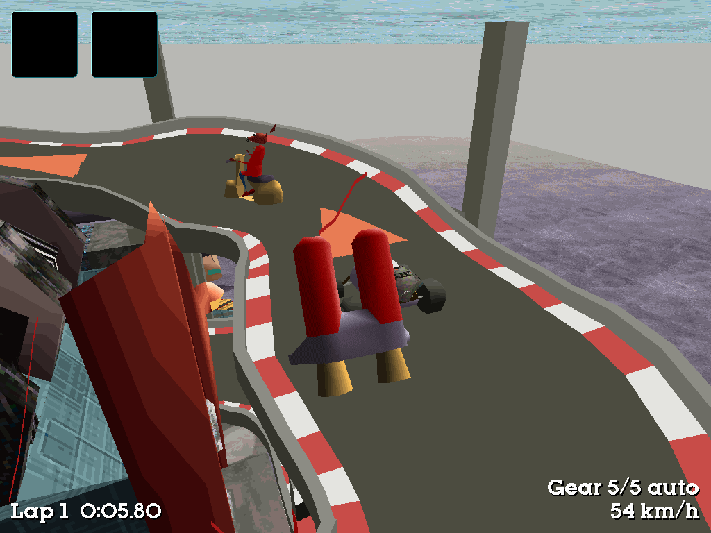

**Through the cars in its way.**
- *Passing through:* while Twinsen's super jet-pack is on, every opponent's car is left out of his car's collisions (`RaceMod_NoCollide`), and an opponent with one passes through Twinsen's.
- *Pushing aside:* a car whose middle comes within 1,400 units of the jet-pack is pushed 2 cells aside, away from the jet-pack's way (right ahead: to its right). It goes out over 0.3 s and back onto its line over 1.2 s, at half its speed.

**Verified** (headless, muted):
- *Desert, super jet-packs only:* the car hidden and the jet-pack drawn in its place, the size of the car.
- *Ascence, every mushroom a super jet-pack, the opponents faster (skill 125):*
  - 14 cars pushed aside in four laps, Twinsen never stuck behind one.
  - His laps 22.8, 18.6 and 16.5 s, every checkpoint crossed.
- *The widened tracks, the test pilot's qualifying laps:*
  - Elevator Platform: 30.9 s (34.0 before, its line using the room).
  - Celebration's statue track: 40.2 s (40.7).
  - The lava lake: 26.9 s (27.2).
  - In each the race's laps complete too.

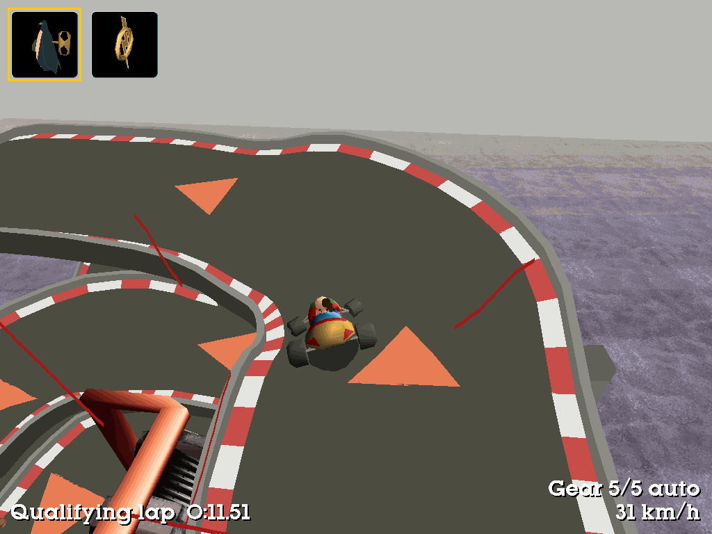

### The super jet-pack flat out and untouchable, its end slowed and flashing; one turn on oil; Twinsen shrunk too (2026-10-04, evening)

The user's asks:
- Tilt the super jet-pack further, so it is fully horizontal.
- While the super jet-pack is on, nothing should affect it (it still skidded on oil).
- Before it ends, slow the car gradually back to its normal top speed, with a slow flashing to warn that it is about to end.
- Spinning a car round three times on oil is too much of a penalty: once round, then a complete stop.
- (Added) A small car for Twinsen, so an opponent's lightning shrinks him as it does the other cars.

**The jet-pack lying flat** (`RaceTrackSuperJet.LaidFlat`).
- *Why the build turns it:* the engine leaning the model a quarter turn as it draws it (`CarPose`) is the decomposition's singular case. The heading folds into the other angles, and at some headings the jet-pack flew backwards.
- *What the build does:* it turns every point and normal of the 0.45-scale copy a quarter turn about x, (x, y, z) to (x, −z, y), and its box with them. The tanks' tops point the way the car goes and the yellow nozzles trail; the HUD's upright icon shows the nozzles at the bottom.
- *In the engine:* `RACE_SUPERJET_LEAN` is now 0 (`superjet_lean=` adds to it, for tests). It is drawn 560 units over the road, the underside about 100 over.

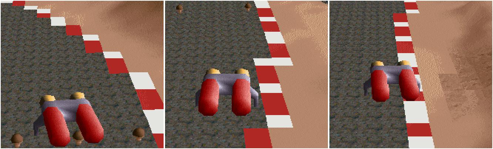

**Nothing touches the super jet-pack.** While Twinsen's is on:
- he drives over oil (logged "Twinsen drives over oil, on the super jet-pack");
- penguins and opponents' lightning pass him by, and `RaceMod_CarHit` lets nothing knock him;
- using it clears a skid, a hit or a shrink he was in.

An opponent on a super jet-pack drives over oil too.

**Its end: slowed and flashing** (`JetFactor`, `RACE_JET_EASE_MS` 2,500, `RACE_JET_FLASH_MS` 250).
- *Slowing:* over its last 2.5 s the speed factor falls evenly from 2 to 1. That covers Twinsen's speed, the pilot's look-ahead speeds and an opponent's pace, so the car comes back to its own top speed rather than dropping to it.
- *Flashing:* over the same 2.5 s the jet-pack and the car take turns, 250 ms each.

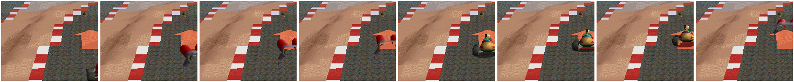

**Oil: once round, then a standstill** (`RACE_SKID_MS` 1,400; `RaceMod_Skid`, `RaceMod_MoveBeta` in BUGGY.CPP).
- *Turning:* the car turns one full turn, quickly at first and easing out: 4096 × (1 − (1 − p)²).
- *Slowing:* its speed falls as (1 − p)² to 0.
- *Sliding:* it slides on along the heading it hit the oil with, while the body turns.
- *Control:* no steering or throttle until it stops.
- *Opponents:* the same, their pace taken down the same way (the old 0.45 pace and three turns are out).

**Twinsen's small car** (`RaceTrackSmallCars.HeroSmall`, `twinsen_small=`).
- *The body:* the build halves Twinsen's buggy too (entity 12's generic body 1) into generic body 101.
- *When it is used:* while an opponent's lightning has him shrunk, unless the protection spell or the super jet-pack is on. Before, his car only slowed.
- *The shadow* shrinks with it. The engine sizes a shadow from the average of the box's width and length, so a small car's shadow still shows a little round it, as the opponents' small cars' shadows do.

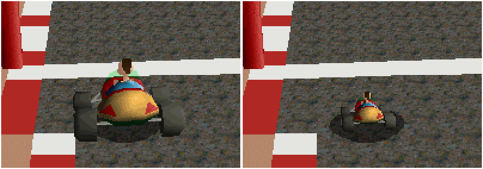

**Verified** (headless, muted):
- *Mosquibees, oil and lightning only, the opponents faster (skill 125):*
  - each of Twinsen's three skids ended at speed 0 one full turn round (heading 3183, 1133, 1159 from 3182, 1132, 1158);
  - the opponents skidded too;
  - each lightning hit switched his car to body 101.
- *Mosquibees, super jet-packs and oil only:* Twinsen drove over oil three times on the jet-pack and never skidded while it was on.
- *Desert, super jet-packs only:*
  - the factor went 2.00 → 1.85 → 1.65 → 1.44 → 1.23 → 1.02 over the last 2.5 s, the speed 9,672 → 4,952 (his top 4,836);
  - frames 80 ms apart show the jet-pack and the car in turn;
  - the jet-pack lay flat, nozzles trailing, at every heading round the lap.

### HAL on the Emerald Moon; the place in the race on the display (2026-10-04, night)

The user's asks:
- In the moon base there is a computer Twinsen can break, and then its mechanics worship it and call it HAL: turn it into a vehicle for the Emerald Moon.
- Show the current position, to see how a race is going.

**What HAL is in the game.**
- *Where:* scene 23, "Emerald Moon, next to outside Baldino's cell".
- *Actor 4, the screen:* a sprite actor, sprites 228 and 229 flickering while it works and 230 once cracked. The cabinet, the bottles and the stand are the room's bricks.
- *When it is broken* (hit, or `var_cube(2)`): the mechanics drop what they are doing. They are actors 12-15, the base's grey Franco guards with tools (BODY.HQR 98). One of them cries "HAL!!" (TEXT.HQR file 6, 546) with the translator, "ZX81!!" (545) without.
- *So there is no body to reuse:* the car is made after the room's look (`lba2sprite` renders the sprites and the palette, to match its colours).

**The car** (`RaceTrackCharacterCars.Hal`, body 63 of the racer's entity; `.Hal.cs`).
- *The stand* is the hull, in the lilac grey (ramp 208), with:
  - rivets down its sides;
  - the round red grille at the front on the left;
  - the dark pipe with its teal horn on the right.
- *The cabinet* is dark slate (ramp 176) with its top edges rounded. On its front:
  - the round green screen (ramp 144) bulging out of its bezel;
  - a grid over the screen, and a red eye in its middle (the other HAL's);
  - the red knobs under the screen.
- *Round the cabinet:*
  - a bottle at each front corner, dark, its coils glowing cyan, a white cap on top;
  - the red pipes arched over the top at the back, and the grey pipe out behind;
  - the gauge on the right with its red cable down to the stand.
- *It drives itself:* bone 13, where a driver sits, holds only the eye. The racer's animations turn that bone up to 40° (measured in ANIM.HQR 1071-1077), which would swing a screen out of its cabinet; a ball turns in place.
- *Size:* 509 points and 386 polygons, 7 lines, 22 spheres (the engine's limits are 550 and 550).
- *Line-up:* it races the Emerald Moon with Baldino, who stays the one to beat.

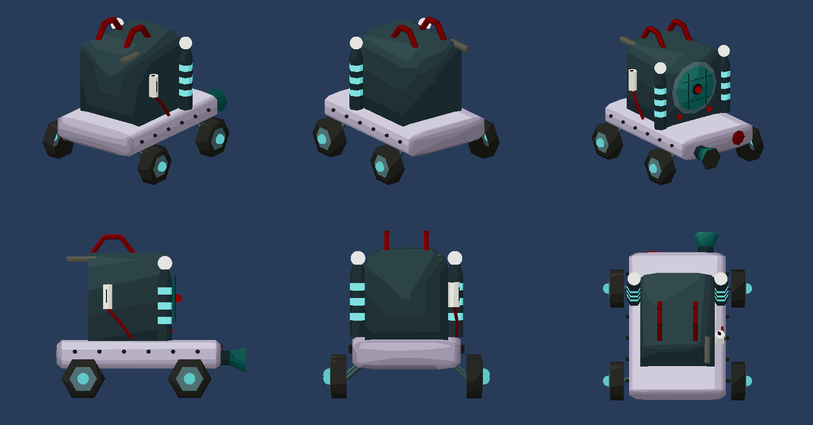

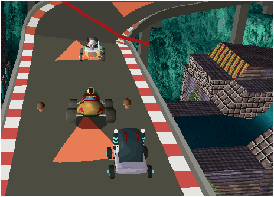

**The place in the race** (RACEMOD.CPP `RacePlace`, drawn over the lap line, bottom left).
- *What it shows:* "Position 2nd of 3", from the moment the grid's GO starts the race until Twinsen finishes; after that, "Finished ..." as before.
- *How it is counted:* by the same measure as the item box's "how far back" (`BackShare`): the player's progress round the lap against each opponent's.
- *Not counted:* a time to beat with no car (Raph's on the storm track), so a race against the clock shows no position.

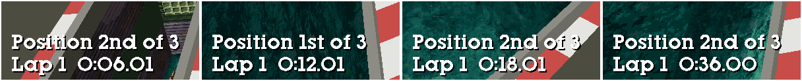

**Verified** (headless, muted):
- *The Emerald Moon:* the grid was Twinsen, HAL, Baldino; HAL drove the lap with the others.
- *At opponent skill 130:* the display went 2nd → 1st → 2nd → 3rd of 3 as the cars passed each other.

### Oil slicks on the road; the open loop slows a car that is too fast (2026-10-04, night)

The user's asks:
- Oil slicks seem to be either invisible or half buried in the track.
- The open loop on EMERAUDE.ILE sends Twinsen flying into the air if he hits it too fast.

**Why the slicks were buried.** A slick was laid 1,300 units behind the car that dropped it, at that car's own height (and 20 over).
- *On a slope* the road back there is higher or lower. Going downhill the slick was inside the road: half of it, or all of it (unseen). Going uphill it floated.
- *Logged on Mosquibees:* road heights 150-240 units off the drop height were common (12125 against 11884).
- *Even at the right height,* a flat puddle 1,240 across on a slope of 0.13-0.2 has its uphill half under the road.

**The fix** (RACEMOD.CPP `PoseSlick`, `SlickGround`). Once a slick is in the scene in sight:
- *Height:* it takes the road's height under its middle: a raised road's in reach of where it was dropped, else the ground's.
- *Tilt:* it is tilted to the road's slope.
  - The slope comes from the heights 256 either side, along x and along z.
  - With no heading, the engine's M(Alpha) M(Gamma) M(Beta) turns its up by Gamma = asin(-nx) and Alpha = atan2(nz, ny).
  - A step over 0.6, like a deck's edge, counts as no slope.
- *Lift:* it rises by as much as the road anywhere under its rim (12 places, 620 out) stands over the tilted plane, plus 14. A crest or a banked deck's curve no longer covers an edge.
- *Collisions:* its new height is what the cars are checked against too.
- *Dropped in the air:* off a jump, it lands on the ground below.

**Verified:**
- *Desert, only oil:* the slicks behind Twinsen lie whole on the road, slopes 0.09-0.13.
- *Elevator Platform, on the banked spiral deck:* the slicks find the deck (432 below the car on the climb), with slopes up to 0.41 and lifts of 49-88.

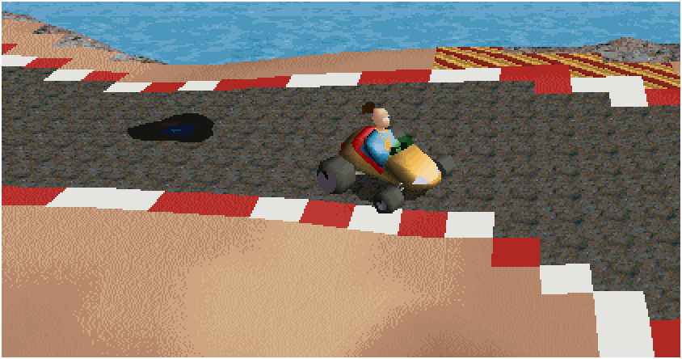

**The open loop.**
- *The problem:* the Emerald Moon's second loop has a 35° gap at its top. It is leapt cleanly only from 22 to 43 km/h (`LoopWindow`).
- *Who it threw:* the car's own top, 34 km/h, is inside that window, but the super jet-pack (68 km/h) and a boost are not. Faster, the leap carried the car high over the far edge and it fell outside the ring.
- *The opponents* were already kept inside the window (`LoopEntry`).

**The fix** (`LoopCap`, `RACE_LOOP_SLOW`). Before a ring with a gap:
- *Braking:* over the road up to its foot, Twinsen's car is held to sqrt(cap² + 2 × 8000 × distance). That brakes it smoothly, no harder than 8,000 units/s², down to the cap at the foot.
- *The cap* is the window's top less a fifth of its width: 39 km/h on the Emerald Moon.
- *Clamped:* its speed into the ring is clamped to the cap as well.
- *The hint* now gives only the least to take it at ("Jump loop: over 22 km/h"). Slower than that the car still falls off: that is the driver's to get right.
- *Whole rings* are untouched.

**Verified** (Emerald Moon, only super jet-packs):
- Twinsen came up to loop 2 at 9,672 units/s and was slowed to about 5,500.
- He left the ring at the gap's edge, was caught "Over the gap" and came round, on both laps.
- Loops 1 and 3, whole, he took at the full 9,672.

### Smooth kerbs (2026-10-05)

The user's ask: the red and white markings on some tracks, Desert Island's and Citadel Island's, are jagged in places instead of one long smooth curve.

**Why they were jagged.** `PaintRoad` gave each 512-unit cell one paint (asphalt, red or white kerb, sand, hatching), chosen by how far the cell's middle is from the road's, and painted both its triangles alike. A kerb one cell wide therefore stepped along every bend and every road not square to the grid.

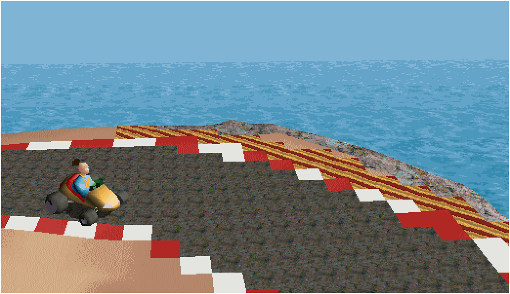

**What the engine allows** (3DEXT/TERRAIN.CPP).
- *Texture corners:* a ground triangle's texture corners are its own (8.8 fixed point into the island's 256 x 256 page, up to 8,192 definitions a cube). Any triangle can show any part of the page, stretched any way.
- *Flat colour plus texture:* a triangle with both draws the flat, lit colour first, then the texture over it with colour 0 see-through (`POLY_TEXTURE_INCRUST`). The verge's own sand shows through the texture's empty part, shaded exactly as the sand next to it.

**The fix** (`RaceTrackTextures.KerbTexture`, `RaceTrackBuilder.KerbCells`, `Painter.PaintKerb`).
- *The kerb texture:* a 48 x 32 block of the island's page, 10 texels a cell, in free space.
  - Along the road (x), red and white blocks 1.6 cells long, as before.
  - Across it (y), from one cell inside the asphalt's edge to one past the kerb:
    - asphalt (the asphalt tile's own pixels, at this scale);
    - the kerb: the red is the colour the flat red kerb shows at the ground's usual light (its ramp's 9th, Desert island's 73), the white the white curb's pixel;
    - nothing (colour 0).
- *The cut:* every cell near a kerb gets the road's coordinates at its four corners (across, from the road's middle, and along). It is cut along whichever diagonal keeps both its triangles within one cell across the road; cut against the road's way, a triangle reaches 1.4 cells.
- *Each triangle:*
  - short of the kerb: asphalt;
  - past it: the verge;
  - reaching it: the verge's flat colour with the kerb texture over it, mapped corner by corner from the road's coordinates.
- *Result:* the kerb's edges and the blocks' ends run where the road says, to a tenth of a cell, whatever the grid.
- *The verge's colour under the texture:*
  - sand on an open verge;
  - also sand beside a banked bend's hatching, which starts from the next triangle out. The hatching's average colour there read as the kerb's red running on round its white blocks.
  - On a walled road (over water or a valley, or cut into a cliff: `Bridge`), whose verge is rock, the ramp whose colour at the usual light is nearest the rock tile's average colour.
- *Where it is not used:*
  - cells near a second road's kerb (a pit lane alongside, a crossing);
  - jumps, landings, decks, the start line and the arrows;
  - roads whose kerb isn't one cell wide.
  - An island whose page has no free 48 x 32 block keeps the cell-by-cell kerbs: Celebration Island's two tracks.
- *The editor's map and holomap pictures* now take colour 0 of a texture over a flat colour as see-through too.

| Track | Triangles with the kerb texture | Where in the page |
|---|---|---|
| Desert island | 10,390 | (208, 32) |
| Citadel Island, storm track | 2,140 | (16, 160) |
| Citadel Island, town circuit | 7,153 | (16, 160) |
| Mosquibees Island | 2,677 | (16, 40) |
| Polar Island (2026-10-06) | 3,818 | (88, 224) |

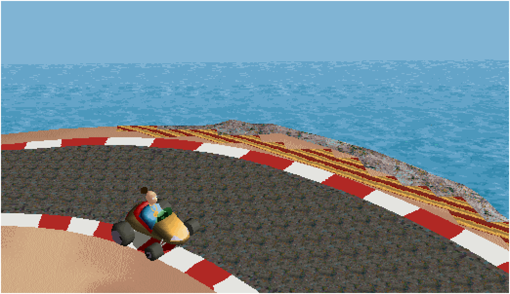

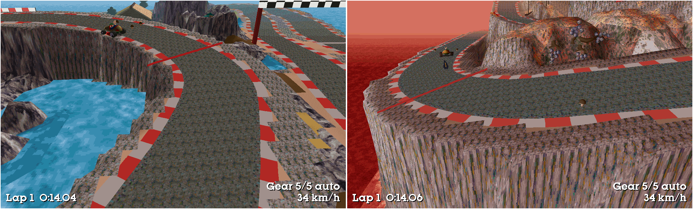

**What is still stepped:**
- the hatching's edges, and the edge between a rock verge's flat colour and the rock texture: they are their own tiles, painted cell by cell;
- a kerb right beside another road's.

**Verified:**
- *The sandbox, all seven islands:* it builds.
- *Desert's qualifying lap:* 126.7 s on fuel only, 119.8 s with every power-up. A first run with every power-up lost the lap after checkpoint 8, in a pile-up of its own penguins and oil; it went round in the rerun.
- *Mosquibees and the Citadel town circuit:* their qualifying laps complete.

### Mushrooms out of sight, a lightning strike, shrinking by place, driving any car, checkpoint maps (2026-10-05, later)

**Floating mushrooms on Celebration Island.** Scene 95 carries the statue's track (CELEBRA2), whose mushrooms stood on its raised road up to 16,560 high. The same scene is drawn with CELEBRAT (no statue, no road) before the statue rises -- in the game, and in the editor's view of CELEBRAT -- so they hung in the air. Citadel Island's scenes carry both weathers' tracks the same way. Now every mushroom is built out of sight (Y -20000, as the penguins and oil slicks are), with its road height in RACETRACK.JSON (`Mushrooms`: [scene, actor, y]) and the car file (`mushroom=<scene> <actor> <y>`); the race-track mode stands it there. Older builds (no height) work as before. Tracks need rebuilding.

**The lightning strike.** An opponent's lightning shrank Twinsen with no sign of it. Both ways now go through `Strike` (RACEMOD.CPP): the game's flash (INCRUST_ECLAIR), its thunder (SAMPLE_FOUDRE_STEP3), and a bolt from the sky onto each car struck, jagged anew every frame for 0.6 s (`DrawBolts`: white, edged in gold, with a branch). Twinsen's spell strikes the opponents in sight; theirs strikes him -- and with the protection spell on, the bolt lands but he isn't shrunk ("protected!"). On the super jet-pack nothing strikes him.

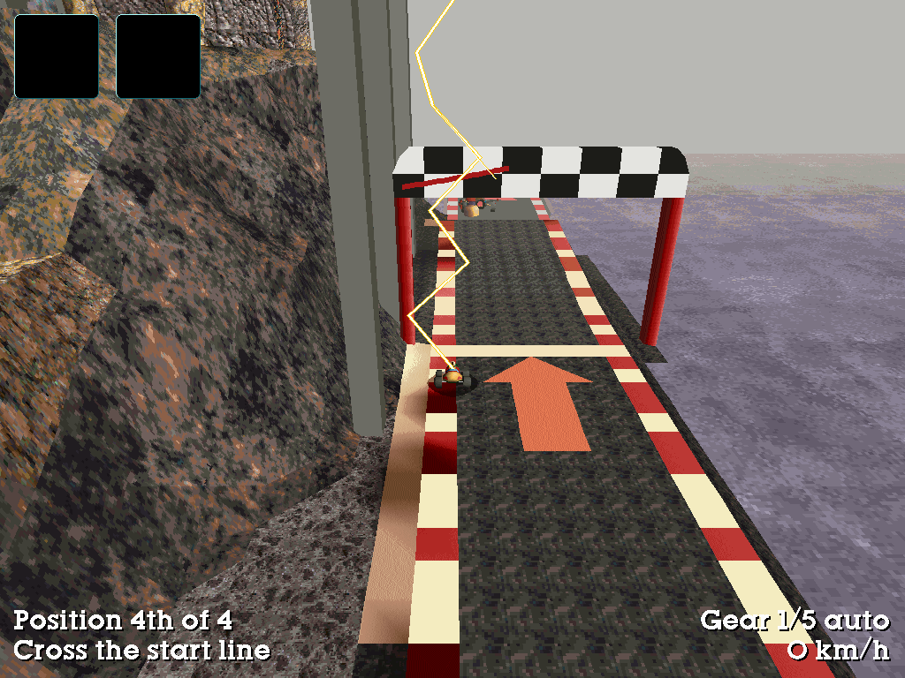

**Shrinking by place.** `ShrinkMs`: 20 s +/-25 %, longer the further ahead -- the leader 25 s, the last 15 s (four cars: 25, 21.7, 18.3, 15 s); 20 s with no race on (qualifying). Each opponent has its own `ShrunkUntil`.

**Driving as any car.** Race car setup > Your car: Twinsen's buggy, or any of the racer entity's cars the folder has (the racer's, Baldino's, the character cars). The car file gets `drive_as=<BODY.HQR body> <ANIM.HQR animation> <shrunk body>` (`RaceCarEngineFile.DriveAsLine`, from the folder's entity table: the racer entity's generic body, its driving animation 1, its shrunk body). The race-track mode hides Twinsen's car (as under the super jet-pack) and draws that car in its place (`DrawDriveAs`: a T_OBJ_3D of its own with the opponents' driving animation, facing the car's way, pitched by the slope just driven); its shrunk body while shrunk. It handles as the setup makes the car. Test: `RT_DRIVE=<body> racecarfile ...`.

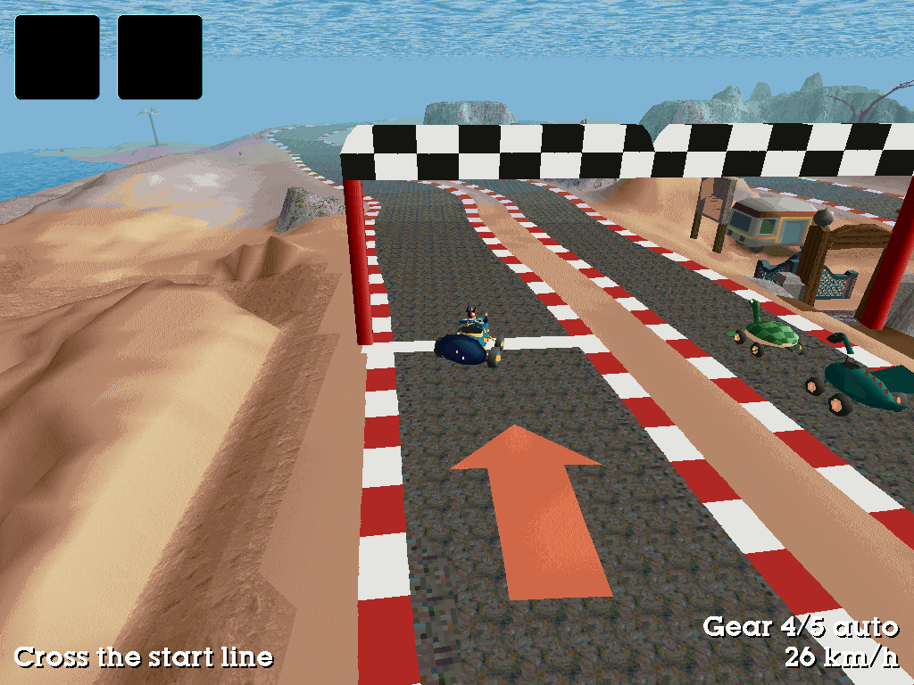

**Checkpoint maps.** `ScriptRoundTrip trackmaps <game> <out>` then `trackmaps_paint.ps1 <out>`: a map of each built track (the island from above, a raised road's deck drawn over it, markers and arrows round the lap, the start line, the checkpoints placed), to draw checkpoints on. A lap that winds over itself gets a map per level (Celebration's statue 3, the Elevator Platform 4). `maps.txt` keeps how each map's pixels turn back into island cells.

**Verified:** the sandbox's seven islands rebuilt (mushrooms at -20000, heights in RACETRACK.JSON); the statue track raced with lightning-only mushrooms (mushrooms on the deck and taken; Twinsen struck, the bolt in the screenshots; shrink times 25/21.7/18.3/15 s by place); the Desert track driven as the Dean's car.

## Polar Island: the dream race to Sendell (2026-10-06)

The user drew a route over a picture of Polar Island (LBA1's island, made into LBA2's island 12: [LBA2_POLAR_ISLAND.md](LBA2_POLAR_ISLAND.md)).
The track picks up from the end of the first game: Twinsen dreams he is racing FunFrock to Sendell. It starts at a red dot on the dock, runs
down the island, loops round, has one jump over itself (two pink marks) and finishes with a jump onto the top of the rocky peak. Then Zoe
shakes Twinsen awake at home, in the second game's first scene.

**From the drawing to a plan.** A 3 x 4 camera (a DLT from seven landmark corners: the dock's end, the arm, 107's corners, the peak) maps the
island's columns onto the drawing. The drawn route's control points, read off the drawing, were put back on the ground through it and
traced on the island seen from above, keeping to the car tracks where the drawing follows them. `tools/RaceTrackPlan/polar_design.py`
turns them into the plan (`docs/racetrack/polar_track_plan.json`): a Catmull-Rom line every half cell, heights from the ground under it
(the highest of a small cross round each point, smoothed, grade-limited to 14 %, at least 600 over the sea), and the two jumps' ways.

**A sprint.** New plan keys: `open` (the route has two ends: the road isn't closed, `TrackRoad.Closed` false) and `finish` (the finish
line's point). An open plan gets no checkpoints. Its finish line is across the road there, like the lap line, at the road's height
(`RaceTrackReport.FinishLine`). Its racing lines run from the start line to the route's end (`PlanRacePath`: the same planner, with ends
of its own instead of going round). The scenes' edge crossings, the grid's places behind the start line and the mushroom rows don't wrap
round from the last point to the first.

**Two raised stretches.** A sprint's `raised` may give several stretches, each its first and last point. The engine's raised road
file is then one list from the first stretch's start to the last one's end, and the ground road between them is points with no width:
no floor there, as in a jump's gap. Pieces and piers are only under the stretches.

**The jumps.** Both are carried jumps (`arcJumps`). The one over the main straight (from cell 521 to 498.5 along z 456, its top at 2,728,
the straight under it at 603) crosses from cube (8, 7) to cube (7, 7). The straight is four cells from that edge, and a gap jump (the car's
own flight animation) breaks at a cube change. The one onto the peak climbs 700 up its ramp, tops out at 15,200 over the plateau's
pillars and comes down a short hill onto the pad, 46 layers up.

**The engine: `sprint=1`, `finishline=`, `intro=`, `lose=`, `wake=`, `dream=`** (`RACEMOD.CPP`):
- an opponent's line has ends: `PathAt` holds it there, and the opponent stops where its line crosses the finish line (`FinishS`). It
  then counts as finished: ahead of the player, who hasn't;
- the player crossing the finish line ends the race (`SprintOver`), and so does the one to beat (`main=`) getting there first, which
  loses it. The player's car stops there (`RaceMod_Held`);
- `RaceMod_Story`, called once a frame from the main loop before the scene is drawn (`PERSO.CPP`), where a dialog can open as a life
  script's does. It shows the intro (said by Twinsen as the grid forms, the count-down starting once it is read). 3.5 s after a win it
  takes Twinsen out of his car (`LeaveBuggy`, `ResetBuggy`: the car is no one's yet, as in a new game; and his move put back to on foot,
  which `LeaveBuggy` leaves the car's -- a change of scene puts a hero whose move is the car's back in it, `ChangeCube`'s `MemoMove`, and
  he drove off his bed at the race's speed) and starts the waking scene afresh at its own start (`FlagChgCube` 0, as the console's `cube`
  does: 2 carries his animation over the change). 3.5 s after a loss it takes the car back to the grid in the start line's scene
  (`cube_scene=`), where the grid forms again with the loss's line;
- `RaceMod_Dial`: in the waking scene, the actor `wake=` names (Zoe, actor 4 of scene 0) says the wake line before her first line. If she
  says nothing, `RaceMod_Story` says it 15 s after he woke. (Since the bed, below, scene 0's own opening says it: `wake=0 -1 4`.)
- `dream=<scene>`, a set's key: a new game starts there instead of in Twinsen's house (`RaceMod_NewGameScene`, from `InitGame`).

**The editor.** `RaceTrackIsland.Polar` (`Dream`), with its line-up `RaceDriver.Polar`: FunFrock, the one to beat. The track's record in
`RACETRACK.JSON` has `Dream`: the finish line, the top speed (140), the texts and where Twinsen wakes up. The car file scales every gear
of the setup so the top one is 140 km/h, turns qualifying off and writes the sprint's keys. A story set writes `dream=` with the start
scene. `RaceTrackService.EnsurePolar` adds the island when the originals the build starts from haven't got it (`PolarInOriginals`), and
`Problem` no longer asks for the island's files. The road's tiles go on the ground's first page: the island build keeps its last row of
32 x 32 slots free (`PolarTextures.Pages.Reserve`), and `RaceTrackTextures.FreeBlocks` counts only the first page's triangles on an island
with more pages. The holomap picture is the island's own (entry 46). The dock scene's buggy has `INIT_BUGGY 1`, and the start line's
script edit takes it as well as 0.

**The kerbs, smooth (2026-10-06, later).** The plan's kerb was 0.75 cells wide (asphalt to 3.0, kerb to 3.75), and the smooth kerbs
(above) are made for a kerb a cell wide: Polar Island's had stayed in cell-sized steps. It is a cell wide now (to 4.0), and 3,818 of its
triangles carry the kerb texture. An island with more texture pages has room for 1,024 texture definitions in a cube (a page and a
definition share the index), and the kerbs take one a triangle: the busiest cube has 994 with the road, and a build that would need
more stops with that said. What is still in steps is the sand verge's outer edge against the island's brown ground, and the rock
walls: they are painted cell by cell, as on every track.

**Waking up in bed (2026-10-06, later).** Won, Twinsen wakes up lying in his bed. Scene 101 (the Wannies' house, where the firefly tart
sends him to sleep) has his own animations for it: 56 asleep in a bed, 57 sitting up, 58 getting out. The race's `win=` sets game
variable 205 (`PolarDream.DreamVar`: nothing in the game uses it), and the build changes scene 0's opening for it (`ApplyOpening`):
- Twinsen starts asleep on his bed (a new track point, the bed's cells 9-11 x 1-4 at 3,072, four layers over the floor; turn 0, as he
  lies on the Wannies' bed, which is the same size with its head the same way; the place found by trying, his head on the pillow), no
  shadow, in cinema mode;
- Zoe walks round the bed's foot to its side (three new points) instead of turning to him, and says the wake line; 205 goes to 2;
- he sits up and gets out of bed, and is put on the floor where that leaves him (the animation lowers him; his place has to follow);
  his track stops at a label 2 of its own, which is what her own opening waits for -- her line, the Weather Wizard's arrow and the rest
  of the game's opening follow as ever.
Citadel Island's story edits the same scene (Zoe's line, the bed's zone): built together, scene 0 has both.

**Checked** (sandbox `E:\dump\TEMP\ptrack\game`, muted):
- `buildtogether` with the six other islands' tracks gives the same 56 files as the previous version, byte for byte.
- The test pilot (`autodrive`) from the grid to the peak: both jumps carry the car (the first changes cube at the top of its flight), the
  finish ends the race won in 36-40 s, Twinsen wakes up asleep in his bed in scene 0, Zoe comes to the bedside and wakes him, he gets up
  onto the floor and her own line follows (later: the kerbs smooth, the bed). With FunFrock's skill at
  300 % he gets there first, the race is lost and runs again from the grid.
- A new game with the story set starts in scene 243, on the dock beside the car.
- From the app: `POLAR.ILE` opens with the road, and Play ("Race: Polar Island") starts on the grid, or in the dream as a new game.
- Putting the track back leaves the island as it was before the track.
- Later: the six other islands built again give the same files but BODY.HQR, whose only changes are the firefly tart car and its
  half-size copy; Citadel Island and Polar Island built together give scene 0 both their edits.

**Round 2 (2026-10-06, later): the peak, the jumps, waking up.**
- *The rocky peak* had lost its middle: the race build takes away decor objects under the road, and the jump's landing pad is on the
  peak, so the tall pieces the peak is made of (columns from the ground to 11,776) went with the low ones round them, leaving the top on
  a thin stalk. A new plan key, `keepAbove` (6,000 here), keeps every decor whose top is at least that high, as `keepBodies` keeps its
  bodies; their boxes are cut to end under the raised road as kept decors' are, and the ruins pass (`ClearRuins`) leaves them too.
  `decordiff <ileA> <ileB> x0 x1 z0 z1` (`PolarStudy.cs`) lists the decors one island file has and the other hasn't in a box of cells.
- *The camera at the first jump* went to the side, as at every carried jump. An `arcJumps` entry may now have a fifth number, the
  camera's side: 1 or -1 beside the jump, 0 behind the car (the engine's `arcjump=` side 0: `ArcCamera` gives way to the follow
  camera). The first jump has 0; the jump up to the peak keeps the side view.
- *The second jump's ramp* had LBA1's terrain through its left half: the ramp rises from a dip (3,072) beside a ledge at 4,608, four
  cells wide along its north rail. The plan now has `raisedCut`, and `CutUnderRaised` deals with the ends of the raised road too: within
  8 cells of where the deck leaves the ground road, ground standing over the deck is brought down to 50 under the nearest stretch of
  deck (out to a cell past the rail, then banked up), never where the ground road is nearer. (The cutting stays away from the ends, and
  the ends' flush only runs while the deck is near the ground under its middle: here it is 900 over the dip.) The lava lake, the other
  `raisedCut` plan, is unchanged by it, byte for byte.
- *Waking up* now puts the race away: the finished race had held the car still wherever Twinsen drove next ("finished 1/1" on Citadel
  Island), a power-up still on came back with the next car (the super jet-pack), and the dream's fine weather stayed, so the house
  door led to CITABAU. `RaceMod_Story`, on a win, reloads the race file for the car alone (`ResetTrack`, `Load(.., 1)`: a story set's
  file when one is loaded), clears the fine weather, and gives the car the gears of the setup as it is (`after_gears=`: the dream's are
  scaled to 140 km/h). The car file of a dreamt race has no `weather=fine`: Twinsen wakes in the game's own weather.

Checked (sandbox, muted): the test pilot over the whole sprint (the first jump with the camera behind; the ramp up to the peak whole,
kerbs on both sides; the peak standing; the win), then out of scene 0's front door into scene 49 on CITADEL in the rain, on foot. The
seven other tracks built again are the same files, byte for byte.

**Round 3 (2026-10-06, later): the island twice its size, LBA1's tracks up 108, round the peak and a jump into it.** The user: "widen the
island and make the whole thing bigger" -- 108's car tracks go back and forth up its terraces more often than the road could follow --
"trim [the car] down to 120", "a loop around the tower followed by a jump into it", and Twinsen to hit that jump "but never land as Zoe
rocks him to wake him up". The island at twice LBA1's size is in [LBA2_POLAR_ISLAND.md](LBA2_POLAR_ISLAND.md).
- *The route* (`tools/RaceTrackPlan/polar_design.py`, run in a folder with the big island's `heights.csv` and `columns.csv`): the old
  route's control points doubled from the dock to the south strip and the jump over the main straight, then LBA1's own tracks up 108 --
  five ways up, each a terrace higher (1,200, 3,072, 6,144, 7,168, 8,192, 9,216), twelve to sixteen cells apart, hairpins of 5 to 6 cells
  round (the tightest, between two ways twelve cells apart, a loop a little wider than LBA1's square turn) -- east along 108's top, then
  a raised road round the rocky peak (its north side over the sea, its east side, a half circle 20 cells round over the lake on its south
  side), climbing 900 from 108's top, and in to a straight and a ramp at the peak's south face. 1,642 cells to the finish, 606 before.
- *Cube edges:* LBA1's grids are whole cubes at the placement with the fewest cubes of land, and its tracks up the arm run along x 512, a
  cube's edge: the road runs ten cells east of them there (along an edge the car changes scene back and forth). The final straight, 109's
  hairpin and 108's top run are kept eight cells or so off edges too (`polar_design.py`'s notes).
- *The jump into the peak:* a carried jump whose landing is the route's end, a few cells inside the peak (no deck anyone sees). The plan's
  `finish` is the ramp's lip, and `keepAbove` is 15,000 (the peak's decors; at twice the size the huts and walls stand taller than the
  old 6,000). Both jumps' cameras are behind the car (`arcJumps` fifth number 0).
- *Waking in mid-flight* (`RACEMOD.CPP`, `wake_flight=<ms>`, `PolarDream.WakeFlightMs` 450; `RaceTrackService.DreamInfo.WakeFlight`): a
  won sprint isn't held at the line (`RaceMod_Held`), the car is carried on over the jump, and 450 ms later the picture fades to white
  (`FadePalToPal` to a white palette: the engine's `WhiteFade` fades from black) and the race is put away as before. The waking scene is
  held white (`RaceMod_FadeFromWhite`, from `OBJECT.CPP`'s fade-in) for 400 ms -- its first picture is Twinsen at the scene's start, before
  its opening lays him in bed -- then fades in from white (`FadeWhiteToPalAndSamples`, `RaceMod_Story`).
- *Top speed* 120 km/h (`PolarDream.TopKmh`); the intro now says "beat him to the rocky peak".
- *Texture definitions:* the busiest cube needed 2,030 with the road. A paged island's triangle has only 10 bits for its definition, the
  page taking the index's top 3, so the triangle's unused `Dummy` bit is now the definition's eleventh (`IslandPolygon.Wide`,
  `IslandFile.GroundTextureOf` / `WithGroundTexture` / `MaxGroundDefinitions`, the painter's `Paged`, the terrain editor's paints,
  `IslandDocument.TextureKey`; the engine's `GroundTexDef`): 2,048 a cube. And on a paged island the smooth kerbs' road coordinates are
  snapped to 1/16 of a cell and their blocks are 2 cells long (`KerbSnap`, `KerbSnapBlock`), so a straight kerb's triangles share
  definitions every 4 cells: the busiest cube now needs 1,425. Other islands' kerbs are as they were, byte for byte.
- *Commands:* `defsuse <ILE> <cx> <cz>` (a cube's definitions by kind of triangle; `DEFS_CELLS` lists a box's kerb triangles),
  `buildhere <game> <island>...` (the window's Build on a folder as it is: the upgrade from the island at LBA1's size). The build names the
  cube that is short of definitions.

Checked (sandbox `E:\dump\TEMP\pbig`, muted): the big island in the engine (dock, 107, 108, the peak) and the app (POLAR.ILE's 35 cubes in
the 3D view and minimap, scene 252), its holomap picture; the test pilot over the whole sprint (both jumps carried, a win in 64-69 s,
the white fade, Twinsen asleep in bed with Zoe beside him); the window's build over a folder with the island at LBA1's size and its track
(put back, the big island added, scenes 233-253 its own and none left over); the seven other tracks built again are the same files, byte
for byte; the island round trip.

**Round 4 (2026-10-06, later): barrels on the road, waking up, the car outside the house.**
- *Two of LBA1's barrels on the road* where it leaves 108's top for the raised road round the peak. They stood 7,000 below the road,
  at the terrace's foot, when the road was cleared; then the raised road's end had its ground filled up to the deck (`FlushRaisedEnds`)
  and decors follow the ground under them (`IslandOps.DecorFollow`), so they rode up onto the road. The decors are now cleared again
  once they have followed the ground (`ClearDecors` a second time, after `follow.Apply()`); the other tracks' files are unchanged by it.
- *Waking up* (the user: Zoe took a long time walking round the bed): she starts where the game's opening has her, beside the bed's
  head, and says the wake line two seconds after the room has faded in; steps back out of his way; he sits up, gets out and turns to
  her; she comes round by the open floor south of the bed and kisses him (her animation 84, the game's own when Twinsen walks into her
  at home: she hugs him, hearts float up); then her opening line (the race track story's about the rain, where it is built). Game
  variable 205 counts the steps (1 asleep, 2 the line said, 3 getting up, 4 the kiss). Two things learnt: a track's `goto_point` counts
  an actor there 500 short of the point (GERETRAK.CPP), so the points lie 500 past where she stops; and an actor whose way runs into
  Twinsen's box walks on the spot for ever -- her route keeps a cell from him, and the kiss happens on his south side, so her own opening
  walk afterwards leads away from him (from his west side it passed him, and walking into him is the game's kiss again, over and over
  while he stood still).
- *The car outside the house* (the user: undrivable after the dream): the town circuit's start, scene 49, puts the car on its start
  line whenever the scene starts on foot, and in the storm -- the dream wakes Twinsen up in it -- that line is CITADEL.ILE's sea. The
  engine now tells the scripts which weather's file is shown (game variable 206: 1 fine, CITABAU; 0 the storm, CITADEL -- set in
  EXTFUNC.CPP `InitGrilleExt` as it chooses the file, `RaceMod_CitadelWeather`, in any game), and each of Citadel Island's two start
  cars parks, in the other weather, in the yard north of Twinsen's house (`RaceTrackIsland.ParkOwn` / `ParkTwin`: flat at 250 in both
  files): the storm track's in scene 42 when it is fine (its line is under CITABAU's ground), the town circuit's in scene 49 in the
  storm. Checked: in the storm the car stands in the yard and drives off (behaviour 12, 5,000 units east); racing the town circuit
  (`weather=fine`) it stands on its start line.
- *Commands:* `entityanims <game> <entity>...` (an entity's animations and bodies), `gametext <game> <file> <id>...`.

## Citadel Island again: the dots, one car, the way into the docks, the doors, the pharmacy, Raph's laps and the lighthouse (2026-10-06, evening)

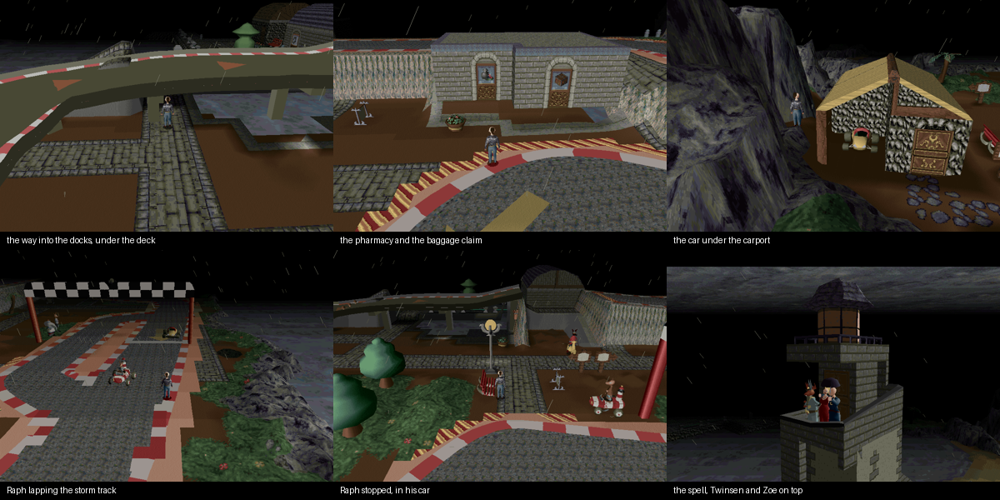

The user drove the storm track and asked for six things, then for the storm story to be told round Raph's laps.

**Three dots following the car.** Every scene's power-up actors and spare cars wait out of sight at Y -20,000 until the race-track mode
needs them -- in Citadel Island's scenes the other weather's track's too (its mushrooms in rows of three). Drawn, each put its shadow on
the ground straight above it. The engine now leaves out any actor that far down (`OBJECT.CPP`, the actors' drawing: `y <= -10000`), body
and shadow. The storm track's own mushrooms are there in a race (the test pilot takes five a lap).

**One car by the house.** The island has a car of its own under Twinsen's carport: a decor that can't be driven (CITADEL body 85,
CITABAU 114). It goes from both files (`RaceTrackIsland.DropDecors`: the pieces at an origin, `RaceTrackBuilder.DropDecors`), and in the
storm the town circuit's start car parks in its place, turned as it was (`ParkTwin`, cell 544.1, 654.75).

**The way into the docks.** The jump climbed from the harbour on a filled embankment and buried the street at the rampart's south end,
cells z 612-617 -- the town's way into the docks (scene 43's crossing zone from 42 is there, under a little bridge at 2,250). The storm
plan now (`citadel_storm_design.py`):
- the jump is at the rampart's own height, 2,500 (it was 2,000), so the landing no longer cuts the rampart down;
- the climb from the harbour, round the south-west corner and up to the take-off lip, is a raised road on piers (`raised` 317-429,
  `raisedHalf` 4.5): the ground under it is left as it was, the street, the passage and the dock's steps with it. Twinsen walks from the
  town under the deck into the docks (scene 43). The test pilot laps in 22.95 s with the power-ups, the jump flown off the deck.

**The doors.** The build took every door within reach of a road away -- to keep the car out of the buildings. It never needed to: the
engine takes the car through a cube change only into an outside scene (`OBJECT.CPP GereZoneChangeCube`: from the buggy, only when the
destination's holomap flag says outside), and most doors also need Twinsen to walk into the building's wall (`Info5` bit 0,
`ZONE_TEST_BRICK`), which does nothing where the building is gone. So every door into a building now stays; only one without the wall
test (a sewer's grate) goes where a road's surface now covers it at its height (`RaceTrackScenes`, `Paved`). On Citadel Island 11 doors
near the roads are kept (the shop, the tavern, the sewer, Mr. Paul's house, the ticket office, Tralu's cave, the spider cave, the museum's
two, the pharmacy, the baggage claim, the school, the neighbour's house); a door that is shut in the game (the pharmacy's, until its
script opens it) is as shut as before.

**The pharmacy, the museum and the storage centre.** The pharmacy and the baggage claim (the user's storage centre) are one low building
of two bodies by the rampart, its doors facing east. The storm track's double hairpin turned 1.5 cells from them, a thousand units up.
Its west turn now lies 6 cells further east and stays at the street's height (250-583; the climb to the north rampart is on the next
leg, 11.2 % at its steepest), and the plan keeps the building's two bodies (`keepBodies` 32, 33): it stands, and the street in front of
its doors is level. The museum couldn't be done the same way: its top floor stands on the rampart's walkway, 5.7 cells from the railing
-- the rampart is the island's edge (cube (7,8) is missing) -- and the road along it, 9 cells wide, lands the jump right there; going
over it would take a deck at 5,300. The town circuit (in the fine weather's file) still takes all three away: its road runs along the
rampart's east side.

**Raph laps the storm track** (the story, `RaceTrackStory`):
- *His laps.* Raph's car laps the storm track on its own, at his skill (his line is the time to beat): the engine's `parade=<driver>
  <variable> <value>` (`RACEMOD.CPP ParadeStep`) drives the time-to-beat driver along his line in the scenes' copies of his car
  (`parade_actor=`: the town circuit's copies, out of sight in the storm) while game variable 208 is 0, nothing colliding with it; then
  it stands parked (`parade_park=`) by the start line. It asks for the whole picture to be drawn while it moves (`RaceMod_Story`, before
  the frame is drawn: a depth-buffered car is drawn into the background, and the opponents' own request is only taken up while Twinsen
  drives -- on foot, the car's first picture stayed on the road).
- *He stops* when Twinsen comes within 20 cells of the start line's end on foot (208 goes to 1), and talks from his parked car -- the car
  has him at its wheel (the game's Raph is the speaker, out of sight where it parks).
- *What he says:* without a car or driving gloves, beat my time and I'll come to the lighthouse -- *you'll need a car and some driving
  gloves to take part*; with both, the time itself: "My best lap is 32.65 seconds." The time is the race-track mode's (`beat_text=<text>`:
  `MESSAGE.CPP GetText` asks `RaceMod_Text`, which puts Raph's lap at the setup's skill where the text has `##`). Having a car is game
  variable 207, set by every outside scene's controller the first time Twinsen drives.
- *Mr. Paul stops him:* a scenaric zone over the start line, the lap's and the pit lane's (the scene's next number, 41), and Mr. Paul
  puts Twinsen out of his car in it without gloves (`set_dir_obj(0, MOVE_MANUAL)`, the game's own way out of the buggy) -- "Stop right
  there, Twinsen! Nobody drives on this track without driving gloves." The race-track mode's gate stays too. "Racing gloves" are "driving
  gloves" everywhere now, in all six languages.
- *Raph's time beaten,* Twinsen out of his car: "A deal is a deal: I'm off to the lighthouse. See you there!" -- the plot's 51 and 56 go
  to 3, as when the game's Raph was freed -- and Zoe joins Twinsen: the two of them walking together (behaviour 5, `C_DOUBLE`: the game's
  own, after the Tralu's cave), her line "Raph's on his way to the lighthouse, and the Weather Wizard is meeting us there," and they are at
  the lighthouse (`change_cube(46)`; the game's walk back from the cave, scenes 45, 47, 50, 48, 49, would play its own films and look for
  people the build took away). There the game's own scene runs: the wizard and Raph wait at the door, Zoe keeps Twinsen from wandering
  off, Action by the wizard -- "We are ready, Master." / "Follow me!" -- the spell from the lighthouse's top, Twinsen and Zoe up there
  with him, the storm is over (chapter 2), and the alien thanks Twinsen by the tavern.
- The lighthouse's people are kept (`RaceTrackIsland.StoryEntities`: Raph 19, his fiancée 113, Twinsen and Zoe on its top 116), and they
  and the door's track points stand on the storm file's ground (`OwnGroundAt`, `RaceTrackScenes.Reseat`): the town circuit, in the fine
  weather's file, cut the hill at the door from 3,250 to about 1,000, and the scene's people had been moved down with it -- in the storm
  the wizard stood inside the hill.
- New game variables: 207 (Twinsen has his car) and 208 (Raph has stopped); nothing in the game uses them (`scriptgrep2`).

Checked (sandbox `E:\dump\TEMP\pbig2`, muted, the story's set of track files): the dots gone where the town circuit's mushrooms wait in
the storm; one car by the house; the storm lap with the test pilot; the walk under the deck into scene 43; the pharmacy's building and
doors; Raph's car lapping with Twinsen away and stopping as he comes, his two lines and the time in them; Mr. Paul putting Twinsen out
without gloves, and not with them; the beaten time to the lighthouse as Twinsen and Zoe, the spell, chapter 2 and the alien's thanks;
the dream's waking up as before. *Commands:* `scriptgrep2 <game> <text>` (every LBA2 script line with it), `decordiff` prints each
decor's origin and turn.

## Citadel Island's buildings back: the storm track over the shop and the museum, the town circuit's houses (2026-10-06, night)

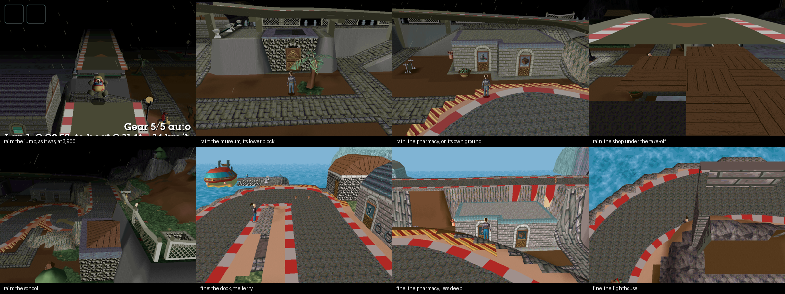

The user: the pharmacy and the storage building float; the museum and the shop are still gone in the rain; restore what can be on the town circuit too -- Mr. Paul's house and the ferry ticket office perhaps by making them "not quite as deep" or the land further out -- the museum may stay out of the fine weather's file. And the fine weather still had a jump script on the town circuit's bridge.

**Why the pharmacy floated.** Decors follow the ground under their origin (`IslandOps.DecorFollow`). The rampart road's verge was blended down into the town over the building's west half, which lifted the ground at its origin by 950 -- and the building with it, over a slope. Plans can now keep the ground under their kept buildings (`keepGroundUnder`: the footprint and 2 cells round it, `KeepGroundMargin`, untouched by `ModifyGround` except under the road's own surface). It now stands where it did, on the ground it stood on.

**The storm track over the shop and the museum.** A first try (v2026-10-06h) flew a carried jump of 36 cells over the whole museum, its pit lane shortened to clear the tavern; the user found the jump far too long and the pit lane too narrow, and would sooner lose the museum's top floor and the tavern. So the lap is as it was -- the jump off the rampart's end, an 11-cell gap (z 594 to 583) flown by the retail flight, the pit lane its 48 cells down the east straight, the start line at z 585.5 -- but higher: take-off and landing at 3,900 (it was 2,500), on one raised road from the harbour round to the north rampart (`raised` [SE1, N3], 141 cells; down to the north rampart at 5 %). Under it the town is untouched: the shop under the take-off (its top 3,500), the way into the docks, and the museum's lower block under the landing (2,618). What goes: the museum's top floor (bodies 31, 42) and the tavern, which the pit lane runs through. The double hairpin's east turn stays 5 cells west, clear of the school. The test pilot laps it through all its checkpoints, the jump off the deck and onto the deck.

**The town circuit (the fine weather's file).** Measured with the build itself (`buildingprobe <pristine> <scratch>`: Citadel's two files built into a scratch folder, every building gone and why, and for each kept one how far the road's curbs are from it and whether it or its ground moved):
- *Mr. Paul's house and the ticket office:* the dock loop ran along their fronts, its curbs 1.3-1.8 cells into them. The loop's north side now runs 2.5 cells further out over the dock's square (the plan's points, at least z 597.8): the curbs are 0.8-0.9 cells clear and their doors face the road.
- *The lighthouse:* the lap round its islet only came within the clearing's reach -- 5.5 cells, at sea level -- and its blend cut the hill at the door 2,000 down. Kept, with its ground: it stands, and so does the hilltop by its door.
- *The pharmacy and the baggage claim:* the bridge's ramp up the rampart runs 2.3 cells into its back (the island's edge leaves the ramp no room further west). The build now makes such a building shallower on that side (`trimKept`, `RaceTrackBuilder.TrimKept`): its pieces' bodies are copied with their points squeezed toward the far side -- the front, with its doors -- along the decor's own axis (its turn found by matching the body's box to the decor's), the copies go on the end of the island's OBL, and the decors' boxes are squeezed with them. The road's surface has to run half a cell or more into a building for that; one it only brushes -- a corner, a door facing the road -- is left as it is. Both doors work (Twinsen walked into the baggage claim).
- *The sewer's hut, the neighbour's house:* kept (the neighbour's 0.7 cells further from the lap, the road's points moved along its east side).
- *Not kept:* the museum (the bridge's ramp runs over it), the shop (the dock loop runs through it at street level, twice), the school (the lap runs through it), and two of the fine weather's own (no doors).
- A general push of the lap off kept buildings, as `KeepOnIsland` pushes it off the island's edge, is there too (`keepClear`, `KeepClear`: never through a building, at most 3.5 cells a round, not into another) -- but the town circuit doesn't use it: moving its dock loop moved its bridge, and the bridge's ramps then ran over Twinsen's house.

**The jump on the town circuit's bridge.** Citadel Island's scenes carry both weathers' tracks, so the storm track's jump zone stood in scene 42 in fine weather too, and raised to the rampart's height its reach took in the town circuit's bridge. The storm track's jump is now carried by the race-track mode of its own file only; and a jump's controller on an island with a track in each weather acts only in its own (`RaceTrackIsland.OwnWeather`: game variable 206, the controller's `&& w == var_game(206)`). The town circuit's test pilot runs its qualifying lap over the bridge and into the race with no jump.

**Mr. Paul and a race started on the line.** His stop (no gloves, on the start line) belongs to the story; a race started on its line has no gloves gate, and he put Twinsen out of his car there too. The race-track mode now sets game variable 209 while a gate of the track is shut (`RACE_GATE_VAR`), and he only stops a car then.

Checked (sandbox `E:\dump\TEMP\pbig2`, muted): the storm lap with the test pilot, the jump off the deck and onto it; the buildings in both weathers (pictures above); Raph lapping, stopping, his lines; Mr. Paul in the story, and not on a race started on the line; the beaten time to the lighthouse, the spell and chapter 2; the town circuit's qualifying and race over its bridge.

## A penguin's blast that left Twinsen alone: power-ups and a loaded game (2026-10-06, late)

The user: Twinsen can be hit by a penguin and not feel the blast -- are we resetting him properly once the protection spell or the super jet-pack wears off?

**When they wear off: yes.** Checked with two new console commands that make the case without a race's chance in it -- `raceitem <0..5>` uses a power-up (0 fuel, 1 protection, 2 lightning, 3 penguin, 4 super jet-pack, 5 oil) and `raceblast [cells]` sets off a penguin's blast that many cells ahead of Twinsen's car (1.5 if left out) -- on the storm track with the test pilot driving and taking no items itself (`autodrop_ms=0`): a blast stops the car; under the protection spell it doesn't; when the spell is over (30 s) it stops the car again; under the super jet-pack it doesn't; when that is over (10 s) it stops the car again. Across cube borders too. His armour is 0 in every scene (`heroarmor <game folder> 0 242`), so a blast's force of 20 always gets through.

**After loading a game: no.** The race mode keeps each power-up's end as a time on the game clock, and loading a game sets the clock back to the save's (`SetTimerHR(savetimerrefhr)`, SAVEGAME.CPP). A protection spell or a super jet-pack taken after the save then ran on, unseen, until the clock had caught up again -- its sparkles gone with the load, but Twinsen's car left alone by every blast (the log: "the blast leaves Twinsen's car as it is: the protection spell", in a game with no spell on), and the jet-pack's hand still on the wheel. A save made under the spell came back with the game's own spell on (the save keeps the protection's extras, the game turns the spell on from them) and nothing to turn it off.

**The fix.** A loaded game has no power-up from before it (`ForgetPowerUps`, called by SAVEGAME.CPP once the save's clock is set, `RaceMod_GameLoaded`): the spell and the jet-pack over (a protection spell the save had on while Twinsen drives with them), the item box empty, every car's boost, skid, shrinking and stop over, the penguins and oil slicks gone, the mushrooms back, Twinsen visible and his own size. (v2026-10-06j also did this whenever the game clock went back by more than a second; that went in v2026-10-06k: the game pauses its clock for every dialog, menu and scene load by setting it back to where it was, `RestoreTimer` in TIMER.CPP, so a pause would have taken Twinsen's power-ups away.)

Checked (sandbox `E:\dump\TEMP\pbig2`, muted, `--fixed-dt 20`): save, protection and super jet-pack, load, blast -- the car stops; protection, save, load, blast -- the car stops, the hero's NO_CHOC off; the wear-off run above unchanged.

## The penguins again: the protection spell's bubbles gone with a jump, and Citadel's shop in the fine weather (2026-10-06, night)

The user, after v2026-10-06j: penguins still go off at the car and do nothing, with no game loaded at all -- from the Polar dream into the Citadel storm track; and the shop's door is missing its decor.

**Why the blasts did nothing.** The user's own Play log (`release\lba2-play\adeline.log`) says it: each blast that left the car alone was "the blast leaves Twinsen's car as it is: the protection spell", the spell used earlier in the same lap. The race's protection lasts 30 seconds, nearly three laps of the storm track, and the spell's bubbles round the car are what tells the player it is on -- but they were gone long before that:
- the game turns its spell off whenever a script takes Twinsen's moves (GERELIFE.CPP `SET_DIR`, `ToggleSortProtection` when the hero's move isn't manual), and the storm track's jump is such a script: its flight sets his moves at the take-off and again at the landing;
- a scene's change puts the spell back (OBJECT.CPP `ChangeCube`) and then clears every extra with the hero's animation kept (`ClearExtra`), so the spell stayed on with no bubbles.

The race mode's own 30 seconds ran on regardless, so the car came out of the jump unprotected to look at and untouchable by blasts, oil and lightning.

**The fix.** While the race's protection has time left and Twinsen drives, the spell is put back whenever it is off or its bubbles are gone (`PowerUps` in RACEMOD.CPP, logged "the protection spell put back: N ms of it left"). Checked on the storm track with the test pilot: the spell put back at the jump's take-off and landing and at the scene changes to 48 and back to 42, the bubbles there in every picture up to the 30 seconds and gone after; a blast under it leaves the car alone, one after it stops the car.

**Citadel's shop in the fine weather.** On the storm track (CITADEL) the shop is the original's, its door and porch included: the raised road passes over it (pictures taken in the same place, the same camera, before and after the build, match but for the deck and its pier). The town circuit (CITABAU) took the whole shop away -- the circuit's bridge and both its streets run through where it stood -- but its door stays (a door is never removed: the cars can't use a building's door), so Twinsen walked into the shop from the open road, beside a strip of sea (the hole in the ground the shop's floor covered). The shop is pieces sharing their inner sides: the one with the door (body 90, x 512.6-523, z 602.4-608, top 2,427) stands between the two streets and under the bridge's deck (3,500). It is now kept, with its two neighbours as its walls: a new plan option, `thinKept` (`RaceTrackBuilder.ThinKept`), squeezes a kept piece toward one side to a few tenths of a cell -- the shop's north piece (89) to its south side and its south piece (91) to its north side, a quarter of a cell each, so their outer faces, the building's own north and south walls, stand where body 90 was open; the porch's back wall (95) closes the rest of the north side. The porch and its stall stood on the north street and stay out. The streets' middles are 4 to 4.4 cells from the pieces (their curbs clear), the opponents' lines 1.3 cells or more.

Checked (sandbox `E:\dump\TEMP\pbig2`, Citadel built with `buildingprobe`): the shop from its door, from the south street and the west; the door's zone where it was.

## The super jet-pack off Polar Island's terraces, and back on the road from the sea (2026-10-06, night)

The user: on Polar Island, with the super jet-pack, Twinsen sometimes leaves the track and ends up in the water.

**Where.** The dream sprint driven by the test pilot with a super jet-pack every 11 seconds (the user's own race file, a sandbox with their built files; `E:\dump\TEMP\pjet`, `run.sh`, `trace.py`): at 31 s the car is on the road up LBA1's tower 108, 8,200 up, coming to the hairpin at the terraces' west end, where the road turns from west to north at x 326.5; a second later the engine has it in its phantom cube (94) -- the sea round the island, where no scene is -- at sea level. It never made the turn: it turned at its steady rate all the way, on a circle of about 9 cells, and ran up the bank beside the road and over the island's map edge at x 320.

**Why.** The jet-pack drives the car along the line at twice the line's own speed (the speed planned for the car's own steering), and BUGGY.CPP only quickened the steering above the top gear's speed. The dream car's top is 120 km/h; through the hairpin the jet-pack had it at about 100 -- twice the line's speed, still under the top -- so it steered as slowly as ever and turned a circle twice as wide.

**The fix.** While the jet-pack drives, the car steers as much quicker as the jet-pack makes it go (`RaceMod_JetSteer`, used by both of BUGGY.CPP's speed functions: the larger of it and the over-the-top factor): the line's own circles, at its speed. Polar's sprint under jet-packs every 11 s, at two timings and with the pilot's own items too: the car keeps to the line through the hairpin and up the terraces, wins (33-50 s) and wakes up. The same under jet-packs on the other tracks, old engine against new: the storm track, the lava lake, Mosquibees Island, the Elevator Platform and the Desert lap as many laps, as fast or a little faster, and nothing is put back on the road.

**Back on the road from the sea.** A car that goes into the sea or the lava is put back on the road (`RaceMod_Rescue`) -- but only at a line point in the scene it is in, so a car out of that scene (into the phantom cube, or a neighbour's sea) had the drowning put off and was never put back: it stayed in the water. The race mode now remembers the scene the car was last safe in, and a car out of it is taken back to it: the scene changes and, once it is in, the car is put at the safe place on the line (`RescueArrive`; the scene change's own place can't be used -- asked for from inside AffScene, the frame's end clears FlagChgCube first). Checked by pushing the car out of scene 242 into scene 241's sea and out of scene 243 off the island's map: "off the road out of scene 243 (in 94): back to it", "back on the road in scene 243: line point 1206", and the pilot drove on up the terraces.

## Citadel's shop door in the game, and the rampart over the storm track's deck (2026-10-07)

The user, with pictures: the shop's door still isn't right in LBA Assembler, though the game outside it shows it right from the same folder; and the storm track still has ground over the road.

**The shop's door.** The door's window is two polygons of their own, 50 units in front of the door (OBL body 60 in CITADEL, the shop's door piece), of type 12 -- `POLY_TEXTURE_SOLID_INC`, a texture whose colour 0 is see-through: the shop's sack, drawn over the window. Their texture handle is `0xFFFF0000`, the whole page with its UVs anywhere on it (the door's own wood and grille use the same handle, in types 16/17). The engine's `Triangle_Texture_Solid`/`Quad_Texture_Solid` (LIB386/OBJECT/AFF_OBJ.CPP) took that value for an unassigned placeholder and drew the polygon's flat colour instead -- a fallback made for the body preview, where some BODY.HQR bodies drew nothing (2026-09-24) -- so in the game the sack was two flat blue-grey panes. The fallback is now the body preview's only (`g_previewFlattenTransparent`, set around its own render); in the game the handle draws its texture, as the retail game does: the sack is in the window. (Every type 8/12 polygon with that handle was drawn flat in Play and in the editor's 3D view until now.)

**The ground over the deck.** Measured along the storm track's raised road (every ground point within the deck's half width against the deck's height along its segment, `poke.py`): 13 points over the deck, all at its two ends -- up to 700 over its north edge where it comes down beside the north rampart (cells 522-528, z 522-524: the rampart's slope and rock, the user's picture), up to 111 at its foot by the harbour. The lava lake's plan already cuts such ground (`raisedCut`, `CutUnderRaised`: the ground near the deck cut to under it, and under each end the ground made the deck's own surface out to its rails, `FlushRaisedEnds`); the storm plan now has it too. The cutting now leaves the kept buildings' ground alone (`keepGroundUnder`), except where it stands up through the deck: unbounded, it raised the baggage claim's floor 231 at the north end. Built (`buildingprobe`): no ground over the deck, every kept building and its ground as before, the fine weather's files and the storm file's objects byte-identical; the pilot laps it (12 s, and 7 s under jet-packs), every jump, nothing put back on the road.

## The Island of the Francos: over the dock, the refinery and the village (2026-10-07)

The user: a track for KNARTAS.ILE, through its three parts -- the village, the refinery and the dock; the village's houses made bigger and Twinsen driving through some of them; lots of pipes and steam in the refinery, and oil dripping in places; the port's ideas left to me. Then: loads of height, lots of loops and jumps, a longer lap than the flat ground allows.

**The lap** (`tools/RaceTrackPlan/knartas_design.py`, run in `E:\dump\TEMP\knartas` with the island's heights and decor boxes; `docs/racetrack/knartas_track_plan.json`; `RaceTrackIsland.Knartas`, scene 107): 598 cells, nearly all of it a raised road at three levels that passes over itself -- the dock's road at 3,400 (over the piers' railings and crates), the high road at 6,000 over the refinery's buildings and the top road at 5,600 over the rocks north of it -- with the village's stretch down among the huts. It starts on the dock's east arm, loops over the north arm, jumps the inlet's mouth past the rocket (a carried jump, 55°), climbs east along the south arm over the start straight and the channel, loops between the refinery's tanks, runs east among the pipes, leaps the cracking tower (22°) into the village, drives through four huts, loops along the south shore, jumps the compound's east fence (30°) and climbs to the top road over the rocks (two loops there, the second with a 35° gap at its top), then comes down the channel over the little bridge to the start. Five loops (the engine's limit was four: `RACE_MAX_LOOPS` is 8 now) and three carried jumps; the steepest grade 18.6 %. Drivers: De La Fontaine (the tanker, the one to beat), Mr. Kurtz (the laboratory) and the nurse (the pram).

**The port.** The dock's road runs over the piers high enough to keep their railings (an earlier 2,600 took them off); the airships stay moored beside it, the rocket stands under the inlet jump, and the start's grid waits on the east arm with pit spots under the straight's west edge (with no pit lane, grid spots ran back round the U-turn and sat on the road while the player qualified).

**Through the village's huts** (`RaceTrackDriveThrough`, plan `driveThrough`: a hut's body and how much bigger). Each hut's pieces (the decor group sharing its origin) are scaled up round the road and cut where it runs: every face over the road's corridor below the deck plus 1,900 is dropped, the rest split into a left side, a right side and a roof, each a new OBL body of its own with its own box (the road's passage left clear), and every face made two-sided -- from inside, the dome's inner side shows. The parts are kept as they are by the clearing (`asIs`: the kept-box cut would flatten their boxes and the adrift-decor clearing took them). Four huts: 88 ×1.4, 81 ×1.6, 84 ×1.3 and the village's middle cluster (76-79) as it is; the road runs under each dome.

**The refinery's pipes** (`RaceTrackPipes`, plan `pipes`: stretches of the lap, a gantry every few cells). Each gantry: two grey pipes standing on the compound's floor outside the rails, up 2,900 over the deck with red vent caps, a cross pipe over the road 2,200 up (its box the only one: nothing else is in a car's way), and a pipe along each side to the next gantry; a lit body (greys ramp 48, reds 64). None stands where another part of the lap passes through an upright or over the cross pipe. Five gantries over the high road (one left out in the widened loop deck on the top road beside it). The race-track mode (`steam=`, `drip=` in the race file, `Vents`):

- steam puffs from each upright's top, each on its own time (every ~0.9 s), rising and growing as it fades -- the game's own smoke puff (pof 1), at most 16 at once, only near Twinsen;
- every other gantry drips oil from its cross pipe onto one side of the road (alternate sides, 45 % of the way to the rail): a drop falls (seen near Twinsen) and where it lands a slick lies for 9 s unless a car takes it -- the oil power-up's slick and skid, the slicks shown by the scenes' own oil actors (only where one is free, never one on the road unseen, never a dropped one replaced: `RACE_MAX_SLICKS` 10). The pipes drip wherever Twinsen is, so a slick may be waiting when he comes.

Tested with the test pilot (`pilot.sh`): the qualifying lap 73.3 s, every loop and jump taken, nothing put back on the road; slicks lying under the pipes off the car's line.

## The Island of the Francos twice its size, in three looks, with loops on the level (2026-10-07, later)

The user: drop the vertical loops; more height, and more loops but not vertical ones; the whole island bigger, maybe 4 times its size, everything scaled up; more steam -- the Gazogem factory's steam that hits Twinsen -- and more oil drips; three distinctly themed sections.

**Twice its size each way, four times its area** (`Terrain/IslandScaler.cs`, `RaceTrackIsland.Scale`/`MoreScenes`; done by the build, from the originals, before anything of the track's). About the corner of the island's first cube, everything goes twice as far and twice as high:

- the ground: each cell becomes 2 x 2 cut the same way, each triangle inside one of the old cell's with that part of its texture -- the island looks as it did, twice as big; heights doubled, the light, the game codes and the water depth as they were;
- the objects: twice as far and as high, their boxes doubled, and every body of KNARTAS.OBL twice its size (box, points, spheres; none past what a body holds);
- the scenes: 107, 108 and 109 become 12 -- each keeps its number for the cube its Twinsen starts in, the other 9 are scenes 255-263. Zones, track points and actors go twice as far into the new scene of the cube they are in (a zone into each it reaches); an actor not in a scene's cube stays in its list as an inert stand-in (out of sight, no scripts), since scripts name actors by their place in it; the cube changes between the 12 cubes are made afresh; and every other scene's way onto the island (the factory's and the houses' doors out, the guard post's) leads to the same place, now in its new scene;
- the holomap: its camera's target twice as far and its distance doubled -- a perspective, so the game's own picture fits the island as it is now, the track drawn into it and Twinsen's place too -- and the island's scenes' arrows moved with it.

Scenes past 254: the engine's holomap arrows (`TabArrow`, kept in the saves) stop at `MAX_CUBE` 255, and the exterior edge crossings read a scene's arrow flags (`GereZoneChangeCube`: bit 2, an exterior scene). `CubeArrowFlags` (HOLO.H) gives a scene past it the flags of an exterior cube with no arrow; the holomap's "where is Twinsen" takes the same. Nothing else in the engine is sized by scene number. (Scenes 222-254 are all the race tracks' already: the story's arrow, the lava lake, Sendell, the moon, the Emerald Moon, Polar Island.)

**The lap** (`tools/RaceTrackPlan/knartas_design.py`, now on the scaled island: `scaleisland` in a sandbox, `islandheights`, `decorpoints` + `obstacles.py`): 1,400 cells, 2,700 to 16,700 high, steepest grade 16.9 %; three carried jumps (over the rocket at the inlet's mouth, off the refinery's north-east corner over the cracking tower down into the village -- topping out at 16,700 -- and past the refinery's east fence up onto the climb); no rings. Its three loops lie on the level: a **cloverleaf** -- where the lap would turn one way, three corners turning the other way take it round 270 degrees and over its own way in, 2,700-2,900 above it there: over the sea off the dock's north-west corner, over the refinery's south fence (up onto the high road at 14,000), and over the village's hills between its first hut and its middle.

**Three looks** (`DeckTheme`, plan `themes`: stretches of the lap by its points; `RaceTrackRaisedBody.Tile`/`Pier` take one):

| Section | Deck | Curbs | Rails | Piers | Arrows |
|---|---|---|---|---|---|
| dock | dark wood planks (23) | blue and white (201/63) | wooden (28/25) | wooden piles (24/20/27) | white |
| refinery | dark steel (52) | yellow and black hazard (108/49) | red (70/67) | steel with red caps (57/54/70) | yellow |
| village | sandy earth (104) | green and white (134/63) | olive (121/118) | brown with olive caps (100/97/120) | orange |

The dock's stretch is its piers, the sea loop, the inlet and the south arm, and the channel down from the rocks back to the start; the refinery's from the channel to the tower leap; the village's from the leap's landing round the huts, the south shore and the climb over the rocks.

**Steam, the factory's own.** The Gazogem factory's steam (its rooms' scripts: `set_hit_zone(n, 10)` with `impact_point(n, 37)`) is impact 37. The race-track mode now blows it out of the road (`jet=x y z reach on off phase`, `Jets`): each jet blows in bursts (1.3 s in every 3.5), one after another down the road ahead of a car, on one side of it and then the other; a car in one while it blows is hit as by a penguin's blast but held 0.9 s ("Scalded by steam!") -- not with the protection spell or on the super jet-pack. 14 jets along the refinery's roads (plan `steamJets`), and the pipe gantries over them -- 16 of them now, 32 vents puffing.

**More oil.** Every gantry drips now (`dripsEvery` 1: 16 drips), the scenes have 5 oil slicks each (3 until now) and the race-track mode 16 slicks in all (10).

**The village's huts**, twice their size with the island, are driven through as they are, half way up their domes; a roof piece's box is now over the deck's highest point under it (the road climbing out of the village's middle ran into the cluster's roof).

**Tested** (sandbox `E:\dump\TEMP\kbig`, `pilot.sh`, start scene 257): qualifying 143.8 s, the race's laps 156.1, 147.4 and 158.1 s, the three opponents 145.6-157.0 s; every jump carried, nothing put back on the road. The hazards hit everyone: in the race the opponents skidded 24 times and were hit by steam 31 times, the test pilot 21 and 12. (A first run had the nurse parked on her grid spot in front of the line while the player qualified: of the plan's three waiting spots one was in the next cube, and only the start scene's are written -- all three are in its cube now.) The build through the window's path (`buildtogether` with Polar Island and Citadel Island, then `buildhere` again in the same folder) makes the island bigger once, from its originals; the holomap shows the game's own picture with the lap drawn on it where it runs.

## The Island of the Francos: shorter leaps, steam across the road, the pipeline to the air-boat, oil that stays on the road (2026-10-07, night)

The user: two of the jumps far too long, the one over the air-boat only just okay -- shorten the other two substantially, and the boat's a little by bringing its landing closer; oil at some points close to the ground passing through the track onto the floor below; the steam sideways, out of the left side on one lap and the right on the next; and a massive pipe above the track from the Gazogem factory to the air ship, dripping oil at fixed places where it is over the track.

**The jumps** (`knartas_design.py` `JUMPS`): the leap over the factory 76 cells to 42 (its ramp moved on to the factory's north edge, its landing just past it), the leap past the refinery's east fence 60 to 30, the jump over the air-boat 35 to 32 (its landing 3 cells closer). A jump can now have its landing lip's height and its landing hill's foot of its own: the factory leap lands at 7,600, clear of the factory's back, and its carried landing hill takes it down to 5,600 -- steeper than a road may be, but the race-track mode carries the car down it with the flight -- so the road comes to the first hut low enough to go under its dome. The road is level to the leap's ramp.

**Steam across the road** (`jet=x y z half reach on off phase dirx dirz`, RACEMOD.CPP `Jets`): each jet stands on the road's middle and blows out of its rail across it -- out of the driver's left on the player's odd laps (the qualifying lap and the race's first and third), his right on the even ones; a burst keeps the side it began with. The steam is the factory's own impact taken apart: its hiss at the burst's start, its puffs (sprites 100-109) in a row from the rail into the road, a puff flown across the road growing as it goes, and its sparks (flow 16, its angle up taken down for the spray) blown across. A car in the band from the rail 5.5 cells across (the road is 9.5) while it blows is hit as before; the other side of the road is clear. (The first form, up out of the deck, is still read.)

**The pipeline** (plan `pipeline`, `RaceTrackPipes.PlacePipeline`): a pipe 1,400 across, teal with red flanges, out of the factory's west wall, up to 12,000 and west along the refinery, under the high road (1,000 to spare), over the channel road and the start straight 13 cells past the start line, and down into the air-boat's deck between its two hulls; 29 pieces of pipe on 9 concrete supports (none where the road passes through a support's way up). It drips oil where it passes over the road -- every 2.5 cells along it there, each drip on its own time (`drip=`): 6 drips, over the channel road and the start straight. `RACE_MAX_DRIPS` 48.

**Oil off the road.** A slick takes the deck under it -- found where it lies, at its height -- or else the ground. A slick dropped behind a car where that is just off the deck (a bend's outside, past a jump's lip) or by a car in the air found no deck and lay on the ground under the road. Now a slick that misses the deck but has it within 1,100 at its height is moved onto it, a slick's width in from its edge; one with no deck near it that would lie more than 900 under where it was dropped is gone (`PoseSlick`). And the opponents waiting on their spots while the player qualifies are no longer skidded or scalded where their lines would have them.

**Tested** (`E:\dump\TEMP\kbig`): qualifying 145.0 s, the race's laps 153.1, 162.0 and 149.7 s, the opponents 146-182 s; every jump carried, nothing put back on the road. The steam out of the left rail on the race's first lap and the right on its second (pictures); with it on one side of the road the test pilot, down the middle, was scalded 6 times in four laps (12 before). A lap with the pilot dropping oil every 2.5 s: every slick on the deck. (The case the user saw wasn't met again; the race-track mode's log says "a slick off the deck's edge moved onto it" or "... with no road under it: gone" when it happens.)

## The Island of the Francos: the factory's horizontal steam, shorter leaps still, Gazogem fuel all race; the editor's whole-island view (2026-10-07, late)

The user, with pictures: the steam jets still show vertically -- the Gazogem factory has horizontal steam jets of its own, use those; the two long jumps still too long; remove Gazogem as a pickup and have it on the cars all the time on this track only; and in the editor, moving a map shifts it against the background and can leave part of it off the screen.

**The factory's horizontal steam.** The factory's rooms play two steam impacts: 37 (a jet straight up, sprites 100-109, flow 16 -- what the race-track mode had used) and 38 (a jet out of the walls on the level, sprites 110-118, flow 76, the hiss sample 17). The jets now play 38's: its hiss at the burst's start, its jet at the rail and a third and two thirds of the way across, and its sparks -- flow 76 already sprays on the level, the way it is turned (the road's other side). The sprites are drawn blowing to the screen's right only, so a jet that blows to the left from where the camera is is drawn mirrored: `EXTRA_MIRROR` (bit 30 of an extra's flags) has OBJECT.CPP draw a mirrored copy of the raw sprite (`MirroredRawSprite`, made once and kept), placed so it mirrors about the extra's place. Their scale 22 (the factory's 35 is for its rooms' close cameras): the jet reaches over the band it hits. Out of the left rail on lap 1, the right on lap 2 (pictures).

**Shorter leaps.** The leap over the factory 42 cells to 24 -- its ramp now on the high road over the factory's roof (1,637 over it), landing just past it -- and the one past the refinery's east fence 30 to 18. The jump over the air-boat stays at 32.

**Gazogem fuel all race** (`RaceTrackIsland.FuelAlways`, the race file's `fuel_always=1`): no mushroom gives it, and every car has its boost all race -- the player's car 1.5 times its top speed and pull (the super jet-pack's own speed while it drives), the opponents 1.35 times their pace; the test pilot drives the line at the boosted speed. A lap is now about 95-100 s.

**The editor's view of a whole island.** The native view drew a square of 5 x 5 cubes round the cube under the camera's target (`AffGrilleExtWide(2)`), the sea with it: moving the view moved that square -- the sea under the island -- and an island wider than it lost its far cubes (the Island of the Francos twice its size is four cubes across: with the camera over the dock, the village and the refinery's east side weren't drawn; over the village, the dock wasn't). Now the renderer draws a rectangle of cubes whichever the camera is over (`AffGrilleExtArea`, `lba2_renderer_render_frame_area`), and the editor gives it the island's cubes and a ring of sea two cubes wide round them (`IslandCubeArea`): the whole island always, the sea fixed under it. The actors, routes and zones drawn over the view take the same rectangle. (`polarview` takes `AREA=x0,z0,x1,z1` and `FAR=` to compare.)

**The oil through the track, found.** A full race logged it at last: a slick 1,057 across from a deck's middle, inside its width, yet with no deck under it -- past the deck's end, over a jump's gap: a car that has just landed drops its oil 1,300 behind it, back over the gap, where there is no road and the sea or the ground far below. The earlier fix only moved a slick across onto a deck beside it; now a slick that misses the deck is put on the nearest place on it -- across and along, at a jump's landing lip -- and one that still has no deck under it is gone.

## The Island of the Francos: steam out of the gantries' pipes, the camera behind the car under the huts; moving the editor's view past an island's edge (2026-10-07, later still)

The user, with a picture: the steam looks like it comes out of the track -- have it come out of the vertical pipes on the track, fully horizontally; driving under parts of the houses forces the camera to look straight down until Enter puts it back behind Twinsen -- keep it behind him. And, with the editor's view now pinned to the island: it is hard to zoom in on some parts of an island -- let the whole thing be moved so that any part of it can be brought to the middle of the view.

**Steam out of the uprights.** A steam-jet stretch (`steamJets`) now blows out of the gantries in it (`RaceTrackPipes.Place` takes the jet stretches): each of their uprights has a nozzle -- a short pipe towards the road with a red mouth, `SteamJetRun.High` (700) over the deck -- and the jet record (`jet=`, an 11th number: how high over the deck it blows, `RACE_STEAM_HIGH` 380 without it) starts at the nozzle's mouth, the upright's distance from the road's middle less the pipe and the nozzle, and reaches `Reach` cells into the road from its rail. Left upright on lap 1, right on lap 2, as before. A stretch with no gantry in it still blows out of the rail. Two things kept them from being seen or felt, both found with the pilot: the pipes' tops puffed into all 24 of the steam's extras (nine gantries in reach, eighteen tops), so the jets drew nothing -- the tops now take 12 at most (`RACE_VENT_PUFFS`); and each jet blew a `Wave` (450 ms) after the one before, which is a Gazogem-fuelled car's own pace from gantry to gantry (6 cells in 420 ms): a car that came between two bursts rode between them the whole stretch. Each now blows a `Wave` *before* the one before it -- the burst runs back up the road at the car: in a qualifying lap and a race lap the pilot was scalded twice a lap, and the opponents too.

**The jet's look, fixed** (the user, with an in-game picture and a drawing of what was meant: a narrow plume out of the nozzle, level across the road). The factory's wall jet (impact 38's sprites 110-118) is drawn on a slant for the factory rooms' cameras, and it blows to the screen's *left* from its right edge (its hot spot is its right edge: -58 in a sprite 60 wide) -- the mirroring had it the wrong way round, so out of a left upright it billowed outwards, away from the road, and drawn as big as the whole reach. Now the jet is the factory's other one, its burst straight up (impact 37's sprites 100-102: 102 is a narrow-rooted plume 27 x 71) laid on its side: an extra with `EXTRA_SCALE_TURNED` (in its `Scale` -- every bit of an extra's `Flags` is taken) and its way in `Vx, Vy, Vz` (unused for an animated sprite that doesn't fly) is drawn by `DrawTurnedExtra` (OBJECT.CPP) from a turned copy of its sprite (`TurnedRawSprite`, made once and kept, its right side up either way: the plume rises a little), its root -- its hot spot -- on the nozzle's mouth, as thick as its scale makes it there and as long on the screen as the way to its end is (shorter where the jet runs towards the camera), to the screen's left or right as that way goes, worked out every frame. The race-track mode gives it a scale that makes 102 as long as the jet's reach (71,000 / reach), so the steam covers just the band that scalds; at a burst's start it grows from 100 and 101 (240 ms). Out of the left uprights on lap 1, the right on lap 2 (pictures), the car scalded as before.

**Through the track, and stuck under it.** The user, with a picture: Twinsen went through the track as lightning and steam struck. Their Play log (lap 21 of a long race, the protection spell on, so neither the lightning nor the steam touched the car) has the car landing from at least 2,048 down ("the car is hit, but protected" is also what a protected landing from a fall of 8 bricks says) on the high road between checkpoints 4 and 5 -- just after two of Twinsen's penguins had stopped Mr. Kurtz's car dead in front of him -- and no checkpoint of Twinsen's after it: the engine, left running when the editor was closed, was asked over its control socket where the car was (`status`, `dumpstate`): on the ground 10,800 under the high road, inside the bend where it turns east (cube (9,7), cell (633, 497)). What put it off the road was not found: four laps of a stress race (every mushroom a protection spell, lightning, penguin or oil, used at once) never left the road. But nothing would ever have put it back -- the rescue was only for lava and the sea. Now (`FallenBelow`, RACEMOD.CPP) a car on a raised-road track that has stood RACE_BELOW_MS (1.5 s) off the lap -- no point of the line within 4,500 of it at about its height -- with the line's nearest point within 16 cells at least 1,500 over it is put back on the road at its last safe place, as from the sea (not in a jump's flight, a loop, the super jet-pack's or a fall still going on; the line, not the raised road, so that a lap on the ground beside a raised part, the Desert island's, is the lap). Tested by teleporting the pilot's car to that place mid-lap: put back 1.5 s after it landed, and on to the next checkpoint.

**The camera under the huts.** The trace (`camtrace 1`) showed the camera's pitch going from 300 (the default, behind the car) to 434-714 and staying there. At every cube edge the lap crosses, the scene change re-centres the camera (`CameraCenter(1)`), and the classic `SearchCameraPos` lifts the eye over any decor's box it finds it in -- a drive-through hut's roof, a gantry -- and steepens `AlphaCam` to look down from there; the follow camera takes its pitch from `AlphaCam`, so it kept looking down until the player re-centred it. With the race-track mode's follow camera on, `CameraCenter` now leaves that search out (INTEXT.CPP): the follow camera keeps its own clearance over the ground and the raised road. A whole lap and a race lap: the pitch never left 300.

**Moving the editor's view past an island's edge.** The view looks at a point 10,000 up, so the ground in the middle of the view lies some 20,000 beyond that point at the usual tilt; and the view's middle had to stay over a cube with land (`IsWorldPositionOnIsland`) -- the renderer couldn't place its camera over open sea, `set_view_target` failed there -- and the pan scrollbars' range was the island's cubes. So an island's edge on the camera's side could never come to the middle. Now the middle may go a cube out past the island's cubes (`IsWorldPositionInView`, `PanRing`; the scrollbars' range too), within the two-cube ring of sea the view draws; and the renderer, given a target over open sea, takes the nearest cube with land as the frame its camera is placed in (`lba2_renderer_set_view_target`). Checked in the editor with ASCENCE.ILE (one cube): the page buttons now take the view a cube out either side, where they stopped at the island's own cube.

## The menu command

Tools > LBA2: Desert island race track... (`RaceTrackWindow.cs`, `Terrain/RaceTrackService.cs`) builds the track from the plan built into the program, or from a plan file. The scene options are choices in the dialog; the crossing style, clearing the old track and drawing on the holomap were too, until 2026-09-30 (see "Fixed choices").

The first build keeps `DESERT.ILE`, `DESERT.OBL`, `SCENE.HQR`, `ANIM.HQR` and `RESS.HQR` as `*.before-racetrack` beside the originals (a folder built before the jump used the last two keeps them from its next build on, while they are still the originals), and every build starts from those. "Put the original files back" restores them all and removes the copies and RACETRACK.JSON. "Race car setup…" opens the car setup. The editor's views are refreshed afterwards.

It was tested on a fresh copy of the game folder, with the bridge and with the jump (again on 2026-09-28 with the squared-up jump, checkpoints and opponent, and with Baldino's car: all six files): the result is byte-identical to the command-line build (all five files and RACETRACK.JSON), and restoring gives back the original files' hashes.

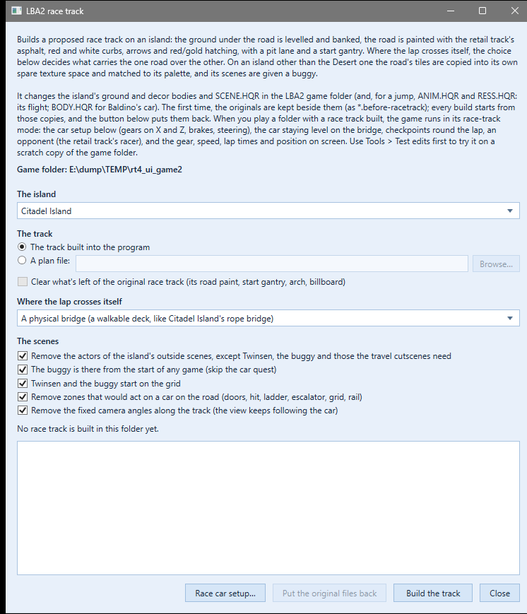

Extra commands in `ScriptRoundTrip`:

- `driveprep <game> <cellx> <cellz> <turn>`: the buggy and Twinsen ready on the road at a cell.
- `initbuggy <game> <scene>`.
- `scripttext <game> <scene> <actor> life|track`: a script as the editor's C text.
- `racetrack island <n>` and `racetrack <cx> <cz> --scripts --hero`.
