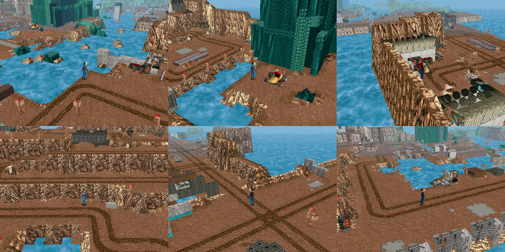
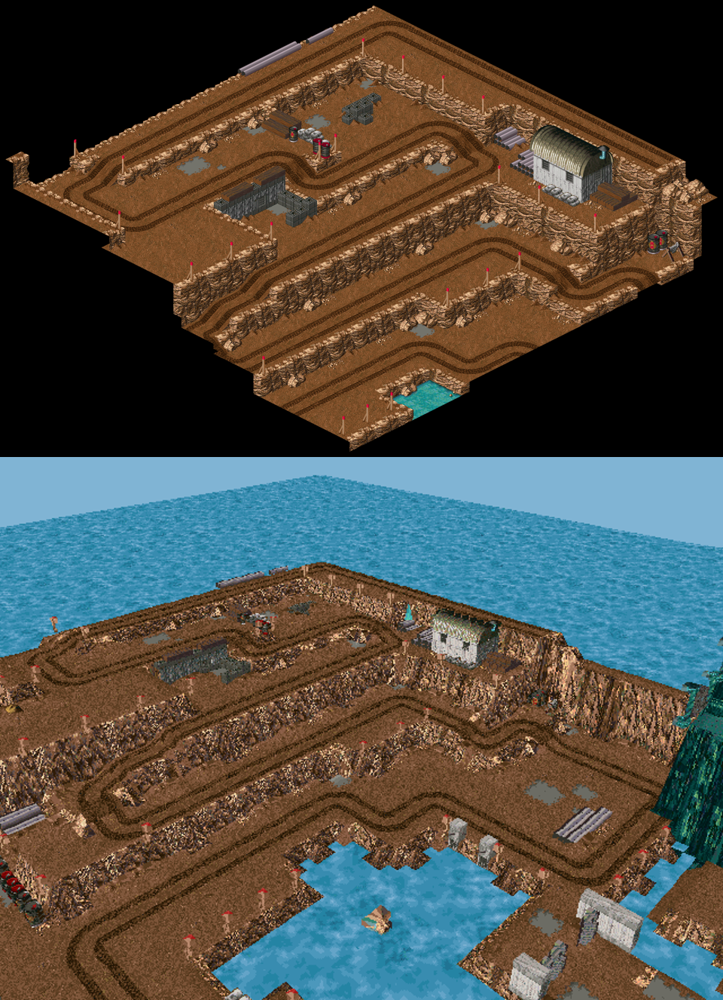
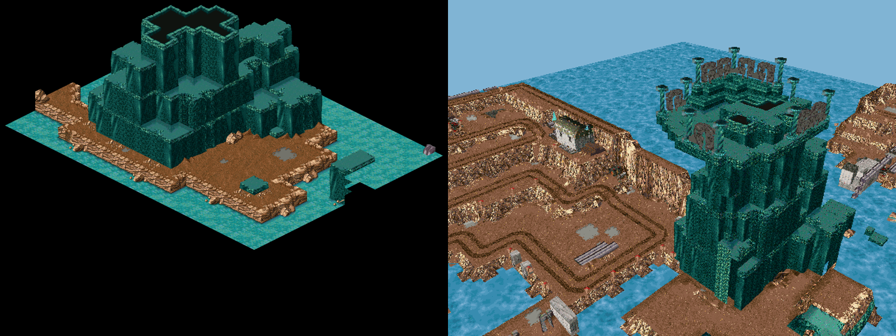
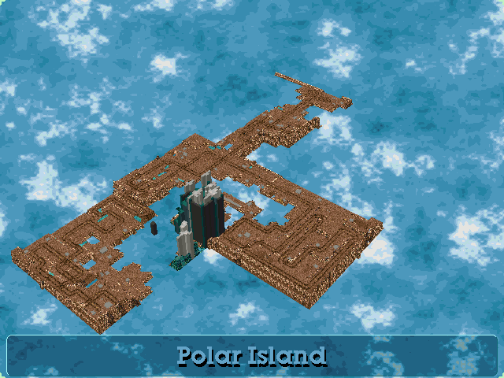

# Polar Island: LBA1's Polar Island as a new LBA2 island (2026-10-05, twice its size since 2026-10-06)



LBA1's Polar Island is six outside scenes, each a fixed isometric view. Here they become island 12 of LBA2: one island you can walk round
and look at from any side, in LBA2's own engine.

**To use it:** Tools > **LBA2: Polar Island (from LBA1)…** in LBA Assembler. You need both game folders set under File > Settings (it
reads LBA1's scenes). The same menu builds the island again or takes it out. Then pick `POLAR.ILE` in the Island list and Play any of its
scenes; Twinsen starts on the dock.

**Only LBA Assembler's own engine loads island 12.** The engine changes are listed below; the original `LBA2.EXE` doesn't load it.

**Twice LBA1's size (since 2026-10-06, later).** The island is LBA1's at twice its size every way (`PolarLayout.Scale`): a cell of
LBA1's is two by two of the island's, a layer two. The user asked for it to make room for the race track: 108's car tracks wind back and
forth up its terraces five times, their ways six to eight cells apart, and the race track's road, eight cells wide, could only follow
three of them. At twice the size they are twelve to sixteen cells apart. The ground's heights are LBA1's corners scaled (between them
the island's vertices follow each LBA1 cell's slope), so its slopes are as steep as LBA1's; the objects are the same boxes, twice as big
(their textures stretched); LBA1's places (the dock's start, the zones' joins) are scaled. Each LBA1 scene's grid is then two cubes by two
or a little more: the island is in cubes 5–9 × 4–10, and 21 of them have land. Twinsen and his car are the size they were, so the huts,
walls and crates are twice as big round them.

## The layout




The outside scenes are joined where their car tracks meet (`Terrain/Polar/PolarLayout.cs`):

```
115 1st scene (the dock) -- 106 2nd scene -- 107 3rd scene -- 108 before the rocky peak (west of 107)
                                                           -- 109 4th scene (north of 107)
```

The scenes don't fit together exactly:

* **The joins:** the cube-change zones put each scene nearly in place, but a cell or two out. LBA1 sets Twinsen down at one point of
  the next scene wherever he crossed the zone, so a zone gives a scene's place only roughly, and the zones overlapped grids that meet
  edge to edge. Comparing where the tracks reach each edge (`polarexits`) and which bricks the grids share (`polarfit`) gave the real
  places:
  * 106, 108 and 109 meet 107 edge to edge, each where its tracks run on from 107's at the same height. 106 is one cell west of the
    zones' place and 108 one cell south.
  * The dock (115) shares a strip of ground with 106 (228 columns, 132 of them the same top brick at the same height), so it lies over
    106 there, one cell south of the zones' place.

  Where two scenes cover the same column, the whole column comes from the scene it lies deeper inside, never half from each. The car
  drives straight across all four joins.

* **The rocky peak (110):** 108's gate leads to 110, the crystal mountain. Put where its zones say, 110 lands on top of 107. 107's north
  corner already holds the same mountain, only cut off at the grid's edge and in a slightly different place. So 110 is left out. Its
  mountain is matched against 107's (the offset where most of its tall columns stand equally high in 107) and placed there whole.
  * 107 and 109 also draw parts of the mountain, a few cells from 110's. Those copies are replaced by what 110 has at those places
    (36 columns), so there is one mountain, LBA1's shape.
  * LBA1 leaves columns hollow where its camera never looks, under a tier or behind the front ones. Seen from all round, each column is
    filled down to the sea.
  * The peak is **twice as high** as LBA1's: every layer becomes two, from the sea up (its top was at layer 23, now 46). It is built as
    objects with straight crystal walls; a height map would turn its tiers into slopes.


* **The plateau (111):** "On the rocky peak", the plateau of twisted pillars, goes on top of the peak: at the offset the 110 ↔ 111 zones
  give, lifted as much as the peak grew. Its own teal floor far below the plateau is a backdrop and is left out.
* **The gate:** across the water from 108's gate, a causeway of the gate's own ground leads onto 107's path to the mountain. It is 14
  cells long now that 108 sits where its tracks meet 107's.

## The ground (`PolarTerrain.cs`)

An LBA1 scene is bricks in 64 × 25 × 64 cells. An LBA2 island is a height map of textured triangles. A cell is the same size in both
(512 world units across, 256 a layer).

* **What counts as ground:** a cell's block-library code decides it:
  * Ground: dirt (6x), the small dirt and grey patches (06, 77), water (F1), crystal (Ax), and brown or teal rock (00 bricks that aren't
    grey).
  * Not ground: grey 00 (concrete walls, crates), metal (22: huts, barrels, pipes), wood (33) and F0 (posts, fences, gates, pillars).
    These become objects.
* **Heights:** each column's ground is its highest ground cell. A height map has no walls, so where two cells of different heights meet,
  one of them becomes a slope. Each corner of the height map takes the height of the cells round it that keep theirs, in this order:
  1. car tracks (dirt whose top is tyre tread);
  2. other dirt, the paths;
  3. water;
  4. rock: the brown rock of the cliffs' rims and foot, and the crystal.

  So a cliff's slope is its rocky rim, not the track at its foot. The water stays flat up to the rock that slopes into it. A step beside
  a track is on the other side. Of the 2,033 track cells, none loses its tread; 93 tilt where the ground itself climbs a layer.
* **Textures:** a ground cell is textured with its brick's top face, unskewed from the sprite's diamond into a **32 × 32** tile. That is
  the retail islands' size; LBA1 draws a cell's edge about 27 pixels long. The 507 faces this takes don't fit one 256 × 256 page, so
  the island has 8 (see *Texture pages*).
* **Colours:** colours map to the nearest of the palette's lit colours. The palette is the fine-weather Citadel's (RESS 42), as near to
  LBA1's browns as any island's.
* **Light:** the engine shades textured ground through the palette's light table, and level 12 (`ShadeNormalLevel`) leaves a colour as
  it is. Baking the cubes' sun put flat ground at 8, a third darker than LBA1. LBA1's bricks have their light drawn in, so flat ground
  is now at 14, two shades lighter than the palette's own colours, and slopes keep 0.6 of the bake's difference round it.
* **Cliffs:** a cell whose corners are two layers or more apart shows a column's side, two bricks of it, turned so its top runs along
  the slope's high edge. A rim dropping to the path below shows its own column; a cell climbing to a higher one shows that one's. Slopes
  steeper than 40° get the engine's own collision bit, so they are walls; one-layer steps stay walkable.
* **Banks:** water next to dirt is drawn as a bank sloping down into LBA2's sea, in the land's side texture. It is still water to
  Twinsen.
* **Rocks in the water:** a piece of land of 40 cells or fewer with the sea all round it is built as an object instead (139 columns).
  Its sides go straight up out of the water. LBA1 draws these rocks with the water round them on the same brick, so the water's own
  colours are taken off their bricks first, and the sea shows round the stones.
* **Enclosed water:** water with land on all four corners is drawn flat with LBA1's own water texture.
* **Open water:** everything else is left undrawn, so the engine's sea shows through.

## The objects (`PolarObjects.cs`, `PolarTextures.cs`)

What isn't ground is built as island objects: 719 bodies in `POLAR.OBL`, one decor each. So are the rocky peak and its plateau.

* **Boxes:** each piece of touching object cells, in chunks of up to 8 × 8 columns, is a body of boxes, one box per cell.
* **Collision:** the engine's collision for an object is its decor's box, the whole rectangle round it. A chunk whose rectangle would
  take in ground that it doesn't cover (a track between two fence posts) is split until it doesn't. No track cell is inside an object's
  box any more; before, 27 were, invisible walls across the tracks.
* **Faces:** every face of a box that something else doesn't cover is drawn, including the sides LBA1 never drew (−x and −z). Those take
  the opposite side's texture, so nothing is see-through when you turn round.
* **Thin objects:** a box is the part of its cell the brick fills, read from the brick's outline. A post is a thin box; a wall fills its
  cell.
  * A box's outline fixes its middle and the sum of its width and depth; of the boxes that fit, the one whose outline is most like the
    brick's wins.
  * Bricks that draw little of their cell get their nearest box even when the fit is poor. LBA1 splits a post's picture among the bricks
    of every cell it crosses *on the screen*, so a brick may hold just one piece of a post, or the roots of another.
* **Mist:** the plateau's mist is dithered sparkle, mostly lone pixels. No solid object can show that, so those bricks are left out.
* **Textures:** each face is textured with its brick's face, 32 pixels to a cell. Where the sprite hardly draws that face, it uses the
  face the brick draws most of; failing that, the brick's commonest colour.
* **Pages:** the faces fill 7 object pages. A body draws from one page, so each brick's faces are all on one page, filled in the
  order the chunks first use the bricks. A chunk whose bricks ended up on two pages becomes a body for each.
* **Gotcha:** each atlas tile needs its own entry in the body's texture table (its place in the page plus a 32-pixel repeat mask). One
  entry for the whole page, `0xFFFF0000`, is what the engine takes for a placeholder: it draws the polygon in its flat colour instead,
  which came out black (`AFF_OBJ.CPP`).

## Texture pages

A retail island has one 256 × 256 page for its ground and one for its objects. At 32 pixels to a cell, Polar Island needs 8 ground
pages and 6 object pages, so the engine reads more pages for an island that has them. A retail island has none and draws as before.

* **In the file:** after the last cube's records, `POLAR.ILE` has a header entry (`PAGE`, then how many more ground pages and object
  pages), then those pages. Retail islands end exactly at their last cube's records.
* **Ground:** a ground triangle's texture index (13 bits) holds its page in the top 3 bits and its texture definition in the cube's list
  in the low 10, and the triangle's next bit down -- the engine's `Dummy`, unused by every retail island -- is the definition's
  eleventh: up to 2,048 a cube (`IslandFile.GroundTextureOf`, `WithGroundTexture`; `TERRAIN.CPP` `GroundTexDef`). The island's own
  ground uses at most 249 a cube; it is the race track's road that needs more (its smooth kerbs: a definition a triangle on a bend --
  1,425 in its busiest cube).
* **Objects:** a decor's body field holds its page in bits 18–21. The body number is the low 16 bits and the engine's two decor flags
  the next two, so the page bits are free.

## Twinsen's car

The island is to have a race track, so the dock scene (252) has Twinsen's car beside him. It is the Desert island's own buggy (scene
67). Every other scene of the island has it too, as on the Desert island: the engine hands the car on to the next scene's copy at a cube
change (`BUGGY.CPP` `InitBuggy`), and without one there the car stopped at the first cube edge. The copies are changed in two ways:

* its script's wait for the car quest is zeroed, as the race track builder does;
* its `INIT_BUGGY` uses mode 1, not 0. Mode 0 only puts back a car the game already has; mode 1 makes it here the first time and
  leaves a car the player has elsewhere where it is.

Twinsen gets in and drives it.

## The scenes (`PolarScenes.cs`)

An LBA2 outside scene is one cube of its island. The island has 35 cubes (5–9 × 4–10); the 21 with land have scenes, **233–253**, in
the order of `PolarScenes.SceneCubes` (row by row). The cubes of open sea have none, and no zone leads into them; Twinsen would drown
before he got there.

* **Numbers:** they start after the retail game's scenes (up to 221) and the race track builder's (222–232: the last four are the
  Emerald Moon's, which the island's first build clashed with). The holomap and saved games have room for scenes up to 254 (`HOLO.H`
  `MAX_CUBE` 255: an arrow record a scene), so the island can have 22. At LBA1's size its scenes were the twelve cubes 6–8 × 5–8
  (233–244); adding the island again, or the race track build, takes out any of those that are left.
* **Placement:** LBA1's grids line up with the cubes' edges (the placement with the fewest cubes of land). Its tracks up the arm from
  the dock run along one, x 512, so the race track's road runs ten cells east of them there: a car driving along an edge would change
  scene back and forth.
* **Contents:** each is a copy of scene 44's header with island 12 and its own cube. Nobody is in it but Twinsen and the engine's Zoe
  placeholder, plus Twinsen's car in the dock scene.
* **Cube changes:** a cube-change zone runs along every edge a cube shares with another (`OBJECT.CPP` `GereZoneChangeCube`: the arrival
  edge in Info0/Info2, 512 or 31744).
* **Start:** Twinsen starts where LBA1 starts him on the island: on the dock (LBA1 scene 115), in scene 252. In the other scenes he
  starts on the flat, clear land cell nearest the cube's middle, so Play from any scene puts him on his feet.
* **Names:** each scene is named in the game folder's `SCENE.HQD` after the LBA1 scenes its land comes from (for example "Polar Island:
  1st scene, 2nd scene"). The editor's scene list reads that file over the game's own descriptions.

## The holomap



* **Map entries:** the retail `HOLOMAP.HQR` has map pairs up to entry 45, and slot 12's pair is already taken (the fine-weather
  Citadel's). Polar Island's picture and camera are appended as entries 46 and 47.
* **Picture:** the island's ground drawn through its camera over a calm sea in the Citadel picture's colours (`HolomapPicture`). The
  rocky peak and its plateau are objects, so they are added as solid columns in their bricks' colours. The camera looks at the middle
  of the cubes (7.5, 7.5) from 280,000 away (150,000 at LBA1's size).
* **Globe:** position record 12 puts the island on the planet near its north pole. Its label is text 620 of the game text file
  ("Polar Island"), added in every language.
* **Scene records:** each scene's record (50 + scene) marks it as an outside scene of island 12. The cube-change zones test this flag.

## Engine changes (`native/lba2-classic-community`)

| Where | Change |
| --- | --- |
| `EXTFUNC.CPP` `IleLst`, `3DEXT/RENDERER_API.CPP` `kIslandNames` | Island 12 is `"polar"`. |
| `HOLO.H` `MAX_ISLAND` | 13. `HOLOPLAN.CPP`'s zoom and arrow scale tables gain island 12, which was read past their end. |
| `HOLOPLAN.CPP` | Island 12's map is entries 46/47. |
| `MESSAGE.CPP` `TextEntry` | Island 12's text file (file 15, one past the retail 15 per language) is a pair of `TEXT.HQR` entries per language after the retail block: entries 180–191. |
| `MESSAGE.CPP` `ListFileText` | Gains `"012"`. Island 12 read past its end when building a voice file name. |
| `DISKFUNC.CPP` | A scene's planet is read only for an island the holomap table has. |
| `3DEXT/LOADISLE.CPP`, `VAR_EXT` | An island's more texture pages: read after its cubes' records when their header is there (8 ground pages at most, 16 object pages). |
| `3DEXT/TERRAIN.CPP` `GroundTexDef` | A ground triangle's page, from its texture index, when the island has more ground pages; and its definition's eleventh bit, the triangle's `Dummy` (since the island was made twice its size). |
| `3DEXT/DECORS.CPP` | Each decor's object page, from its body field, when the island has more object pages; back to the first page after the decors. |
| `BUGGY.CPP` `TakeBuggy` | The parked car is drawn into the cached background, so taking it rebuilds that background. Only race mode did that before; elsewhere the empty car stayed on screen until the camera moved. |
| `SAVEGAME.CPP` | Loading a save first tries the old 64-bit record layout and accepts it only if every actor's body index is in range. A Polar scene has just Twinsen and the Zoe placeholder, mostly zeros, so its saves passed that check, were misread, and crashed in `ObjectSetInterDep`. Now the old layout is accepted only if Twinsen's animation state also reads whole (1–30 groups, frames inside the animation). The 13 LBA2 saves on this PC still load. |

## What the build changes in the game folder

| File | Change |
| --- | --- |
| `POLAR.ILE`, `POLAR.OBL` | New. |
| `RESS.HQR` | Entries 23 (island 12's sky, the fine-weather Citadel's) and 39 (its palette). Both are empty in the retail file. |
| `SCENE.HQR` | Scenes 233–253. The slots before them are padded empty. |
| `HOLOMAP.HQR` | Entries 46 and 47; position records 12 and those of the scenes (283–303). |
| `TEXT.HQR` | Entries 180–191; text 620 of file 2 in each language. |
| `SCENE.HQD` | The scenes' names. |

* **Backups:** before the first build, the four HQR files are copied to `*.before-polar`.
* **Removal:** taking the island out removes exactly what the build added, putting replaced entries back from those copies. Everything
  else changed in the folder since stays. Checked: add, rebuild, remove on a copy of the retail files leaves every entry as it was.
* **Read-only files:** the retail files are read-only on GOG installs, so the build makes the files it changes writable.
* **Race track builder:** its "put the folder back" restores its own copies of `SCENE.HQR`, `RESS.HQR`, `HOLOMAP.HQR` and `TEXT.HQR`. A
  track built *before* Polar Island was added would take the island's scenes out with it. Add the island again afterwards.

## LBA Assembler's own readers

* `IslandFile` and `IslandDocument` stop reading cubes at the page header. Before that, they took the pages for extra cubes and read past
  the end of the entry table ("Unsupported HQR compression method").
* The island map and minimap, the holomap picture and the 3D export draw from a triangle's own page.
* The export puts the pages one under another in one texture.
* The terrain editor's atlas shows the first page only.

## The race track: a dream (2026-10-06)

The island has a race track of its own, built from the race track window like the other islands' (Tools > LBA2 race tracks, "Polar
Island: the dream race to Sendell"). The user drew it over a picture of the island. It picks up from the end of the first game: Twinsen
is dreaming he is back on Polar Island, and FunFrock has escaped and is racing him to Sendell. If FunFrock gets to her first, the planet
is lost.

* **The route** is a sprint, not a lap. It runs from a start line on the dock (scene 252), north up the arm and the main straight through
  107 into 109, round a hairpin at its top and back down 107's east side. Then west along 107's south strip, over a jump across the main
  straight, into 108 and up its terraces along LBA1's own car tracks -- north, a jog east and north again, then back and forth west:
  south, north, south (a jog west on the way) and north, a terrace higher each time, from 1,200 to 9,216 -- and east along 108's top
  towards the rocky peak. There it leaves the ground on a raised road on piers, round the peak at about 9,000 to 10,000: its north side
  over the sea, its east side, a half circle over the lake on its south side, and in to a straight and a ramp aimed at the peak's south
  face. It is 1,642 cells from the start line to the finish (606 at LBA1's size); a win takes a little over a minute.
* **The jumps** are both carried jumps: the race-track mode carries the car along the plan's heights, from cube to cube where the flight
  crosses an edge. The one over the main straight takes off in cube (8, 7) and lands in cube (7, 7). The track builder's other kind of
  jump is the car's own animation, and it can't change cube in mid-air. Each jump has a raised stretch of its own; the ground road runs
  between them. The camera stays behind the car over both.
* **The jump into the peak** has no landing anyone reaches: the route ends a few cells inside the peak. The finish line is the ramp's
  lip, and Twinsen never lands.
* **The rocky peak** stays whole: the build keeps every decor standing 15,000 or higher (`keepAbove`). At twice the size it is 23,552
  high, 27,136 with the plateau on top.
* **The car** is Twinsen's buggy, with the race car setup's gears scaled so its top gear is **120 km/h** (140 at LBA1's size). The
  user's setup tops out at 80 km/h.
* **FunFrock** races him in his own car (the racer's body 17, made after the character), and he is the one to beat.
* **The end:** take off from the ramp before FunFrock and "You beat FunFrock!": the car flies on at the peak, the picture fades to white
  in mid-flight, and Twinsen wakes up at home, in the second game's first scene (scene 0), lying asleep in his bed (his own animations
  from scene 101, the Wannies' bed), the room fading in from white. Zoe, beside the bed, wakes him at once ("Twinsen! Twinsen, wake
  up! You were tossing and turning all night. Were you dreaming about FunFrock again?") and steps back out of his way; he sits up, gets
  out of bed and turns to her; she comes round to him and kisses him (her own kiss, the one the game plays when Twinsen walks into her
  at home), and the game's own opening goes on with her line (where the race track story is built, the one about the rain and the
  Weather Wizard).
  The dream's race is put away as he wakes: outside it is Citadel Island in the storm, as in the game, and his car drives with the
  setup's own gears, no race holding it and no power-up left on. Where Citadel Island's tracks are built, the car waits in the yard
  north of the house (the town circuit's start line, where it stands in fine weather, is the sea in the storm).
  If FunFrock gets there first, Twinsen says so and the race starts again from the grid.
* **The kerbs** are drawn smooth, as the other tracks' are (a kerb a cell wide, its own texture over the triangles along it).
* **A new game** played as a game (the race car setup's "new game") starts in the dream, on the dock beside the car, instead of in
  Twinsen's house.
* **Texts:** Twinsen's intro (said as the grid forms) and his line after a loss are texts 1 and 2 of the island's own text file, next to
  its name (`PolarScenes.WriteTexts`, `PolarDream`). Zoe's wake line is a new text at the end of Citadel Island's file, where scene 0's
  texts are. All three are in the game's six languages, shown and not spoken: the island has no voice file, and Citadel's new text has no
  sample.
* **The island first:** a folder without Polar Island gets it before the track is built, from the LBA1 folder in the settings. The
  folder is put back to its originals first (when an earlier build kept copies), so the copies kept from then on have the island.
  Putting the track back leaves the island.
* **The road's tiles** go on the ground's first texture page, in its last row, which the island build now leaves empty for them.

How it was made, and how the engine runs it, is in [LBA2_DESERT_RACE_TRACK_BUILD.md](LBA2_DESERT_RACE_TRACK_BUILD.md), "Polar Island: the
dream race to Sendell".

## Testing

`tools/ScriptRoundTrip`:

| Command | What it does |
| --- | --- |
| `polarinstall <LBA1> <game>` | Builds and writes the island; no copies. |
| `polaradd` / `polarremove` | The menu's add and remove. |
| `polarsame <a> <b>` | Compares the shared files entry by entry. |
| `polarlayout` | Draws the joined LBA1 picture. |
| `polarfoot` | Each object brick's fitted box. |
| `polarsheet` | Bricks drawn over their cells. |
| `polarcubes` | Which LBA1 scenes fill each cube. |
| `polartall` | The tall columns. |
| `polaratlas` | The atlases. |
| `polarview <game> <png> <x> <z> [alpha beta distance wide]` | The island through the native renderer from any angle. LBA1's angle is alpha 341, beta 3584. |
| `polarregion <LBA1> <png> <scene or joined> <x0> <x1> <z0> <z1>` | A region as LBA1 draws it, to compare with `polarview`. |
| `polarprobe` | The cells of some columns. |
| `polartiles` | The ground bricks overall and per cube. |
| `polarpalette` | Each palette's fit to LBA1's colours, and its normal light level. |
| `polarwater` | The water's and the crystal's colours. |
| `polardark` | The ground bricks by tread darkness, with a picture sheet. |

Headless engine checks (sandbox copy of the game):

* `cube 252` loads island 12 with Twinsen standing on the dock. Every scene starts with Twinsen standing at full life.
* A save made on the island loads.
* Walking across a cube edge changes to the next cube's scene (at LBA1's size, from the dock north into scene 240; at twice its size the
  race car crosses 27 edges, cube-change zones added where the road crosses).
* `ui holoplan 12` and `ui holomap` show the new map and the label.
* LBA Assembler's menu adds the island in a sandbox: `POLAR.ILE` is listed, its named scenes appear, and Play starts them inside the
  window.

## Not yet

* **Characters:** none yet. LBA1's actors and their scripts aren't ported.
* **Getting there:** no way in from the story's islands: Play, `cube 252`, or a new game in a folder with the island's race track built
  (the dream: see above).
* **Shapes:** objects are boxes, so the huts' curved roofs are square, and a post split over several bricks is a few small boxes.
* **Tall cliffs:** a cliff higher than two layers stretches its two-layer rock texture over the whole slope.
* **Missing scene:** the rocky peak's own scene (110) isn't a separate place: its mountain stands in 107's water.
* **The peak's sides:** they are LBA1's crystal blocks, so they look like stacked blocks rather than rock.
