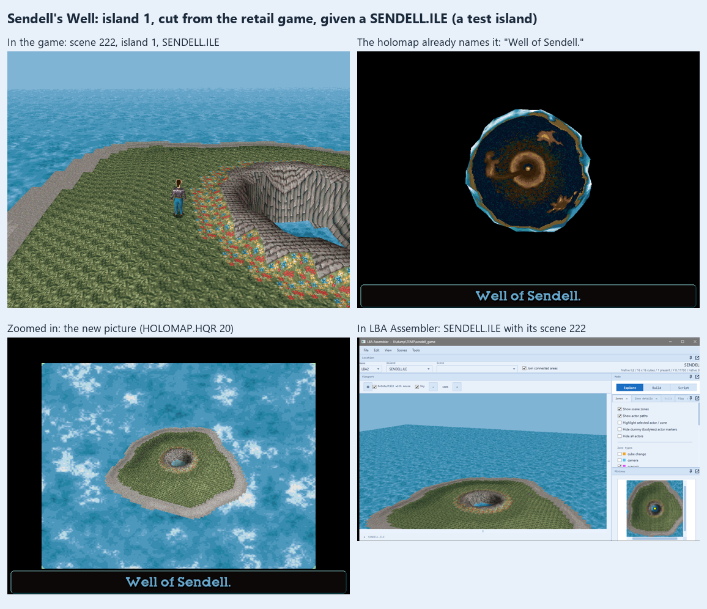
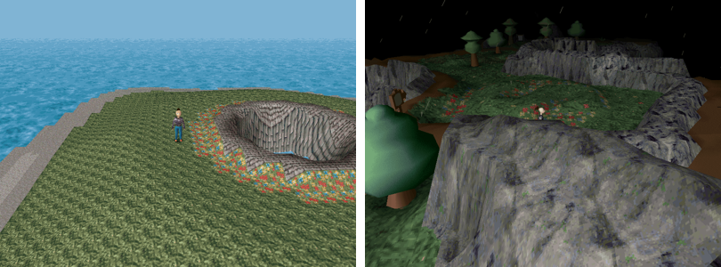

# Sendell's Well: giving the game its missing island (2026-10-01)

LBA2 names twelve islands, and an outside scene's first byte says which one it is on (`SceneModel.Island`). The engine turns that number
into a file name through a fixed list (`EXTFUNC.CPP` `IleLst`): citadel, **sendell**, desert, emeraude, otringal, celebrat, platform,
mosquibe, knartas, ilotcx, ascence, souscelb. Island 1, "sendell" -- the *Puits de Sendell*, Sendell's Well -- is an outside island the
game was to have and that was cut: no `SENDELL.ILE` ships, and no scene has island 1. (The shipped `MOON.ILE` is not it: that is an
older copy of the Emerald Moon, island 3, `EMERAUDE.ILE`, that neither `LBA2.EXE` nor `LBA2.DOS` names.)

Much of the island is still in the game:
- the engine loads `SENDELL.ILE` and `SENDELL.OBL` for a scene of island 1, like any other island (`LOADISLE.CPP` `LoadIsland`);
- the holomap knows it: it names it "Well of Sendell." and knows where it is on the planet (the globe turns to it), and has zoom and arrow
  sizes for it (`HOLOPLAN.CPP` `BodyFactorScale`, "Puit Sendell");
- `RESS.HQR` keeps its slots: its sky (`RESS_SKYSEA1`, entry 12) and its palette (`RESS_XPL1`, entry 28);
- `TEXT.HQR` has its dialogue file (file 4, empty).

What is missing: the island file, its sky (entry 12 is an empty slot; its palette slot 28 shares the Desert island's data), the picture
the holomap shows zoomed in on it (`HOLOMAP.HQR` 20, and its camera, 21: empty -- the map view was black), and a scene.

## The test island

`ScriptRoundTrip sendell build <pristine folder> <game folder>` (`tools/ScriptRoundTrip/SendellIsland.cs`) builds one into a game folder
whose `SCENE.HQR`, `RESS.HQR` and `HOLOMAP.HQR` are the originals. It is a placeholder, to show the game takes it:
- **`SENDELL.ILE`**: the fine-weather Citadel Island's file (`CITABAU.ILE`: its ground atlas, so the grass, rock, paving and water are its
  own) with its map down to one cube, at (7, 7): the cube of the Dome of the Slate, reshaped into a round island -- a beach, grassy slopes,
  a ring of flowers, a paved rim round a stone well 9 cells across, water at its bottom (game code 1: Twinsen drowns if he falls in).
  Heights by formula, each cell painted with a 32 x 32 tile of the atlas by where it is and how steep (`IslandGround.PaintTile`), the light
  baked with terrain shadows (`IslandBake`), no decors. `SENDELL.OBL` is a copy of `CITABAU.OBL`.
- **`RESS.HQR`**: island 1's sky and palette, the fine-weather Citadel's (entries 26 and 42). `HqrWriter.FillEntry` gives an empty or shared
  slot data of its own.
- **`HOLOMAP.HQR`**: its picture and camera. `Terrain/HolomapPicture.cs` draws the island's ground through a holomap camera (Francos
  Island's, also one cube at (7, 7)), its atlas shaded by the baked light and matched to the game's palette, over a calm sea in the
  colours of the Citadel picture's.
- **Scene 222**, the first number past the retail game's: scene 44's header with island 1 and cube (7, 7), Twinsen alone (and the engine's
  Zoe placeholder in slot 1), scripts emptied, standing south of the well. `SCENE.HQR` gets a new entry; its entry 0 (the largest scene's
  size) is kept up to date.
- **A way there and back**, for testing in the game: a cube-change zone on the Sendell's sign on Citadel Island (scene 47, the circle of
  flowers with an S) to scene 222, and one on the new island's south slope back to scene 47, east of the sign.

**Checked** (headless engine, a sandbox copy of the game, `E:\dump\TEMP\sendell_game`): `cube 222` loads it (the engine's state: island 1,
cube 222, exterior); Twinsen walks on it, and falls into the well and drowns; the holomap opens there on the Well of Sendell and zooms in
on the new picture; stepping onto the sign in scene 47 lands him on the island, and the south slope's zone back beside the sign. LBA
Assembler lists `SENDELL.ILE` with scene 222 under it and draws it in its 3D view, with island 1's palette (`LoadIslandPalette`,
`IslandMapRenderer.LoadPalette`: `SENDELL` 28, and `MOON` 30, the Emerald Moon's).

## Since 2026-10-01: in the race track window, scene 224

The island's making moved into the program (`Terrain/SendellWell.cs`): the race track window builds a track on it (see "Walls, mines,
checkpoints, Sendell's Well and a loop" in `LBA2_DESERT_RACE_TRACK_BUILD.md`), and the `sendell build` test command calls the same code.
Its scene is now **224**, not 222: 222 is the race track story's holomap arrow (a position the game's scripts never use, which a scene of
that number would take for its own) and 223 the lava lake's scene. `SCENE.HQR` is padded with empty entries up to it, and the scene's
holomap record puts it at island 1's place on the globe (the "Well of Sendell" label's, record 1). The test command's portals now lead to
224. What follows describes the first version.

## For a real island

The test island is the plumbing. A real Sendell's Well needs a design: its shape and size (more cubes, and scenes for each), its decors
(`SENDELL.OBL` bodies and the cubes' decor lists), its sky and palette if it isn't to look like Citadel Island, a holomap picture with the
decors in it, its people and scripts (dialogue in `TEXT.HQR` file 4), music, and a way to get there that belongs to the story -- a boat,
the Dino-Fly or a scripted scene -- rather than the test's portal on the sign.
